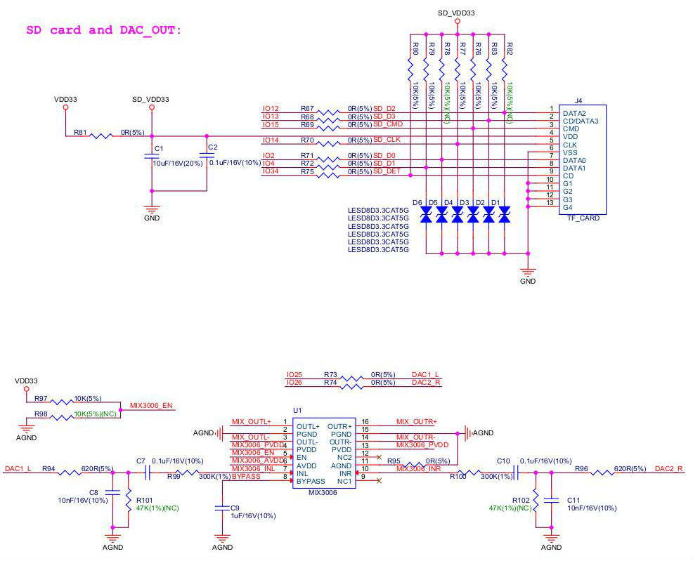

[[EN]](./ESP32_LCDKit_guide_en.md)

# ESP32-LCDKit 开发板介绍

---

# 1. 概述

ESP32-LCDKit 是一款以乐鑫 ESP32-DevKitC（需另采购） 为核心的 HMI（人机交互）开发板，可外接屏幕，并且集成了 SD-Card、DAC-Audio 等外设，主要用于 HMI 相关开发与评估。开发板预留屏幕接口类型：SPI 串行接口、8 位并行接口、16 位并行接口。

[HMI Example](../../examples/hmi/) 这里提供的一些 HMI 示例可在 ESP32-LCDKit 开发板上运行。

关于 ESP32 详细信息，请参考文档[《ESP32 系列芯片技术规格书》](https://www.espressif.com/sites/default/files/documentation/esp32_datasheet_cn.pdf)。 

# 2. 电路设计说明

## 2.1 系统框图

ESP32-LCDKit 开发板的系统框图如下所示：

## 2.2 PCB 布局  

ESP32-LCDKit 开发板的 PCB 布局如下所示：  

表 1：PCB 部件功能说明

PCB 部件   | 说明
------    | ------
屏幕连接模块 | 连接串行或者并行（8/16 bit）屏幕
ESP32 DevKitC 开发板连接模块 | 与 ESP32 DevKitC 开发板连接
SD-Card 模块 | 连接 SD-Card，扩展存储
DAC-Audio 模块 | 连接喇叭播放音频，包含音频功率放大器
数据位选择跳冒 | 用于选择所用并行屏幕的数据位宽（8/16 bit）

# 3. 硬件模块

本章主要介绍各个功能模块（接口）的硬件实现，以及对这些模块的描述。

## 3.1 ESP32 DevKitC 开发板连接模块

使用 ESP32-LCDKit 开发板进行 HMI 相关开发时需要搭配使用 [ESP32 DevKitC 开发板](https://docs.espressif.com/projects/esp-idf/en/stable/hw-reference/modules-and-boards.html#esp32-devkitc-v4)。

ESP32-LCDKit 开发板与 ESP32 DevKitC 开发板连接模块电路原理图如下所示：

## 3.2 电源管理

USB 供电管理模块电路图如下所示：

## 3.3 屏幕连接模块

开发板采用两种不同的连接插座，可以将不同屏幕接至 ESP32-LCDKit 开发板上，以实现 ESP32 模组对屏幕的操作。以下接口可供选择使用：SPI 串行接口、8 位并行接口、16 位并行接口。

外接屏幕电路原理图如下所示：

## 3.4 SD-Card、DAC-Audio 外设模块

开发板支持外接 SD-Card 以扩展存储，并且有 MIX3006 功率放大器，可以外接喇叭播放音频。

SD-Card、DAC-Audio 外设模块电路原理图如下所示：

