[[EN]](esp32_ulp_eb_en.md) 

# ESP32_ULP_EB_V1 评估板使用说明

## 一 系统简介:

&nbsp;&nbsp;&nbsp;&nbsp;&nbsp;&nbsp;
**ESP32_ULP_EB V1** 开发板以乐鑫 ESP32 模组为核心, 外接一些 Touch Pad, 按键开关, 排针等. 主要用于检测模组在正常工作或睡眠状态下的电流情况.

---

## <h2 id="hardware">二 PCB功能模块:</h2>

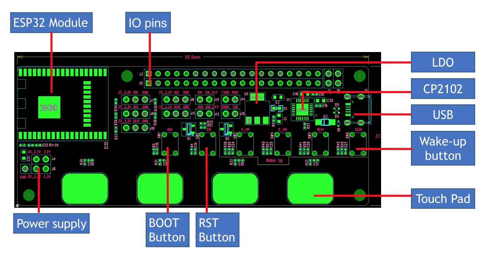

---

## 三 功能实现及描述:

### 3.1 RST Button & Boot Button

* <h5 id="bootButton">系统复位按键</h5>

    控制 ESP32 芯片 EN 脚，用于使芯片复位，硬件设计如下:
	<br>
    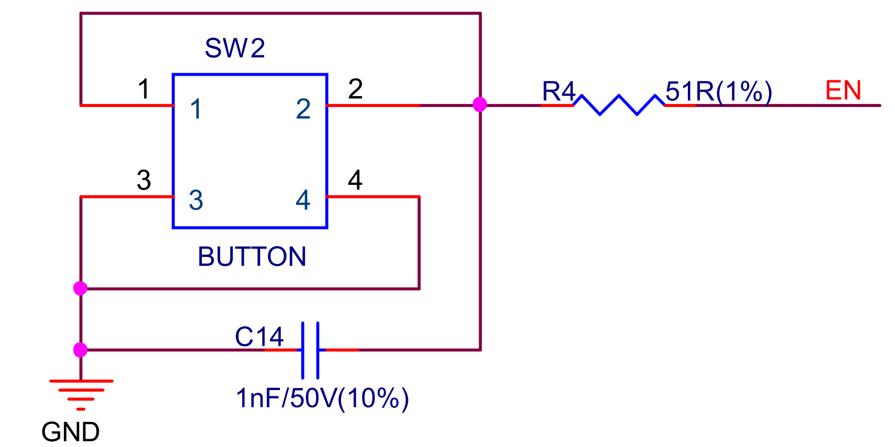


* <h5 id="modeButton">系统模式按键</h5>
    连接至芯片的 GPIO0. 按下此键后, 再按下 RST 键, 系统进入 Download 模式, 此时用户可以通过串口对 Flash 进行下载. 硬件实现如下:
    <br>
    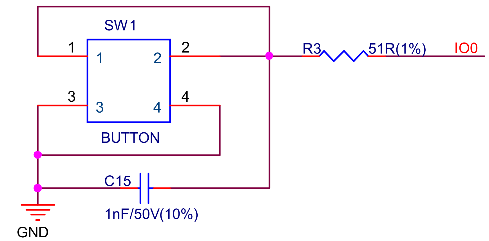

* <h5 id="downloadMode">下载模式</h5>

    [返回编译与下载](#compileAndRun)

    系统复位时，GPIO0 为低电平时，芯片进入下载模式。 长按Boot Button 的同时， 按下RST Button 复位系统，芯片将进入下载模式，等待下载固件，下载模式下可以看到系统启动的串口输出(波特率115200)如下：

    ```
    ets Jun  8 2016 00:22:57
    rst:0x1 (POWERON_RESET),boot:0x3 (DOWNLOAD_BOOT(UART0/UART1/SDIO_REI_REO_V2))
    waiting for download
    ```

* <h5 id="flashMode">固件运行模式</h5>

    系统复位时, GPIO0 为高电平(默认内部上拉), 芯片进入 Flash 启动模式，从 Flash 中加载固件并运行。放开 Boot Button, 直接按下 RST Button 复位系统即可，固件运行后，可以看到系统启动的串口输出(波特率115200)如下：

    ```
    ets Jun  8 2016 00:22:57
    rst:0x1 (POWERON_RESET),boot:0x13 (SPI_FAST_FLASH_BOOT)
    ```

### 3.2 Wakeup Button

&nbsp;&nbsp;&nbsp;&nbsp;&nbsp;&nbsp;
本电路中包含 4 个唤醒按键, 可以实现模组的睡眠唤醒功能. 设计时需要注意，只有 RTC IO 才能在 deep sleep 状态下唤醒芯片。ESP32 共有18个 RTC IO，都可单独用做 deep sleep 下唤醒芯片。RTC IO 有两种唤醒模式，EXT0 或者 EXT1 模式。
在**ESP32_ULP_EB V1** 评估板上，位于USB 接口下方的四个按键为唤醒按键，从过到右依次为GPIO36/GPIO39/GPIO34/GPIO35.

&nbsp;&nbsp;&nbsp;&nbsp;&nbsp;&nbsp;
_`注: GPIO34 及以上的 IO 只能用做输入，无法输出。因此，一般讲只能输入的 RTC IO 作为 deep sleep 唤醒功能，以避免占用输出功能的 IO. 以上 wake_up 按键分别接到 RTC IO36, RTC IO39, RTC IO34, RTC IO35, 预留了一个上拉电阻.`_

硬件设计如下:

| 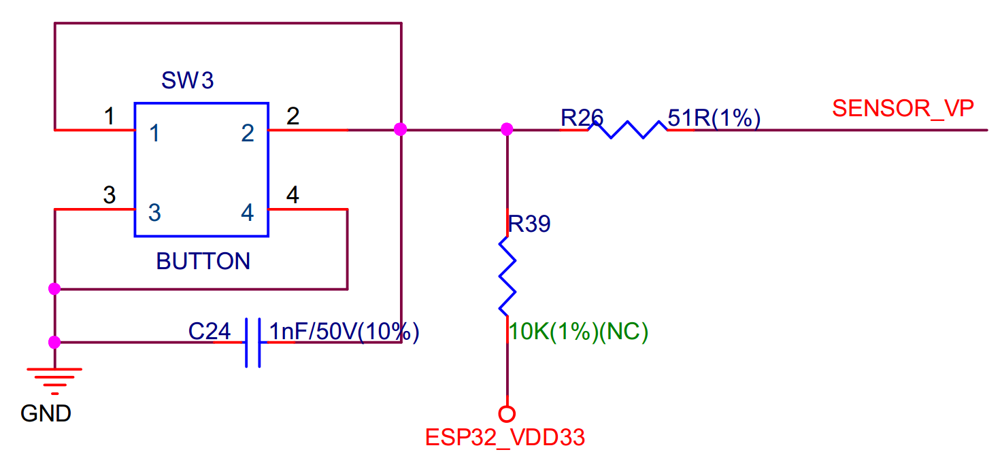 | 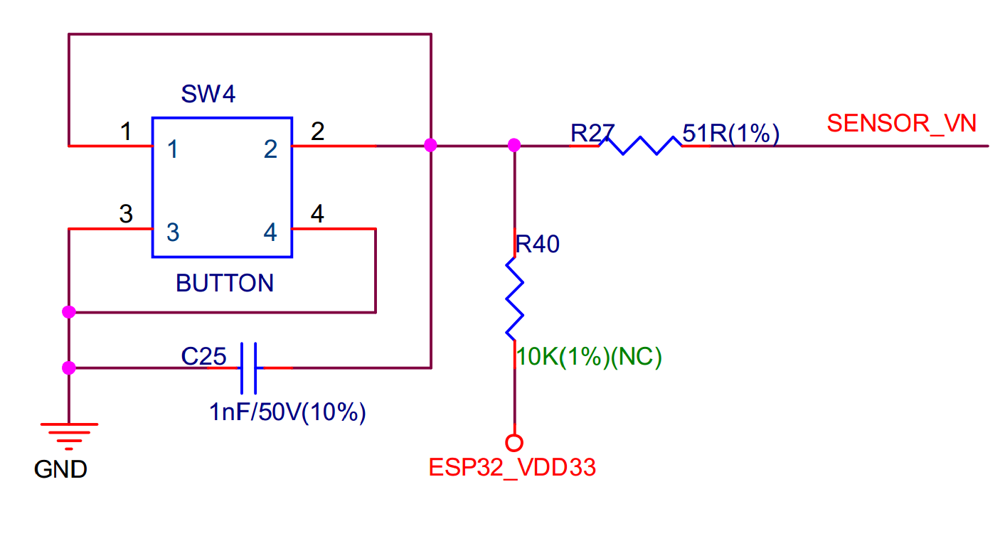 | 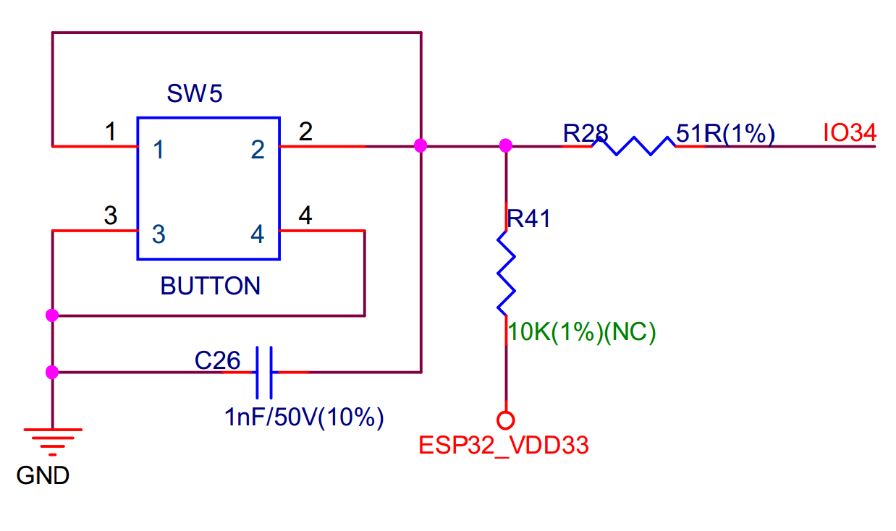 | 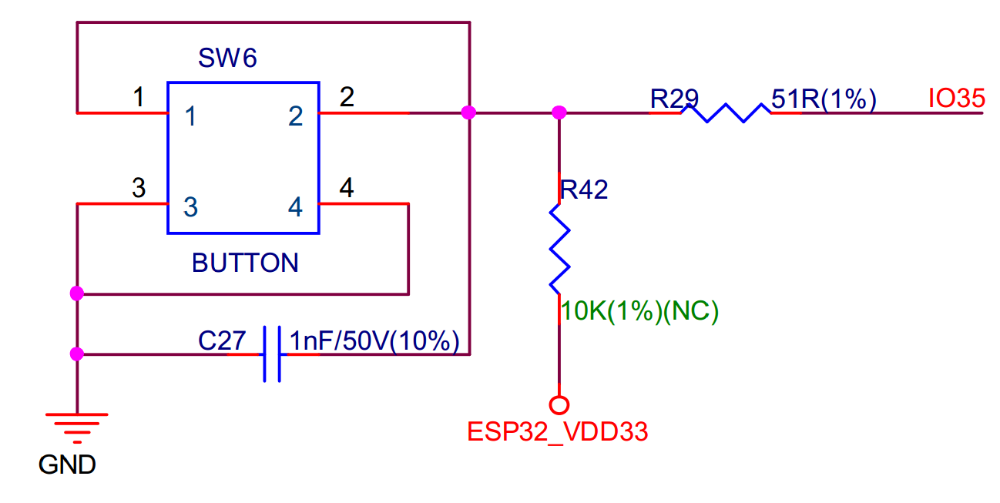 |
|--|--|--|--|
| GPIO36 | GPIO39 | GPIO34 | GPIO35 |
| RTC_IO_0 | RTC_IO_3 |  RTC_IO_4 | RTC_IO_5 |


### 3.3 Touch Pad

&nbsp;&nbsp;&nbsp;&nbsp;&nbsp;&nbsp;
本电路中包含 4 个 Touch Pad, 同样可以实现模组的睡眠唤醒功能.
在 deep sleep 模式下，touch pad 仍然能够工作，并且每隔一段时间间隔就会唤醒进行充放电计数，一旦读数小于（或者大于）设定的阈值，就会唤醒芯片。
 
&nbsp;&nbsp;&nbsp;&nbsp;&nbsp;&nbsp;
_`注： 由于touch sensor 需要定期读数，会造成一定的功耗，可以通过 esp-idf 中的 touch_pad_set_meas_time 接口来设置 touch sensor 计数时间和计数间隔，来调整合适的功耗和唤醒灵敏度`_

硬件设计如下:

| 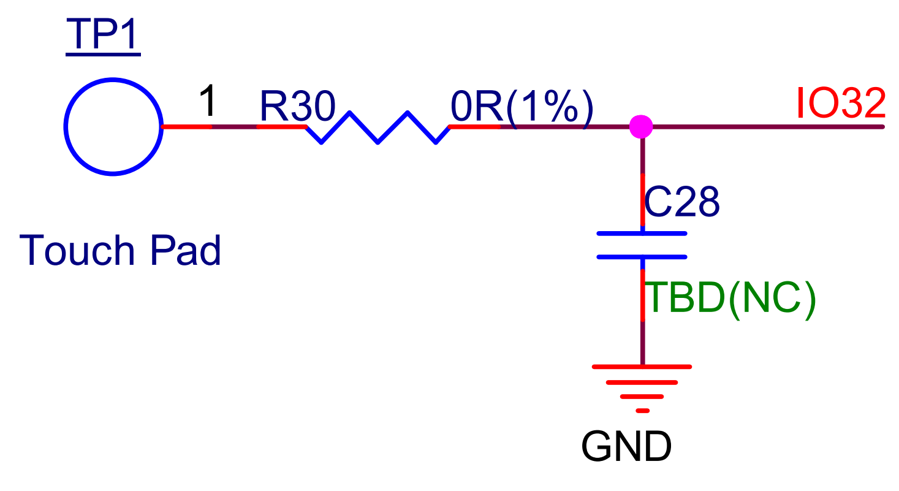 | 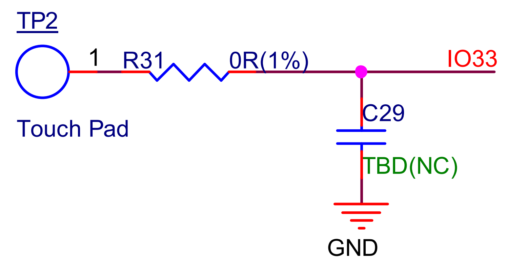 | 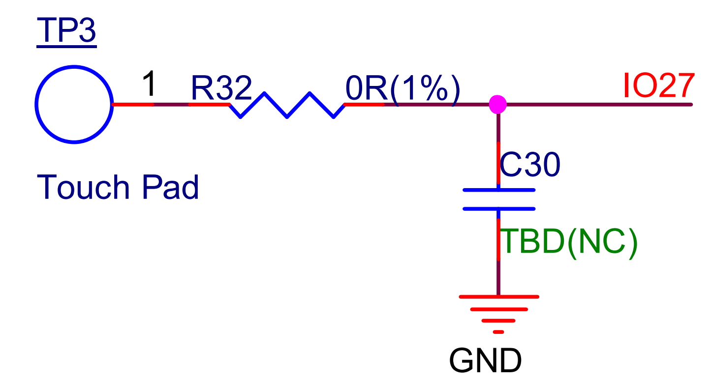 | 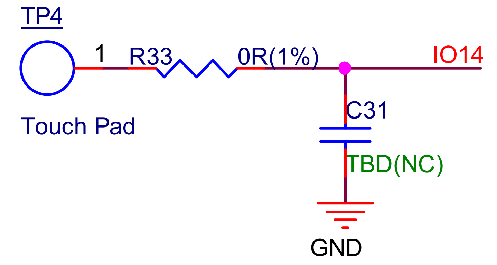 |
|--|--|--|--|
| GPIO32 | GPIO33 | GPIO27 | GPIO14 |
| TOUCH_PAD_NUM9 | TOUCH_PAD_NUM8 | TOUCH_PAD_NUM7 | TOUCH_PAD_NUM6 |


### 3.4 电源断路排针

&nbsp;&nbsp;&nbsp;&nbsp;&nbsp;&nbsp;
在**ESP32_ULP_EB V1** 评估板上, 一共有两个电源域： 3.3V（VDD33）与 32_3.3V(ESP32_VDD33)。两个电源域之间，仅通过JP4/JP6两个跳线连接，如将电流表分别接至两端串联进电路, 即可测量模组在不同状态下的电流情况.

| 3.3V（VDD33） | ==> | 32_3.3V(ESP32_VDD33) |
|--|--|--|
| LDO 输出电压，给串口芯片提供电源，给32_3.3V(ESP32_VDD33)提供电源 | 通过J6/J4进行连接 | 给所有 ESP32 模块的部分提供电压，包括模块输入电源、 strap pin 上拉所使用的电源以及所有 ESP32 GPIO 上拉所使用的电源 |

### 3.5 接口排针与IC

* ESP32 模组的各个 GPIO 外接至排针
* Strap pin 预留可以上拉/下拉的排针接口
* TX/RX 预留排针接口
* USB 接口既为开发板提供电源, 又作为通信接口连接 PC 与 ESP32 芯片.
* CP2102: USB 与 UART 协议转换芯片.
* LDO: 电源管理芯片, 固定输出 3.3V 电压.

- - -

## 四 功能测试:

### 4.1 低功耗概述

&nbsp;&nbsp;&nbsp;&nbsp;&nbsp;&nbsp;
ESP32 有多种低功耗模式, 能够适用于很多应用场景. 只要进行一些简单的配置, 就可以进入低功耗模式. 这里针对 deep_sleep 模式进行测试, 简单介绍测试方式和注意事项.

### 4.2 Deep Sleep 低功耗模式

&nbsp;&nbsp;&nbsp;&nbsp;&nbsp;&nbsp;
在 deep_sleep 模式下, ESP32 CPU 将停止运行, 但 RTC 外设, RTC 存储器和 ULP 协处理器可以继续运行. 进入 deep_sleep 模式后, 可以通过外部事件, RTC 定时器等方式唤醒芯片. 这里测试以下几种唤醒方式:

* EXT0 唤醒模式:
    > 会有 RTC 外设开启, 可以配置某个RTC IO 高电平或者低电平唤醒.
* EXT1 唤醒模式:
    > 可以配置一个或者多个 RTC IO 作为唤醒源, 在一个或者多个 RTC IO 同时为高电平或者同时为低电平时唤醒
* RTC Timer 唤醒模式:
    > RTC Timer 作为唤醒源, 可以配置定时的唤醒.定时时间由用户配置.
* TouchPad 唤醒模式:
    > Touchpad 是电容式触摸传感器, 会有电容充放电过程.工作电流稍微偏高. 10 个 Touch_pad 经过配置后都可以用来将系统唤醒.


__注意事项:__

1. RTC 外设一旦开启, 不会自动关闭, 除非在程序里将其关闭或系统掉电重启.

2. 测试板上的四个 wakup 按键需要外部接上下拉电阻(开发板上预留了四个上拉电阻, 默认阻值10 KOhm).

<h3 id="testcase">4.3 deep_sleep 模式下电流测试</h3>

&nbsp;&nbsp;&nbsp;&nbsp;&nbsp;&nbsp;
不同唤醒模式下, deep_sleep 期间工作电流测试结果:

| 唤醒方式  | deep_sleep 期间电流 |   测试步骤   | 测试用例唤醒方式|
| :----:   |       :----:      |   :----:    |:--: |
|  EXT0    |      6.5uA        |   [见测试 1](#test1)  | RTC_IO 39(按键 S_VN)低电平 |
|  EXT1    |      5.4uA        |   [见测试 2](#test2)  | RTC_IO34/35/36/39同时为低电平(四个唤醒按键同时按下)  |
|  Timer   |      6uA          |   [见测试 3](#test3)   | 定时 10S 后唤醒 |
| TouchPad |      36uA         |   [见测试 4](#test4)   | TOUCH_PAD_NUM7/GPIO27(丝印TP3)触摸唤醒 |

&nbsp;&nbsp;&nbsp;&nbsp;&nbsp;&nbsp;
`(注: 这里采用外部 10K Ohm 的上拉电阻)`

---
### 测试项说明:


<h5 id="test1">测试1. EXT0 唤醒模式</h5>
&nbsp;&nbsp;&nbsp;&nbsp;&nbsp;&nbsp;
将 RTC_IO 39 ( 测试板上 按键标号为 S_VN )配置成EXT0 唤醒源, 低电平唤醒. 在deep_sleep 期间, 按下该按键产生一个低电平信号从而唤醒芯片.示例代码片段:

```
static void ext0_wakeup_init(void)
{
    //use RTC_IO_39 as wakeup pin, low level will wakeup system.
    const uint32_t pin_num = 39;
    esp_sleep_enable_ext0_wakeup(pin_num, 0);
}
...
void ext0_wakeup_test(void)
{
    ...
    ext0_wakeup_init();
    esp_deep_sleep_start();
}

```

<h5 id="test2">测试2. EXT1 唤醒模式</h5>
&nbsp;&nbsp;&nbsp;&nbsp;&nbsp;&nbsp;
配置 RTC_IO 34, 35, 36, 39 组合触发方式, 作为 EXT1 触发源, 当以上 IO 全都是低电平时, 将芯片从 deep_sleep 模式中唤醒. 配置代码示例:

```
static void ext1_wakeup_init(void)
{
    //set RTC_IO_34,35,36,39 as wakeup pins.
    // when all of these pines are low level, system will be awakend.
    const uint64_t pin_mask = (1ULL << 39) | (1ULL << 36) | (1ULL << 35) | (1ULL << 34);
    esp_sleep_enable_ext1_wakeup(pin_mask, ESP_EXT1_WAKEUP_ALL_LOW);
}
...
void ext1_wakeup_test(void)
{
    ...
    ext1_wakeup_init();
    esp_deep_sleep_start();
}
```

<h5 id="test3">测试3. RTC Timer 唤醒模式</h5>
&nbsp;&nbsp;&nbsp;&nbsp;&nbsp;&nbsp;
配置 RTC Timer 唤醒方式, 定时时间为 10 秒, 进入芯片进入 deep_sleep 模式, 10 秒后会被唤醒. 示例代码如下:

```
static void timer_wake_init(void)
{
    //10 seconds later, system will be awakend after entering deep_sleep mode.
    const int time_wakeup_sec = 10;
    esp_sleep_enable_timer_wakeup(time_wakeup_sec * 1000000);
}
...
void timer_wakeup_test(void)
{
    ...
    timer_wake_init();
    esp_deep_sleep_start();
}

```

<h5 id="test4">测试4. TouchPad 唤醒模式</h5>
&nbsp;&nbsp;&nbsp;&nbsp;&nbsp;&nbsp;
配置 TouchPad 唤醒方式, 这里使用的是 TouchPad 7 作为外部唤醒源. 当触碰该 pad 时, 系统将被唤醒. 配置代码示例:

```
static void touchpad_wake_init(void)
{
    //set tpuch_pad 7 as wakeup pad.
    iot_tp_create(TOUCH_PAD_NUM7, 900, 0, 100);

    //this function call will lower system's  power consumption during deep_sleep mode.
    //if interested, you can not call this function to found what different about working current.
    touch_pad_set_meas_time(0xffff, TOUCH_PAD_MEASURE_CYCLE_DEFAULT);
    esp_sleep_enable_touchpad_wakeup();
}
...
void touchpad_wakeup_test(void)
{
    ...
    touchpad_wake_init();
    esp_deep_sleep_start();
}

```

&nbsp;&nbsp;&nbsp;&nbsp;&nbsp;&nbsp;
`注: TouchPad 初始化时调用了 touch_pad_set_meas_time 这个函数，调整touch sensor 读数时间和读数间隔时间, 这使得系统在deep_sleep 期间工作电流从默认340uA 降低到 36uA 左右.`


---

## 五 IOT-Solution Test Case 编译步骤:

### 5.1 测试前的准备

&nbsp;&nbsp;&nbsp;&nbsp;&nbsp;&nbsp;
首先需要确保你的电脑上已经安装好 ESP32 工具链, 工具链安装请参考 ESP-IDF 中的 [README.md](https://github.com/espressif/esp-idf/blob/master/README.md).

### 5.2 获取 IoT Solution 项目代码

&nbsp;&nbsp;&nbsp;&nbsp;&nbsp;&nbsp;
执行指令, 下载 iot-solution 项目仓库:

* 可以直接递归获取仓库代码, 这样将会自动初始化需要的所有子模块：

    ```
    git clone -b release/v1.1 --recursive https://github.com/espressif/esp-iot-solution.git

    ```

* 也可以手动进行：

    ```
    git clone -b release/v1.1 https://github.com/espressif/esp-iot-solution.git
    ```

* 然后切换到项目根目录执行指令, 下载本项目依赖的一些其它子模块:

    ```
    git submodule update --init --recursive
    ```


### <h3 id="compileAndRun">5.3 编译与运行</h3>

&nbsp;&nbsp;&nbsp;&nbsp;&nbsp;&nbsp;
子模块代码下载完成后就可以对 Iot Solution 工程中的 TestCase 进行编译和测试. 切换到 esp-iot-solution/tools/unit-test-app 目录下

* `串口参数设置`

&nbsp;&nbsp;&nbsp;&nbsp;&nbsp;&nbsp;
执行以下指令进行编译配置, 如串口号和串口下载速度可以在 `Serial flasher config` 这一菜单选项中进行配置(如果不需配置, 可跳过这一步):

```
    cd YOUR_IOT_SOLUTION_PATH/tools/unit-test-app
    make menuconfig
```


* `硬件连接`

    | 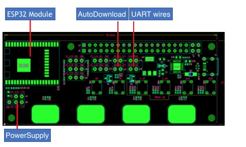  | 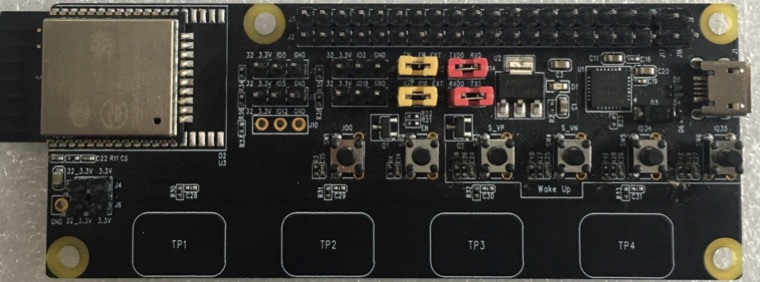 | 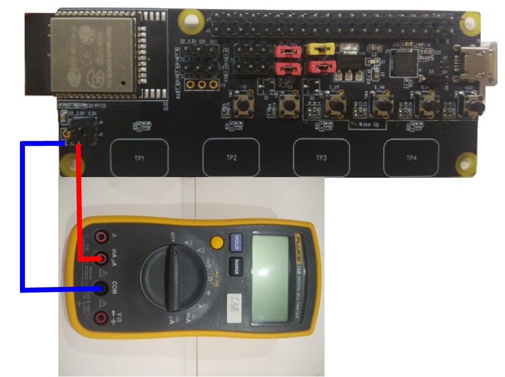 |
    |:--:|:--:|:--:|
    | 跳线功能示意图 | 实际连接图 | 将万用表和开发板正确连接后, 测试电流 |
    * 红色的两处跳线为串口通信线，用于下载固件和串口通信。
    * 黄色的两处跳线为模式控制，用于串口自动下载功能，如不需要，可以手动进入下载模式。
    * 左下角的跳线为总电流入口, 用于esp32模块的供电。

* `编译, 烧写与运行固件`

&nbsp;&nbsp;&nbsp;&nbsp;&nbsp;&nbsp;
执行下面指令，编译所有 TestCase, 以下命令中的 flash 是下载命令, monitor 表示开启系统打印， 可根据实际情况选择添加:

```
    make IOT_TEST_ALL=1 flash monitor
```
&nbsp;&nbsp;&nbsp;&nbsp;&nbsp;&nbsp;
也可以执行以下指令，只编译 ‘deep_sleep’ 相关的测试项. 以下命令中的 flash 是下载命令, monitor 表示开启系统打印， 可根据实际情况选择添加:

```
    make TEST_COMPONENTS="deep_sleep" flash monitor
```


> &nbsp;&nbsp;&nbsp;&nbsp;&nbsp;&nbsp;
> 注: 示例 TEST_COMPONENTS="deep_sleep" 中 ‘=’ 两边不能有空格, 否则无法编译.

> &nbsp;&nbsp;&nbsp;&nbsp;&nbsp;&nbsp;
> 注: 下载程序时, 如果无法自动开始下载，可以尝试[手动进入下载模式](#downloadMode)。下载固件完成后，按reset键重新运行程序，可以查看串口打印


* `选择测试项`

   [查看测试项与描述](#testcase)

&nbsp;&nbsp;&nbsp;&nbsp;&nbsp;&nbsp;
固件下载完成，并打开串口界面并运行固件后，将输出以下选项，选择对应的测试序号并输入，即可进行测试：

```
    Here's the test menu, pick your combo:
    (1)     "Deep_sleep get wake_up cause test" [deep_sleep][iot]
    (2)     "Deep_sleep EXT0 wakeup test" [deep_sleep][iot]
    (3)     "Deep_sleep EXT1 wakeup test" [deep_sleep][iot]
    (4)     "Deep_sleep touch_pad wakeup test" [deep_sleep][iot]
    (5)     "Deep_sleep time wakeup test" [deep_sleep][iot]
```

&nbsp;&nbsp;&nbsp;&nbsp;&nbsp;&nbsp;
以 EXT1 模式测试为例，输入 3 选择运行 Deep_sleep EXT1 wakeup test，得到以下串口输出，测试观察电流表的读数即为模块消耗的总电流。

```
    >>>   ext1 wake_up test   <<<

    During deep_sleep, set key 's_VP' 's_VN' 'IO_34' 'IO_35' all low to wake_up system
    System entering deep_sleep mode 3 seconds later
    time remain 3 s
    time remain 2 s
    time remain 1 s


    >>>   entering deep_sleep mode   <<<
```

&nbsp;&nbsp;&nbsp;&nbsp;&nbsp;&nbsp;
然后同时按下开发板上四个 wakeup 按键来唤醒芯片. 从串口打印可以看出系统已经被唤醒, 这时候可以输入 1 来查看系统被唤醒的原因.
串口打印如下:

```
    Running Deep_sleep get wake_up cause test...


    >>>   wake_up cause test, please do deep_sleep test first   <<<


    waked up by EXT1
```

