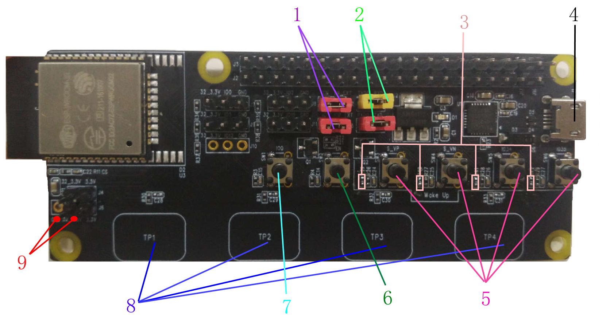

[[中文]](esp32_ulp_eb_cn.md) 

# User Guide to **ESP32_ULP_EB_V1** Evaluation Board

## 1. System Description

&nbsp;&nbsp;&nbsp;&nbsp;&nbsp;&nbsp;
**ESP32_ULP_EB_V1** evaluation board is based on the ESP-WROOM-32 module, with peripherals including touchpads, buttons, pin headers, etc. It is used to detect the working current of the module in the normal working condition or in sleep.

---

## <h2 id="hardware"> 2. PCB Function Block</h2>


---

## 3. Functional Description

### 3.1 RST Button & Boot Button

* <h5 id="bootButton">RST Button</h5>

    Used for controlling the EN pin of ESP32，and resetting the chip. The hardware design is as follows:
	<br>
    


* <h5 id="modeButton">System Mode Button</h5>
    Connects to ESP32's GPIO0. Press the System Mode Button and then the RST Button, the system will enter the Download mode. Users can then download firmware to the flash. Below is the schematics:
    <br>
    

* <h5 id="downloadMode">Download Mode</h5>

    [Compile and Execution](#compileAndRun)

    When the system resets, GPIO0 is at a low level. The chip enters the Download mode. Press and hold the Boot Button, while pressing the RST Button to reset the system, the chip will enter the Download mode and wait for downloading the firmware. The serial port will output the following log at a baud rate of 115200:

    ```
    ets Jun  8 2016 00:22:57
    rst:0x1 (POWERON_RESET),boot:0x3 (DOWNLOAD_BOOT(UART0/UART1/SDIO_REI_REO_V2))
    waiting for download
    ```

* <h5 id="flashMode">Firmware Operating Mode</h5>

	When the system resets, GPIO0 is at a high level. The chip enters the Flash Boot mode. GPIO loads firmware from the flash and runs the firmware. Release the Boot Button, and press the RST Button to reset the system directly. The serial port will output the following log at a baud rate of 115200:

    ```
    ets Jun  8 2016 00:22:57
    rst:0x1 (POWERON_RESET),boot:0x13 (SPI_FAST_FLASH_BOOT)
    ```

### 3.2 Wakeup Button

&nbsp;&nbsp;&nbsp;&nbsp;&nbsp;&nbsp;

There are four wakeup keys in the circuit to wake up the module from sleep. Users designing the circuit should note that only RTC IOs in the Deep-sleep state can wake up the chip. ESP32 has a total of 18 RTC IOs, each of which can wake up the chip from Deep-sleep. The RTC IOs can be used in two wakeup modes, EXT0 or EXT1 wakeup modes.


Four buttons, GPIO36/GPIO39/GPIO34/GPIO35 respectively from left to right, are located below the USB interface on the **ESP32_ULP_EB V1** evaluation board.

&nbsp;&nbsp;&nbsp;&nbsp;&nbsp;&nbsp;

_` Note：GPIO34 to GPIO39 can only be used as input, not output. Only RTC IOs working as an input are used to wake up the chip from Deep-sleep, so as not to occupy the output IOs. The wakeup keys are connected to RTC IO36, RTC IO39, RTC IO34, and RTC IO35 respectively. A pull-up resistor is reserved.`_

Below is the hardware design:

|  |  |  |  |
|---|---|---|---|
| GPIO36 | GPIO39 | GPIO34 | GPIO35 |
| RTC_IO_0 | RTC_IO_3 |  RTC_IO_4 | RTC_IO_5 |


### 3.3 Touchpad

&nbsp;&nbsp;&nbsp;&nbsp;&nbsp;&nbsp;
The development board has four touchpads, which can also be used to wake up the module.

Touchpads can work in the Deep-sleep mode, and wake up periodically for readings of charge and discharge. Once the reading is lower (or greater) than the threshold, the chip will be woken up.

&nbsp;&nbsp;&nbsp;&nbsp;&nbsp;&nbsp;

_`Note：Because of regular counting of charge and discharge, the touch sensor consumes a certain amount of power. Users need to set the touch sensor counting time and counting interval, and adjust the power consumption and wakeup sensitivity via the esp-idf touch_pad_set_meas_time interface in esp-idf`_

Below is the hardware design:

|  |  |  |  |
|---|---|---|---|
| GPIO32 | GPIO33 | GPIO27 | GPIO14 |
| TOUCH_PAD_NUM9 | TOUCH_PAD_NUM8 | TOUCH_PAD_NUM7 | TOUCH_PAD_NUM6 |


### 3.4 Power Supply Pins

&nbsp;&nbsp;&nbsp;&nbsp;&nbsp;&nbsp;

On the **ESP32_ULP_EB V1** evaluation board, there are two power domains: 3.3V (VDD33) and 32_3.3V (ESP32_VDD33). The two power domains are connected via jumpers JP4 and JP6 only. Connect an ammeter in series to each ends of the circuit to measure the current of the module in different states.

| 3.3V（VDD33） | ==> | 32_3.3V(ESP32_VDD33) |
|---|---|---|
| LDO output voltage; power supply for the chip and 32_3.3V (ESP32_VDD33) | Power domains are connected via J6/J4|  Supplies voltage to ESP-WROOM-32, including input power for the module, and power for pulling up strapping pins and all ESP32 GPIOs.|

### 3.5 Interface pins and ICs

* All GPIOs of the ESP32 module are pinned out.
* Pin headers are reserved for pulling up and down the strapping pins.
* Pin headers are reserved for Tx/Rx.
* The USB interface provides power for the board, and works as a communication interface to connect PC and ESP32.
* CP2102: USB to UART bridge chip
* LDO: Power management chip with a fixed output voltage of 3.3V.

- - -

## 4. Functional Tests:

### 4.1 Low-Power Management

&nbsp;&nbsp;&nbsp;&nbsp;&nbsp;&nbsp;
With the use of advanced power-management technologies, ESP32 can switch between different low power modes. Users can configure ESP32 into low power modes with simple configuration. Below is an introduction to the test of power consumption in the Deep-sleep mode.


### 4.2 Deep-Sleep Mode

&nbsp;&nbsp;&nbsp;&nbsp;&nbsp;&nbsp;
In Deep-sleep mode, the ESP32 CPU stops running, but the RTC peripherals, RTC memory, and the ULP co-processor can continue working. After entering the Deep-sleep mode, the chip can be woken up by external events, RTC timers, etc. Below are some wakeup modes:

* EXT0 wakeup mode:
    >  RTC peripherals are enabled. Users can configure a RTC IO to wake up ESP32 at a high or low level.
* EXT1 wakeup mode:
    > Users can configure one or more RTC IOs as the wakeup source to wake up ESP32 when one or more RTC IOs are at a high or low level simultaneously.
* RTC timer wakeup mode:
    > The RTC timer can be used as a wakeup source. Users can configure ESP32 to wake up after entering Deep-sleep for a fixed period of time.
* Touch-pad wakeup mode:
    > Touchpad is a capacitive touch sensor. The capacitor charges and discharges. So the working current is slightly higher. A total of 10 touchpads can be configured to wake up the system.


__Notes__

1. Once the RTC peripherals are enabled, they will not be disabled automatically unless disabled via software, or when the system powers off or reboots.

2. External pull-off resistors need to be connected to the four wakeup buttons on the test board. Four pull-up resistors are reserved on the development board, with a default resistance of 10 kOhm.

<h3 id="testcase">4.3 Current Test in Deep-Sleep Mode</h3> 

&nbsp;&nbsp;&nbsp;&nbsp;&nbsp;&nbsp;
Working current of the Deep-sleep mode in different wakeup modes:

| Wakeup source  | Current in Deep-sleep mode |   Test steps   | Wakeup method|
|----|----|----|----|
|  EXT0    |      6.5 μA        |   [See Test 1](#test1)  | wake up when RTC_IO 39 (Button S_VN) is at a low level |
|  EXT1    |      5.4 μA        |   [See Test 2](#test2)  | wake up when RTC_IO34/35/36/39 are at a low level simultaneously (the four wakeup buttons are pressed simultaneously)  |
|  Timer   |      6 μA          |   [See Test 3](#test3)   | wake up 10s after entering Deep-sleep |
| TouchPad |      36 μA         |   [See Test 4](#test4)   | wake up when touching TOUCH_PAD_NUM7/GPIO27 (chipset marking: TP3)|

&nbsp;&nbsp;&nbsp;&nbsp;&nbsp;&nbsp;
`(Note: External pull-up resistors of 10 kOhm are used.)`

---
### Notes to the test:


<h5 id="test1">Test 1. EXT0 wakeup mode</h5>
&nbsp;&nbsp;&nbsp;&nbsp;&nbsp;&nbsp;
Configure RTC_IO 39 (labeled S_VN on the test board) to wake up the chip at a low level in the EXT0 wakeup mode. During the Deep-sleep, press the button to generate a low-level signal to wake up the chip. Below is the sample code:

```
static void ext0_wakeup_init(void)
{
    //use RTC_IO_39 as wakeup pin, low level will wakeup system.
    const uint32_t pin_num = 39;
    esp_sleep_enable_ext0_wakeup(pin_num, 0);
}
...
void ext0_wakeup_test(void)
{
    ...
    ext0_wakeup_init();
    esp_deep_sleep_start();
}

```

<h5 id="test2">Test 2. EXT1 wakeup mode</h5>
&nbsp;&nbsp;&nbsp;&nbsp;&nbsp;&nbsp;
Configure RTC_IO 34, 35, 36, and 39 as the wakeup source in the EXT1 wakeup mode. When all these IOs are at a low level simultaneously, the chip is woken up from the Deep-sleep mode. Below is the sample code:

```
static void ext1_wakeup_init(void)
{
    //set RTC_IO_34,35,36,39 as wakeup pins.
    // when all of these pines are low level, system will be awakend.
    const uint64_t pin_mask = (1ULL << 39) | (1ULL << 36) | (1ULL << 35) | (1ULL << 34);
    esp_sleep_enable_ext1_wakeup(pin_mask, ESP_EXT1_WAKEUP_ALL_LOW);
}
...
void ext1_wakeup_test(void)
{
    ...
    ext1_wakeup_init();
    esp_deep_sleep_start();
}
```

<h5 id="test3">Test 3. RTC timer wakeup mode</h5>
&nbsp;&nbsp;&nbsp;&nbsp;&nbsp;&nbsp;
Configure RTC timer to wake up the chip after 10 seconds of Deep-sleep. Below is the sample code:

```
static void timer_wake_init(void)
{
    //10 seconds later, system will be awakend after entering deep_sleep mode.
    const int time_wakeup_sec = 10;
    esp_sleep_enable_timer_wakeup(time_wakeup_sec * 1000000);
}
...
void timer_wakeup_test(void)
{
    ...
    timer_wake_init();
    esp_deep_sleep_start();
}

```

<h5 id="test4">Test 4. Touchpad wakeup mode</h5>
&nbsp;&nbsp;&nbsp;&nbsp;&nbsp;&nbsp;
Configure the chip into the touchpad wakeup mode, and use Touchpad 7, for example, as an external wakeup source. The chip will be woken up when the Touchpad 7 is touched. Below is the sample code:

```
static void touchpad_wake_init(void)
{
    //set tpuch_pad 7 as wakeup pad.
    iot_tp_create(TOUCH_PAD_NUM7, 900, 0, 100);

    //this function call will lower system's  power consumption during deep_sleep mode.
    //if interested, you can not call this function to found what different about working current.
    touch_pad_set_meas_time(0xffff, TOUCH_PAD_MEASURE_CYCLE_DEFAULT);
    esp_sleep_enable_touchpad_wakeup();
}
...
void touchpad_wakeup_test(void)
{
    ...
    touchpad_wake_init();
    esp_deep_sleep_start();
}

```

&nbsp;&nbsp;&nbsp;&nbsp;&nbsp;&nbsp;
`Note：During touchpad initialization, the function touch_pad_set_meas_time is called to adjust the time it takes for touch sensor reading and the interval between readings. So the working current of the system during Deep-sleep drops from the default 340 μA to 36 μA.`

---

## 5. IoT-Solution TestCase Compiling Steps:

### 5.1 Test Preparation

&nbsp;&nbsp;&nbsp;&nbsp;&nbsp;&nbsp;
Set up ESP-IDF, Espressif's official development framework, and related ESP32 tool-chain on the PC. For details please refer to [README.md](https://github.com/espressif/esp-idf/blob/master/README.md).

### 5.2 Acquire IoT Solution Project Code

&nbsp;&nbsp;&nbsp;&nbsp;&nbsp;&nbsp;
Execute the commands to download the esp-iot-solution project code:
* Users can directly get the lib code via recursion, which will automatically initialize all the required sub-modules.

    ```
    git clone -b release/v1.1 --recursive https://github.com/espressif/esp-iot-solution.git
    ```

* Users can also get the lib code manually：

    ```
    git clone -b release/v1.1 https://github.com/espressif/esp-iot-solution.git
    ```

* Then change path to the project root directory to execute commands and download sub-modules that the project needs:

    ```
    git submodule update --init --recursive
    ```

### <h3 id="compileAndRun">5.3 Compiling and Execution</h3>

&nbsp;&nbsp;&nbsp;&nbsp;&nbsp;&nbsp;
After the sub-module code is downloaded, compile and test the TestCase in the esp-iot-solution project. Change directory to esp-iot-solution/tools/unit-test-app.

* `Serial port parameter configuration`

&nbsp;&nbsp;&nbsp;&nbsp;&nbsp;&nbsp;
Execute the following commands to configure the parameters. For example, serial number and serial port download speed can be configured in the menu option `Serial flasher config`. (Skip this step if there is no need of configuration.)

```
    cd YOUR_IOT_SOLUTION_PATH/tools/unit-test-app
    make menuconfig
```


* [`PCB Function Block`](#hardware)

    |  |  |
    |---|---|
    | Connect the PC to the development board as shown in the figure above. | Connect the multimeter and the development board as shown in the figure above. |


* `Compile, program and run the firmware`

&nbsp;&nbsp;&nbsp;&nbsp;&nbsp;&nbsp;
Execute the following commands to compile all TestCases. The following command is the flash download command. `monitor` in the command is used to enable system print after downloading firmware. Users can add this parameter as need be.
```
    make IOT_TEST_ALL=1 flash monitor
```
&nbsp;&nbsp;&nbsp;&nbsp;&nbsp;&nbsp;
Users can also execute the following command to compile the `deep_sleep`-related test items only. In the following command, `flash` is the download command; `monitor` in the command is used to enable system print after downloading firmware. Users can add this parameter as need be.

```
    make TEST_COMPONENTS="deep_sleep" flash monitor
```

> &nbsp;&nbsp;&nbsp;&nbsp;&nbsp;&nbsp;
> Note: Do not add any space between `=` in the command `TEST_COMPONENTS="deep_sleep"`.

> &nbsp;&nbsp;&nbsp;&nbsp;&nbsp;&nbsp;
> Note: If the firmware fails to download, try the steps in [Download Mode](#downloadMode). After the download is done, press the reset button to re-execute the program to check the serial output.


* `Choose the test item`

   [Click to see the test items](#testcase)

&nbsp;&nbsp;&nbsp;&nbsp;&nbsp;&nbsp;
After the firmware download is complete, click open the serial interface and execute the firmware. The following log will be output. Enter the corresponding number to choose the test item.

```
    Here's the test menu, pick your combo:
    (1)     "Deep_sleep get wake_up cause test" [deep_sleep][iot]
    (2)     "Deep_sleep EXT0 wakeup test" [deep_sleep][iot]
    (3)     "Deep_sleep EXT1 wakeup test" [deep_sleep][iot]
    (4)     "Deep_sleep touch_pad wakeup test" [deep_sleep][iot]
    (5)     "Deep_sleep time wakeup test" [deep_sleep][iot]
```

&nbsp;&nbsp;&nbsp;&nbsp;&nbsp;&nbsp;
Take EXT1 wakeup mode test as an example, enter 3 to execute `Deep_sleep EXT1 wakeup test`. The following log will be output. The ammeter readings shows the total power consumption of the module.

```
    >>>   ext1 wake_up test   <<<

    During deep_sleep, set key 's_VP' 's_VN' 'IO_34' 'IO_35' all low to wake_up system
    System entering deep_sleep mode 3 seconds later
    time remain 3 s
    time remain 2 s
    time remain 1 s


    >>>   entering deep_sleep mode   <<<
```

&nbsp;&nbsp;&nbsp;&nbsp;&nbsp;&nbsp;
Press the four wakeup buttons on the development board simultaneously to wake up the chip. If the serial output shows that the system has been woken up, enter 1 to see wakeup mode.

Below is the serial output:

```
    Running Deep_sleep get wake_up cause test...


    >>>   wake_up cause test, please do deep_sleep test first   <<<


    waked up by EXT1
```

