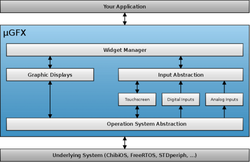
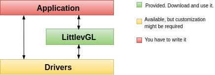

# HMI WorkFlow

## 概述

本文档将介绍使用 ESP32 提供的硬件资源和软件资源开发人机交互界面 HMI 的方法。

## ESP32 HMI 资源

- 硬件资源

    * LCD 接口：SPI、I2S

- 系统性能

    * 外部存储器 Cache

- 图形库

    * μGFX
    * LittlevGL

## ESP32 图形库特性

* 多国语言支持
* 易移植外设驱动架构
* 完整的特性列表
* 丰富的 GUI 例程
* 绘制 UI 工具或 PC 模拟器

## μGFX 介绍

- 2D 图像库
    * 丰富的绘图 API
    * 图像显示功能（bmp、jpeg、png、gif）
    * Alpha 混合
- 多种字体
    * 可导入用户字体
    * 支持多国语言
    * 抗锯齿
- 支持嵌入式操作系统
- 清晰的驱动接口，方便用户快速移植 LCD 驱动
- 提供从简单到复杂的例程
    - 快速上手
    - 加快应用开发速度
- 丰富的 GUI 控件
    - 可自定义 GUI 控件

### μGFX 结构

### μGFX 开发平台基本结构和开发方法

1. 准备资源

    图片/字体等资源

2. UI 原型设计

    将 GUI 的原型通过 PS 或 μGFX-Studio 等软件呈现出来

3. 代码转换

    将资源文件转换为代码或者存储在外部存储器

4. ESP32 平台选择

5. 基于 [ESP32 μGFX](https://github.com/espressif/esp-iot-solution/tree/master/components/hmi/ugfx_gui) 库进行移植、相关驱动开发

6. 基于 μGFX-Studio 平台开发应用程序（可选）

7. 应用代码开发

8. 调试运行

### 资源准备示例

1. 图片资源处理

    通过 `./file2c -dcs romfs_img_ugfx.png romfs_img_ugfx.h` 命令，将 `png` 图片资源生成相应的 `.h` 文件

2. 字体资源处理

    通过[在线字体转换工具](https://ugfx.io/font-converter)将 `*.ttf` 字体资源生成相应的 `.c` 文件

### 使用 μGFX-Studio 开发应用程序

- μGFX 可运行在 Windows
- 拖放式 UI 设计
- 创建多个显示页面
- FontManager - 使用您想要的任何字体
- ImageManager - 使用您想要的任何图像
- 自定义绘制方式

  

### μGFX 例程演示视频

[演示视频](http://demo.iot.espressif.cn:8887/cmp/demo/demo2.mp4)

## LittlevGL 介绍

- 内置良好主题样式
- 出色的性能
    * 更低的内存消耗
    * 更易实现动画效果
- 抗锯齿、不透明度、平滑滚动
- 清晰的驱动接口，方便用户快速移植 LCD 驱动
- 丰富的 GUI 控件
    - 可自定义 GUI 控件

### LittlevGL 结构

### LittlevGL 开发平台基本结构和开发方法

1. 准备资源

    图片/字体等资源

2. UI 原型设计

    将 GUI 的原型通过 PS 等软件呈现出来

3. 代码转换

    将资源文件转换为代码或者存储在外部存储器

4. ESP32 平台选择

5. 基于 [ESP32 LittlevGL](https://github.com/espressif/esp-iot-solution/tree/master/components/hmi/lvgl_gui) 库进行移植、相关驱动开发

6. 使用 PC 模拟器开发应用程序（可选）

7. 应用代码开发

8. 调试运行

### 资源准备示例

1. 图片资源处理

    通过[在线图片转换工具](https://littlevgl.com/image-to-c-array)将图片资源转换为相应的 `.c` 文件

2. 字体资源处理

    通过[在线字体转换工具](https://littlevgl.com/ttf-font-to-c-array)将 `*.ttf` 字体资源生成相应的 `.c` 文件

### 使用 LittlevGL 模拟器开发应用程序

- 独立的硬件抽象层便于平台移植
- 模拟器可运行在 Linux、Windows、Mac OS
- 支持 Eclipse

### LittlevGL 例程演示视频

[演示视频](http://demo.iot.espressif.cn:8887/cmp/demo/demo1.mp4)

## 总结

- ESP32 为用户界面应用开发提供了：
    * 强大的 CPU 处理能力及其丰富的外设接口
    * 多个图形库供开发工程师选择
- ESP32 用户界面设计方案可广泛应用于：
    * 便携或穿戴式消费电子产品，智能楼宇和工业控制器、智能家电、个人医疗设备、保健点医疗设备，车载电子等
