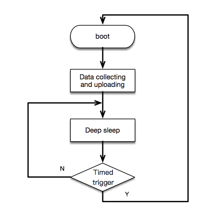
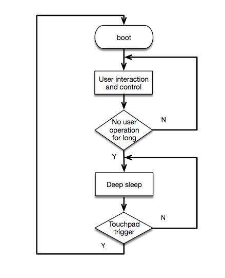

# ESP32 低功耗方案概述

* 使用 ESP32 的 deep sleep 功能, RTC资源和ULP协处理器可以实现各种应用场合的低功耗需求. 当 ESP32 进入 deep sleep 模式时, 所有由 APB_CLK 驱动的外设, CPUs 和 RAM 将掉电. Deep sleep 模式中, RTC_CLK 仍然工作, RTC controller, RTC 外设, ULP 协处理器, RTC fast memory 和R TC slow memory 可以不掉电, 取决于 app 中所设置的唤醒源. 以上提到的资源具体如下:
    * RTC 外设: 包括片上温度传感器, ADC, RTC GPIO 和 touch pad
    * ULP 协处理器: 可用于 deep sleep 时的简单数据采集和 deep sleep唤醒, 只能访问 RTC slow memory和RTC寄存器
    * RTC fast memory: deep sleep 唤醒后不会马上执行 bootloader, 而是先执行 deep sleep wake stubs 对应的函数 esp_wake_deep_sleep, 此函数存放在 RTC Fast memory中
    * RTC slow memory: 存放供 ULP 协处理器和 deep sleep wake stubs 访问的数据

* Deep sleep 唤醒源:
    * Timer
    * Touchpad
    * Ext(0):  RTC IO 中的指定的某个 gpio 满足指定电平
    * Ext(1):  RTC IO 中的某些 gpios 同时满足指定电平
    * ULP 协处理器

# 低功耗场景

## 定时数据采集与上报（例如器械状态监控器）
* 此场景使用 ESP32 定时地采集传感器的数据并上传数据, 此时可使用 deep sleep 的 timer 唤醒源. ESP32 采集数据上传后进入 deep sleep, 设置 timer 唤醒, 唤醒后再采集数据上传, 如此循环. 此场景 ESP32 需要周期性的唤醒, 不能充分利用 ESP32 的低功耗, 但是优势在于此场景可以进行复杂传感器数据采集.
* 逻辑流程图:
     
    

* 程序流程:
    * 芯片 boot 后读取传感器数据, 将数据上传
    * 调用 esp_deep_sleep_enable_timer_wakeup(sleep_time_us) 设置 deep sleep 时间
    * 调用 esp_deep_sleep_start() 进入 deep sleep 模式

## 支持gpio触发的异常数据采集（例如烟雾报警器）
* 此场景中不需要周期性的采集传感器数据, 当传感器采集到异常数据时会主动向 ESP32 输出 gpio 触发电平. 此时, ESP32 可以进入支持 RTC IO 唤醒的 deep sleep 模式, 如果传感器没有采集到异常数据, ESP32 将持续睡眠, 只有在传感器采集到异常数据并将提示 GPIO 置为指定电平时 ESP32 才会从 deep sleep 唤醒, 然后发出警报或者上传数据. 此场景充分利用了ESP32 的低功耗, 但是对传感器要求较高, 需要具有 gpio 触发功能.
* 逻辑流程图:
     
    

* 程序流程:
    * 首先确定 deep_sleep 唤醒方式. 根据唤醒方案, 配置 RTC IO 上下拉模式(如果是电平唤醒, 需要上拉, 如果是高电平唤醒, 需要下拉. 可以通过程序配置或外接上下拉电阻. 建采用外部上下拉, 功耗会更低.)
    * 芯片 boot 后读取传感器数据, 发出警报或者上报异常
    * 调用 `esp_deep_sleep_enable_ext0_wakeup(MY_RTC_WAKEUP_IO, WAKEUP_IO_LEVEL)` 或者 `esp_deep_sleep_enable_ext1_wakeup(WAKEUP_PIN_MASK, WAKEUP_TYPE)` 设置芯片唤醒电压条件. *注: 由于 esp_deep_sleep_enable_ext0_wakeup() 在 deep sleep 时需要打开 RTC 外设, 相对 EXT1 唤醒方式来说, 电流会稍微偏高. 而 esp_deep_sleep_enable_ext1_wakeup() 不需要打开 RTC 外设*
    * 调用 esp_deep_sleep_start() 进入 deep sleep 模式

## 数据采集或异常检测（不支持 gpio 触发, 不需要频繁上传数据）
* 此场景中传感器不具有 gpio 触发功能, 需要 cpu 和片上外设进行轮询式数据采集或者异常检测, ESP32 的 ULP 协处理器可以进行简单的数据采集, 并在指定条件下唤醒 ESP32 进行进一步的处理, 此过程中采集的数据可存放在 RTC slow memory 中, 供 ESP32 唤醒时读取, 目前 ULP 协处理只支持片上温度传感器和 ADC 数据的采. 此场景的优势在于可以在低功耗情况下频繁地采集数据, 降低了对传感器的要求.
* 逻辑流程图:
     
    

* 用户可以自己根据 ULP 指令集写汇编程序用于 deep sleep 时, ULP 协处理器执行, 流程如下:
    * 芯片 boot 后从 RTC_SLOW_MEMORY 读取 deep sleep 时 ULP 协处理采集的数据, 上传数据
    * 调用 ulp_process_macros_and_load() 将汇编代码拷贝到 RTC_SLOW_MEMORY
    * 调用 ulp_run(ADDRESS) 启动协处理器, 执行 RTC_SLOW_MEMORY 中的代码
    * 调用 esp_deep_sleep_start() 开始 deep sleep
* 为了使用户更方便地使用协处理器进行数据采集与存储, 我们在 Iot Solution 中增加了 ulp_monitor 模块, 用户可直接调用 c 函数运行协处理器. ulp_monitor 模块使用按如下流程（具体可查看 ulp_monitor 模块的 readme.md 和 ulp_monitor_test.c 文件）:
    * 芯片 boot 后从 RTC_SLOW_MEMORY 读取 deep sleep 时 ULP 协处理采集的数据, 上传数据
    * 调用 iot_ulp_monitor_init(ULP_PROGRAM_ADDR, ULP_DATA_ADDR) 设置协处理器程序运行地址与数据保存地址
    * 调用 iot_ulp_add_adc_monitor 或 iot_ulp_add_temprature_monitor 添加协处理器采集的数据类型和唤醒条件（可同时添加）
    * 调用 iot_ulp_monitor_start 设置测量频率并启动协处理器
    * 调用 esp_deep_sleep_start() 开始 deep sleep

## 用户交互场景, 使用 touchpad 触摸（gpio 按键）唤醒（例如控制面板）
* 此场景一般用于一些用户交互设备如控制面板等. 当用户长时间没有操作面板（例如触摸 touchpad, 按 gpio 按键）时, 可使 ESP32 进入 deep sleep 模式, 并设置 touchpad（gpio）唤醒. 支持 touchpad 唤醒的 deep sleep 模式下, 芯片的电流大约为 30uA .
* 逻辑流程图:
     
    

* 程序流程:
	* 芯片 boot 后运行用户交互与控制程序
	* 配置需要用于唤醒的 touchpad （包括初始化与设置阈值, 可查看 iot-solution 中的 touchpad 方案）
	* 调用 esp_deep_sleep_enable_touchpad_wakeup() 使能 touchpad 唤醒 , 然后调用 esp_deep_sleep_start() 开始 deep sleep

# deep sleep支持不同唤醒源时电流情况
* 正常工作, ESP32 作为 station 时, 平均电流约为 115mA

    

* 支持定时唤醒时, deep sleep 期间的平均电流约为 6uA:

    

* 支持 rtc io 唤醒时, deep sleep 期间的平均电流约为 6uA

    

* deep sleep 期间, 协处理器周期性运行数据采集程序(每秒采集 10 次, 所以图中的尖峰是协处理器工作时的电流)

    

* 支持 touchpad 唤醒时, deep sleep 期间的平均电流约为 13uA 左右

    

关于 deep_sleep 唤醒方式的配置, 可以参考 IOT-Solution 中 Test Case 或 [电流测试板使用简介](./esp32_ulp_eb.md)

关于 deep_sleep 电流测试可以参考 RTC IO 和 TouchPad 覆盖[测试结果](./coverage_test.md)
