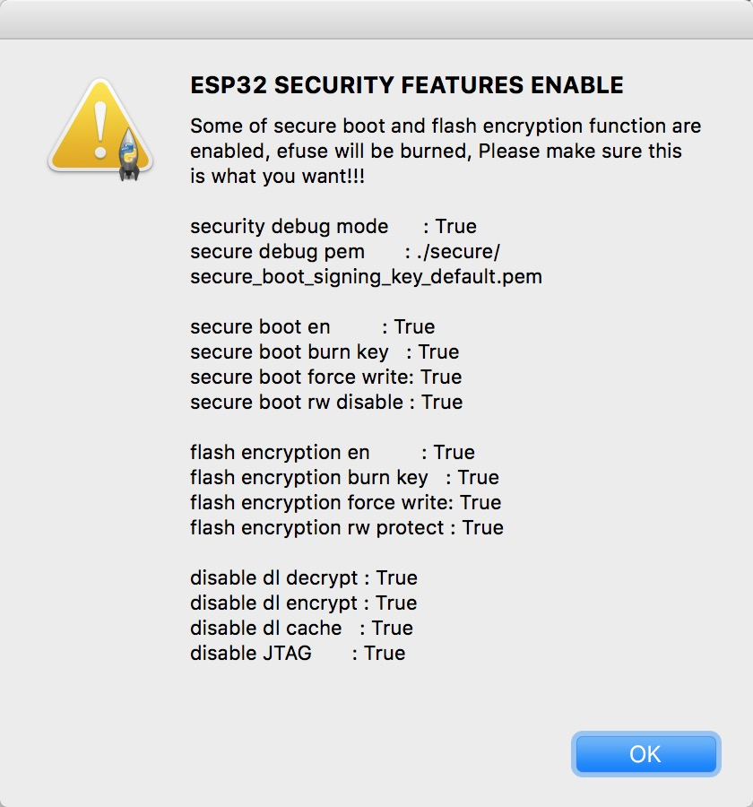

## Download Tool GUI instruction

---


    


### Path panel
* choose files and set addresses

> * DeviceMasterKey Folder Path(Only used for esp-iot platform, the tool will find .bin files under this folder and take it as a master device and burn to the flash. Once done, the key file will be moved to "used" folder under the path.)

> * The flash address must aligned with 4096 Bytes, that is 0x1000 in hex.

### SPI configure panel

#### Crystal

* Choose the frequency of the crystal on module.

    > On ESP8266, the tool will overwrite the 48th byte of rf parameter(default_init_data.bin) if chosen. 

    > This option will do nothing for ESP32 chips.

#### SPI speed

* This is the SPI clock speed to read/write SPI flash. (It is 40Mhz by default)

* Usually 40Mhz is enough and safe, if you want to enable 80Mhz for SPI flash, make sure:
    > 1. The flash you are using support 80Mhz.
    > 2. Your PCB layout is good enough for 80Mhz.

* The configure byte is in the 4th byte from flash address 0x0. So the tool will overwrite the 4th byte of bin file which is to be written to 0x0 address.

#### SPI mode

* To choose the SPI data mode for flash R/W operations.

* QIO/QOUT: use /HOLD and /WP pin as SPI data2/data3, make sure your flash support Quad instructions before select.(Almost the same but "QIO" will send address in quad mode, but "QOUT" will not.)

* DIO/DOUT: use Dual mode instructions to read/write flash. (Almost the same but "DIO" will send address in Dual mode but "DOUT" will not.)

* Most of the flashes support DIO/DOUT mode operations.

* Most of the flashes have their "QE" bit on the 9th bit of status register.

* For those flashes whose "QE" bit are the 6th bit of status register, we can use DIO/DOUT mode. You can refer to this document if you want to know use quad mode on these flashes, 
[click to read](http://www.espressif.com/sites/default/files/documentation/2a-esp8266-sdk_getting_started_guide_en.pdf)

* The configure byte is in the 3rd byte from flash address 0x0. So the downlaod tool will overwrite the 3rd byte of bin file which is to be written to 0x0 address.

#### Flash(map) size

* Choose the flash map mode

* This option should be the same as the one you chose when compiling the bin file.

* For different map size, the system parameters will be saved in different flash regions.

* This is not the physical flash size, but the flash mapping mode.

* The configure byte is in the 4th byte from flash address 0x0. So the tool will overwrite the 4th byte of bin file which is to be written to 0x0 address.


#### SpiAutoSet

* The tool will read flash ID to pick the SPI options.

> * `Not recommanded` to select this option. Because this is the physical size maybe not feasible for the logic flash map in software.

#### CombineBin

* Click this button, the download tool will combine the images selected in the path panel and generate a new image according to the download address and the length of the image files.

> * `Note that, if "DoNotChgBin" is selected, combined binary will not change the SPI and flash parameters, otherwise, tool will modify the SPI and flash parameters accordingly.`

* The empty regions will be filled with 0xFF.

#### DoNotChgBin(Do not change bin file)

* If selected, the tool will not modify anything of the bin files.

> * For ESP32 CHIPs, we can select this option to use default option set by the esp-idf build system.

> * `Note that, if "DoNotChgBin" is selected, combined binary will not change the SPI and flash parameters, otherwise, tool will modify the SPI and flash parameters accordingly.`

#### Lock settings

> * If selected, the download tool will lock the SPI panel and path panel, usually used in factory.

#### Default

> * Click this button to restore the options to default ones.

#### Detected info 

> * This window will display the flash ID and crystal frequency reading from ESP chip.

#### MAC address

> * This window will show the MAC addresses read from ESP chips.

#### COM

> * Choose serial port, if click, the tool will auto-detect and list all available serial ports.

#### BAUD

> * Choose the download speed.

> * ESP chip has a baud synchronize function. So we can choose different speed to download the image to ESP chips.

#### START

> * Start to download flash image

#### STOP 

> * To stop the download process

#### ERASE

> * To erase the whole flash chip

#### Close the tool

> * When you click [x] to exit the tool, the tool will save the options and paths in configure folder

## Parameter settings

* Configure file path is $DOWNLOAD_TOOL/configure
* Different chips for different folder
* xxx_download.conf keeps the download settings, usually we don't modify this
* Utility.conf keeps the log level setting as well as the RF settings.
* Security.conf(for ESP32) keeps the settings for secure boot and flash encryption.


## Security solution

* We can set the following items in security.conf

```
[DEBUG MODE]
debug_enable = True
debug_pem_path = ./secure/secure_boot_signing_key_default.pem

[SECURE BOOT]
secure_boot_en = True
burn_secure_boot_key = True
secure_boot_force_write = True
secure_boot_rw_protect = True

[FLASH ENCRYPTION]
flash_encryption_en = True
burn_flash_encryption_key = True
flash_encrypt_force_write = True
flash_encrypt_rw_protect = True

[AES KEY]
aes_key_en = False
burn_aes_key = False

[DISABLE FUNC]
jtag_disable = True
dl_encrypt_disable = True
dl_decrypt_disable = True
dl_cache_disable = True
```

| Item | Function | default |
|--|--|--|
| debug_enable |  enable debug mode for security features, users can use a .pem key to generate the secure boot key and flash encryption key. This is only a debug mode in case users forget their keys.| True |
| debug_pem_path | file path of the .pem key| 
| Secure boot | |
| secure_boot_en | to enable secure boot function| False |
| burn_secure_boot_key | to enable burning the secure boot key into efuse after downloading is finished | False |
| secure_boot_force_write | to force write the secure boot key into efuse, no mater whether the efuse block has been written before. It is risky of breaking the original value | False |
| secure_boot_rw_protect | to set write and read protection for secure boot key | False |
| flash encryption | |
| flash_encryption_en | to enable flash encryption function | False |
| burn_flash_encryption_key | to enable burning flash encryption key into efuse after flash downloading is finished | False |
| flash_encrypt_force_write | to force write the flash encrypt key into efuse, no mater whether the efuse block has been written before. It is risky of breaking the original value | False |
| flash_encrypt_rw_protect | to set write and read protection for flash encrypt key | False|
| AES KEY| Not used yet |
| DISABLE FUNC | |
| jtag_disable | to disable JTAG access after downloading | True|
|dl_encrypt_disable| to disable encrypt functions in download mode |True|
|dl_decrypt_disable| to disable decrypt functions in download mode | True |
|dl_cache_disable | to disable flash cache functions in download mode| True|

* If `secure_boot_en` or `flash_encryption_en` is set, you need to `restart the download tool`, if the security feature is enabled, you will see this warning message: 

 

* Make sure the settings are correct before any download action.


