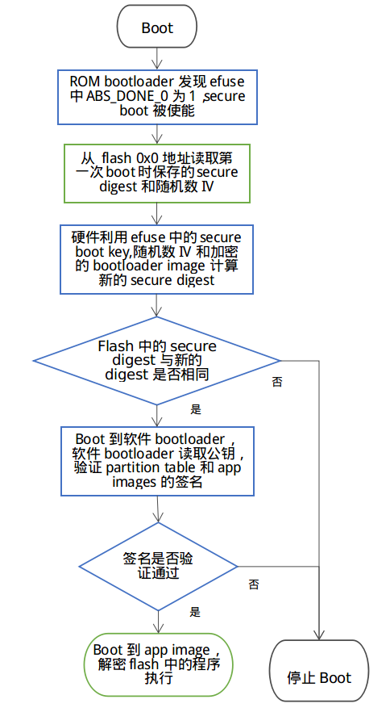
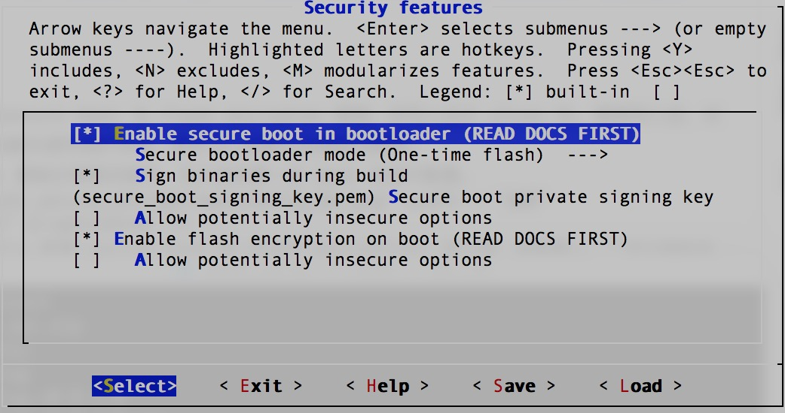

# Secure Boot 功能概述

### 方案概述
* Secure Boot 的目的是保证芯片只运行用户指定的程序，芯片每次启动时都会验证从 flash 中加载的 partition table 和 app images 是否是用户指定的
* Secure Boot 中采用 ECDSA 签名算法对 partition table 和 app images 进行签名和验证，ECDSA 签名算法使用公钥/私钥对，秘钥用于对指定的二进制文件签名，公钥用于验证签名
* 由于 partition table 和 app images 是在软件 bootloader 中被验证的，所以为了防止攻击者篡改软件 bootloader 从而跳过签名验证，Secure Boot 过程中会在 ROM bootloader 时检查软件 bootloader image 是否被篡改，检查用到的 secure boot key 由硬件随机数生成器产生，保存的 efuse 中，对于软件是读写保护的

### 所用资源
* ECDSA 算法公钥/私钥对
    * 烧写 flash 前在 PC 端生成
    * 公钥会被编译到 bootloader image 中，软件 bootloader 在执行时会读取公钥，使用公钥验证 flash 中partition table 和 app images 是否是经过相应的私钥签名的
    * 私钥在编译时被用于对 partition table 和 app images 签名，私钥必须被保密好，一旦泄露任何使用此私钥签名的 image 都能通过 boot 时的签名验证
* secure bootloader key
    * 这是一个 256-bit AES key，在第一次 Secure Boot 时由硬件随机数生成，保存在 efuse 中，软件无法读取
    * 使用此 key 验证软件 bootloader image 是否被修改
	
### 执行过程
1. 编译 bootloader image 时发现 menuconfig 中使能了 secure boot，于是根据 menuconfig 中指定的公钥/秘钥文件路径将公钥编译到 bootloader image 中，bootloader 被编译成支持 secure boot
2. 编译 partition table 和 app images 时使用秘钥计算出签名，将签名编译到相应的二进制文件中
3. 芯片第一次 boot 时，软件 bootloader 根据一下步骤使能 secure boot：
    * 硬件产生一个 secure boot key，将这个 key 保存在 efuse 中，利用这个 key、一个随机数 IV 和 bootloader image 计算出 secure digest 
    * secure digest 与随机数 IV 保存在 flash 的 0x0 地址，用于在后续 boot 时验证 bootloader image 是否被篡改
    * 若 menuconfig 中选择了禁止 JTAG 中断和 ROM BASIC 中断，bootloader 会将 efuse 中的一些标志位设置为禁止这些中断（强烈建议禁止这些中断）
    * bootloader 通过烧写 efuse 中的 ABS_DONE_0 永久使能 secure boot
    
4. 芯片在后面的 boot 中，ROM bootloader 发现 efuse 中的 ABS_DONE_0 被烧写，于是从 flash 的地址 0x0 读取第一次 boot 时保存的 secure digest 和随机数 IV，硬件使用 efuse 中的 secure boot key 、随机数 IV 与当前的 bootloader image 计算当前的 secure digest，若与 flash 中的 secure digest 不同，则 boot 不会继续，否则就执行软件 bootloader。
5. 软件 bootloader 使用 bootloader image 中保存的公钥对 flash 中的 partition table 和 app images 签字进行验证，验证成功之后才会 boot 到 app 代码中

### 使用步骤
1. make menuconfig 选择 "enable secure boot in bootloader"
2. make menuconfig 设置保存公钥/秘钥对的文件
3. 生成公钥和秘钥，先执行  "make" 命令，此时由于还没有公钥/秘钥对，所以命令行中会提示生成公钥/秘钥对的命令，按提示执行命令即可。但在产品级使用中，建议使用 openssl 或者其他工业级加密程序生成公钥/秘钥对。例如使用 openssl：“openssl ecparam -name prime256v1 -genkey -noout -out my_secure_boot_signing_key.pem”（若使用现有的公钥/秘钥对文件，可以跳过此步）
4. 运行命令 "make bootloader" 产生一个使能 secure boot 的 bootloader image
5. 执行完4后命令行会提示下一步烧写 bootloader image 的命令，按提示烧写即可
6. 运行命令 "make flash" 编译并烧写 partition table 和 app images 
7. 重启芯片，软件 bootloader 会使能 secure boot ，查看串口打印确保 secure boot 成功启用。

### 注意事项
* 正常使用情况下， bootloader image 只能烧写一次，partition table 和 app images 可以重复烧写
* 秘钥必须保密，一旦泄露 secure boot 将失去作用
* 用于 OTA 的 image 必须进行秘钥签名，OTA 时会使用公钥进行验证
* __`在默认设置下， bootloader的从0x1000地址开始，最大长度为 28KB（bootloader)。如果发现 Secure Boot 发送错误, 请先检查是否因为 Bootloader 地址过大。 通过在menuconfig中调整Bootloader的log等级，可以有效降低编译后的Bootloader大小。`__


### 可重复烧写 bootloader
* 默认情况下 bootloader image 只能烧写一次，在产品中强烈建议这样做，因为 bootloader image 可以重新烧写的情况下可以通过修改 bootloader 跳过后续 image 的验证过程，这样 secure boot 就失去作用
* 可重复烧写 bootloader 模式下，secure bootloader key 是在 PC 端产生的，此 key 必须保密，一旦 key 被泄露，其它使用此 key 生成digest 的 bootloader image 也能通过硬件检查
* 使用步骤：
    1. make menuconfig 中选择 "secure bootloader mode"->"Reflashable"
    2. 按“使用步骤”一节步骤2和3生成公钥与秘钥
    3. 运行指令 "make bootloader" ，一个 256-bit secure boot key 会根据用于签名的私钥计算出，命令行会打印两个后续步骤，按循序执行：
        * 将 PC 端生成的 secure boot key 烧入 efuse 中的命令
        * 将编译好的带有预计算出的 secure digest 的 bootloader image 烧写到 flash 中
    4. 从“使用步骤”一节的步骤6继续执行

# Flash Encryption

### 方案概述
* 使能 flash encryption 后，使用物理手段（如串口）从 SPI flash 中读取的数据都是经过加密的，大部分数据无法恢复出真实数据
* flash encryption 使用 256-bit AES key 加密 flash 数据，key 保存在芯片的 efuse 中，生成之后变成软件读写保护
* 用户烧写 flash 时烧写的是数据明文，第一次 boot 时，软件 bootloader 会对 flash 中的数据在原处加密
* 一般使用情况下一共有4次机会通过串口烧写 flash ，通过 OTA 更新 flash 数据没有次数限制。开发阶段可以在 menuconfig 中设置无烧写次数限制，但不要在产品中这么做

### 使用步骤

1. make  menuconfig 中选择 "Security features"->"Enable flash encryption on boot"
2. 按通常操作编译出 bootloader, partition table 和 app image 并烧写到 flash 中
3. 第一次 boot 时 flash 中被指定加密的数据被加密（大的 partition 加密过程可能需要花费超过1分钟） ，之后就可以正常使用被加密的 flash 数据

### 加密过程（第一次 boot 时进行）

1. bootloader 读取到 efuse 中的 FLASH_CRYPT_CNT 为0，于是利用硬件随机数生成器产生加密用的 key ，此 key 被保存在 efuse 中，对于软件是读写保护的
2. bootloader 对所有需要被加密的 partition 在 flash 中原处加密
3. 默认情况下 efuse 中的 DISABLE_DL_ENCRYPT, DISABLE_DL_DECRYPT 和 DISABLE_DL_CACHE 会被烧写为1，这样 UART bootloader 时就不能读取到解密后的 flash 数据
4. efuse 中的 FLASH_CRYPT_CONFIG 被烧写成 0xf，此标志用于决定加密 key 的多少位被用于计算每一个 flash 块（32字节）对应的秘钥，设置为 0xf 时使用所有256位
5. efuse 中的 FLASH_CRYPT_CNT 被烧写成 0x01，此标志用于 flash 烧写次数限制以及加密控制，详见“FLASH_CRYPT_CNT”一节
6. bootloader 将自己重启，从加密的 flash 执行软件 bootloader

### 串口重烧 flash （3次重烧机会）
* 串口重烧 flash 过程
    1. make  menuconfig 中选择 "Security features"->"Enable flash encryption on boot"
    2. 编译工程，将所有之前加密的 images （包括 bootloader）烧写到 flash 中
    3. 在 esp-idf 的 components/esptool_py/esptool 路径下使用命令 espefuse.py burn_efuse FLASH_CRYPT_CNT 烧写 efuse 中的 FLASH_CRYPT_CNT
    4. 重启设备，bootloader 根据 FLASH_CRYPT_CNT 的值重新加密 flash 数据
    
* 若用户确定不再需要通过串口重烧 flash，可以在 esp-idf 的 components/esptool_py/esptool 路径下使用命令 espefuse.py --port PORT write_protect_efuse FLASH_CRYPT_CNT 将 FLASH_CRYPT_CNT 设置为读写保护（注意此步骤必须在 bootloader 已经完成对 flash 加密后进行）

### FLASH_CRYPT_CNT
* FLASH_CRYPT_CNT 是 flash 加密方案中非常重要的控制标志，它是 8-bit 的值，它的值一方面决定 flash 中的值是否马上需要加密，另一方面控制 flash 烧写次数限制
* 当 FLASH_CRYPT_CNT 有（0,2,4,6,8）位被烧写为1时，bootloader 会对 flash 中的内容进行加密
* 当 FLASH_CRYPT_CNT 有（1,3,5,7）位被烧写为1时，bootloader 知道 flash 的内容已经过加密，直接读取 flash 中的数据解密后使用
* FLASH_CRYPT_CNT 的变化过程：
    1. 没有使能 flash 加密时，永远是0
    2. 使能了 flash 加密，在第一次 boot 时 bootloader 发现它的值是 0x00，于是知道 flash 中的数据还未加密，利用硬件随机数生成器产生 key，然后加密 flash，最后将它的最低位置1（取值为0x01）
    3. 后续 boot 时，bootloader 发现它的值是 0x01，知道 flash 中的数据已加密，可以解密后直接使用
    4. 用户需要串口重烧 flash ，于是使用命令行手动烧写 FLASH_CRYPT_CNT，此时2个 bit 被置为 1（取值为0x03）
    5. 重启设备，bootloader 发现 FLASH_CRYPT_CNT 的值是 0x03（2 bit 1），于是重新加密 flash 数据，加密完成后 bootloader 将 FLASH_CRYPT_CNT 烧写为0x07（3 bit 1），flash 加密正常使用
    6. 用户需要串口重烧 flash ，于是使用命令行手动烧写 FLASH_CRYPT_CNT，此时4个 bit 被置为 1（取值为0x0f）
    7. 重启设备，bootloader 发现 FLASH_CRYPT_CNT 的值是 0x0f（4 bit 1），于是重新加密 flash 数据，加密完成后 bootloader 将 FLASH_CRYPT_CNT 烧写为0x1f（5 bit 1），flash 加密正常使用
    8. 用户需要串口重烧 flash ，于是使用命令行手动烧写 FLASH_CRYPT_CNT，此时6个 bit 被置为 1（取值为0x3f）
    9. 重启设备，bootloader 发现 FLASH_CRYPT_CNT 的值是 0x4f（6 bit 1），于是重新加密 flash 数据，加密完成后 bootloader 将 FLASH_CRYPT_CNT 烧写为0x7f（7 bit 1），flash 加密正常使用
    10. 注意！此时不能再使用命令行烧写 FLASH_CRYPT_CNT，bootloader 读到 FLASH_CRYPT_CNT 为 0xff（8 bit 1）时，会停止后续的 boot。

### 被加密的数据

* Bootloader 
* Secure boot bootloader digest（若 Secure Boot 被使能， flash 中会多出这一项， 具体查看“Secure Boot”中“执行过程”的步骤3）
* Partition table
* Partition table 中指向的所有 Type 域标记为“app”的部分
* Partition table 中指向的所有 Flags 域标记为“encrypted”的部分（用于非易失性存储（NVS）部分的 flash 在任何情况下都不会被加密）

### 哪些方式读到解密后的数据（真实数据）
* 通过内存管理单元的 flash 缓存读取的 flash 数据都是经过解密后的数据，包括：
    * flash 中的可执行应用程序代码
    * 存储在 flash 中的只读数据
    * 任何通过 API esp_spi_flash_mmap() 读取的数据
    * 由 ROM bootloader 读取的软件 bootloader image 数据
* 如果调用 API esp_partition_read()读取被加密区域的数据，则读取的 flash 数据是经过解密后的数据

### 哪些方式读到不解密的数据（无法使用的脏数据）
* 通过 API esp_spi_flash_read() 读取的数据
* ROM 中的函数 SPIRead() 读取的数据

### 软件写入加密数据
* 调用 API esp_partition_write() 时，只有写到被加密的 partition 的数据才会被加密
* 函数 esp_spi_flash_write() 根据参数 write_encrypted 是否被设为 true 决定是否对数据加密
* ROM 函数 esp_rom_spiflash_write_encrypted() 将加密后的数据写入 flash 中，而 SPIWrite() 将不加密的数据写入到 flash 中

# Secure Boot 与 Flash Encryption 流程图
* 第一次 boot 时 secure boot 与 flash encrypt 的生效过程如下图所示，图中蓝色框是 secure boot 的步骤，绿色框是 flash encrypt 的步骤

    
	
* 后续 boot 时流程图如下，图中绿色框中的步骤会执行解密，解密是由硬件自动完成的

    
	
	
# Windows平台的下载工具

* 乐鑫提供windows平台的下载工具，能够在工厂生产环境中批量烧写固件
* 点击[这里](./download_tool_en.md)，阅读生产下载固件的说明文档。
* 生产下载工具的配置文件在 configure 文件夹内，涉及安全特性的配置在 security.conf 中，目前涉及的配置内容如下表：

| `ITEM` | Function | default |
| :----:   |       :----:     |       :----:      |
| debug_enable |  是否开启debug模式，在debug模式下，工具会根据pem文件产生相同密钥，否则随机生成密钥| True |
| debug_pem_path | 设置证书地址，用于生成可重复烧写的密钥，尽在debug模式下有效 |  | 
| `SECURE BOOT` | |
| secure_boot_en | 开启secure boot功能| False | 
| burn_secure_boot_key | 使能secure boot key烧写 | False |
| secure_boot_force_write | 是否不检查secure boot key block，强制烧写key | False | 
| secure_boot_rw_protect | 开启secure boot key区域的读写保护 | False | 
| `FLASH ENCRYPTION` | |
| flash_encryption_en | 开启flash加密功能 | False |
| burn_flash_encryption_key | 使能flash encrypt key烧写 | False |
| flash_encrypt_force_write | 是否不检查flash encrypt key block，强制烧写key | False |
| flash_encrypt_rw_protect | 开启flash encrypt key区域的读写保护 | False| 
| `AES KEY`| Not used yet |
| `DISABLE FUNC` | |
| jtag_disable | 是否关闭JTAG调试功能 | False| 
|dl_encrypt_disable| 是否关闭下载模式下flash加密功能 |False|
|dl_decrypt_disable| 是否关闭下载模式下flash解密功能 | False |
|dl_cache_disable | 是否关闭下载模式下的flash cache功能| False|


* 下载工具的内部逻辑和流程如下：

    

---
# 启用Secure Boot 与 Flash Encryption 的生产方案
### 准备工作
* 安装eptool
    * esptool默认路径在$IDF_PATH/components/esptool_py/esptool/ 
    * 也可以通过python安装：
    
        ```
        pip install esptool
        或者
        pip3 install esptool
        ```

### 方案1: 通过bootloader完成security特性初始化
* `优势`: 可以批量进行flash烧录，初始化的固件相同，密钥在第一次上电有在设备内随机生成。
* `缺陷`: 设备在首次初始化过程所用时间较长，如果在首次初始化过程发生掉电等意外情况，设备可能无法正常启动。
* 由芯片端自动随机生成secure boot 与 flash encrypton 密钥，并写入芯片 efuse 中, 密钥写入后，对应的efuse block会被设置为读写保护状态，软件与工具都无法读取出密钥。
* 所有编译出的 images 都按正常情况烧写，芯片会在第一次 boot 时进行配置。
* 通过 make menuconfig 配置 secure boot 和 flash encryption, 按照第一、二节介绍的步骤执行即可，具体操作步骤如下，如果了解第一、二节的内容，可以跳过：
    1. 随机生成RSA密钥文件：

        ```
        espsecure.py generate_signing_key secure_boot_signing_key.pem
        or
        openssl ecparam -name prime256v1 -genkey -noout -out secure_boot_signing_key.pem
        ```
    2. 在menuconfig中，选择Sign binaries during build, 并指定刚才生成的密钥路径, 如下图。
        <br>
        
    3. 分别编译bootloader与应用代码
	
        ```
        make bootloader 
        make
        ```
    4. 使用 esptool 将编译生成的bin文件写入flash对应地址, 以example中hellow-world工程为例：
	
        ```
        bootloader.bin -->   0x1000
        partition.bin  -->   0x8000
        app.bin        -->  0x10000
        python $IDF_PATH/components/esptool_py/esptool/esptool.py --chip esp32 --port /dev/cu.SLAB_USBtoUART --baud 1152000 --before default_reset --after no_reset write_flash -z --flash_mode dio --flash_freq 40m --flash_size detect 0x1000 $IDS_PATH/esp-idf/examples/get-started/hello_world/build/bootloader/bootloader.bin 0xf000 $IDF_PATH/esp-idf/examples/get-started/hello_world/build/phy_init_data.bin 0x10000 $IDF_PATH/examples/get-started/hello_world/build/hello-world.bin 0x8000 $IDF_PATH/examples/get-started/hello_world/build/partitions_singleapp.bin
        ```
	    > 以上命令仅是示例代码，请在使用时，替换其中的文件路径以及所选参数，包括串口、波特率、SPI模式和频率等。
    5. 我们也可以使用window平台的下载工具来完成工厂下载。需要在配置文件中，关闭工具的security功能，这样工具端就不会操作security相关特性，完全由硬件和bootloader来完成初始化：
	
        ```
        [SECURE BOOT]
        secure_boot_en = False
        [FLASH ENCRYPTION]
        flash_encryption_en = False
        ```
        > 注意： 
        > 修改并保存参数前，请先关闭下载工具，配置文件修改完成并保存后，再开启运行下载工具。
        
    6. 或者我们可以通过下载工具的combine功能，将多个bin文件打包为一个文件，再由工厂flash烧录器烧录进flash进行批量生产。
        * 选择bin文件并制定flash中的地址
        * 选中 ‘DoNotChgBin’ 选项，这样工具不会对bin文件的配置(SPI模式速率等)进行任何修改。
        * 点击 ‘CombineBin' 按键，生产合并后的bin文件。
        * 在 ‘combine’ 文件夹下，生成 target.bin，将其烧写到 Flash 的 0x0 地址即可。
        * 工具只会对填写的最大地址范围内的空白区域填充 0xff。并将文件按地址组合。
        <br>
        
    7. 下载完成后，需要运行一次程序，使bootloader完成security相关特性的初始化，包括AES密钥的随机生成并写入EFUSE，以及对明文的flash进行首次加密。
        > 请误在首次启动完成前，将芯片断电，以免造成芯片无法启动的情况。
		
* `注意事项`：
    * 用于签名的私钥需要保密，如果泄漏，app.bin有被伪造的可能性。
    * 使用者不能遗失私钥，必须使用私钥用于对 OTA app 签名(如果有OTA功能)。
    * 芯片通过软件 bootloader 对 flash 加密是一个比较缓慢的过程，对于较大的 partition 可能需要花费一分钟左右
    * 若第一次执行 bootloader， flash 加密进行到一半芯片掉电
        * 没有使能 secure boot 时，可重新将 images 明文烧写到 flash 中，让芯片下次 boot 时重新加密 flash
        * 使能了 secure boot 时，由于无法重新烧写 flash，芯片将永久无法 boot
	
### 方案2: 通过下载工具初始化security特性
* `优势`: 工具进行密钥的随机生成，直接将 image 密文烧写进flash，然后配置efuse. 避免过程中掉电造成无法启动的情况。
* `缺陷`: 每个设备必须通过下载工具进行烧写，因为密钥不同，无法预先烧写相同的固件到flash中。
* 使用下载工具应用 secure boot 和 flash encryption，这时用户只需要的在 make menuconfig 中选择“enable secure boot in bootloader”并设置公钥/秘钥路径即可
* 下载工具在运行时，会随机产生 secure boot 与 flash encryption 密钥, 并烧写到对应的 EFUSE 位置中。
* 操作步骤：
    1. 随机生成RSA密钥文件，用于签名固件：

        ```
        espsecure.py generate_signing_key secure_boot_signing_key.pem
        or
        openssl ecparam -name prime256v1 -genkey -noout -out secure_boot_signing_key.pem
        ```
    2. 在menuconfig中，选择Sign binaries during build, 并指定刚才生成的密钥路径, 如下图。
        <br>
        
    3. 分别编译bootloader与应用代码
	
        ```
        make bootloader
        make
        ```
    4. 设置下载工具的安全配置文件
	
        ```
        [DEBUG MODE]
        debug_enable = False                #关闭debug模式，工具随机生成密钥。否则根据pem文件产生相同密钥
        debug_pem_path =                    #debug模式下，设置证书地址，用于生成可重复烧写的密钥
        [SECURE BOOT]
        secure_boot_en = True               #开启secure boot功能
        burn_secure_boot_key = True         #使能secure boot key烧写
        secure_boot_force_write = False     #是否不检查secure boot key block，强制烧写key
        secure_boot_rw_protect = True       #开启secure boot key区域的读写保护
        [FLASH ENCRYPTION]
        flash_encryption_en = True          #开启flash加密功能
        burn_flash_encryption_key = True    #使能flash encrypt key烧写
        flash_encrypt_force_write = False   #是否不检查flash encrypt key block，强制烧写key
        flash_encrypt_rw_protect = True     #开启flash encrypt key区域的读写保护
        [AES KEY]
        aes_key_en = False                  #目前未实现，仅保留该选项
        burn_aes_key = False                #目前未实现，仅保留该选项
        [DISABLE FUNC]
        jtag_disable = True                 #是否关闭JTAG调试功能
        dl_encrypt_disable = True           #是否关闭下载模式下flash加密功能
        dl_decrypt_disable = True           #是否关闭下载模式下flash解密功能
        dl_cache_disable = True             #是否关闭下载模式下的flash cache功能
        ```
        > 注意： 
        > 修改并保存参数前，请先关闭下载工具，配置文件修改完成并保存后，再开启运行下载工具。
    5. 使用下载工具进行下载，若不希望工具修改任何配置参数(比如flash 频率和模式)，请勾选‘DoNotChgBin’选项。下载工具会更具配置文件的设置，在下载过程中完成固件加密下载和密钥随机生成与烧写。
        <br>
        

* `注意事项`: 
	* 用于签名的私钥需要保密，如果泄漏，app.bin有被伪造的可能性。
	* 使用者不能遗失私钥，必须使用私钥用于对 OTA app 签名(如果有OTA功能)。
	* 用户可以选择不启用 app image的签名校验，只需要关闭menuconfig中的secure boot功能即可。下载工具会更具配置文件，通过efuse启用secure boot。
	  禁用app image的签名校验会存在安全隐患。

# 开发阶段使用可重复烧写 flash 的 Secure Boot 与 Flash encryption
1. make menuconfig 中使能 secure boot 和 flash encrypt，“Secure bootloader mode”选择“Reflashable”，并设置你的公钥/私钥.pem文件路径
2. 编译 bootloader 并生成 secure boot key：

    ```
    make bootloader
    ```
3. 使用 key 和 bootloader 计算带 digest 的 bootloader

    ```
    python $IDF_PATH/components/esptool_py/esptool/espsecure.py digest_secure_bootloader --keyfile ./build/bootloader/secure_boot_key.bin -o ./build/bootloader/bootloader_with_digest.bin ./build/bootloader/bootloader.bin
    ```
4. 编译 partition_table 与 app

    ```
    make partition_table
    make app
    ```
5. 加密三个 bin 文件

    ```
    python $IDF_PATH/components/esptool_py/esptool/espsecure.py encrypt_flash_data --keyfile flash_encrypt_key.bin --address 0x0 -o build/bootloader/bootloader_digest_encrypt.bin build/bootloader/bootloader_with_digest.bi
    python $IDF_PATH/components/esptool_py/esptool/espsecure.py encrypt_flash_data --keyfile flash_encrypt_key.bin --address 0x8000 -o build/partitions_singleapp_encrypt.bin build/partitions_singleapp.bin
    python $IDF_PATH/components/esptool_py/esptool/espsecure.py encrypt_flash_data --keyfile flash_encrypt_key.bin --address 0x10000 -o build/iot_encrypt.bin build/iot.bin
    ```
6. 烧写三个加密后的 bin 文件

    ```
    python $IDF_PATH/components/esptool_py/esptool/esptool.py --baud 1152000 write_flash 0x0 build/bootloader/bootloader_digest_encrypt.bin
    python $IDF_PATH/components/esptool_py/esptool/esptool.py --baud 1152000 write_flash 0x8000 build/partitions_singleapp_encrypt.bin
    python $IDF_PATH/components/esptool_py/esptool/esptool.py --baud 1152000 write_flash 0x10000 build/iot_encrypt.bin
    ```
7. 将 flash_encryption_key 烧入 efuse (仅在第一次boot前烧写):

    ```
    python $IDF_PATH/components/esptool_py/esptool/espefuse.py burn_key flash_encryption flash_encrypt_key.bin
    ```
8. 将 secure boot key 烧入efuse（仅在第一次boot前烧写）:

    ```
    python $IDF_PATH/components/esptool_py/esptool/espefuse.py burn_key secure_boot ./build/bootloader/secure_boot_key.bin
    ```
9. 烧写 efuse 中的控制标志（仅在第一次boot前烧写）

    ```
    python $IDF_PATH/components/esptool_py/esptool/espefuse.py burn_efuse ABS_DONE_0
    python $IDF_PATH/components/esptool_py/esptool/espefuse.py burn_efuse FLASH_CRYPT_CNT
    python $IDF_PATH/components/esptool_py/esptool/espefuse.py burn_efuse FLASH_CRYPT_CONFIG 0xf
    python $IDF_PATH/components/esptool_py/esptool/espefuse.py burn_efuse DISABLE_DL_ENCRYPT
    python $IDF_PATH/components/esptool_py/esptool/espefuse.py burn_efuse DISABLE_DL_DECRYPT
    python $IDF_PATH/components/esptool_py/esptool/espefuse.py burn_efuse DISABLE_DL_CACHE
    ```
