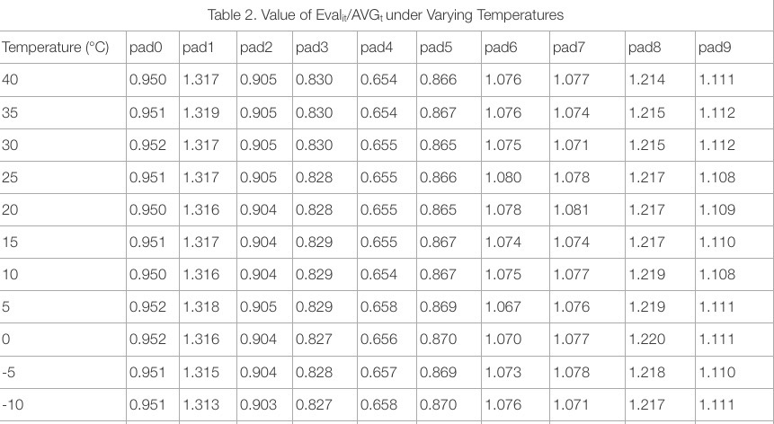

# Overview of ESP32 Touchpad Solution

*  Capacitive touch sensor is a key feature of the ESP32 chip. The touchpad solution using ESP32 is based on the principle that a finger touch produces additional capacitance on the pad and, thus, changes the charge and discharge times. The chip detects and reacts to any changes in the amount of charge and discharge in real time, thus reflecting the effectiveness of the finger touch.
* Sample readings from the ESP32 touchpad are provided in ESP-IDF. The value of each reading decreases as the equivalent capacitance on the touchpad increases. An interrupt mechanism is provided in ESP-IDF to capture real-time touch events on the touchpad without taking up CPU resources. Users need to set a threshold for the touchpad readings' sampling. If the sampled value is lower than the threshold, a touch interrupt will be triggered.
* Since the touchpad's capacitance is sensitive to external factors, such as temperature, voltage, humidity, etc., the sampled readings from the touchpad fluctuate even when there is no touch event. Changes thus caused to readings will lead to the decreased sensitivity of the touchpad, errors in capturing touch events, and so on.

# Mathematical Models

* Supposing there are N * touchpads, the mathematical expectation of the readings from the i-th pad at time *t* is Eval<sub>it</sub>. The average mathematical expectation of the readings from N * pads at time *t* is AVG<sub>t</sub>  = (Eval<sub>0t</sub> + Eval<sub>1t</sub> + ... + Eval<sub>t(N-1)</sub>)/N.
* Here is a simple mathematical model for ESP32 touchpad: Eval<sub>it</sub> = θ<sub>t</sub> * μ<sub>i</sub> * P.
	* θ<sub>t</sub> is the parameter of external factors (such as temperature, voltage, and humidity, etc.) at time *t*. The value of θ<sub>t</sub> is the same for different pads.
	* μ<sub>i</sub> is a parameter relevant to the shape of the pad, its location on the PCB and PCB routing, etc. The value of μ<sub>i</sub> is subject to the type of touchpads.
	* P is the common denominator (eg. material, etc.) across different pads.
* At a specific time *t*, the ratio of the mathematical expectation of the i-th pad to the average mathematical expectation of the N * pads can be described by the model: <br>β<sub>i</sub> = Eval<sub>it</sub>/AVG<sub>t</sub> = N * μ<sub>i</sub> / (μ<sub>0</sub> + μ<sub>1</sub> + ... + μ<sub>N-1</sub>)<br> The value of β<sub>i</sub> is not subject to changes in time. In order to test the accuracy of this model, we conducted tests where the temperature and voltage were varied so that we could observe the constancy of the value of Eval<sub>it</sub>/AVG<sub>t</sub>. 
	
# Verification of Mathematical Model

* To verify the accuracy of the second mathematical mode, we conducted tests with varying temperature and voltage. 
* As shown in the two figures below, the readings from each pad are subject to varying temperature and voltage. Users are advised to dynamically tune the mathematical expectation of the readings from the touchpads when not touched, and the interrupt trigger threshold during the tests. 
    
Readings under varied temperature| Readings under varied voltage 
|---|---|  
|||                                                          
 

* Table 1 shows the readings from the tested pads under varying temperature conditions:
 
  

*  Table 2 shows the value of Eval<sub>it</sub>/AVG<sub>t</sub> (the ratio of the mathematical expectation of the i-th pad's readings to the average mathematical expectation of the N * pads' readings) when the temperature varies:

    

* Table 3 shows the readings from the tested pads under varying voltage:

  

* Table 4 shows the value of Eval<sub>it</sub>/AVG<sub>t</sub> (the ratio of the mathematical expectation of the i-th pad's readings to the average mathematical expectation of the N * pads' readings) when the voltage varies:

   

* As Table 2 and Table 4 show, regardless of the varying temperature and voltage, the value of Eval<sub>it</sub>/AVG<sub>t</sub> is relatively stable with a fluctuation range of 1%. The two tests prove that the model is accurate.

# Self-Calibration Solution 

* Based on the mathematical models and the tests mentioned above, we will use the value of AVG'<sub>t</sub>, the global average readings from the N * pads in the non-touch state, and the value of β<sub>i</sub> to update the expected readings from pad *i* in the non-touch state: <br>Eval<sub>it</sub> = AVG'<sub>t</sub> * β<sub>i</sub>.<br>AVG'<sub>t</sub> = (c<sub>0t</sub> + c<sub>1t</sub> + ... + c<sub>(N-1)t</sub> ) / N<br>If pad *i* is in the non-touch state, then use the current readings for c<sub>it</sub>; otherwise, c<sub>it</sub> = c<sub>i(t-1)</sub>.
* Steps:
	* 1. When ESP32 is powered up, acquire m * readings from each pad, and calculate all pads' β<sub>i</sub>, a fixed value not subject to changes in time. 
		 - β<sub>i</sub>= AVG'<sub>0</sub> / Eval'<sub>i0</sub> 
      - Eval'<sub>i</sub> = (val<sub>0</sub> + val<sub>1</sub> + ... + val<sub>(m-1)</sub>) / m. 
      - val<sub>j</sub> is the j-th readings from the pad.
	* 2. Update the expected readings from all the pads in non-touch state: Eval<sub>it</sub> = AVG'<sub>t</sub> * β<sub>i</sub>.
	* 3. Update the interrupt trigger threshold of all the pads in non-touch state: thres<sub>it</sub> = λ<sub>i</sub> * Eval<sub>it</sub>. The coefficient λ<sub>i</sub> determines the trigger sensitivity.
	* 4. Enable the timer for self-calibration. When triggered, self-calculation starts from Step2.

# Sensitivity Test of the Touchpad with a Plate Added to PCB

* Adding a plate to the touch sensor provides protection for the sensor. But it also decreases the touchpad's sensitivity. We carried out tests for it.
* The chart and table below show the readings from the touchpad when not touched, when touched through one PCB, and when touched through one PCB plus a 1 mm plastic plate.

  

  

* According to the test result, the difference of the three readings is only 3%. Thus, adding PCB or plastic plate in between the touchpad and the finger will severely impact the sensitivity of the pad. 

# Single Touchpad Solution

* Users can set up a touchpad instance in esp-iot-solution. An interrupt trigger threshold percentage λ<sub>i</sub> needs to be set. The real threshold is thres<sub>it</sub> = λ<sub>i</sub> * Eval<sub>it</sub>. The parameter Eval<sub>it</sub> will self-calibrate at timed intervals. Users also need to set the filter time.
* Steps:
	* [step1] When a pad interrupt is triggered, enable the software timer. The fixed time interval is filter<sub>i</sub>.    
	* [step2] When a timed interrupt is triggered, read the sampled value of the pad val<sub>i</sub>. If val<sub>i</sub> < thres<sub>it</sub>, execute the pad push callback and restart the software timer. If val<sub>i</sub> > thres<sub>it</sub>, wait for the next pad interrupt.
	* [step3] When another timed interrupt is triggered, read the value of the sampled pad, val<sub>i</sub>. If val<sub>i</sub> > thres<sub>it</sub>, execute the pad tap and pad release callbacks. Otherwise, restart the timer and repeat Step3.
* Users can set a continuous trigger mode. In this mode, if val<sub>i</sub> < thres<sub>it</sub> in Step3, the pad serial trigger callback will be executed.
* Steps of calling the API for single touchpad in esp-iot-solution:

```
    tp_handle_t tp = tp_create(touch_pad_num, thres_percent, 0, filter_value);
    tp_add_cb(tp, cb_type, cb, arg);		// Add a callback function for push, release, or tap events.
    tp_add_custom_cb(tp, press_sec, cb, arg);// Add a callback function for user-defined events. Users can define the number of seconds it takes in touching the pad in order to trigger the callback.
    tp_set_serial_trigger(tp, trigger_thres_sec, interval_ms, cb, arg);
```

# Touchpad Slide Solution

* The following figure shows the arrangement of multiple pads in a touchpad slide. Each pad is connected to a touch sensor. When a finger touches the slide, users can read the touch position on the slide.

    

* Calculating the position of the touch point on the touchpad slide is based on centroid calculation.<br>First, give a position weight w<sub>i</sub> = i * ξ to each pad *i* in order. ξ determines the accuracy of positioning. The bigger ξ is, the finer the division of the position will be. For example, confer a position weight of 0, 10, 20, 30, and 40 respectively to the five pads from left to right in the figure above. Calculate the readings' variation of each pad at time *t* with Δval<sub>it</sub> = Eval<sub>it</sub> - real<sub>it</sub>. real<sub>it</sub> is the real-time readings from the pad. Then, calculate the relative position with posi<sub>t</sub> = (Δval<sub>0t</sub> * w<sub>0</sub> + Δval<sub>1t</sub> * w<sub>1</sub> + ... + Δval<sub>(N-1)t</sub> * w<sub>N-1</sub>) / (Δval<sub>0t</sub> + Δval<sub>1t</sub> + ... + Δval<sub>(N-1)t</sub>). The value of the posi<sub>t</sub> is between 0 and (N-1)*ξ.

* Steps：
	* 1. During system initialization, create pad instances following the sequence of the pads' arrangement on the slide; add push and release callback functions for each pad instance. 
	* 2. Read the value of each touchpad in the push and release callback functions and calculate the position using the equation above-mentioned.
* The steps of calling the API for the touchpad slide in esp-iot-solution are listed below.
```c++
/*
Create a touchpad slide object.
- Parameter num determines the number of pads in a slide. 
- Parameter tps is an array of TOUCH_PAD_NUM. The position of each TOUCH_PAD_NUM in the array should strictly correspond to the pad's location on the PCB. 
*/
tp_slide_handle_t tp_slide = tp_slide_create(num, tps, POS_SCALE, TOUCHPAD_THRES_PERCENT, NULL, TOUCHPAD_FILTER_MS);
uint8_t pos = tp_slide_position(tp_slide);		// Used to read the relative position of the finger touch on the slide. Returns 255 when there is no finger touch. 
```

* The duplex slide shown below can be used to drive a longer pad slide with a limited number of touch sensors.


* The duplex slide in the figure above consists of 16 pads and 8 touch sensors. The left half of the 16 pads connect to the 8 touch sensors in order. The right half of the 16 pads connect to the 8 touch sensors in random order. This means that the touch sensors used by the adjacent pads in the left half should not be used by adjacent pads in the right half.
* When a pad in the left half is touched, the right-half pad connecting to the same sensor is assumed to be touched as well. Algorithm will locate the area where the readings of adjacent pads change, and exclude assumed touches on non-adjacent pads in the right half. 
* For example, in the figure above, when we touches the slide on pad 1 and pad 2, pads 1, 2, 9, and 12 connected to sensor 0 and 1 are assumed to be triggered. Pad 1 and Pad 2 are adjacent while pad 9 and pad 12 are not. So the algorithm will locate the touch position on pad 1 and pad 2.
* In esp-iot-solution，the same API applies to the simplex slide and the duplex slide. 
* Create a duplex touchpad slide object:

    ```
const touch_pad_t tps[] = {0, 1, 2, 3, 4, 5, 6, 7, 0, 3, 6, 1, 4, 7, 2, 5};	// The order in which the 16 pads are connected to sensor 0 to 7.
tp_slide_handle_t tp_slide = tp_slide_create(16, tps, POS_SCALE, TOUCHPAD_THRES_PERCENT, NULL, TOUCHPAD_FILTER_MS);
```

# Touchpad Matrix Solution
* The single touchpad solution requires that a sensor assigned to each pad button. The touchpad matrix solution, in comparison, is more suitable for applications where a large number of pads are needed.
* The following figure shows the touchpad matrix's structure. Each pad button is divided into four blocks. Opposite blocks within a pad are connected to the same sensor. In the touchpad matrix, the horizontal/vertical blocks in each row/column of pads are connected to the same sensor.


* It is only when both (horizontal and vertical) sensors connected to a pad are triggered that the pad is assumed to be touched. For example, in the figure above, a touch event is assumed to occur on the upper left pad when both sensor2 and sensor3 are triggered at the same time.
* Below is a guidance to creating a touchpad matrix in esp-iot-solution. Users can add callback functions and set up a continuous trigger mode.

    ```
/*
Parameters sizeof(x_tps)/sizeof(x_tps[0] and sizeof(y_tps)/sizeof(y_tps[0] specify the number of horizontal and vertical sensors respectively. Parameters x_tps and y_tps are arrays specifying the horizontal/vertical sensor No. 
*/
const touch_pad_t x_tps[] = {3, 4, 5};		// horizontal sensors (sensor3, sensor4, sensor5) in the figure above
const touch_pad_t y_tps[] = {0, 1, 2};		// vertical sensors (sensor0, sensor1, sensor2) in the figure above]
tp_matrix_handle_t tp_matrix = tp_matrix_create(sizeof(x_tps)/sizeof(x_tps[0]), sizeof(y_tps)/sizeof(y_tps[0]),
                                                                x_tps, y_tps, TOUCHPAD_THRES_PERCENT, NULL, TOUCHPAD_FILTER_MS);
```

* **Notice**: <br>In the touchpad matrix solution, only one pad can be touched at a time. Touching multiple pads at the same time will not trigger a touch event. When a pad is being touched, touching the other pads will not trigger touch events.

