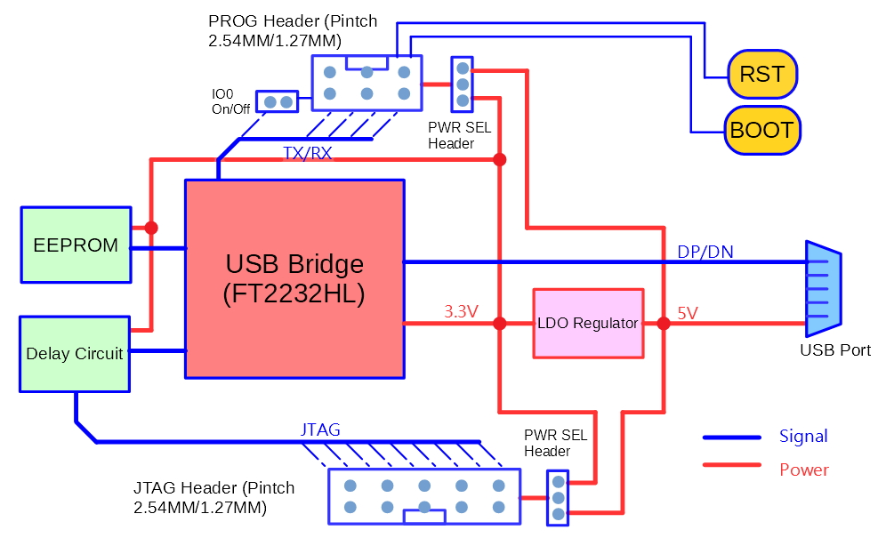
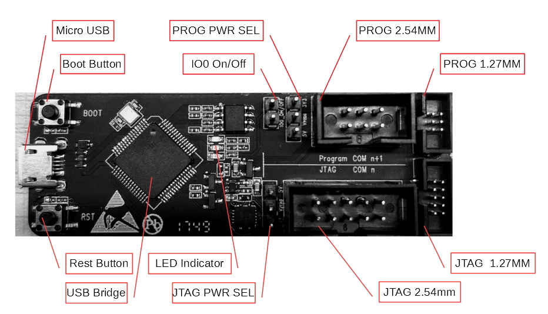

# ESP-Prog 下载与调试板硬件设计及使用说明

----

## 一、 概述
ESP-Porg 是一款为 ESP32 芯片设计的、集成了下载及调试功能的调试器。用户通过板上的 Micro USB 接口可以和电脑相连，通过 DC3 (6Pin/10Pin) 接口可以和使用 ESP32 的产品板相连，实现利用电脑对 ESP32 产品板进行下载和调试的功能。

## 二、 系统框图

## 三、 PCB布局和尺寸

- Top side   

- Bottom side   

## 四、 功能介绍
1. **通讯接口及自动下载**   
ESP-Porg 上所使用的 USB Bridge 芯片为 FTDI 公司的 FT2232HL 芯片，通过配置可以将 USB 2.0 接口转换成多种工业标准的串行和并行接口。
下载板上和 ESP32 产品板连接的部分，既有 Programmer 接口，又有 JTAG 接口，供用户自行选择使用。
其中，Programmer 接口包括了 UART 接口和两路连接到 ESP32 IO0 和 EN 管脚的 I/O，可通过电脑端的软件脚本控制这两个 I/O 的状态。
以此切换 ESP32 芯片的 Boot Mode，实现对 ESP32 进行自动下载的功能。
同时，ESP32 IO0 和 EN 信号还接到了下载板中的两个按键开关上，用户也可以手动控制这两个信号的电平状态。

2. **EEPROM 的作用及 USB Bridge 的工作模式**   
通过外置的 EEPROM，用户可以将 FT2232HL 芯片的配置参数及其 USB 描述信息存储到 EEPROM 中。
FT2232HL 默认的工作模式为双异步串行接口模式，电脑中序号大的 COM 对应着 UART 接口，序号小的 COM 口对应着 JTAG 接口。电脑
用户需要在电脑端的 UART/JTAG 工具中选择正确的 COM 口，方能正常使用。

3. **延时电路的作用**   
延时电路包括了 Bus Buffer、反相器、MOS 管、一阶 RC 电路等器件，可实现上电延迟和复位延迟功能。
如此，可以保证在上电或复位过程中，ESP32 芯片先完成自身的上电启动或复位，再和 JTAG 的信号接通，确保其上电或复位过程不被 JTAG 的信号所影响。

4. **LED指示灯的含义**   
当系统的 3.3V 电源通电时，红色 LED 灯亮起；
当下载板向 ESP32 发送数据时，绿色 LED 灯亮起；
当下载板接收来自 ESP32 的数据时，蓝色 LED 灯亮起。  

5. **Interface POWER SEL 排针的作用**   
Programmer 和 JTAG 接口中的参考电源可以通过跳线帽来选择，如下图所示。   
  
将中间的 Pin header 和标注为 5V 的 Pin header 连起来，接口电源输出 5V。  
将中间的 Pin header 和标注为 3V3 的 Pin header 连起来，接口电源输出 3.3V。  

6. **IO0 On/Off 排针的作用**   
在芯片启动时，通过控制 IO0 的状态，可以使芯片进入不同的启动模式。
在芯片启动结束后，用户可以移除 I/O 的跳线帽，断开 IO0 和下载板的连接，保证芯片启动结束后下载板不会对 I/O 的信号产生影响。

## 五、 操作步骤
1. 用 USB 线连接下载板和电脑端的USB口。
2. 在电脑端安装 FT2232HL 芯片所对应的驱动（可以在FTDI的官网上找到对应的[驱动][FT DRV]）。当电脑端的设备管理器中出现两路新的串口设备时，表明驱动已安装成功。
3. 用跳线帽选择 Programmer/JTAG 接口上的电源输出电压。
4. 用灰排线连接下载板和 ESP 产品板（注意：排线插头的方向不要搞反）。至此，电脑、下载板和 ESP32 产品板的连线就完成了。
5. 在电脑端设置好相应的串口号，利用相应的软件工具或脚本，即可和 ESP32 产品板的通讯，实现下载和调试功能。