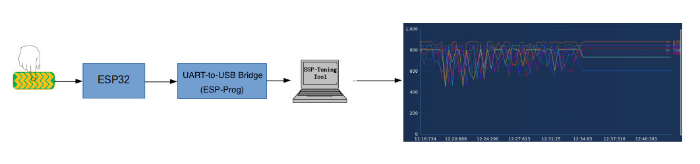
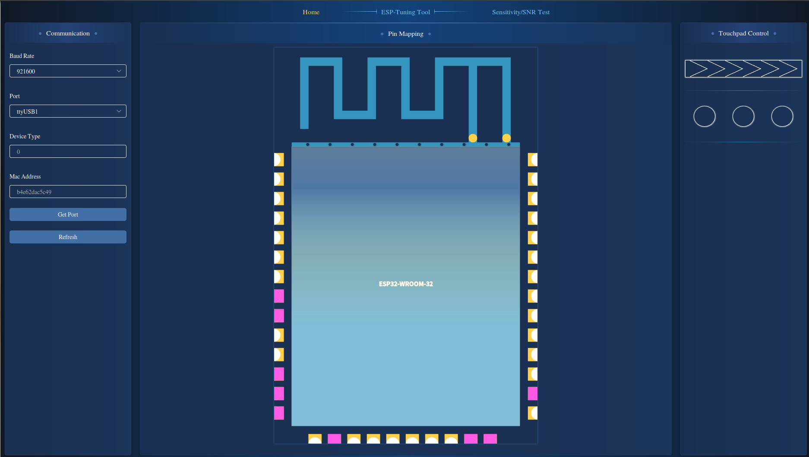
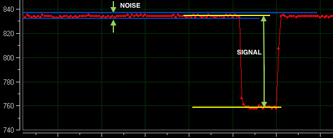
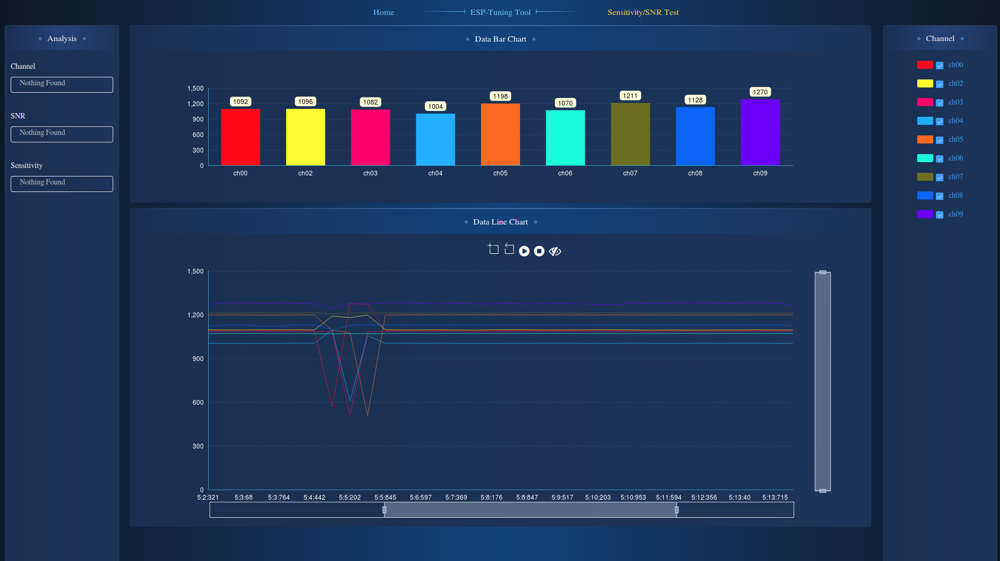
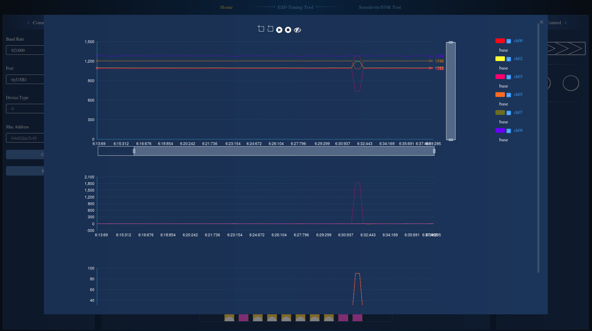
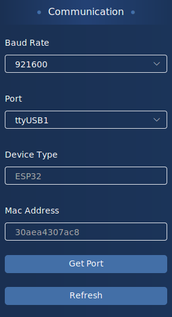
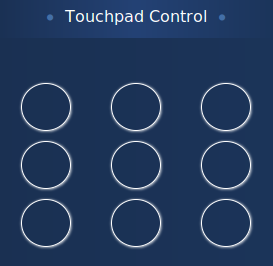
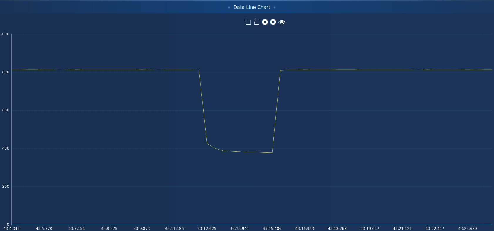

[[中文]](esp_tuning_tool_user_guide_cn.md)

# ESP-Tuning Tool User Guide

## Table of Contents

- [ESP-Tuning Tool Introduction](#introduction)  

- [ESP-Tuning Tool Overview](#overview)  

- [ESP-Tuning Tool Interface](#esp-tuning-tool-interface)  

- [Instructions](#instructions)  

    * [System Requirements](#system-requirements)  

    * [Step-by-Step Guide](#step-by-step-guide)    

- [Introduction to Related Processes](#introduction-to-related-processes)  

- [FAQs](#faqs)


## Introduction

For a good touchpad sensor design, it is necessary to monitor touchpad sensor readings, such as raw count value, baseline value and deviation of the count value, for calibration and debugging, and, most importantly, for **evaluating the touch system performance in terms of Sensitivity, SNR (Signal-to-noise ratio) and Channel Coupling**.

This document introduces a new tool for monitoring touchpad sensor readings: ESP-Tuning Tool. It is specially designed to debug and optimize touchpad sensor performance. Before reading this document, you might have known much about the technologies related to touchpad sensor. However, if you want to read more about the technologies in this field, please refer to [Touchpad Sensor Application Note](touch_sensor_design_en.md).

## Overview

ESP32 supports the UART interface, which can help in monitoring touchpad sensor readings. With UART, the ESP32 data can be read and sent to a PC via USB. See Figure 1 below showing how ESP-Tuning Tool uses touchpad sensor readings from ESP32 via ESP-Prog (UART-to-USB bridge) to draw a diagram.

The following items will be used in this document to further demonstrate how the above mentioned process works:

 - [ESP32-Sense Kit dev board](../evaluation_boards/esp32_sense_kit_guide_en.md)
 - [ESP-Prog for firmware downloading](../evaluation_boards/ESP-Prog_guide_en.md)
 - [ESP-Tuning Tool](https://www.espressif.com/en/support/download/other-tools)

<div align="center"></div>  
<div align="center">Figure 1. Touchpad sensor readings from ESP32</div>  

## ESP-Tuning Tool Interface

### Homepage

Figure 2 shows the homepage of ESP-Tuning Tool, which consists of the following four sections:

1. Tab Bar

    There are three tabs in total: Home, ESP-Tuning Tool, and Sensitivity / SNR Test.  

2. Communication Column

    This section contains:
    - Communication related parameters: **Baud Rate**, **Port**.
    - Device information: **Device Type**, **Mac Address**.
    - **Get Port** button: updates port list.
    - **Refresh** button: reconnects the device.

3. ESP32 Pin Mapping  

    It indicates the pads currently in use.  

4. Touchpad Control

    This section shows the touchpad in different combinations or shapes. Once you click a combination, you will be directed to a page containing details related to the chosen combination, as shown in Figure 5 below.  

    <div align="center"></div>  
    <div align="center">Figure 2. ESP-Tuning Tool homepage</div>  

### Sensitivity / SNR Page

Figure 4 shows the Sensitivity / SNR page of ESP-Tuning Tool. On this page, you may test the sensitivity as well as SNR and channel coupling of the touch system, and improve the system performance accordingly to meet the specific requirements by saving the parameter settings to the [touch sensor file](../../examples/touch_pad_evb/main/evb.h). The Sensitivity / SNR page consists of the following five sections:

1. Tab Bar

    There are three tabs in total: Home, ESP-Tuning Tool, and Sensitivity / SNR Test.  

2. Analysis Column

    It lists the channel number, along with the SNR and Sensitivity data analyzed by ESP-Tuning Tool.  

3. Raw Data Bar Chart

    It demonstrates the real-time pulse count value (raw data) of the currently used touchpad channels. As shown in this chart, you may use the non-touch value and touch value on each channel to calculate the change rate of touch readings with the following formula: **(non-touch value - touch value) / non-touch value * 100%**. This change rate can further be used to calculate the touch threshold. For a highly stable touch system, this rate should be greater than 3%.

4. Raw Data Line Chart

    It demonstrates the history raw data of the currently used touchpad channels. SNR and channel coupling are the important parameters to evaluate the touch system performance. You can calculate SNR (the signal-to-noise ratio) by using the value as shown in Figure 3 below:
    - **Sensor signal level**: the amount of touch reading change.
    - **Idle channel noise level**: the noise level of a channel when it is idle.

    **SNR = Sensor signal level / Idle channel noise level** (the SNR of a highly stable touch system should be greater than 5:1)

    <div align="center"></div>
    <div align="center">Figure 3. SNR calculation</div>

    This line chart can also be used to evaluate the channel coupling, which in some cases may occur if two touch channel traces are adjacent and have no hatched ground. Specifically, when a touch event occurs, the pulse count value of the adjacent channel changes.

5. Touchpad Channel

    It shows the touchpad channels that are currently in use. You may tick the right boxes to select the specific channels you want to check in the bar chart and the line chart. Please note that the color of each channel is consistent across this tuning tool.  

    <div align="center"></div>  
    <div align="center">Figure 4. ESP-Tuning Tool Sensitivity / SNR test page</div>  

### Detailed Data Page

Figure 5 shows the detailed data page of ESP-Tuning Tool. On this page, you may check if the touch system is working properly by testing the baseline value, the amount of touch reading change, touch threshold, real-time pulse count value, etc. This page consists of the following four sections:

1. Button Bar

    It contains five buttons for zoom-in, restore, start, pause, and preview respectively.
    - Zoom-in: enlarges the selected area.
    - Restore: switches back to the previous status.
    - Start: begins displaying real-time data.
    - Pause: pauses displaying real-time data.
    - Preview: you can place the mouse cursor over a point of interest in the line chart to preview the data of all the selected channels at the specific time as indicated by the horizontal axis.

2. Raw Data Line Chart
    - Shows the raw data of the touchpad channels currently in use.
    - Contains the baseline value of all the channels currently in use.
    - Features scroll bars on the bottom and on the right for an extended view.

3. The Line Chart Indicating Touchpad Status

    If the touch electrodes are arranged in different combinations, such as matrix buttons, this chart indicates if a touch event has occurred by showing the following:
    - **0**: no touch event.
    - **1**: touch event has occurred.

    When the touch electrodes appear as sliders, the chart traces and logs the last position of the sliders.

4. Touchpad Channels
    It shows the touchpad channels that are currently in use. You may tick the right boxes to select the specific channels you want to check in the line chart. Please note that the color of each channel is consistent across this tuning tool.

    <div align="center"></div>  
    <div align="center">Figure 5. ESP-Tuning Tool detailed data page</div>  

## Instructions

### System Requirements

 - The current version of ESP-Tuning Tool supports **Linux** and **Windows**. Please download the version according to your operating system.

### Step-by-Step Guide

Step 1: Prepare Touchpad

 - Download the demo [examples/touch_pad_evb](https://github.com/espressif/esp-iot-solution/tree/master/examples/touch_pad_evb) to your ESP32-Sense Kit dev board. Before downloading, please make sure the debugging function of ESP-Tuning Tool is enabled in **menuconfig**. To do this, please go to: `IoT Solution settings > IoT Components Management > General functions > Touch Sensor`.

Step 2: Download ESP-Tuning Tool

 - Download the version according to your operating system.

Step 3: Connect Touchpad

 - Connect one side of ESP-Prog to PC via USB.
 - Connect the other side of ESP-Prog to ESP32-Sense Kit.

Step 4: Open ESP-Tuning Tool to read touchpad sensor readings

 - After opening, this tool automatically obtains the current port information and tries to connect and receive the touchpad sensor readings.

 - If the port fails to respond, please try [manual connection](#faqs).

 - If it successfully obtains the port information, **MAC Address** and **Device Type** will appear in the left column of the homepage, while the right column will display **Touchpad Control**.

|||
|:---:|:---:|
|communication column|Touchpad in different combinations|


Step 5: Modify the touchpad sensor parameters according to the touchpad sensor readings

 - If, after checking the SNR related chart, you notice that the touch sensor system fails to meet the ideal performance, you may modify the touchpad parameters to optimize the system performance.

 - Check the line chart and modify the touchpad parameters according to the touch value and non-touch value as given in this chart.

 - As shown in the figure below, click the preview button to check the touch value and non-touch value, and modify the change rate of touch readings on a specific touchpad channel according to the formula **(non-touch value - touch value) / non-touch value**.

Step 6: Evaluate the touch system performance

 - Evaluate the touchpad sensitivity according to the amount of the change in touchpad raw data and the touchpad status, as shown in the line chart drawn by ESP-Tuning Tool.

<div align="center"></div>  
<div align="center">Figure 6. ESP-Tuning Tool sensitivity test</div>

Please find below the parameters related to touchpad sensor:  

```
/*
 * Spring button threshold settings.
 * Store the max change rate of the reading value when a touch event occurs.
 * Decreasing this threshold appropriately gives higher sensitivity.
 * If the value is less than 0.1 (10%), leave at least 4 decimal places.
 * Calculation formula: (non-trigger value - trigger value) / non-trigger value.
 * */
#if COVER_THICK_SPRING_BUTTON <= 1          /*!< Plastic cover thickness is 0 ~ 1 mm */
    #define SPRING_BUTTON_MAX_CHANGE_RATE_0    0.1129   // (1196-1061) / 1196 = 0.1129
    #define SPRING_BUTTON_MAX_CHANGE_RATE_1    0.1029   // (1215-1090) / 1215 = 0.1029
    #define SPRING_BUTTON_MAX_CHANGE_RATE_2    0.0950   // (1053-953 ) / 1053 = 0.0950
    #define SPRING_BUTTON_MAX_CHANGE_RATE_3    0.0856   // (1110-1015) / 1110 = 0.0856
    #define SPRING_BUTTON_MAX_CHANGE_RATE_4    0.0883   // (1132-1032) / 1132 = 0.0883
    #define SPRING_BUTTON_MAX_CHANGE_RATE_5    0.0862   // (986 -901 ) / 986  = 0.0862
```

## Introduction to Related Processes

1. Initialize UART - baud rate, data bit, stop bit, etc.  
2. Configure device information - device type, device version, and MAC address.
3. Configure touchpad parameters - filter threshold, debounce, baseline value, etc.  
4. Add touchpad in different combinations - channels to use, combinations of touchpad, etc.  
5. Set touchpad data - channel, raw data, baseline value, etc.
6. Create ESP-Tuning Tool tasks - receive data task or send data task.

### Initialize UART

 - Modify the UART default configuration in **menuconfig** - UART NUM, baud rate, etc. Please find the initialization function below:

```
void uart_init()
{
    uart_config_t uart_config = {
        .baud_rate = UART_BAUD_RATE，
        .data_bits = UART_DATA_8_BITS，
        .parity    = UART_PARITY_DISABLE，
        .stop_bits = UART_STOP_BITS_1，
        .flow_ctrl = UART_HW_FLOWCTRL_DISABLE
    };
    uart_param_config(UART_PORT_NUM， &uart_config);
    uart_set_pin(UART_PORT_NUM， UART_TXD_PIN， UART_RXD_PIN， UART_PIN_NO_CHANGE， UART_PIN_NO_CHANGE);
    uart_driver_install(UART_PORT_NUM， 2 * 100， 2 * 100， 0， NULL， 0);
}
```

### Configure Device Information

 - `tune_tool_set_device_info()`: configures the device information in ESP-Tuning Tool by entering device type, device version, and MAC address.

 - `tune_dev_info_t` struct contains the above mentioned device information to be configured, as shown below:

```
typedef struct {
    tune_dev_cid_t dev_cid;
    tune_dev_ver_t dev_ver;
    uint8_t dev_mac[6];
} tune_dev_info_t;

esp_err_t tune_tool_set_device_info(tune_dev_info_t *dev_info);
```

### Configure Touchpad Parameters

 - `tune_tool_set_device_parameter()`: configures the touchpad parameters by entering filter threshold, debounce, baseline value, etc.

 - `tune_dev_parameter_t` struct contains the above mentioned touchpad parameters to be configured, as shown below:

```
typedef struct {
    uint16_t filter_period;     //TOUCHPAD_FILTER_IDLE_PERIOD
    uint8_t debounce_ms;        //TOUCHPAD_STATE_SWITCH_DEBOUNCE
    uint8_t base_reset_cnt;     //TOUCHPAD_BASELINE_RESET_COUNT_THRESHOLD
    uint16_t base_update_cnt;   //TOUCHPAD_BASELINE_UPDATE_COUNT_THRESHOLD
    uint8_t touch_th;           //TOUCHPAD_TOUCH_THRESHOLD_PERCENT
    uint8_t noise_th;           //TOUCHPAD_NOISE_THRESHOLD_PERCENT
    uint8_t hys_th;             //TOUCHPAD_HYSTERESIS_THRESHOLD_PERCENT
    uint8_t base_reset_th;      //TOUCHPAD_BASELINE_RESET_THRESHOLD_PERCENT
    uint8_t base_slider_th;     //TOUCHPAD_SLIDER_TRIGGER_THRESHOLD_PERCENT
} tune_dev_parameter_t;

esp_err_t tune_tool_set_device_parameter(tune_dev_parameter_t *dev_para);
```

### Add Touchpad in Different Combinations

 - When the touchpad initialization is completed, please call  `tune_tool_add_device_setting()` to add the touchpad you want to monitor in different combinations.

 - `tune_dev_comb_t` struct contains the information about the touchpad in different combinations - various kinds of combinations, the touchpad channels to be used, etc.

 - `tune_dev_setting_t` struct contains all the information about the touchpad you want to monitor in different combinations - touchpad combination, and the touchpad channels to be used.

```
typedef struct {
    tune_dev_char_t dev_comb;
    uint8_t ch_num_h;
    uint8_t ch_num_l;
    uint8_t ch[25];
} tune_dev_comb_t;

typedef struct {
    uint32_t ch_bits;
    tune_dev_comb_t dev_comb[10];
} tune_dev_setting_t;

esp_err_t tune_tool_add_device_setting(tune_dev_comb_t *ch_comb);
```

### Set Touchpad Data

 - `tune_tool_set_device_data()`: updates the data that should be sent to ESP-Tuning Tool.

 - `tune_dev_data_t` struct contains the touchpad data sent to ESP-Tuning Tool, as shown below:

```
typedef struct {
    uint8_t ch;
    uint16_t raw;
    uint16_t baseline;
    uint16_t diff;
    uint16_t status; //if the button is slide， the value of status if the position of slide.
                     //else the value of status is the state of button.
} tune_dev_data_t;

esp_err_t tune_tool_set_device_data(tune_dev_data_t *dev_data);
```

### Create ESP-Tuning Tool Tasks

 - `touch_tune_tool_task_create()`: creates ESP-Tuning Tool tasks to receive data or send data.

```
void touch_tune_tool_task_create()
{
    xTaskCreate(&touch_tune_tool_read_task， "touch_tune_tool_read_task"， 2048， NULL， 5， NULL);
    xTaskCreate(&touch_tune_tool_write_task， "touch_tune_tool_write_task"， 2048， NULL， 5， NULL);
}

```

## FAQs

 - In case a port error occurs, please check if the current user has the permission to use this port (for Linux system, make sure the port permission is granted).

 - If the port cannot be found in the port list after a new device is plugged in, please click the **Get Port** button to refresh the port list.

 - In case of failing to detect the device information, please make sure the correct port is selected and click the **Refresh** button to request a second connection.

 - If the expected port does not appear in the port list, please make sure the device has been plugged in with the correct port number and baud rate selected. Then click the **Get Port** button to refresh the port list. At this point, the new device should appear in the list.
