# ESP32 触摸功能开发套件


## 1. 概述
TOUCH_EB 套件用于评估和开发 ESP32 触摸传感器功能。评估套件包含一个主板和若干子板，主板包含显示单元，主控单元，调试单元。子板是根据不同的使用场景，更改了触摸电极的形状和排列方式，包括滑条、矩阵按键、弹簧按键、辐射按键。  
下图是 TOUCH_EB 开发套件：

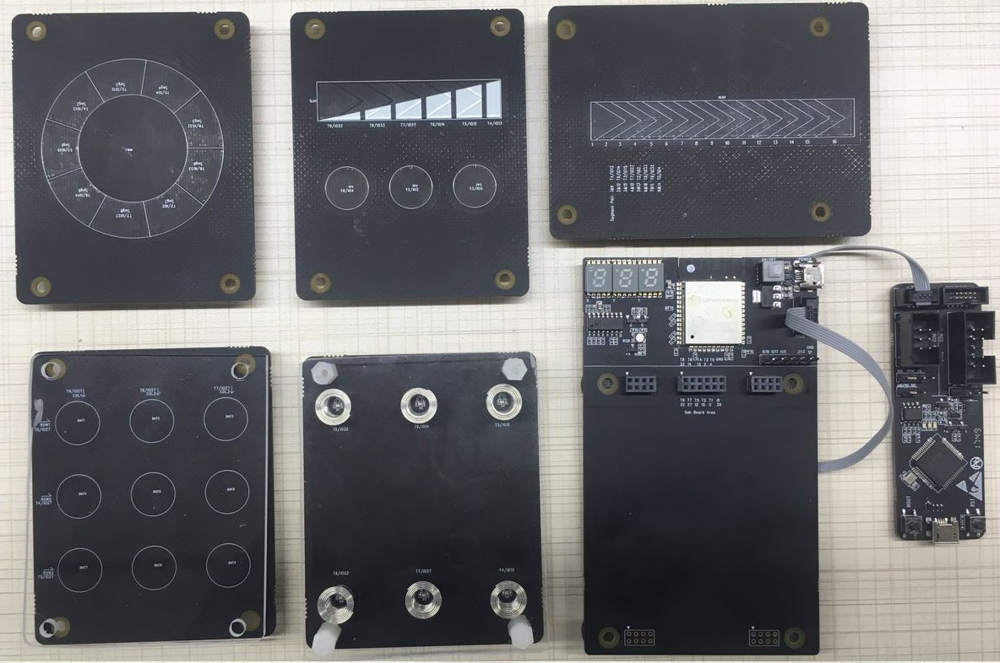

## 2. 基本介绍

- **开发环境准备**
 - [ESP-IDF](https://github.com/espressif/esp-idf) 是 ESP32 平台的软件开发包。文档 [Get Started](https://esp-idf.readthedocs.io/en/latest/get-started/index.html) 介绍编译环境的搭建和软件开发包的使用说明。
 - [ESP-Prog](./esp_prog_instruction.md) 是 ESP32 调试器。

- **软件获取**
 - [esp-iot-solution](https://github.com/espressif/esp-iot-solution) 基于 ESP-IDF 开发，包含多种应用解决方案。文档 [project-description-of-iot-solution](https://github.com/espressif/esp-iot-solution#project-description-of-iot-solution) 介绍了如何编译解决方案。
 - [touch_pad_evb](../../examples/touch_pad_evb) 是 TOUCH_EB 开发套件对应的应用方案，下载程序到 TOUCH_EB 开发板即可使用触摸功能。

- **硬件手册**
  - TOUCH_EB 开发套件的硬件原理图，PCB 文件，BOM 等文件参考 esp-iot-solution-hardware 工程。
  - [ESP-Prog](./esp_prog_instruction.md) 调试器的介绍。

- **相关参考资料**
  - [Espressif 官网](www.espressif.com)。  
  - [ESP32 编程指导](https://esp-idf.readthedocs.io/en/latest/index.html) : ESP32 相关开发文档汇总平台。包含内容全面，包括硬件手册，软件 API 介绍等。  
  - [Espressif 下载中心](http://espressif.com/en/support/download/overview) : 乐鑫平台文档和工具的下载中心。
  - [触摸传感器应用设计参考文档](https://github.com/espressif/esp-iot-solution/tree/master/documents/touch_pad_solution): ESP32 触摸传感器功能应用设计手册。包括触摸传感器原理介绍，软件设计，PCB 设计。

- **技术支持**
  - TOUCH_EB 开发套件使用时遇到的问题，请在 esp-iot-solution 中提交 [issue](https://github.com/espressif/esp-iot-solution/issues)。

## 3. 开发板操作

- **保护盖板安装**。  
塑料材质保护盖板厚度应小于 3mm。空气间隙导致手指的触摸感应变弱，保护盖板应紧贴子板安装，如果有空气间隙可以使用双面胶填充。弹簧子板上应使用 7mm 螺柱安装保护盖板。  
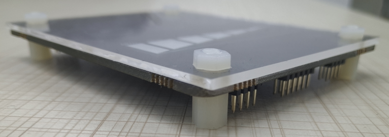  

- **子板安装**。  
子板与主板之间使用连接器连接，既有连通作用，也有固定作用。子板安装孔可安装 4 个 7 mm 塑料镙注，使子板水平支撑在主板上，如下图：  
  

- **ESP-Prog 调试器设置**。  
ESP-Prog 起到下载程序和供电作用。下载程序时 IO0 插针应被短接，运行状态时 IO0 应断开下载器连接（IO0 为 TOUCH1，自动下载电路会对触摸性能造成影响）。供电电压应选择 5V 供电，调试器设置如下图：  
  

- **ESP-Prog 调试器连接**。  
调试器包含 Jtag 接口 Program 接口。与 TOUCH_EB 连接使用 Program 下载接口。  
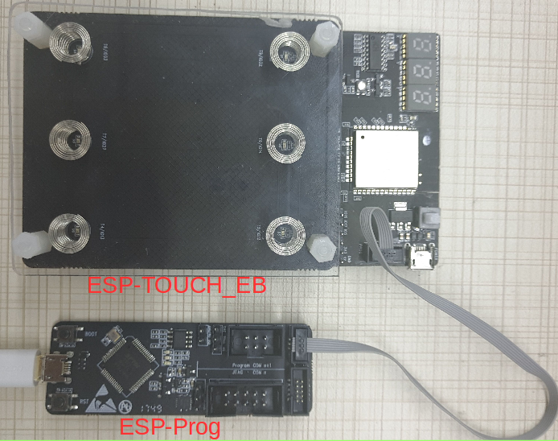  

- **编译下载**。  
配置 touch_pad_evb 的 config 参数，执行命令 `make menuconfig` 配置参数，如下图。执行命令 `make flash`，程序会自动下载到开发板中。  
  
  

- **更换子板**。  
ESP32 上电时会检测子板上的分压电阻的分压值，识别不同的子板。所以更换各子板不需要重新烧写应用程序。更换子板后需重启应用程序。  

## 4. 硬件介绍

- **主板硬件资源介绍**  
显示单元包括数码管和 RGB 三色灯电路。调试单元包括 ESP-Prog 调试器接口。主板单元包含 ESP32 模组。Mini USB 供电作用。   
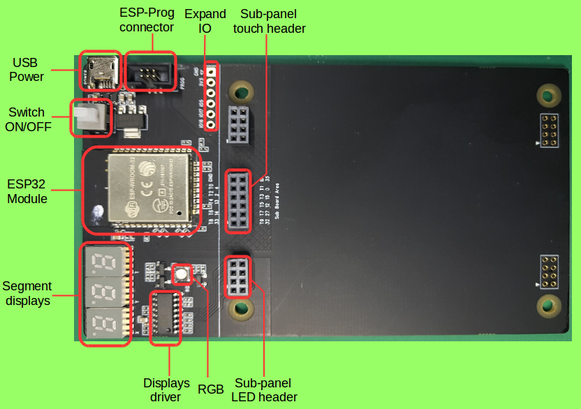  

- **子板介绍**  
子板根据不同的使用场景，将触摸电极按照特定形状和顺序排列。每个子板上有分压电阻，每个子板上分压电阻的阻值不同，主板应用程序通过 ADC 读取分压值，识别不同类型的子板。分压电路如下图:  
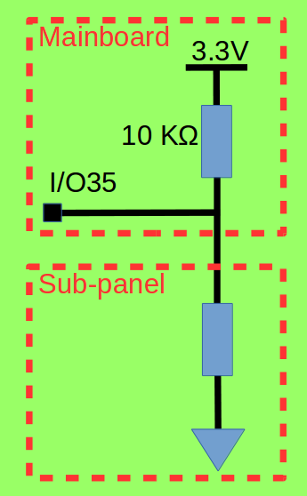  
主板上的分压电阻是 10 KΩ，下表是各子板上对应的分压电阻阻值：  

|Sub-panel|Divided resistor(Kohm)|ADC 读数（Min）|ADC 读数(Max)|
|:---:|:---:|:---:|:---:|
|single spring buttons|0|0|120|
|slider bar&single buttons|4.7|935|1175|
|button matrix|10|1530|1770|
|duplex slide bar|33|2400|2620|
|touch wheel|47|2630|2810|  

- **系统框图**  
下图是底板的功能框图。  
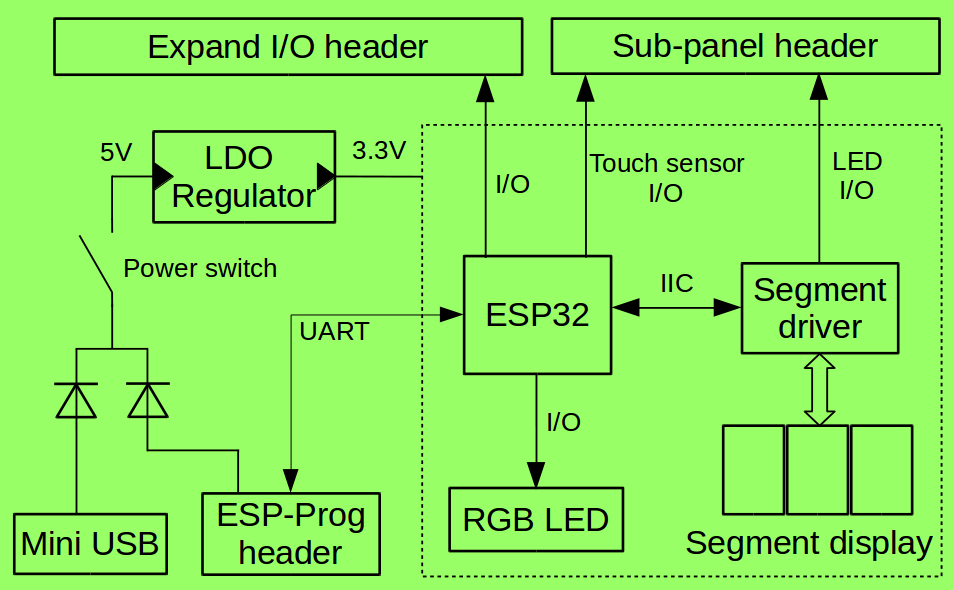  

### 4.1. 电源管理系统

TOUCH_EB 的开发套件上 Mini USB 和 ESP-Prog 均可供电，两者之间保护二极管隔离，供电不相互影响。USB 只具有供电功能。ESP-Prog 接口除了供电功能还具有自动烧写固件功能。下图是电源管理系统的硬件原理图：  

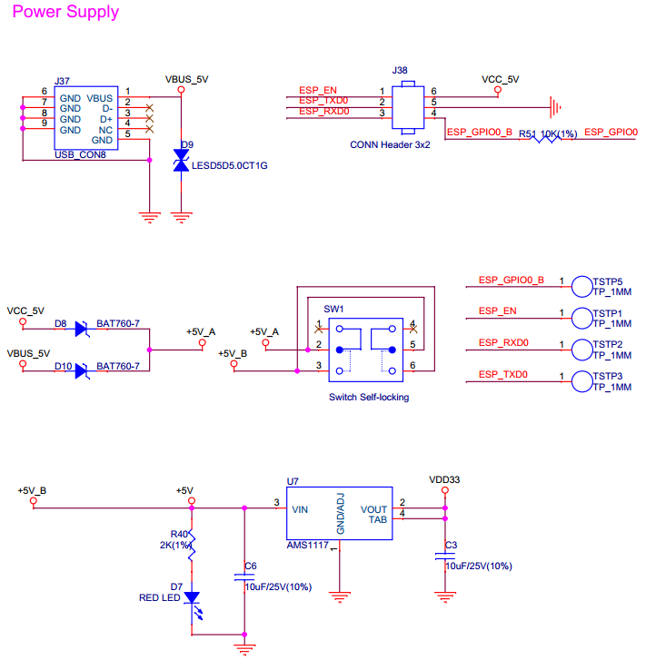  

### 4.2. 显示电路

TOUCH_EB 开发套件的底板上有显示单元，可直观的反馈触摸动作。三个数码管分别显示触摸的横坐标、纵坐标、触摸动作的持续时间。数码管驱动芯片为 CH455G，使用 IIC 接口控制。RGB 灯用于触摸时的颜色反馈。用户滑动滑条，RGB 灯的颜色会相应变化。  
下图是显示单元的硬件原理图：  

  

  

## 5. 应用程序介绍

esp-iot-solution 工程下的 [touch_pad_evb](https://github.com/espressif/esp-iot-solution/tree/master/examples/touch_pad_evb) 是 TOUCH_EB 开发套件对应的应用程序。目录结构如下图：  

```
.
├── main
│   ├── evb_adc.c       //使用 ADC 功能识别不同子板，设置每个子板对应的 ADC 阈值
│   ├── evb.h           //TOUCH_EB 应用程序参数设置（触摸阈值，ADC I/O，IIC I/O）
│   ├── evb_led.cpp  	//RGB LED 初始化程序
│   ├── evb_seg_led.c   //数码管驱动程序
│   ├── evb_touch_button.cpp    //子板驱动程序-触摸按键
│   ├── evb_touch_wheel.cpp    //子板驱动程序-辐射滑条/圆盘滑条
│   ├── evb_touch_matrix.cpp    //子板驱动程序-矩阵按键
│   ├── evb_touch_seq_slide.cpp //子板驱动程序-扩展滑条
│   ├── evb_touch_slide.cpp     //子板驱动城西-滑条
│   ├── evb_touch_spring.cpp    //子板驱动程序-弹簧按键
│   ├── Kconfig.projbuild
│   └── main.cpp        //主程序入口
├── Makefile
└── sdkconfig.defaults
```

### 5.1. 参数配置
当使用不同厚度的盖板时，需要调节触摸触摸阈值。触摸阈值直接反映为触摸的灵敏度。触摸阈值越高，灵敏度越高，会出现手指未接触按键时即发生触摸响应。触摸阈值越低，灵敏度越低，过低会出现触摸无反馈或触摸延迟。  
在 touch_pad_evb 工程中 [evb.h](https://github.com/espressif/esp-iot-solution/blob/master/examples/touch_pad_evb/main/evb.h) 文件调节触摸阈值。  

```
#define TOUCHPAD_THRES_PERCENT 980         //触摸阈值 980，识别至少 98.0% 的触摸变化率
#define TOUCHPAD_SPRING_THRESH_PERCENT 970 //弹簧子板触摸阈值 970，识别至少 97.0% 的触摸变化率
```
### 5.2. 效果展示
|||
|:---|:---|
|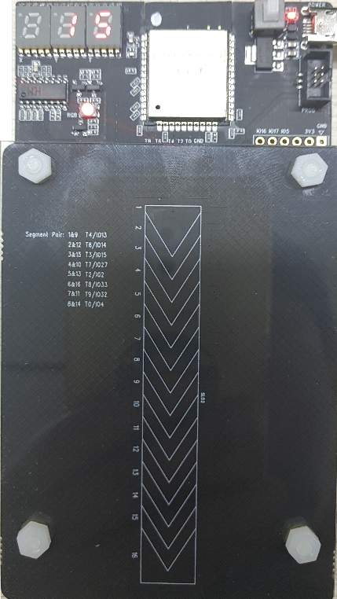|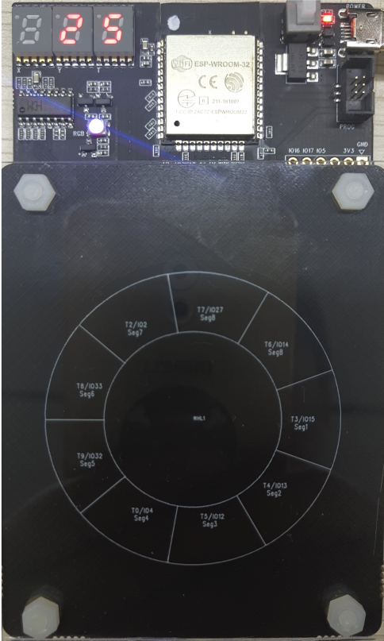|
|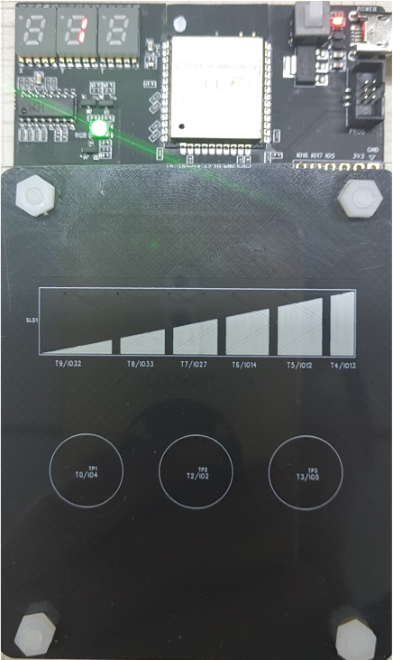|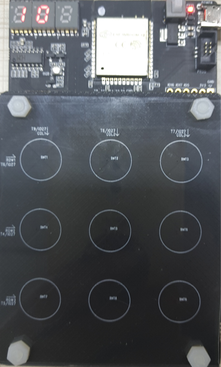|
|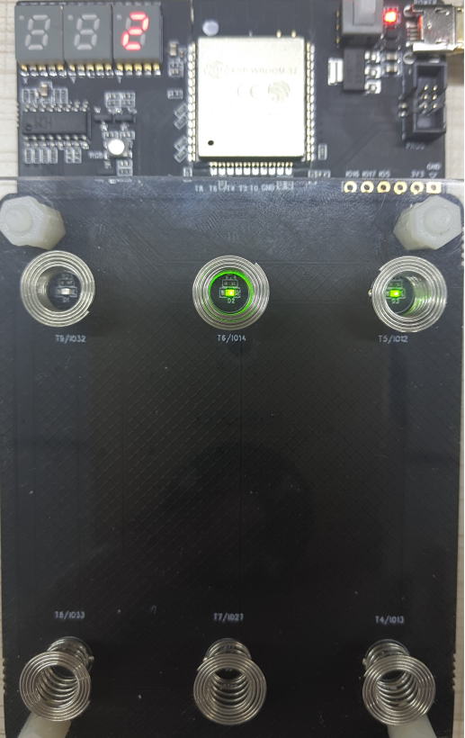|