[[EN]](touch_sensor_design_en.md)

# 触摸传感器应用方案简介
---
ESP32 不仅提供核心的 Wi-Fi 和蓝牙功能，还集成了丰富的外设，不需要额外的外部元器件即可实现应用，比如，ESP32 支持具有 10 个触摸通道的触摸传感器系统。

设计并实现触摸传感系统是一个复杂的过程，因此需要特别注意一些关键步骤。本文为用户提供了一些通用的指导规范，说明了在使用 ESP32 进行设计开发时需要注意的事项。建议用户遵循这些指导规范，以保证触摸传感器系统的最佳性能。

## 目录

- [1. 触摸按键简介](#1-触摸按键简介)  

    * [1.1. 触摸按键的基本知识](#11-触摸按键的基本知识)  

    * [1.2. 开发流程](#12-开发流程)  

    * [1.3. 名词解释](#13-名词解释)  

- [2. ESP32 触摸传感器介绍](#2-触摸传感器介绍)  

    * [2.1. 触摸传感器主要特征](#21-触摸传感器主要特征)  

    * [2.2. 触摸传感器通道](#22-触摸传感器通道)  

    * [2.3. 触摸传感器功能描述](#23-触摸传感器功能描述)  

    * [2.4. 触摸传感器驱动程序介绍](#24-触摸传感器驱动程序介绍)  

- [3. 触摸传感器机械和硬件设计](#3-触摸传感器机械和硬件设计)  

    * [3.1. 机械设计](#31-机械设计)  

    * [3.2. 使用芯片和模组的注意事项](#32-使用芯片和模组的注意事项)  

    * [3.3. PCB 布局规范](#33-pcb-布局规范)  

- [4. 触摸传感器软件设计](#4-触摸传感器软件设计)  

    * [4.1. Wi-Fi 对触摸的影响](#41-wi-fi-对触摸的影响)  

    * [4.2. 触摸按键消抖方案](#42-触摸按键消抖方案)  

    * [4.3. 自校准方案](#43-自校准方案)  

    * [4.4. 触摸按键软件设计](#44-触摸按键软件设计)  

    * [4.5. 触摸滑块软件设计](#45-触摸滑块软件设计)  

    * [4.6. 触摸矩阵键盘软件设计](#46-触摸矩阵键盘软件设计)  

- [5. 触摸传感器调试](#5-触摸传感器调试)  

    * [5.1. ESP-Tuning Tool](#51-esp-tuning-tool)  

- [6. 开发套件及相关资源](#6-开发套件及相关资源)  


## 1. 触摸按键简介

电容式触摸感应技术已经广泛应用于家用电器、消费电子等领域，以此发展的触摸按键产品与传统按键相比按键有下面的优点：

* 无机械装置，不宜磨损老化，超长使用寿命。
* 表面无缝隙，无水分、杂质渗透。
* 减少元件使用，BOM 成本降低。
* 面板不需开孔，工业设计成本降低。
* 产品外观美观，设计灵活。

### 1.1. 触摸按键的基本知识

电容式触摸感应技术通过测量面板（传感器）和其环境之间的电容变化来检测触摸界面附近是否有触摸事件发生。

#### 1.1.1. 触摸按键基本结构
下面一个典型的触摸传感器系统组成的示意图。

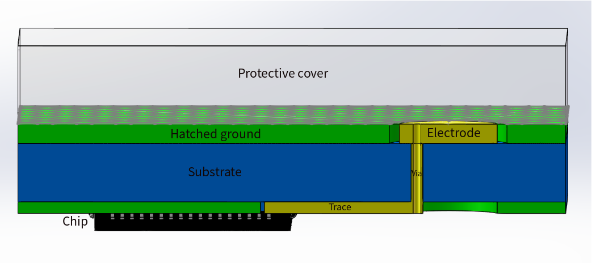

- **保护覆盖层**  
  保护覆盖层是指触摸面板。触摸面板必须是绝缘材质，作用是隔离触摸电极与外部环境，起到保护作用。但保护覆盖层会降低触摸的灵敏度，需要根据应用场景选择合适厚度、材质。<br>

- **触摸电极**  
  触摸电极是触摸传感器的重要组成。手指触摸时与触摸电极形成平行板电容器，改变触摸通道的电容量。触摸电极必须是导电材质。样式多变，如 PCB 板上的铜箔、金属板、触摸弹簧等。<br>

- **绝缘基板**  
  对触摸电极起支撑作用，非导电材质。<br>

- **走线**  
  连接触摸电极与芯片，包括 PCB 走线和连接器。走线是引入干扰和寄生电容的主要部分，需要谨慎分配走线的布局。<br>

#### 1.1.2. 触摸按键原理

触摸传感器电路可以测量触摸通道上的总电容量。当电容量发生改变且变化量超过阈值，会判定为 “手指触摸动作”。我们使用灵敏度（ΔC/C）来表示电容的变化程度。分析触摸传感器系统的电容组成和分布，有助于找到优化方法，提高触摸灵敏度，下图是触摸传感器系统的电容分布情况：

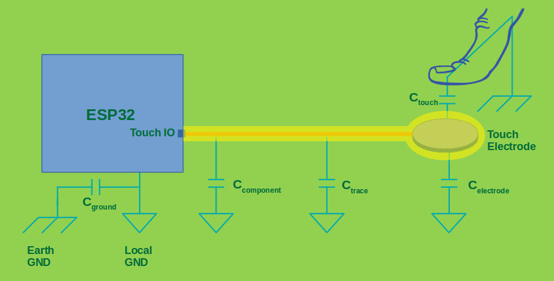

|电容组成|说明|
|-----|----|
|C<sub>ground</sub>|触摸电路参考地和大地之间的电容|
|C<sub>componet</sub>|ESP32 内部寄生电容|
|C<sub>trace</sub>|走线与电路参考地之间的寄生电容|
|C<sub>electrode</sub>|触摸电极与电路参考地之间的寄生电容|
|C<sub>touch</sub>|手指与触摸电极所形成的相对于大地的电容|

触摸传感器的读数值是上述所有电容共同作用的结果。其中 C<sub>trace</sub>、C<sub>electrode</sub>、C<sub>componet</sub> 通常被统称为寄生电容 C<sub>p</sub>（即未发生触摸动作时的电容）。C<sub>touch</sub> 为发生触摸动作时，系统总电容的变化量（ΔC==C<sub>touch</sub>）。当寄生电容 C<sub>p</sub> 越小，C<sub>touch</sub> 越大时，触摸动作越容易被系统检测到，即触摸传感系统的灵敏度就越高。如下图所示的电容变化率影响关系：

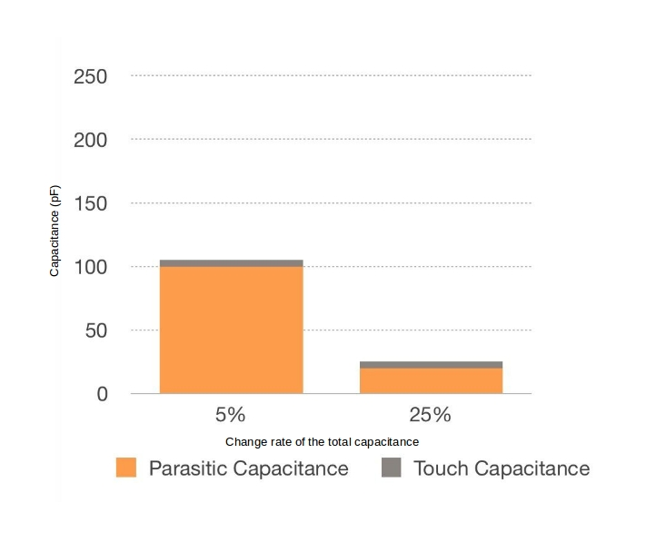

> 例如：手指触摸时触摸电容  C<sub>touch</sub> 为 5 pF，寄生电容 C<sub>p</sub> 为 20 pF 时，总电容变化率为 25%。如果寄生电容增大到了 100 pF，总电容的变化率仅为 5%。

可以得出结论：做触摸传感器系统设计时，重要步骤是要降低寄生电容 C<sub>p</sub>，同时提高触摸电容 C<sub>touch</sub> 。下表表明各电容关系和优化方向：

|电容类型|组成|电容优化方向|优化方法|
|-----|---|---|---|
|寄生电容 C<sub>p</sub>|C<sub>trace</sub> + C<sub>electrode</sub> + C<sub>componet</sub>|减少|减少走线长度，优化 PCB 布局|
|触摸电容 |C<sub>touch</sub> |增加|覆盖层与电极紧密贴合，选用介电常数大的覆盖层，减少覆盖层厚度，增大触摸电极的面积|
|固定电容|C<sub>ground</sub>|-|-|

> **触摸电容 C<sub>touch</sub>**
当手指触摸传感器表面时，人体的导电性质和大质量构成接地的导电层（平行于触摸电极），该操作构成一个平行板电容器。平行板电容器的公式：
<div align="center"><center>C<sub>touch</sub> = ε*S/(4*π*k*d)</center></div>
其中 ε 为覆盖层的介电常数，S 为手指接触覆盖层与触摸板电极的映射面积，k 为静电力常量，d 为触摸覆盖层的厚度。

#### 1.1.3. 触摸按键电场分布

下图显示的是触摸传感器系统的硬件环境，触摸引脚通过走线和过孔与触摸电极连接。一般情况下，触摸电极周围会有栅格地，屏蔽触摸电极与其他电路，但触摸电极也会与栅格地形成电场（寄生效应），如图中虚线所示。所以 PCB 布局时应注意触摸电极与周围栅格地的距离。

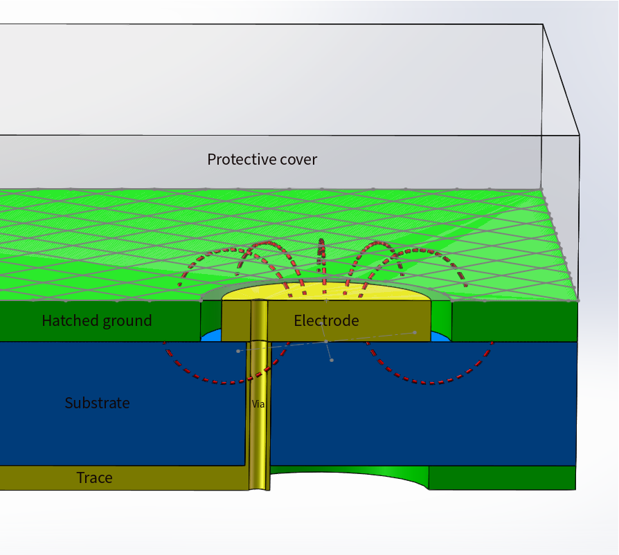

下图显示了有手指触摸时的电场分布。触摸电极与手指之间形成电场。

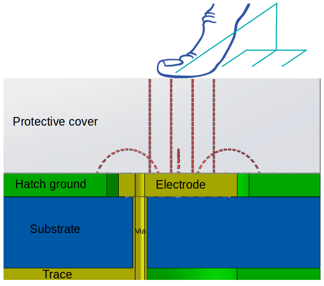

尽管图中显示了触摸电极周围的电场线，但实际产品中电场要复杂得多。触摸传感系统往往只是整块电路板中的一部分，所以肯定会受到来自系统或者系统之外的噪声的影响，使触摸检测产生偏差。噪声来源通常包括电源开关噪声、静电放电（ESD）、电快速瞬变（EFT）、辐射噪声及耦合到系统中的其他电气噪声。如何消除干扰源、切断噪声的传播途径以及保护易受噪声影响的子系统也是设计触摸传感电路时需要仔细考虑的问题，如此才能提高整个系统的信噪比。

### 1.2. 开发流程

下图说明了 ESP32 电容式触摸传感器典型的开发流程。下文会对流程中的重要步骤进行详细说明，以帮助用户减少开发周期，使 ESP32 的触摸传感器达到最佳性能。

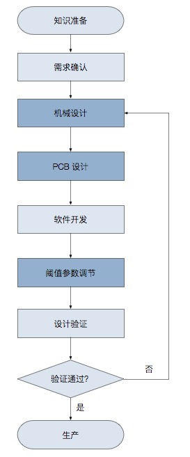

|开发步骤|说明|
|:-------------------|:----|
|知识准备|设计人员需了解电容式触摸传感器工作原理，设计规则，设计参考|
|需求确认|确认使用触摸传感器的通道数，触摸电极类型（触摸按键，线性滑条，矩阵按键）|
|**机械设计**|**参考规则选择触摸电极的摆放位置，触摸盖板材料（材料和厚度影响触摸的灵敏度）**|
|**PCB 设计**|**参考规则设计 PCB 的原理图和布局，减少板上寄生电容**|
|软件开发|可以使用轮循式或者中断式设计应用。ESP32 也提供了多种触摸场景的软件设计参考例程，例程中包含滤波算法|
|**阈值参数调节**|**根据自己的硬件环境选择合适的触发阈值，既能防止误触也能保证较强灵敏度**|
|设计验证|触摸受设计环境影响较大，应在实际产品上测试触摸传感器的**灵敏度**，**稳定性**，**信噪比**，**通道耦合**等性能指标|

### 1.3. 名词解释
**触摸传感器系统**：本文指 ESP32 电容式触摸感应系统，包括与触摸相关的 ESP32 内部感应电路，走线， 触摸电极，触摸电极盖板。

**触摸电极**：触摸传感器系统中的组件。可以是一个传感器或一组类似传感器，包括触摸按键、滑条、矩阵按键。

**总电容量**：指每个触摸传感器通道上的电容总量，包括触摸电路内部电容、寄生电容、触摸电容。

**脉冲计数值**：ESP32 触摸传感器内部电路对通道电容充放电，相同的时间间隔内的充放电次数称为脉冲计数值，此值与总电容量成反比。

**灵敏度**：触摸传感器触摸时的读数变化率，即 (非触发值-触发值)/非触发值*100%。传感器灵敏度取决于电路板布局、覆盖层属性、软件参数设置等。设计中应提高触摸灵敏度，稳定性高的触摸系统灵敏度应大于 3% 。灵敏度是系统性能参数之一。

**稳定性**：触摸传感器读数的离散程度，可以使用脉冲计数值的标准差表示。传感器稳定性取决于电路板布局、覆盖层属性、软件参数设置等。稳定性是系统性能参数之一。

**信噪比**：触摸传感器触摸时的读数变化量与通道空闲时噪声幅值的比值。设计中应提高信噪比，稳定的触摸传感器系统，信噪比应大于 5:1。信噪比是系统性能参数之一。

**通道耦合**：当两个触摸通道走线相邻且无栅格地屏蔽时，会产生通道耦合现象。具体表现为发生触摸动作时，相邻通道的脉冲计数值发生变化。设计中应减少通道耦合现象，耦合的数据变化量不应超过本通道的触摸阈值。通道耦合是系统性能参数之一。

**测量时间**：完成触摸传感器测量过程所需要的时间。

**测量间隔**：触摸传感器两次连续测量之间的时间。

**寄生电容（C<sub>p</sub>)**：寄生电容是由 PCB 走线、触摸电极、过孔以及气隙组成的传感器电极的内部电容。应该减少寄生电容，因为它会使触摸传感器的灵敏度降低。

**栅格地**：当设计有电容式触摸传感器功能的 PCB 板时，触摸电路周围应谨慎铺铜。接地铜层能增加抗干扰能力，也能增加触摸传感器的寄生电容 C<sub>p</sub>，减少灵敏度。因此折中的方式是在实铜和净空之间选择一种特殊的网格填充的方式（地线交叉织成网状）。

**触摸去抖**：正常使用触摸按键时，阈值与触摸延迟在一定的范围内变化。通过设置合适的参数，可过滤掉假的触摸信号。

**API**：指的是触摸传感器 API，核心函数可在 [ESP-IDF](https://github.com/espressif/esp-idf) 中查看，具体介绍在 [触摸传感器 API 参考](https://docs.espressif.com/projects/esp-idf/en/stable/api-reference/peripherals/touch_pad.html) 中查看，API 扩展可在 [触摸传感器组件](../../components/features/touchpad) 中查看。

## 2. 触摸传感器介绍

本章介绍 ESP32 触摸传感器的管脚分布、工作原理及部分相关寄存器和驱动接口。

### 2.1. 触摸传感器主要特征

- 最多支持 10 路电容触摸管脚/通用输入输出接口 (General Purpose Input and Output, GPIO)
- 触摸管脚可以组合使用，可覆盖更大触感区域或更多触感点
- 触摸管脚的传感由有限状态机 (FSM) 硬件控制，由软件或专用硬件计时器发起
- 触摸管脚是否受到触碰的信息可由以下方式获得：
  - 由软件直接检查触摸传感器的寄存器
  - 由触摸监测模块发起的中断信号判断
  - 由触摸监测模块上的 CPU 是否从 Deep-sleep 中唤醒判断
- 支持以下场景下的低功耗工作：
  - CPU 处于 Deep-sleep 节能模式，将在受到触碰后逐步唤醒
  - 触摸监测由超低功耗协处理器 (ULP 协处理器) 管理<br>
    ULP 用户程序可通过写入与检查特定寄存器，判断是否达到触碰阈值

### 2.2. 触摸传感器通道
ESP32 提供了多达 10 个的支持电容式触摸传感的 IO，能够检测触摸传感器上因手指接触或接近而产生的电容变化。芯片内部的电容检测电路具有低噪声和高灵敏度的特性，支持用户使用面积较小的触摸垫来实现触摸检测功能，用户也可使用触摸板阵列以探测更大的区域或更多的测试点。下表列出了 ESP32 中 10 个具备触摸传感功能的 IO。

|触摸传感器通道|管脚|
|-----|-----|
|T0|GPIO4|
|T1|GPIO0|
|T2|GPIO2|
|T3|MTDO|
|T4|MTCK|
|T5|MTDI|
|T6|MTMS|
|T7|GPIO27|
|T8|32K_XN|
|T9|32K_XP|

### 2.3. 触摸传感器功能描述

#### 2.3.1. 内部结构
触摸传感器的内部结构见下图:

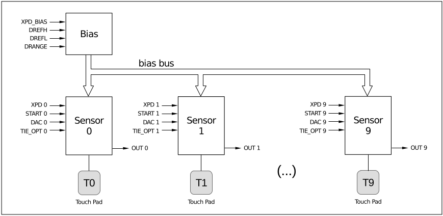

用户可以通过配置图中寄存器初始化触摸传感器的功能，图中相关寄存器描述如下表：

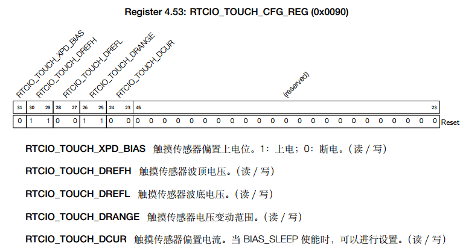

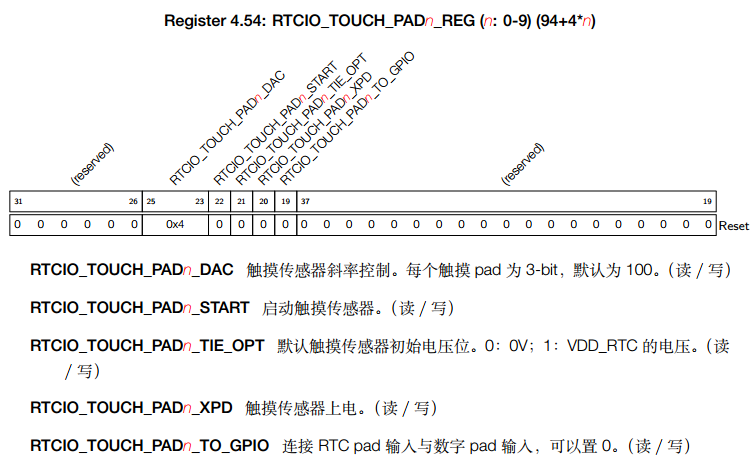

#### 2.3.2. 工作流程
每个触摸传感器内部工作流程请见下图：

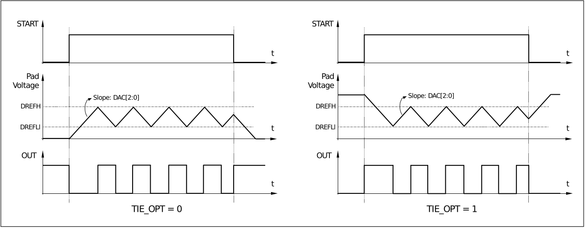

ESP32 内部电流源会对每个触摸管脚周期性充放电。充放电过程中，触摸管脚的电压在参考高值 (drefH) 与参考低值 (drefL) 之间变化。如上图所示，在比较器作用下，由下限充电到上限然后再放电回到下限即完成一次充放电周期的计数。每个变化周期，触摸传感器将生成一个输出脉冲 (OUT)，并计数一次。无干扰理想环境中触摸管脚上的电容值保持恒定，同一时间间隔内输出的脉冲（OUT）数量是恒定的。

触摸管脚上充放电的速率由内部电流源输出电流强度决定，电流源强度由寄存器 DAC[2:0] 配置，充放电过程的上下限分别由寄存器 DREFH[1:0] 和 DREFL[1:0] 确定。

当手指触摸传感器时，手指与传感器金属板之前形成平行板电容器，其等效电容并联连接在了触摸管脚上，增大了触摸管脚的电容。根据公式 du/dt=C/I，电容充放电电流不变，电容量增大，则充放电时间增加，同一时间间隔内输出的脉冲数（OUT）减少。我们根据相同间隔内的脉冲计数（OUT）的变化量判断是否有手指触摸传感器。

在应用层，用户可以调用函数 `touch_pad_read(touch_pad_t touch_num, uint16_t * touch_value);` 读取脉冲计数值（OUT）。

下图是手指触摸时脉冲计数（OUT）产生变化的过程：

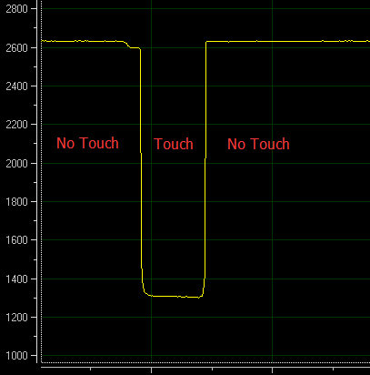

上面各因素变化关系可总结为：

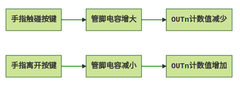

#### 2.3.3. FSM 描述
用户可以实时读取每个触摸传感器通道的脉冲计数值（OUT），根据脉冲计数值（OUT）的变化判断是否有手指触摸。这种方式可灵活的实现多种软件处理算法，但会占用较大 CPU 资源。ESP32 也支持配置硬件寄存器实现检测手指触摸动作，硬件周期性检测脉冲计数值，如果超过设置的阈值时会产生硬件中断，通知应用层某个触摸传感器通道可能被触发了。

内部的硬件逻辑包含有限状态机 (Finite-State Machine, FSM)。FSM 将执行触摸传感器的内部结构描述的序列检测。软件可通过专用寄存器操作 FSM。
FSM 的内部结构可见下图。

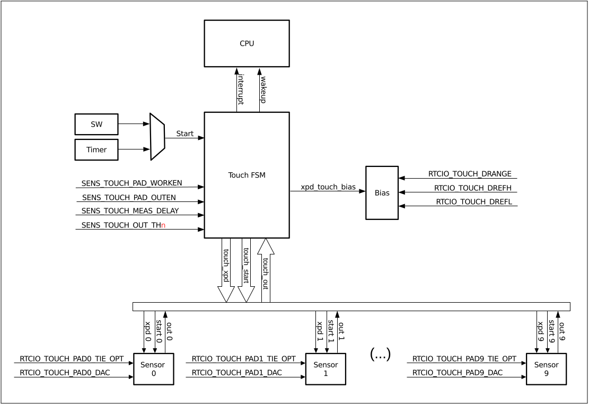

FSM 的功能包括:

- 接收软件或计时器发出的开始信号
  - 当 `SENS_SAR_TOUCH_START_FORCE = 1` 时，可通过设置 `SENS_SAR_TOUCH_START_EN` 发起一次性检测；
  - 当 `SENS_SAR_TOUCH_START_FORCE = 0` 时，可利用计时器实现周期性检测。

    触摸传感器在睡眠模式下也能工作。可通过寄存器 `SENS_SAR_TOUCH_SLEEP_CYCLES` 设定检测周期。传感器由 `FAST_CLK` 控制，常见时钟频率为 8 MHz。
- 根据可调节时序，生成 `XPD_TOUCH_BIAS / TOUCH_XPD / TOUCH_START`<br>
    在选择使能触摸管脚时，`TOUCH_XPD / TOUCH_START` 中的内容将被 10 位寄存器 `SENS_SAR_TOUCH_PAD_WORKEN` 遮掩。
- 计数 `TOUCH0_OUT ~ TOUCH9_OUT` 上的脉冲数量<br>
    计数结果可见 `SENS_SAR_TOUCH_MEAS_OUTn`。全部 10 个触摸管脚可支持同时工作。
- 生成唤醒中断。<br>
    如果一个管脚的脉冲计数结果低于阈值，则 FSM 视该管脚被“触碰”。10 位寄存器 `SENS_TOUCH_PAD_OUTEN1 & SENS_TOUCH_PAD_OUTEN2` 可以将所有管脚定义为 2 组，即 `SET1 & SET2`。默认状态下，如果 `SET1` 中的任意管脚被“触碰”，即可生成唤醒中断；也可以配置为 `SET1` 和 `SET2` 中均有管脚被“触碰”时有效。

### 2.4. 触摸传感器驱动程序介绍

#### 2.4.1. IIR 滤波器设置

ESP32 触摸传感器驱动包含无限脉冲响应滤波器（IIR）功能，用户可以调用函数`touch_pad_read_filtered(touch_pad_t touch_num, uint16_t *touch_value);`读取滤波之后的脉冲计数值。IIR 产生与 RC 滤波器相类似的阶跃响应。 IIR 滤波器能够衰减高频噪声成分，并忽略低频信号。下图是手指触摸响应的波形。<br>
用户可以通过 API 设置 IIR 滤波器的采样周期。周期越大读数稳定性越高，相应的也会产生延迟。下图是采样周期设置成 10 ms 与 20 ms 的滤波效果和延迟的对比图。黄色是滤波之后的读数，红色是没有经过滤波的读数。

||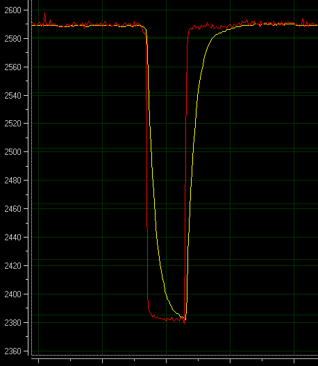|
|:---:|:---:|
|**IIR 滤波周期：10 ms**|**IIR 滤波周期：20 ms**|

下面两个图分别是 10 ms 和 20 ms 滤波周期滤波效果的对比图，黄色是滤波之后的读数。

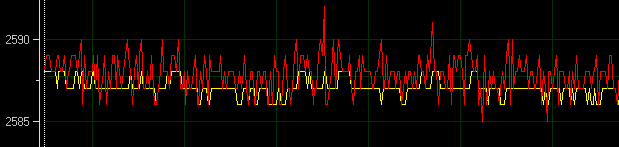  

&emsp;&emsp;&emsp;&emsp;&emsp;&emsp;&emsp;&emsp;&emsp;&emsp;&emsp;&emsp;&emsp;&emsp;&emsp;&emsp; **IIR 滤波周期：10 ms**  

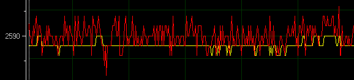  

&emsp;&emsp;&emsp;&emsp;&emsp;&emsp;&emsp;&emsp;&emsp;&emsp;&emsp;&emsp;&emsp;&emsp;&emsp;&emsp;**IIR 滤波周期：20 ms**  

> 注：假如滤波时间设置为 20 ms，则滤波器功能打开后的前 20 ms 为滤波器取样时间，滤波器读数是 0。

滤波器相关 API 说明：

* [`esp_err_t touch_pad_filter_start(uint32_t filter_period_ms)`](https://docs.espressif.com/projects/esp-idf/en/stable/api-reference/peripherals/touch_pad.html#_CPPv222touch_pad_filter_start8uint32_t)

* [`esp_err_t touch_pad_read_filtered(touch_pad_t touch_num, uint16_t *touch_value)`](https://docs.espressif.com/projects/esp-idf/en/stable/api-reference/peripherals/touch_pad.html#_CPPv223touch_pad_read_filtered11touch_pad_tP8uint16_t)

#### 2.4.2. 测量时间设置

ESP32 内部触摸传感器电路可配置为周期性测量模式。测量时间和测量间隔都可配置。测量时触摸传感器内部电流源对触摸管脚上的电容周期性充放电，管脚电压在参考高值 (drefH) 与参考低值 (drefL) 之间变化。非测量时间引脚电压不变，且电平高低状态由寄存器（TIE_OPT）设置。<br>
下图是示波器抓取某触摸引脚上的电压波形，时间参数设置为：sleep_cycle = 0x1000, meas_cycle = 0xFFFF（参考函数 `touch_pad_set_meas_time`）。

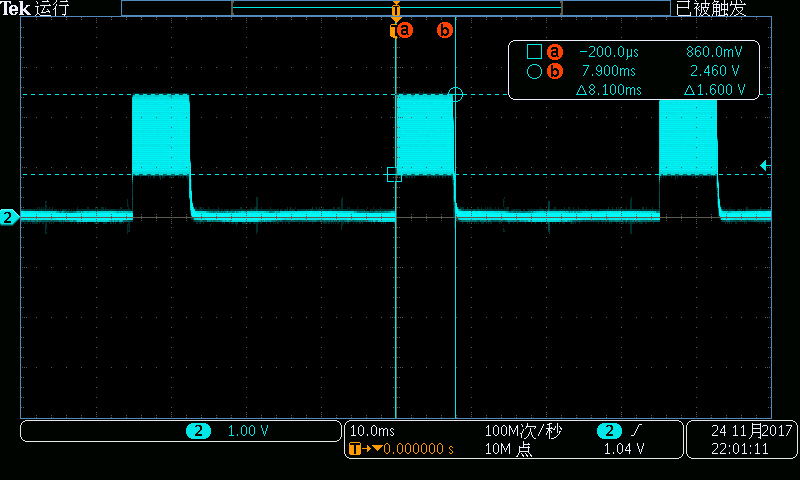

> 因为示波器端子有相对参考地的电容，如需准确测量通道电压变化，需要添加缓冲器（Buffer）。

相关 API 说明：

* [`esp_err_t touch_pad_set_meas_time(uint16_t sleep_cycle, uint16_t meas_cycle)`](https://docs.espressif.com/projects/esp-idf/en/stable/api-reference/peripherals/touch_pad.html#_CPPv223touch_pad_set_meas_time8uint16_t8uint16_t)

#### 2.4.3. 充放电压门限设置

上一节提到了触摸传感器内部电路充放电的电压门限、高电压衰减值（HATTEN），这几个参数由用户设置。门限的范围越小，脉冲计数值越大。但门限过小会导致读数的稳定性变差。选择合适的门限电压可以提高读数的稳定性。<br>
下图是示波器抓取某一触摸管脚上的充放电电压波形，不同的电压参数的对比。

电压参数为：refh = 2.4V, refl = 0.8V, atten = 0V。

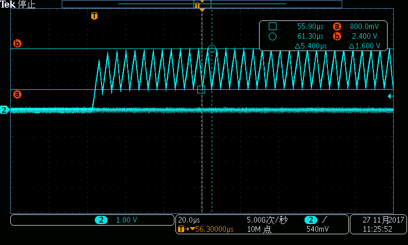

电压参数为：refh = 2.4V, refl = 0.8V, atten = 0.5V。

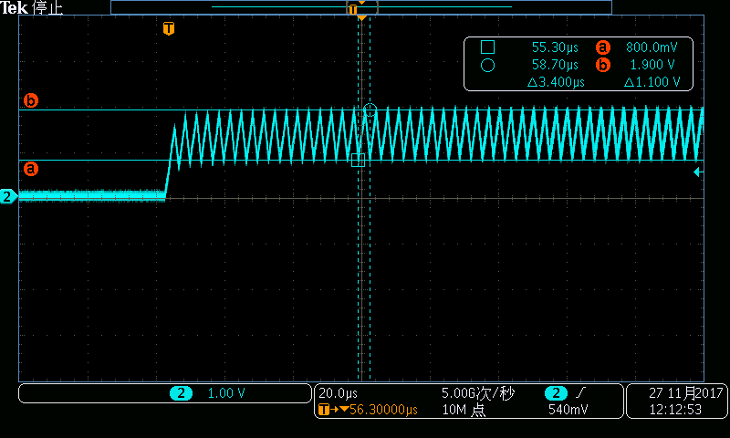

不同电压值对稳定性和灵敏度有一定的影响，门限电压范围越大，系统抗干扰能力越强，但得到的脉冲计数值较小。电压值选择 (refh = 2.7V, refl = 0.5V, atten = 1V) 组合能满足绝大多数设计要求。<br>

相关 API 说明：

* [`esp_err_t touch_pad_set_voltage(touch_high_volt_t refh, touch_low_volt_t refl, touch_volt_atten_t atten)`](https://docs.espressif.com/projects/esp-idf/en/stable/api-reference/peripherals/touch_pad.html#_CPPv221touch_pad_set_voltage17touch_high_volt_t16touch_low_volt_t18touch_volt_atten_t)

#### 2.4.4. 设置充放电电流
通过下面接口设置触摸传感器内部电流源的电流大小，改变电容的充放电速率。高的充放电电流会增加抗干扰能力，建议选择 TOUCH_PAD_SLOPE_7。

相关 API 说明：

* [`esp_err_t touch_pad_set_cnt_mode(touch_pad_t touch_num, touch_cnt_slope_t slope, touch_tie_opt_t opt)`](https://docs.espressif.com/projects/esp-idf/en/stable/api-reference/peripherals/touch_pad.html#_CPPv222touch_pad_set_cnt_mode11touch_pad_t17touch_cnt_slope_t15touch_tie_opt_t)


#### 2.4.5. 读取数据
用户读取脉冲计数值使用下面的接口。接口返回的 touch_value 是脉冲计数值。如果滤波器功能开启，使用 `esp_err_t touch_pad_read_filtered(touch_pad_t touch_num, uint16_t *touch_value);` 读取滤波之后的脉冲计数值。开启滤波器功能时不影响 `touch_pad_read` 接口使用。

相关 API 说明：

* [`esp_err_t touch_pad_read(touch_pad_t touch_num, uint16_t * touch_value)`](https://docs.espressif.com/projects/esp-idf/en/stable/api-reference/peripherals/touch_pad.html#_CPPv214touch_pad_read11touch_pad_tP8uint16_t)

#### 2.4.6. 中断触发
ESP32 触摸传感器支持中断触发模式，触发阈值可配置。中断模式可代替循环读取脉冲计数值模式，节省软件资源。 <br>
中断模式和延迟读取配合可以实现触摸按键消抖方案，排除误触发的干扰，下文软件章节会详细介绍此方案。

相关 API 说明：

* [`esp_err_t touch_pad_isr_register(intr_handler_t fn, void* arg)`](https://docs.espressif.com/projects/esp-idf/en/stable/api-reference/peripherals/touch_pad.html#_CPPv222touch_pad_isr_register14intr_handler_tPv)

## 3. 触摸传感器机械和硬件设计

触摸传感器系统设计过程更像是一种艺术作品的设计，需要追求完美的工匠精神。设计电容式触摸感应功能时，一定要记住触摸传感器是整个设计中的一部分，尽量规避其他设计对其产生的影响。注意从 PCB 布局到最终操作环境的每一个细节，这有助于实现强大且可靠的系统性能。

### 3.1. 机械设计
#### 3.1.1. 覆盖层设计
覆盖层是触摸传感器设计中非常重要，也具有挑战性的部分。设计者要在满足工业设计的同时达到最好的触摸性能。对于触摸传感器，覆盖层最大的作用是隔离外界环境，对电路提供 ESD 保护，减少误触操作的概率。

##### 3.1.1.1. 材质选择
根据本文引用的平行板电容器公式：

<div align="center"><center>C<sub>touch</sub> = ε*S/(4*π*k*d)</center></div>

手指和触摸传感器中的触摸电极都是导电介质，两者可等效为平行板电容器， C<sub>touch</sub> 与 ε 成正比。高介电常数将导致高灵敏度。由于空气的介电常数是最低的，所以需要消除传感器垫块和覆盖层间的任何间隔。
一些普通覆盖层材料的介电常数如下表列出。介电值在 2.0 和 8.0 间的材料适合于电容感应应用。

|材料|ε|击穿电压（V/mm）|
|---|----|---|
|空气|1.0|1200-2800|
|福米卡®|4.6 – 4.9|18000|
|玻璃（标准）|7.6 – 8.0|7900|
|玻璃（陶瓷）|6.0|13000|
|PET 薄膜|3.2|280000|
|聚碳酸酯|2.9 – 3.0|16000|
|丙烯酸|2.8|13000|
|ABS|2.4 – 4.1|16000|
|木表和桌面|1.2 – 2.5|3900|
|石膏（石膏板）|2.5 – 6.0|-|

传导材料不能用做覆盖层，因为它会与电场模式相干扰。因此，不要对覆盖层使用含有金属微粒的油漆。

##### 3.1.1.2. 厚度选择
覆盖层厚度与灵敏度成反比，选用厚度小的盖板可以提高触摸灵敏度，如下图所示。

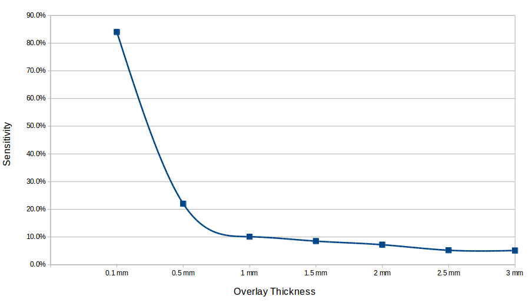

如果使用塑料材质盖板，建议厚度不超过 3 mm。对于覆盖层超过 1 mm 厚度的触摸传感器设计，需要较高的灵敏度，应严格执行本文档的设计建议。

##### 3.1.1.3. 覆盖层安装

- 紧贴覆盖层安装  
覆盖层材料要与触摸电极具有良好的机械接触。可以使用绝缘的粘合剂去除触摸电极与覆盖层之间的空隙，增加触摸的灵敏度。覆盖层与触摸电极要保持位置固定，否则出现读数不稳定。

- 与覆盖面板有距离  
在某些应用场景下需要 PCB 与覆盖层分离，这种场景就需要有填充物连接覆盖层与触摸电极。建议使用金属弹簧连接，弹簧应保持形变。

##### 3.1.1.4. 覆盖层涂层
产品设计中，可能对覆盖层进行表面处理，如电镀、贴膜等。设计时应依照平行板电容器原理，优先选择对触摸性能有利的方式。<br>
例如，在覆盖层的按键区域内(与手指接触的一侧)添加导电涂层，能够增加触摸的灵敏度，提高用户体验。不论是轻触还是触摸位置偏移，只要手指接触到了导电区域，均可与触摸电极形成较大面积的电场，完成按键触摸操作。

### 3.2. 使用芯片和模组的注意事项

#### 3.2.1. 管脚分配

下图是触摸传感器功能在 ESP32 芯片和 ESP-WROOM-32 模组中的管脚位置。可以看出 ESP32 芯片触摸管脚位置分布较集中，但在模组中触摸管脚位置比较分散。

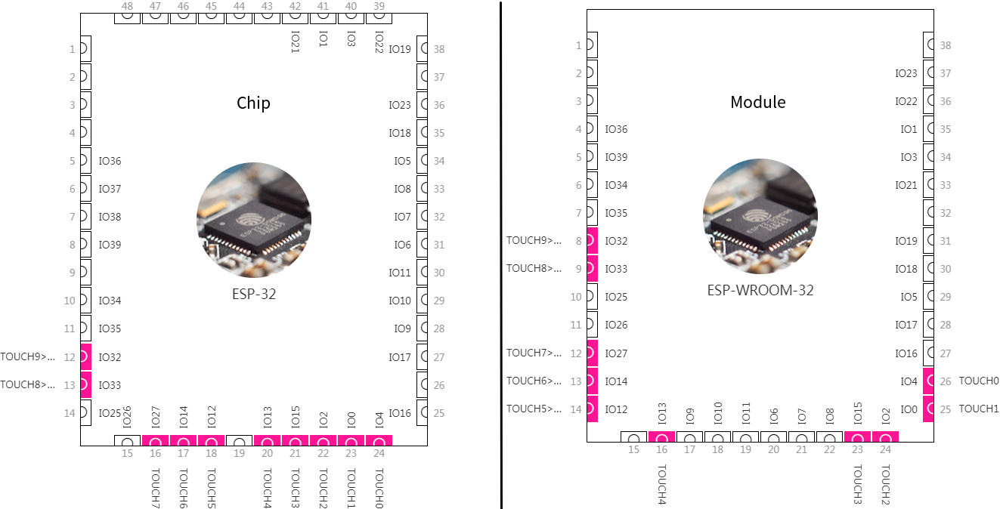

产品设计触摸管脚功能尽量集中分配，这样 PCB 设计时方便能做数字信号与模拟信号隔离。比如需要 4 个触摸传感器,则可选择 T1~T4，而不是 T0，T4，T7，T9。

触摸管脚相邻管脚不应分配高频数字信号 如 SPI，I2C，PWM 等。

#### 3.2.2. 布局规划

- 走线方向  
  触摸传感器走线不应经过芯片和模组下方。走线不应靠近射频天线电路。

- 模组贴装
  - 模组上的触摸通道的走线是在底层，模组的贴装区域应按下面方式设置栅格地。下图中红色是触摸传感器的走线和引脚位置，此区域内对应的贴装区不应铺地，蓝色区域表示的是可铺地的区域。
  - 模组贴装的焊盘设计不应过大，不应延伸到模组底层的铺地区，否则触摸通道会紧邻 GND，造成过大的寄生电容，降低灵敏度。

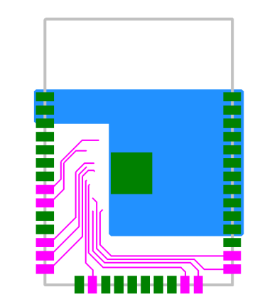

> 注意：T1(GPIO0) 既是触摸传感器管脚，也是下载模式选择管脚，设计时应注意下载功能不应影响触摸功能。比如可以使用跳线帽或者电阻选择功能，调试时选择下载功能，发布产品时选择触摸功能。

#### 3.2.3. 电路功能分配

触摸传感器内部电路对电压比较敏感，触摸传感器及其他 RTC IO 由 VDD_RTC 同时供电，当 RTC IO 输出电流变化时，会影响某些触摸传感器读数变化。下图是 ESP32 各管脚电源域的分布。<br>

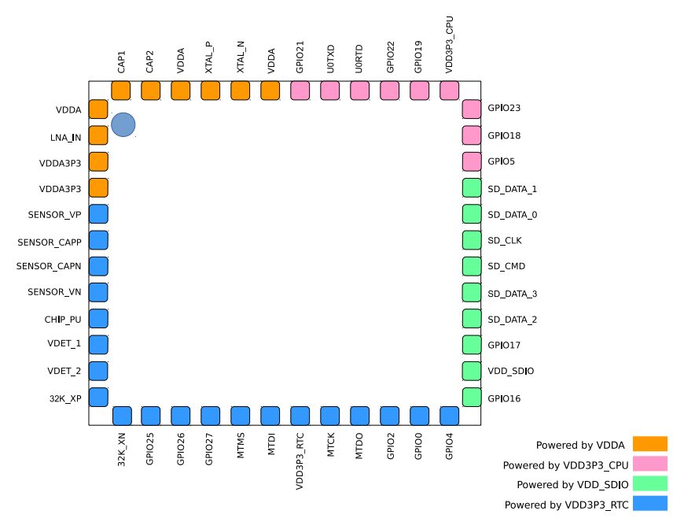

下图是实际测试结果。当 GPIO32 输出不同的电流大小时，触摸传感器通道的读数发生变化，且每个触摸通道上读数的变化率和变化方向不同。

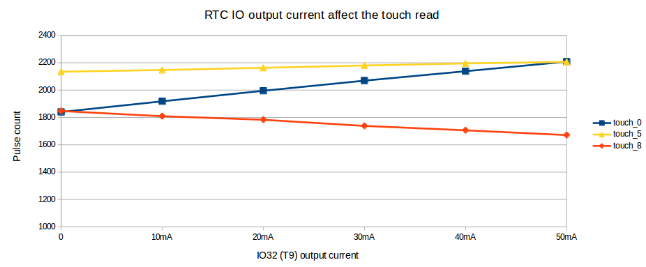

实际测试各触摸传感器的受影响程度后，得出 Touch 5 到 Touch 9 通道受 RTC IO 输出电流的影响程度较小。所以对设计稳定性要求较高的场景，建议使用 Touch 5 到 Touch 9 做触摸传感器设计。<br>

以下是电路功能分配的注意事项：

- 不应在 RTC IO 上输出动态范围较大的电流（如 RTC IO 直接驱动 LED），因为电流变化会引起触摸传感器读数变化。
- TOUCH 0 到 TOUCH 6 输出动态电流时，对 Touch 5 到 Touch 9 读数无影响。
- RTC IO 电流输入不影响触摸传感器读数。

### 3.3. PCB 布局规范

在使用 ESP32 设计电容式触摸传感器系统时，PCB 设计用户应遵循本文提供的设计规则，以使触摸传感器系统有更高的灵敏度和稳定性。

#### 3.3.1. 寄生电容 C<sub>p</sub>

C<sub>p</sub> 的主要组成部分是走线电容和触摸电极电容。 C<sub>p</sub> 与触摸电极面积、走线长度、走线宽度和离地间隙有非线性关系。PCB 布局会直接影响 C<sub>p</sub> 的大小。增大触摸电极面积、延长走线长度和宽度以及减少离地间隙，都会使 C<sub>p</sub> 变大。扩大传感器和接地之间的间隙可以降低 C<sub>p</sub>，但同时也会降低抗噪能力。<br>

实际设计中，不同因素对 C<sub>p</sub> 影响的程度大小为：走线长度 > 触摸电极周围铺地 > 走线离地间隙 > 过孔数 > 触摸电极面积 ≈ 走线宽度 <br>

以下是实际测试的结果：

|测试项|参考值 [*]|走线增长 77 mm|触摸电极反面实地|触摸电极反面栅格地|过孔数增加 8 个|走线宽度增加4 mil|
|:---:|:---:|:---:|:---:|:---:|:---:|:---:|
|脉冲计数值（与 C<sub>p</sub> 成反比）|1245.4|1045|1050.6|1113.3|1158.5|1246.4
|与参考值比较的差值|0|+200.4|+194.8|+132.1|+86.9|-1|

> [*] 参考值的硬件环境: 走线宽度 6 mil，走线长度 50 mm，过孔数 0，触摸电极直径 10 mm，触摸电极反面无铺地。

#### 3.3.2. 电路板厚度

如果使用 FR4 作为 PCB 的基材，板厚建议 0.5 mm 到 1.65 mm。如果板厚小于 1 mm，走线反面铺地应该减少。

#### 3.3.3. 走线规格

走线是影响寄生电容最大的因素之一。缩短走线、走线变窄都会减少寄生电容。以下是关于走线规格的注意事项：

- 走线长度不应超过 300 mm
- 走线宽度（W）不应大于 0.18 mm（7 mil）
- 走线夹角（R）不应小于 90°
- 走线离地间隙（S）范围 0.5 mm 到 1 mm
- 触摸电极离地间隙范围 1 mm 到 2 mm
- 触摸电极直径（D）范围 8 mm 到 15 mm
- 触摸电极和走线应被栅格地围绕

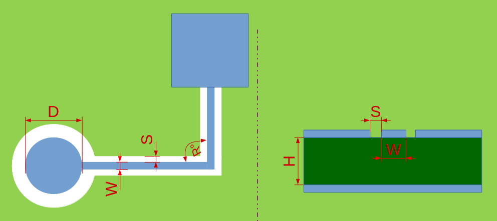

#### 3.3.4. 走线位置

触摸传感器属于模拟电路，设计走线位置是为了防止其他数字电路或环境对触摸电路干扰。触摸传感器周围尽量使用铺地屏蔽隔离。以下是关于走线位置的注意事项：

- 为防止用户误触，应在触摸电极的背面走线。
- 触摸电极下方不能走线，除了与之相连的触摸传感器走线。
- 触摸传感器走线不应与高频数字线并行排列，或使用接地屏蔽触摸传感器走线。
- 如需与通信数字线（如 SPI、I2C）相交，应确保触摸传感器走线与其呈直角相交。
- 走线应远离高功率电路，如开关电源、LCD、电机驱动、射频天线电路等。

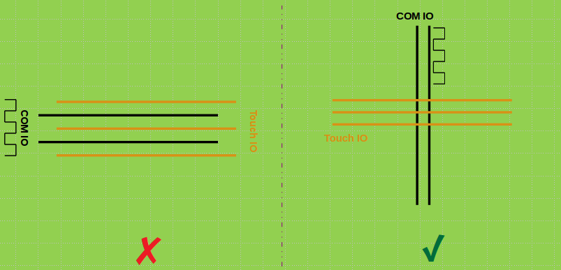

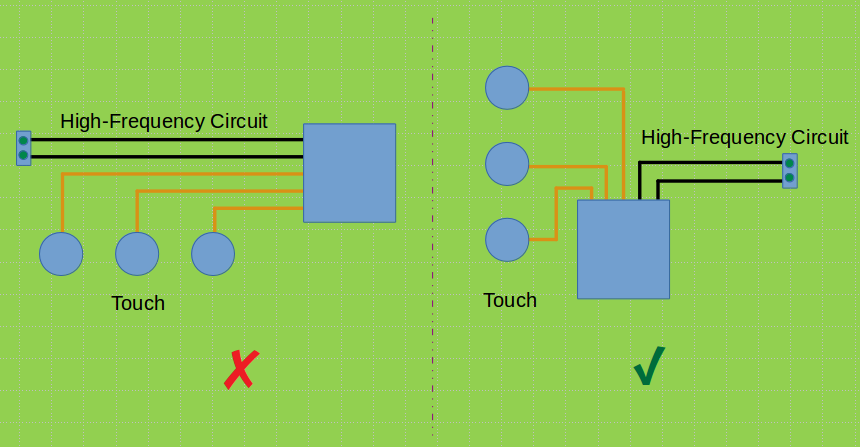

#### 3.3.5. 走线过孔

- 走线时使用过孔数量越少越好，尽量减少寄生电容。
- 过孔放置在触摸电极的边缘上，减少走线长度。
- 过孔直径应为 10 mil。

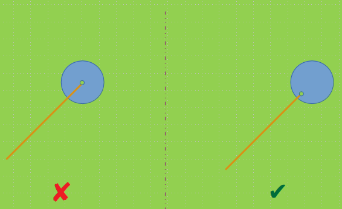

#### 3.3.6. 走线串扰

触摸传感器设计中，触摸传感器的走线较容易受到其他走线串扰影响，比如高功率走线或高频数字信号走线。为了解决串绕的问题可以通过调整走线位置，减少电路高频信号等方式解决。<br>

- **走线位置**

LED 是触摸传感器设计中经常出现的电路，做触摸背光使用。如果触摸电极是 PCB 板上的圆形铜箔，背光 LED 应该放在触摸电极的反面，如下图所示。

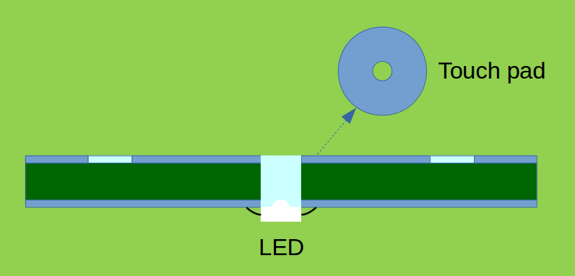

当 LED 打开或关闭时，走线上驱动 LED 的电压转变会耦合到触摸传感器输入，影响触摸传感器充放电过程。为了防止耦合（串扰），应将触摸传感器和 LED 驱动的走线位置分开。间距最小值应为 4 mm，也可以使用网格地隔离，如下图所示。

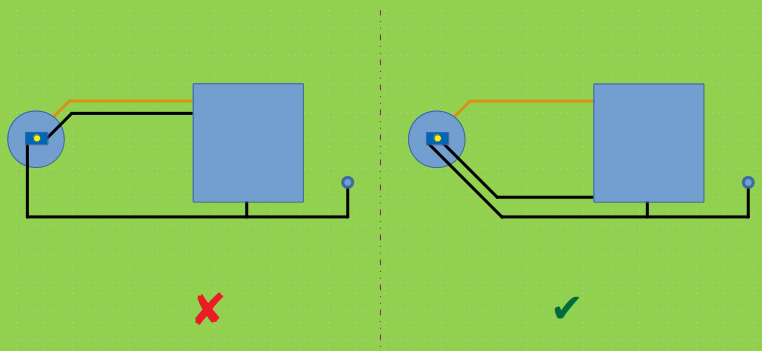

- **使用滤波电容**

另外一种降低串扰的方法是使用滤波器电容将 LED 驱动电压的上升和下降沿放缓。下图展示了这种解决方案的示例电路。所添加的电容值取决于 LED 的驱动电流要求，典型应用中使用 0.1 µF。

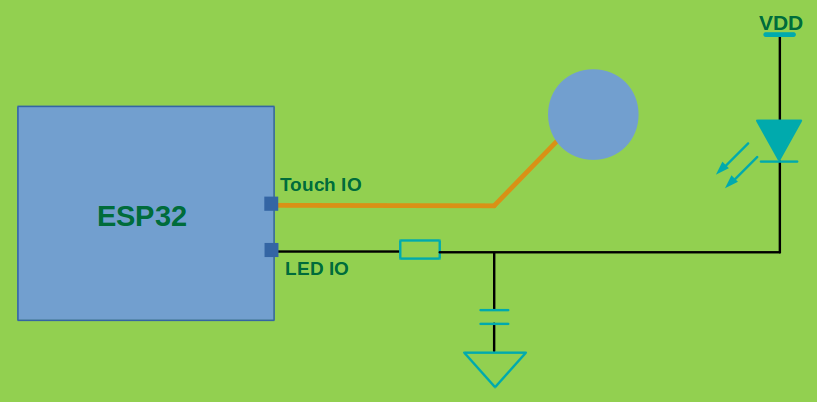

- **LED 与触摸传感器接近**

如果将 LED 放置在触摸传感器附近（在 4 mm 范围内），而且 LED 的某一端随时变为非低阻抗状态，那么触摸传感器的电容将在 LED 打开和关闭两种状态间变化。这种电容的变化可能会导致误触发，应使用旁路电容减少这种影响。旁路电容应并联在 LED 的旁边，旁路电容的典型值 1 nf。在通过下拉或上拉来打开 LED 或通过悬空来关闭 LED 的情况下，该操作非常重要。

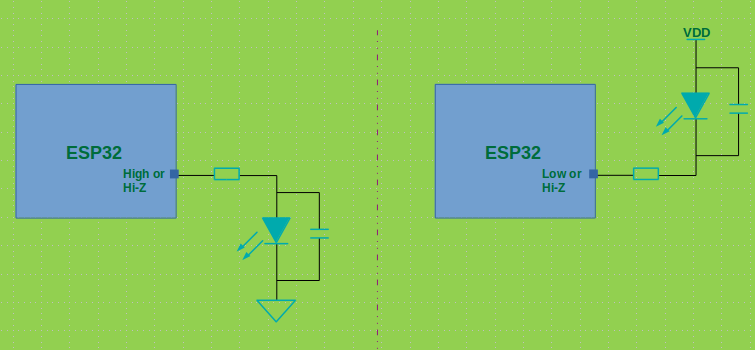

#### 3.3.7. 铺地

铺地指的是 PCB 设计中使用大面积铜箔铺设参考地，可以起到隔离干扰的作用。铺地可以是实铜地或者是栅格地。铺地是触摸传感器设计中最重要的步骤之一，以下是关于铺地的注意事项：

- 铺地使用栅格地类型，是增强抗干扰能力并保证高灵敏度的折中选择。
- 触摸电极周围使用栅格地，触摸电极反面如无干扰源不应铺地。
- 铺地应距离触摸电极至少 1 mm。
- 铺地应距离触摸走线至少 0.5 mm。
- 栅格地的规格应为：19%（5 mil 线宽，50 mil 间距）。
- 触摸电极及触摸走线 10 mm 范围不应有实心地。

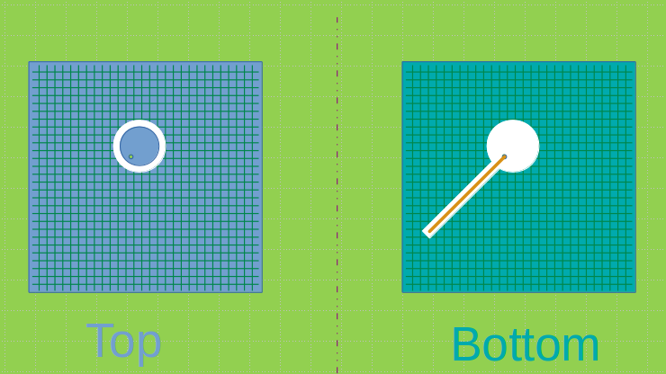

#### 3.3.8. 串联电阻

触摸传感器走线及触摸电极会产生寄生电容（C<sub>p</sub>），C<sub>p</sub> 与走线上的串连电阻 R 会形成 RC 滤波器，实现滤波功能，减少走线上的耦合噪声和干扰。如下图：

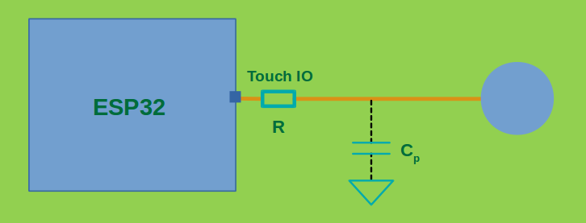

串联电阻有一定的取值范围，过大会导致波形失真，降低灵敏度，过小则滤波效果不明显。串联电阻的取值受多种因素影响，如触摸传感器通道内部电阻、冲放电频率、外部寄生电容等。如果要得到合适的阻值，需要测试实际产品的效果决定。

下图显示的是触摸管脚上不同阻值的串联电阻对触摸变化率的影响。

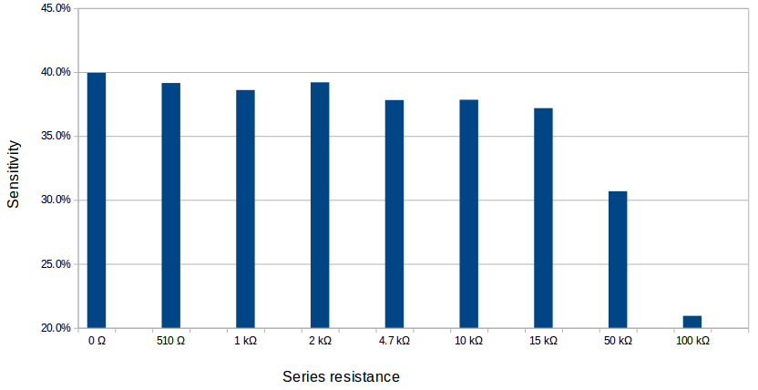

关于串联电阻应注意：

* 串联电阻位置应距离触摸管脚 1 mm 以内。
* 串联电阻阻值建议 470Ω 到 2 KΩ，建议 510Ω。

#### 3.3.9. 电源设计建议

减少噪声影响首先要考虑的是抑制噪声源，电源是噪声来源的重要途径。如果电源设计不良会使触摸传感器易受噪声影响，特别是在需要高灵敏度的使用场景时，比如当覆盖保护层厚度大于 1 mm 时。关于电源设计应注意：

- ESP32 芯片应使用电源芯片单独供电，不应与其他高功耗，高频率元件使用同一电源，如 LED 驱动芯片，电机驱动芯片等。
- ESP32 应严格依照[ESP32 硬件设计指南](http://espressif.com/sites/default/files/documentation/esp32_hardware_design_guidelines_cn.pdf)中电源参考电路设计，减少电源纹波。

#### 3.3.10. 连接器

在触摸传感器设计中，存在触摸电极和触摸芯片不在同一 PCB 的使用场景，这就需要用到连接器。连接器的选型和布局会影响触摸传感器的寄生电容 C<sub>p</sub> 。以下是关于连接器的注意事项：

- 连接器焊盘封装面积不应过大，并减少其周围的铺地。
- 应选用连接牢固的连接器，不应出现接触不良的现象。
- 触摸传感器走线经过大面积焊盘时会产生寄生电容，应避免这样走线，如下图所示。

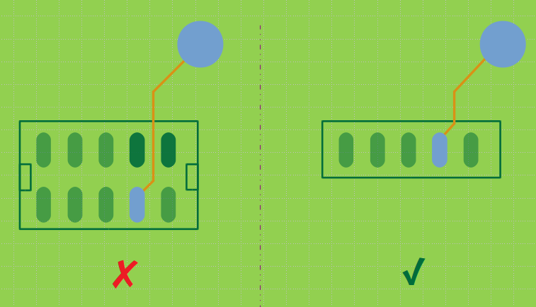

#### 3.3.11. 按键设计

- 按键的最佳形状是圆形，也可以使用圆角的矩形焊盘。因为尖点会集中电磁场，所以在设计触摸电极时应避免尖角（小于 90º）。
- 按键直径范围应介于 8 mm 到 15 mm 之间，典型值为 12 mm 。如果覆盖层较厚可以选用较大直径的触摸电极。
- 触摸电极距离栅格地网络应介于 1 mm 与 2 mm 之间，且应等于覆盖层的厚度。如果覆盖层厚度超过 2 mm，触摸电极离地间隙应为 2 mm 。
- 两个相邻按键应间距 5 mm 以上，避免手指触摸时互相影响。

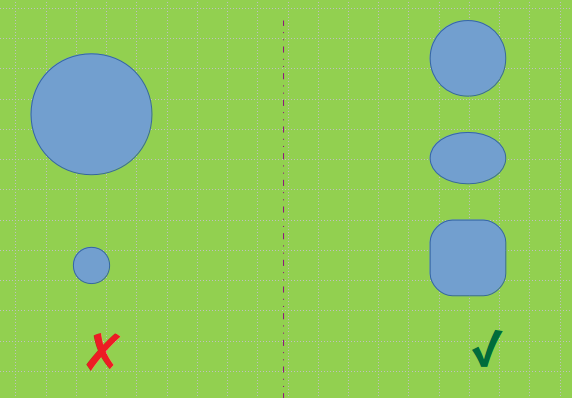

#### 3.3.12. 滑条/滚轮设计

将多个触摸按键排列在一起就组成了滑条，配合软件能检测到手指滑动的方向和位置。滑条可以是直线排列，也可以是圆形排列，取决于产品的使用要求。<br>


人的手指直径大约 9 mm，所以滑条的宽度（W）建议为 8 mm，滑条间距（A）建议为 0.5 mm。让手指在滑条上方滑动时相邻两个触摸电极上的读数值变化相反，信号变强的电极是手指即将到达的位置，信号变弱的电极是手指即将离开的电极。所以相邻两个触摸电极之间的距离不应过大，否则无法计算手指准确位置。<br>

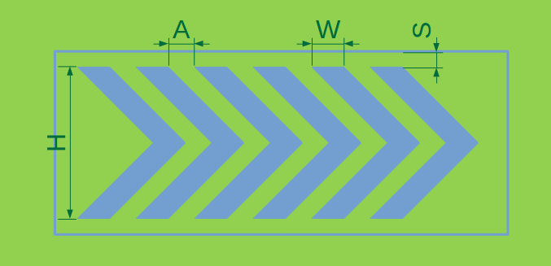

|参数|最小值 (mm)|最大值 (mm)|建议值 (mm)|
|:---:|:---:|:---:|:---:|
|宽度（W）|4|-|8|
|高度（H）|8|15|12|
|间距（A）|0.5|2|0.5|
|距离栅格地（S）|1|2|覆盖层厚度|

常见的滑条形状包括 V 字形、双 V 字形或锯齿形。

#### 3.3.13. 矩阵键盘设计

当按键数量较多或管脚不够用时，可使用矩阵键盘设计，减少 IO 的占用。一个 m×n 的矩阵按键，需要 m+n 个触摸传感器。矩阵键盘中单个按键被划分成两部分，行块连接到行线，列块连接到列线，如下图所示。

- 按键直径介于 8 mm 到 15 mm 之间，典型值为 12 mm。
- 行块和列块的间隔 0.5 mm。
- 每个矩阵按键是多个触摸通道的组合，要求手指触摸时覆盖整个按键。若在覆盖层的按键区域电镀导电涂层，可优化用户触摸体验。

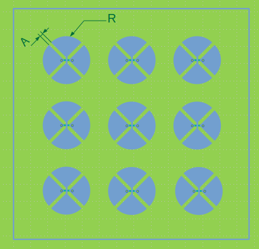

#### 3.3.14. 触摸弹簧设计
很多产品以触摸弹簧作为触摸电极，连接覆盖层与 PCB 主板。设计中弹簧的选型会影响触摸性能。使用触摸弹簧进行设计时应注意以下几点：

- 弹簧的安装高度应大于 5 mm。
- 弹簧的直径不应小于 10 mm。
- 弹簧的灵敏度性能由高到低为： 带金属片型，喇叭型，直筒型。
- 相邻弹簧按键距离不应小于 10 mm。
- 弹簧离地间隙不应小于 1mm。

#### 3.3.15. 使用 ITO 设计按键
ESP32 支持使用 ITO 材质实现触摸功能。因 ITO 材质透明、导电的特性，可以通过将 ITO 材质喷涂在 LCD 盖板表面上实现屏幕触摸。

- ITO 触摸按键大小/形状的设计规则参考普通 PCB 按键设计规则。
- ITO 材质电阻率较高，若设计允许，可使用其他导电材质代替 ITO 走线。
- 通道上 ITO 走线和 pad 的总电阻应小于 2 KΩ。增加走线长度会明显增加通道总电阻，影响触摸灵敏度，在设计时应尽量减少 ITO 走线长度。
- LCD 工作会影响 TouchPad 通道的计数值。应在 LCD 工作时评估触摸按键的触摸性能（灵敏度，信噪比）。
- ITO 触摸按键周围增加铺地，会减少 LCD 引入的干扰，但也会降低触摸灵敏度。应根据实际触摸性能调整产品设计。

## 4. 触摸传感器软件设计

本章会说明触摸传感器的方案设计过程，给出一般的设计指导，旨在缩短产品的上市时间。

### 4.1. Wi-Fi 对触摸的影响

Wi-Fi 发包时需要 300 mA 左右的电流，频繁地收发包会对电源系统带来压力。触摸传感器对电源比较敏感，Wi-Fi 功能开启会影响触摸传感器的稳定性。但电源端噪声具有周期性，使用 ESP32 驱动程序中的 IIR 滤波算法可以滤掉此干扰。<br>

下表是不同触摸通道在不同 Wi-Fi 状态下的读数标准差（数值越大，触摸传感器稳定性越差）。相同触摸通道，若 Wi-Fi 功能开启，读数值的标准差会增大。但使用滤波器功能，读数值的标准差会明显减少。建议用户使用滤波器模式。

|触摸通道|Wi-Fi 关闭 & 读数|Wi-Fi 开启 & 读数|Wi-Fi 关闭 & 滤波器读数 (10 ms)|Wi-Fi 开启 & 滤波器读数 (10 ms)|
|:---:|:---:|:---:|:---:|:---:|
|T0|1.77|2.47|0.55|0.88|
|T1|1.43|2.06|0.50|0.73|
|T2|0.97|1.15|0.64|0.49|

Wi-Fi 功能不仅影响触摸传感器读数稳定性，也会对读数值有影响。Wi-Fi 功能打开时会减少触摸传感器的读数。改变程度不超过 1.2%。并且各通道的被影响程度不同： 0.5% < TOUCH 5 ~ TOUCH 9 < 1% < TOUCH 0 ~ TOUCH 4 < 1.2% 。  

> ⚠️ 注意：
>
一般设计中，触摸传感器初始化时会计算触发阈值。为了阈值计算准确，请在 Wi-Fi 功能初始化后，读取触摸传感器的值。

### 4.2. 触摸按键消抖方案

触摸按键消抖是对按键设计更高的要求。好的消抖方案能过滤掉一些误触发动作，比如水滴经过，皮肤的误碰等。为了得到解决方案，我们测试实际触摸和误触摸时的触摸传感器读数变化，如下图所示。

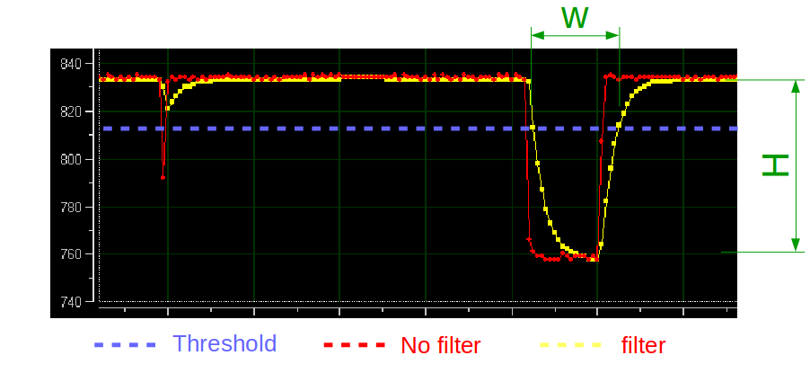

误触发会产生比较大的幅值（H）变化，约是正常触摸的 2/3 左右。但是误触发的时延（W）比正常触摸小得多。所以我们可以使用滤波方案减少读数的突变。如图中黄色是 filter 读数的变化，数据变化幅度明显降低，没有触发阈值。<br>
正常触摸在时延（W）上有一定范围。所以在触摸中断产生时，延迟读取触摸传感器的值，判断是否超过阈值，如果没有超过则认为是误触发操作。

### 4.3. 自校准方案
由于触摸传感器自身的电容会随温度、电压、湿度等外界因素的变化而变化，所以在触摸电极无触摸的情况下其采样读数也会产生波动。存在由于触摸传感器自身引起的读数变化会导致灵敏度下降、误捕捉触摸事件等情况。我们采用自校准方案会解决上面遇到的问题。esp-iot-solution/components 中 [touch_pad](https://github.com/espressif/esp-iot-solution/tree/master/components/features/touchpad) 已经实现自校准方案。<br>

下面是自校准方案的分析、验证过程。

#### 4.3.1. 建立数学模型
* 假设有 *N* 个触摸传感器，第 *i* 个触摸传感器在 *t* 时刻的采样读数的数学期望为 Eval<sub>it</sub> , N 个触摸传感器在 *t* 时刻的读数期望的平均值为 AVG<sub>t</sub>  = (Eval<sub>0</sub> + Eval<sub>1</sub> + ... + Eval<sub>N-1</sub>)/N 。
* 我们为触摸传感器建立的模型满足 Eval<sub>it</sub> = θ<sub>t</sub> * μ<sub>i</sub> * P 。
	* θ<sub>t</sub> 是与 *t* 时刻的外界因素（如温度、电压、湿度等）有关的参数，不同的触摸传感器的 θ<sub>t</sub> 是相同的。
	* μ<sub>i</sub> 是对于不同的触摸传感器取不同值的参数，它与触摸电极的形状、在 pcb 上的位置、pcb 的走线等相关的。
	* P 描述了不同触摸电极之间存在的固有共性，例如材料等。
* 在同一时刻 *t* 对于第 *i* 个触摸传感器，其数学期望与 N 个触摸传感器的数学期望平均值的比值满足 β<sub>i</sub> = Eval<sub>it</sub>/AVG<sub>t</sub> = N * μ<sub>i</sub> / (μ<sub>0</sub> + μ<sub>1</sub> + ... + μ<sub>N-1</sub>)。   
β<sub>i</sub> 是一个不随时间变化的定值。我们对触摸传感器进行了温度与电压实验，通过观察电压与温度变化时用实验数据计算的 Eval<sub>it</sub>/AVG<sub>t</sub> 是否为定值验证此模型的准确性。以下章节描述了实验验证过程和结果。

#### 4.3.2. 实验验证
为了验证上文所述的数学模型，我们对触摸传感器进行了温度测试与电压测试。
不同温度与电压下各触摸传感器的读数如下二图所示，从图中可以看出温度与电压的变化都会对触摸传感器的读数有影响，使用过程中动态地调整触摸传感器的无触摸读数期望值与中断触发阈值是有必要的。

| 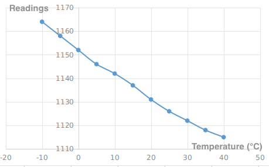| |
|:---:|:---:|
|**温度测试**|**电压测试**|


温度测试的触摸传感器读数数据如下表所示：


不同温度下第 *i* 个触摸传感器的数学期望与 *N* 个触摸传感器的数学期望平均值的比值 Eval<sub>it</sub>/AVG<sub>t</sub> 如下表所示：


电压测试的触摸传感器读数数据如下表所示：

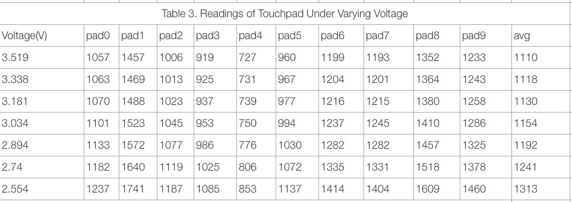

不同电压下第 *i* 个触摸传感器的数学期望与 *N* 个触摸传感器的数学期望平均值的比值 Eval<sub>it</sub>/AVG<sub>t</sub> 如下表所示：


从表 2 与表 4 可以看出无论温度与电压如何变化，每一个触摸传感器的 Eval<sub>it</sub>/AVG<sub>t</sub> 都是一个较为稳定的数值，其波动范围仅为 1% 左右。通过这两个实验可以证明我们的模型是准确的。

#### 4.3.3. 方案实施

根据以上所述的数学模型和实验验证，我们将利用 *N* 个触摸传感器的无触摸状态全局平均读数估计值 AVG'<sub>t</sub> 与每个触摸传感器固定不变的 β<sub>i</sub> 更新触摸传感器 *i* 的无触摸状态读数期望值：Eval<sub>it</sub> = AVG'<sub>t</sub> * β<sub>i</sub> 。其中 AVG'<sub>t</sub> = (c<sub>0t</sub> + c<sub>1t</sub> + ... + c<sub>(N-1)t</sub> ) / N。  

如果当前判断触摸传感器 *i* 为无触摸状态则 c<sub>it</sub> 取当前的读数值，否则 c<sub>it</sub> = c<sub>i(t-1)</sub> 。

* 具体步骤如下：
	* 1、系统初始化时读取每个触摸传感器 *m* 个数据，计算所有触摸传感器的 β<sub>i</sub> = AVG'<sub>0</sub> / Eval'<sub>i0</sub>，这是一个固定的值，不会随时间变化。
	 - Eval'<sub>i</sub> = (val<sub>0</sub> + val<sub>1</sub> + ... + val<sub>(m-1)</sub>) / m, 其中 val<sub>j</sub> 表示第 *j* 个读数。
	* 2、更新所有触摸传感器的无触摸状态读数期望值 Eval<sub>it</sub> = AVG'<sub>t</sub> * β<sub>i</sub>。
	* 3、更新所有触摸传感器的中断触发阈值 thres<sub>it</sub> = λ<sub>i</sub> * Eval<sub>it</sub> ，λ<sub>i</sub> 是一个决定触发灵敏度的系数。
	* 4、 启动自校准定时，定时触发时从步骤 2 开始执行。

### 4.4. 触摸按键软件设计
在 [esp-iot-solution](https://github.com/espressif/esp-iot-solution) 中，用户可以直接创建一个触摸传感器实例，用户需要设定触摸传感器 *i* 中断触发阈值百分比 λ<sub>i</sub>，真实的阈值为 thres<sub>it</sub> = λ<sub>i</sub> * Eval<sub>it</sub>，其中 Eval<sub>it</sub> 会定时地自校准。同时用户需要设置滤波时间 filter<sub>i</sub>。

* 驱动步骤：
	* 1、触摸传感器中断触发，开启软件定时器，定时时间为 filter<sub>i</sub> 毫秒。
	* 2、定时中断触发，读取触摸传感器采样值 val<sub>i</sub>。若 val<sub>i</sub> < thres<sub>it</sub>，执行 pad push 回调，重启软件定时。否则，不启动定时器，等待下一个触摸传感器中断。
	* 3、定时中断触发，读取触摸传感器采样值 val<sub>i</sub>。若 val<sub>i</sub> > thres<sub>it</sub>，执行 pad tap 与 pad release 回调。否则重启定时器重复步骤 3。

用户可以设置连续触发模式，这时在步骤 3 中，若 val<sub>i</sub> < thres<sub>it</sub>，就会执行 pad serial trigger 回调。

[esp-iot-solution](https://github.com/espressif/esp-iot-solution) 中的使用步骤：

```
/*
创建 touchpad（触摸传感器）对象
thres_percent 的设置取决于使用场景下 touchpad 的灵敏度，大致取值可以参考如下：
1、如果使用时触摸电极直接与手指接触，则将 thres_percent 设置为 700~800 即可得到很好的灵敏度，同时又能保证很高的稳定性
2、如果触摸电极放置于 pcb 的最底层，手指与触摸电极之间会间隔 1 mm 左右厚度的 pcb，则将 thres_percent 设置为 970 左右
3、如果还要在 pcb 上加一层 1 mm 左右的塑料保护层，则将 thres_percent 设置为 990，这时稳定性会比较低，容易发生误触发
filter_value 用于判断释放的轮询周期，一般设置为 150 即可
tp_handle_t 用于后续对此 touchpad 的控制
*/
tp_handle_t tp = iot_tp_create(touch_pad_num, thres_percent, 0, filter_value);
iot_tp_add_cb(tp, cb_type, cb, arg);		// 添加 push、release 或者 tap 事件的回调函数
iot_tp_add_custom_cb(tp, press_sec, cb, arg);// 添加用户定制事件的回调函数，用户设置持续按住 touchpad 多少秒触发该回调
/*
设置连续触发模式：
trigger_thres_sec 决定按住触摸电极多少秒后开始连续触发
interval_ms 决定连续触发是两次触发间的时间间隔
*/
iot_tp_set_serial_trigger(tp, trigger_thres_sec, interval_ms, cb, arg);
```

### 4.5. 触摸滑块软件设计

#### 4.5.1 单工滑块

触摸滑块采用如下图所示的结构布置多个触摸电极，一个触摸电极使用一个触摸传感器。手指触碰滑块时，用户可以读取触碰点在滑块上的相对位置。

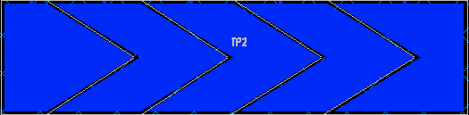

触摸滑块触碰点位置的计算采用质心计算的灵感。首先，按顺序为每一个触摸传感器 *i* 赋予位置权重 w<sub>i</sub> = i * ξ，式中 ξ 决定了定位的精度，ξ 越大位置分割越细。例如图中将从左到右的 5 个触摸传感器的权值依次赋值为 0，10，20，30，40。然后读取 *t* 时刻每个触摸传感器上的读数变化量 Δval<sub>it</sub> = Eval<sub>it</sub> - real<sub>it</sub> ，real<sub>it</sub> 是实时读数。最后，计算相对位置：posi<sub>t</sub> = (Δval<sub>0t</sub> * w<sub>0</sub> + Δval<sub>1t</sub> * w<sub>1</sub> + ... + Δval<sub>(N-1)t</sub> * w<sub>N-1</sub>) / (Δval<sub>0t</sub> + Δval<sub>1t</sub> + ... + Δval<sub>(N-1)t</sub>) 。此相对位置将是一个在 0 和 (N-1)*ξ 的值。

驱动步骤：

1、初始化时按位置顺序创建触摸传感器实例，为每一个触摸传感器实例添加 push 与 release 回调函数。  
2、在 push 和 release 回调函数中，读取此滑块中每一个触摸传感器的值，按上面的公式计算相对位置。

[esp-iot-solution](https://github.com/espressif/esp-iot-solution) 中的使用步骤：

```
/*
创建 touchpad 滑块对象
num 决定使用多少个触摸传感器组成一个滑块
tps 是 TOUCH_PAD_NUM 的数组，每一个 TOUCH_PAD_NUM 在数组中的位置要跟 pcb 上的实际位置严格对应
*/
tp_slide_handle_t tp_slide = iot_tp_slide_create(num, tps, POS_SCALE, TOUCHPAD_THRES_PERCENT, NULL, TOUCHPAD_FILTER_MS);
uint8_t pos = iot_tp_slide_position(tp_slide);// 用于读取手指触碰位置在滑块上的相对位置，手指没触碰时返回 255
```

#### 4.5.2 双工滑块
为了利用有限的触摸传感器驱动更长的滑块，可以使用下图所示的双工滑块。

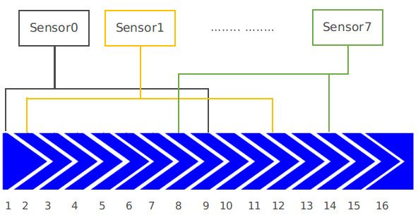

图中的双工滑块用到了 16 个触摸电极，但只需要使用 8 个触摸传感器。左半部分 8 个触摸电极按顺序使用 8 个传感器。右半部分 8 个触摸电极以乱序使用 8 个传感器。在左半部分相邻的传感器在右半部分不能相邻。

当左半部分有触摸电极被触摸时，右半部分连接同一传感器的触摸电极也会被认为有触摸，此时算法会寻找相邻触摸电极都有读数变化的区域，去除孤立的触发触摸电极。例如图中，当我们在 1、2 位置触摸滑块时，传感器 0 和 1 上的 1、2、9、12 号触摸电极都会被认为触发，但是只有 1 和 2 是相邻触摸电极触发，而 9 和 12 是两个孤立的触发触摸电极，所以算法会将位置定位在 1、2 区域。

在 [esp-iot-solution](https://github.com/espressif/esp-iot-solution) 中，用户不需要区分单工滑块和双工滑块，两者使用相同的 API 进行操作。

双工触摸滑块对象创建方式：

```
const touch_pad_t tps[] = {0, 1, 2, 3, 4, 5, 6, 7, 0, 3, 6, 1, 4, 7, 2, 5};// 假设图中的 16 个 pad 按此顺序使用 0~7 这 8 个传感器
tp_slide_handle_t tp_slide = iot_tp_slide_create(16, tps, POS_SCALE, TOUCHPAD_THRES_PERCENT, NULL, TOUCHPAD_FILTER_MS);
```

### 4.6. 触摸矩阵键盘软件设计
单个触摸按键的方案中一个触摸传感器只能连接一个触摸电极，在按键使用数量较大的应用场景下，触摸传感器不够用，可以使用矩阵按键的驱动方式。

矩阵按键使用如下图所示的结构，每个触摸按键被分成 4 块，相对的两块连接成同一个触摸电极，同时矩阵中每一行（每一列）的水平块（垂直块）连接到同一个触摸传感器。

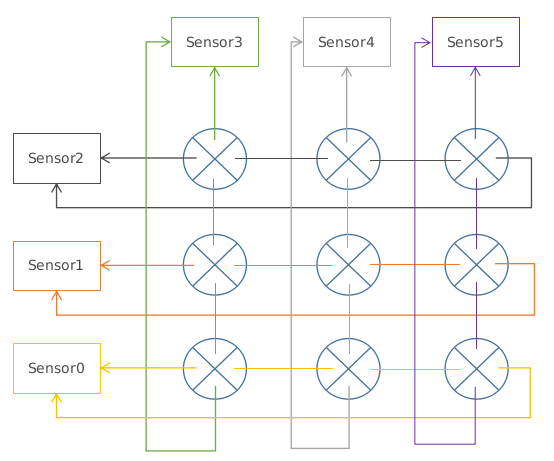

当一个触摸按键上横竖两个对应传感器同时都被触发时，该触摸按键才会被认为有触摸。例如图中 sensor2 和 sensor3 同时触发时，左上角的触摸按键被判定为有触摸事件。

[esp-iot-solution](https://github.com/espressif/esp-iot-solution) 中创建矩阵按键的方法如下，矩阵按键可以像单个触摸按键一样添加回调函数，设置连续触发等。

```
// 第 1、2 个参数指定水平与垂直方向的传感器数量，第 3、4 个参数是数组，指定了水平（垂直）方向按顺序的传感器编号
const touch_pad_t x_tps[] = {3, 4, 5};	// 图中水平方向的 sensor3, sensor4, sensor5
const touch_pad_t y_tps[] = {0, 1, 2};	// 图中垂直方向的 sensor0, sensor1, sensor2
tp_matrix_handle_t tp_matrix = iot_tp_matrix_create(sizeof(x_tps)/sizeof(x_tps[0]), sizeof(y_tps)/sizeof(y_tps[0]), x_tps, y_tps, TOUCHPAD_THRES_PERCENT, NULL, TOUCHPAD_FILTER_MS);
```

**注意：**由于矩阵按键驱动方式的限制，同时只能按一个触摸按键。当多个触摸按键同时按下时不会有触摸事件触发，当一个触摸按键正被触摸时，触摸其他触摸按键不会有事件触发。

## 5. 触摸传感器调试

### 5.1 ESP-Tuning Tool

在 Touchpad 传感器设计过程中，您需要监控 Touchpad 传感器数据（如原始计数值、基线值和计数差值），**评估触摸产品的性能（灵敏度，信噪比，通道干扰）**，以进行调校和调试。ESP-Tuning Tool 是用于调试 Touchpad 传感器性能的专用工具。有关 ESP-Tuning Tool 使用，请查阅 [ESP-Tuning Tool 使用手册](esp_tuning_tool_user_guide_cn.md)。

## 6. 开发套件及相关资源

* [ESP32-Sense 触摸传感器开发套件介绍](../evaluation_boards/readme_cn.md)    

* [触摸传感器开发程序示例](../../examples/touch_pad_evb)  

* ESP32 编程指南，[触摸传感器 API 参考](https://docs.espressif.com/projects/esp-idf/en/stable/api-reference/peripherals/touch_pad.html)  

* [《ESP32 技术参考手册》](https://espressif.com/sites/default/files/documentation/esp32_technical_reference_manual_cn.pdf)，章节*电容式触摸传感器*  
