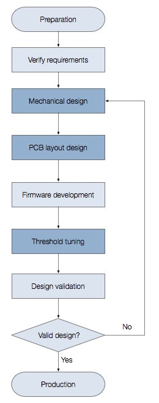
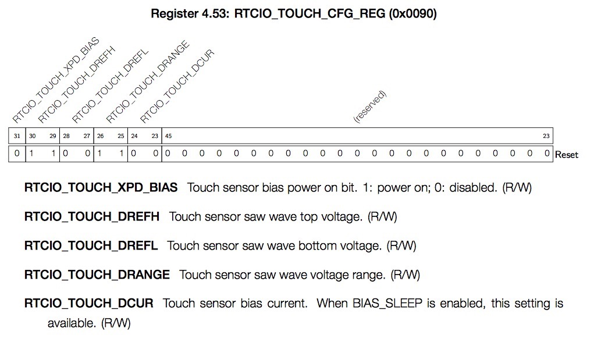
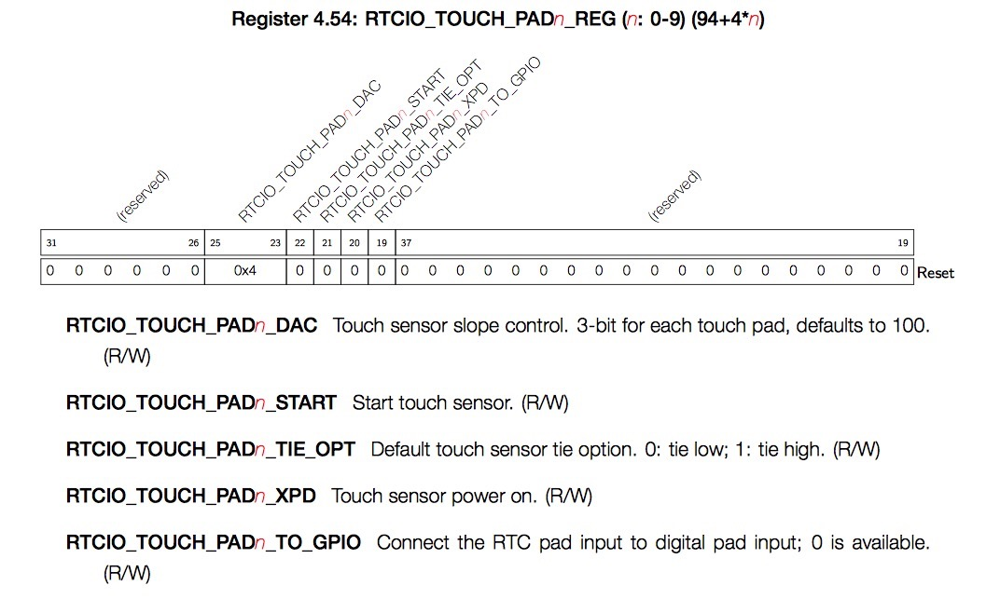

[[中文]](touch_sensor_design_cn.md) 

# Touch Sensor Application Note

Besides the core Wi-Fi functionality, the ESP32 integrates several peripheral devices to implement applications without providing additional external components. One of such devices is the touch sensor system with ten individual channels.

Design and implementation of the touch sensor system is a complex process and this document is intended to walk users though its critical steps. Besides general guidelines on touch sensor design it also contains several ESP32 specific notes and comments to optimize the design and get the best out of the application with sensors controlled with the ESP32.

## Table of Contents

- [1. Introduction to Touch Sensor System](#1-introduction-to-touch-sensor-system)
    * [1.1. Basics of Touch Sensing Technology](#11-basics-of-touch-sensing-technology)
    * [1.2 Development Process](#12-development-process)
    * [1.3. Terminology](#13-terminology)
- [2. Introduction to the ESP32 Touch Sensor System](#2-introduction-to-the-esp32-touch-sensor-system)
    * [2.1. Key Features of the ESP32 Touch Sensor System](#21-key-features-of-the-esp32-touch-sensor-system)
    * [2.2. Touch Sensor Channels](#22-touch-sensor-channels)
    * [2.3. Functional Description](#23-functional-description)
    * [2.4. Introduction to Touch Sensor Driver Applications](#24-introduction-to-touch-sensor-driver-applications)
- [3. Touch Sensor System Mechanical and Hardware Design](#3-touch-sensor-system-mechanical-and-hardware-design)
    * [3.1. Mechanical Design](#31-mechanical-design)
    * [3.2. Notes on Designs with ESP32 Devices](#32-notes-on-designs-with-esp32-devices)
    * [3.3. PCB Layout Guidelines](#33-pcb-layout-guidelines)
- [4. Touch Sensor Firmware Design Guidelines](#4-touch-sensor-firmware-design-guidelines)
    * [4.1. The Impact of Wi-Fi Enabling on Touch Sensor](#41-the-impact-of-wi-fi-enabling-on-touch-sensor)
    * [4.2. Jitter Filter Solution](#42-jitter-filter-solution)
    * [4.3. Self-Calibration Solution](#43-self-calibration-solution)
    * [4.4. Touch Button Firmware Design](#44-touch-button-firmware-design)
    * [4.5. Touch Slider Firmware Design](#45-touch-slider-firmware-design)
    * [4.6. Matrix Touch Button Firmware Design](#46-matrix-touch-button-firmware-design)
- [5. Touch Sensor Debugging](#5-touch-sensor-debugging)
    * [5.1. ESP-Tuning Tool](#51-esp-tuning-tool)
- [6. Related Documents and Resources](#6-related-documents-and-resources)


## 1. Introduction to Touch Sensor System

Capacitive touch sensing technology is widely used in household appliances, consumer electronics and other fields. The products with touch buttons have many advantages compared with those with mechanical buttons. They have:

* No mechanical parts that wear out over time.
* Completely sealed surfaces that are waterproof.
* Less components and reduced BOM cost.
* No vias on the panel, reducing mechanical design costs.
* A modern look with a flexible design.

### 1.1. Basics of Touch Sensing Technology

Capacitive touch sensing detects the occurrence of a touch event near the touch interface by measuring the change in capacitance between the panel (sensor) and the environment.

#### 1.1.1. Basic Structure of a Touch Sensor System

Below is a schematic diagram of a typical touch sensor system.


- **Protective Cover**  
Protective cover refers to the touch panel. The touch panel must be of insulating material that helps isolate and protect the touch electrode from the outside. However, the protective cover reduces the touch sensitivity. Therefore, the overlay's thickness and material should be selected depending on the specific usage scenarios to provide both required protection and sensitivity.

- **Touch Electrode**  
The touch electrode is a key part of a touch sensor system. When a finger touch takes place, a plate capacitor that is in parallel to the electrode will be formed, and the capacitance on the touch channel changes accordingly. The touch electrode must be conductive. A touch electrode can be copper foil on a PCB, a metal plate, a touch spring, etc.

- **Insulation Substrate**  
The non-conductive substrate provides support to the touch electrodes.

- **Traces**  
The traces connect the touch electrode and the chip, including PCB traces and connectors. Poor trace routing is very likely to introduce interferences and parasitic capacitance.

#### 1.1.2. Technology Underlying a Touch Sensor System

The touch sensor circuit measures the total capacitance on the touch channel. When the capacitance changes and the amount of change exceeds the threshold value, the system will detect a "finger touch". Sensitivity (ΔC / C) is used to indicate the amount of change in capacitance. Analyzing the capacitance composition and distribution helps to find a way to optimize the touch sensitivity. The figure below shows the capacitance distribution of a touch sensor system:


|Capacitance composition | Description |
| ----- | ---- |
|C<sub>ground</sub>|Capacitance between the circuit ground and the earth|
|C<sub>component</sub>| ESP32's intrinsic parasitic capacitance |
|C<sub>trace</sub>|Parasitic capacitance between the trace and the circuit ground |
|C<sub>electrode</sub>|Parasitic capacitance between the touch electrode and the circuit ground |
|C<sub>touch</sub>|Capacitance formed by a finger and the touch electrode relative to the earth|

The touch sensor readings are determined by all the above-mentioned capacitances. C<sub>trace</sub>, C<sub>electrode</sub> and C<sub>component</sub> are generally collectively referred to as parasitic capacitance C<sub>p</sub> (under no-touch conditions). C<sub>touch</sub> is the total change in capacitance (ΔC == C<sub>touch</sub>) of the system when a touch event occurs. The smaller the parasitic capacitance C<sub>p</sub> is and the larger C<sub>touch</sub> is, the more easily the touch action can be detected, i.e., the higher the system's sensitivity is. The figure below shows the correlation between the parasitic capacitance and the change rate of the total capacitance.


> For example, when a finger touch occurs, the touch capacitance C<sub>touch</sub> is 5 pF, the parasitic capacitance C<sub>p</sub> is 20 pF, and the capacitance change rate is 25%. If the parasitic capacitance increases to 100 pF, then the capacitance change rate decreases to only 5%.

It can be concluded that when designing a touch sensor system, it is important to reduce the parasitic capacitance C<sub>p</sub> while increasing the touch capacitance C<sub>touch</sub>. The following table lists several types of capacitances and how to optimize them:

|Types of capacitance|Composition|Optimization|How to optimize|
|-----|---|---|---|
|Parasitic capacitance C<sub>p</sub>|C<sub>trace</sub> + C<sub>electrode</sub> + C<sub>component</sub>|Reduce|Reduce trace length</br>  Optimize PCB layout|
|Touch capacitance |C<sub>touch</sub> |Increase|Remove air gaps between the electrode and the overlay </br> Use high-dielectric materials as overlays</br> Reduce the thickness of the overlay</br> Enlarge the electrode's area|
|Fixed capacitance|C<sub>ground</sub>|-|-|

> **Touch Capacitance C<sub>touch</sub>**  
When a finger touches the sensing surface, the conductive properties and mass of the body constitute a grounded conductive layer (in parallel to the touch electrode) and form a parallel plate capacitor. The parallel plate capacitor formula is:

<center>C<sub>touch</sub> = ε*S/(4*π*k*d)</center>

where ε is the dielectric constant of the overlay, S is the overlapping area of the finger and the electrode, k is the electrostatic constant, and d is the thickness of the overlay.

#### 1.1.3. The Electric-field Distribution of Touch Sensor

The figure below shows the hardware environment of a touch sensor system. The touch pins are connected to the electrode by traces through vias. In general, there will be a hatched ground plane around the touch electrode to shield the electrode from other circuits. However, the electrode also forms an electric field (parasitic effect) with the hatched ground, as shown by the dashed lines in the figure. Therefore, the distance between the electrode and its surrounding hatched ground must be taken into account in the PCB layout.


The figure below shows the electric-field distribution when a finger touch takes place. An electric-field is formed between the finger and the electrode.


Although the figure shows the field lines only around the touch electrode, the actual electric field is much more complex. As only a part of the entire circuit board, the touch sensing system will certainly be affected by the noise from within the system or the outside, thus affecting the system's sensitivity. Common noise sources include power switch, electrostatic discharge (ESD), electrical fast transient (EFT), radiated noise, and other electrical noise coupled into the system. Designers should carefully consider how to eliminate interference sources, cut off the transmission of noise and protect the noise-sensitive subsystems in order to increase the signal-noise ratio of the entire system.

### 1.2 Development Process

The figure below illustrates a typical development flow of an ESP32 capacitive touch sensing system. This document will detail the important steps in the design process that help to reduce product development time and optimize the system's performance.



|Development process|Description|
|:-------------------|:----|
|Preparation|The designer should be familiar with touch sensing technology and good design practices.|
|Verify requirements|Confirm the requirements including the number of touch sensor channels, the electrode pattern (touchkey, linear slider, or matrix button).|
|**Mechanical design**|**Decide on the placement of touch electrodes and the material for the overlay (the overlay's material and thickness affect the system's sensitivity).**|
|Firmware development|The design can use polling or interrupts when designing a sensing system. ESP32 provides a variety of reference routines that contain filtering algorithm.|
|**Threshold tuning**|**Set an appropriate trigger threshold according to the hardware environment, in order to avoid inadvertent touch and ensure a strong sensitivity. Use sensor self-calibration if required.**|
|Design validation|Since the sensing system's performance is closely related to the surrounding environment, the system's sensitivity, stability, signal-to-noise ratio, channel coupling and other performance indicators should be tested on an actual product.|

### 1.3. Terminology

**Touch sensor system**: In this document, the touch sensor system refers to the ESP32 capacitive touch sensing system, which includes the touch-related internal sensing circuitry, traces, touch electrodes and touch electrode caps.

**Touch electrode**: It is a component in the sensor system. It can be one sensor or a group of similar sensors in various arrangements, such as touchkeys, sliders, or matrix button.

**Total capacitance**: It is the total amount of capacitance on each touch sensor channel, including the internal capacitance of the touch circuit, the parasitic capacitance and the touch capacitance.

**Pulse count value**: The internal circuit of ESP32 touch sensor charges and discharges the channel capacitor. The number of charges/discharges is the same as that of pulses in the same period of time. The count value is inversely proportional to the total capacitance.

**Sensitivity**: It is the change rate of the reading value when a touch occurs, i.e., (non-trigger value - trigger value) / non-trigger value * 100%. Sensor sensitivity depends on the board layout, overlay characteristics, and the parameter settings in firmware. The system sensitivity should be improved in the design, and the sensitivity of a highly-stable touch system should be greater than 3%. Sensitivity is one of the system performance parameters.

**Stability**: It is the dispersion of the touch sensor readings. It can be expressed as standard deviation. Sensor stability depends on the board layout, overlay characteristics, and the parameter settings in firmware. Stability is one of the system performance parameters.

**Signal-to-noise ratio (SNR)**: It is the ratio of the amount of touch reading change to the noise level of the channel when it is idle. The SNR should be improved in the design, and the SNR of a highly-stable touch system should be greater than 5:1. SNR is one of the system performance parameters.

**Channel coupling**: Channel coupling occurs when two touch channel traces are adjacent and without hatched ground. Specifically, when a touch event occurs, the pulse count value of the adjacent channel changes. Channel coupling should be reduced in the design, and the amount of coupled data should not exceed the touch threshold of the channel. Channel coupling is one of the system performance parameters.

**Measurement time**: It is the time required to complete the touch sensor measurement process.

**Measurement interval**: It is the interval between two measurements by the touch sensor.

**Parasitic capacitance (C<sub>p</sub>)**: Parasitic capacitance is the intrinsic capacitance of the sensor electrode consisting of PCB traces, touch electrodes, vias, and air gaps. Parasitic capacitance should be reduced because it reduces the sensitivity of the touch sensor.

**Hatched ground**: The designer should be careful about the placement of the grounded copper layer. The copper layer increases the anti-interference ability, but also increases the parasitic capacitance C<sub>p</sub>, consequently reduces the system's sensitivity. Therefore, instead of a solid fill or clearance area, a compromise would be a hatched ground.

**Debounce**: Touch threshold and hysteresis have certain ranges. The designer should set appropriate thresholds to reject spurious touch signals. For a consecutive debounce number of scan samples, a finger touch is reported only if the difference count is greater than touch threshold + hysteresis.

**API**: Is the Application Programming Interface for the ESP touch sensor. The core functions are provided by [ESP-IDF](https://github.com/espressif/esp-idf) and documented in [Touch Sensor API Reference](https://docs.espressif.com/projects/esp-idf/en/stable/api-reference/peripherals/touch_pad.html). The API extension is avialable as [touchpad component](../../components/features/touchpad).

## 2. Introduction to the ESP32 Touch Sensor System

This chapter introduces the ESP32 touch sensor system's pin layout, operating principles, as well as its relevant registers and driving APIs.

### 2.1. Key Features of the ESP32 Touch Sensor System

- Supports up to 10 capacitive touch pins / GPIOs
- Touch pins can be arranged in different combinations to cover a larger touch area or more touch points
- Sensing of the touch pins is controlled by Finite State Machine (FSM) hardware, initiated by software or dedicated hardware timers
- The information on whether the touch pins are touched can be obtained:  
   - by checking the touch-sensor registers directly through software  
   - from an interrupt triggered by the touch detection module  
   - by waking up the CPU on the touch detection module from Deep-sleep
- Support for low-power operation in the following scenarios:  
   - The CPU is in Deep-sleep and will wake up gradually after a touch takes place  
   - Touch detection is managed by the ULP co-processor.  
The ULP user program can determine whether a touch threshold has been reached by writing and checking a specific register.

### 2.2. Touch Sensor Channels

ESP32 offers up to 10 capacitive IOs that detect changes in capacitance on touch sensors due to finger contact or proximity. The chip's internal capacitance detection circuit features low noise and high sensitivity. It allows users to use touch pads with smaller area to implement the touch detection function. Users can also use the touch panel array to detect a larger area or more test points. The following table lists the 10 sensing IOs in ESP32.

|Touch sensor channel|Pin|
|-----|-----|
|T0|GPIO4|
|T1|GPIO0|
|T2|GPIO2|
|T3|MTDO|
|T4|MTCK|
|T5|MTDI|
|T6|MTMS|
|T7|GPIO27|
|T8|32K_XN|
|T9|32K_XP|

### 2.3. Functional Description

#### 2.3.1. Internal Structure

The figure below illustrates the internal structure of the touch sensor.


Users can initialize the touch sensor by configuring the registers shown in the figure. Below is a detailed description of the registers:





#### 2.3.2. Touch Sensor Operating Flow

The figures below illustrate how the touch sensor works.


The ESP32 internal current source periodically charges and discharges each touch pin. During charge/discharge, the voltage at the touch pin swings from reference voltage high (drefH) to reference voltage low (drefL). As shown in the figure above, with the function of comparator, a charge/discharge cycle is counted after the charging from drefL to drefH and the discharging back to drefL is completed. During each swing, the touch sensor generates an output pulse (shown in the chart as ”OUT”) that will be counted. The capacitance on the touch pin remains constant in an ideal environment without interferences. The number of output pulses (OUT) is constant over the same time interval.

The charge/discharge speed on the touch pin is determined by the strength of the output current from the internal current source. The current source strength is configured with register DAC[2:0]. drefH and drefL are set by registers DREFH[1:0] and DREFL[0], respectively.

When the finger touches the sensor, the parallel plate capacitor is formed between the finger and the sensor metal plate, and its equivalent capacitance is connected in parallel to the touch pin, increasing the capacitance on the touch pin. According to the formula du/dt = C/I, if the charge/discharge current remains the same and the capacitance increases, the charge/discharge time will increase, and the output pulse count (OUT) will decrease during the same time interval. By comparing the difference between the output pulse counts during the same time interval, we can conclude whether the touch pad has been touched.

At the application level, the user can call the API function `touch_pad_read (touch_pad_t touch_num, uint16_t * touch_value);` to read the pulse counts (OUT).

The figure below shows how the pulse count (OUT) changes when a touch takes place:


Relationship between all the above-mentioned factors is described below.

* Finger touches sensor --> Capacitance increases --> Pulse count decreases  
* Finger leaves sensor  --> Capacitance decreases --> Pulse count increases   

#### 2.3.3. FSM Description

Users can read the pulse counts (OUT) on each touch sensor channel in real time, and know whether there is a touch according to the change in the OUT. The continuous pooling is flexible and  supports various software algorithms. However, it also costs CPU overhead. ESP32 supports touch detection by configuring hardware registers. The hardware periodically detects the pulse counts. If the number of pulse counts exceeds the set threshold, a hardware interrupt will be generated to notify the application layer that a certain touch sensor channel may be triggered.

The internal hardware logic includes a Finite-State Machine (FSM) that performs sequence detection as described in the [*Internal Structure*](#231-internal-structure) of the touch sensor. Software can operate the FSM through dedicated registers. The internal structure of the FSM is shown in the figure below.


The functions of the FSM include:

- Receipt of a start signal, either from software or a timer
  - when `SENS_SAR_TOUCH_START_FORCE = 1`, `SENS_SAR_TOUCH_START_EN` is used to initiate an one-time measurement
  - when `SENS_SAR_TOUCH_START_FORCE = 0`, measurement is triggered periodically with a timer.
The Touch FSM can be active in sleep mode. The `SENS_SAR_TOUCH_SLEEP_CYCLES` register can be used to set the cycles. The sensor is operated by `FAST_CLK`, which normally runs at 8 MHz.
- Generation of `XPD_TOUCH_BIAS / TOUCH_XPD / TOUCH_START` with adjustable timing sequence. When selecting enabled touch pands,`TOUCH_XPD / TOUCH_START` is masked by the 10-bit register `SENS_SAR_TOUCH_PAD_WORKEN`.
- Counting of pulses on `TOUCH0_OUT ~ TOUCH9_OUT`.
The result can be read from `SENS_SAR_TOUCH_MEAS_OUTn`. All ten touch sensors can work simultaneously.
- Generation of a wakeup interrupt.
The FSM regards the touch pads as “touched”, if the number of counted pulses is below the threshold. The 10-bit registers `SENS_TOUCH_PAD_OUTEN1` & `SENS_TOUCH_PAD_OUTEN2` define two sets of touch pads, i.e., `SET1` & `SET2`. If at least one of the pads in `SET1` is touched, the wakeup interrupt will be generated by default. It is also possible to configure the wakeup interrupt to be generated only when pads from both sets are touched.

### 2.4. Introduction to Touch Sensor Driver Applications

#### 2.4.1. Setting the IIR Filter

The ESP32 touch sensor driver contains Infinite Impulse Response (IIR) filter function, which allows users to read the filtered pulse counts. The IIR Filter produces a similar step response to the RC filter. The IIR filter attenuates high-frequency noise and ignores low-frequency signals. The figure below shows the waveform of a finger touch response. 

Users can set the sampling period of the IIR filter through an API. Longer period yields more stable reading, and hysteresis as well. The following figures show a correlation between the filter performance and the hysteresis when the sampling period is set to 10 ms and 20 ms, respectively. The yellow lines indicate the filtered readings, while the red lines indicate the unfiltered readings.

|||
|:---:|:---:|
|**IIR filter period: 10 ms**|**IIR filter period: 20 ms**|

The two figures below show the comparison between the filter performances when the sampling period is set to 10 ms and 20 ms, respectively. The yellow lines indicate the filtered readings.

|IIR filter period: 10 ms|
|:--:|
||
|**IIR filter period: 20 ms**|
||

> Note: If the sampling period is set to 20 ms, the first 20 ms after the filter function is enabled, is the sampling time, and the filter reading value is 0.


Filter-related APIs:

* [`esp_err_t touch_pad_filter_start(uint32_t filter_period_ms)`](https://docs.espressif.com/projects/esp-idf/en/stable/api-reference/peripherals/touch_pad.html#_CPPv222touch_pad_filter_start8uint32_t)
* [`esp_err_t touch_pad_read_filtered(touch_pad_t touch_num, uint16_t *touch_value)`](https://docs.espressif.com/projects/esp-idf/en/stable/api-reference/peripherals/touch_pad.html#_CPPv223touch_pad_read_filtered11touch_pad_tP8uint16_t)


#### 2.4.2. Setting Measure Time

The ESP32 internal touch sensor circuit can be set to periodically measure the total capacitance on the touch sensor channel. The measurement time and measurement interval are configurable. During measurement, the internal current source of the touch sensor periodically charges and discharges the capacitance on the touch pin. The voltage at the touch pin swings between reference voltage high (drefH) to reference voltage low (drefL). The voltage stays stable when no measurement takes place, and its logic level is set by register (TIE_OPT).

The following figure shows a voltage waveform at a touch pin, captured by an oscilloscope. The time parameter is set to: sleep_cycle = 0x1000, meas_cycle = 0xFFFF (see API function `touch_pad_set_meas_time` below).


> Please note that an accurate measurement of the changes in voltage requires a buffer, due to the capacitance between the oscilloscope ground terminal and the circuit ground.

Related APIs:

* [`esp_err_t touch_pad_set_meas_time(uint16_t sleep_cycle, uint16_t meas_cycle)`](https://docs.espressif.com/projects/esp-idf/en/stable/api-reference/peripherals/touch_pad.html#_CPPv223touch_pad_set_meas_time8uint16_t8uint16_t)

#### 2.4.3. Setting Charge/Discharge Voltage Range

The last section mentioned the charging/discharging voltage threshold of the internal circuit of the touch sensor, and the high voltage attenuation value (HATTEN). These voltage parameters are configured by users. The smaller the threshold, the greater the pulse count value. However, a threshold that is too small will reduce reading stability. On the contrary, an appropriate threshold can improve the stability.

The following figures show the charging/discharging voltage waveform with different threshold parameters, captured by an oscilloscope.

The parameters are: refh = 2.4V, refl = 0.8V, atten = 0V


The parameters are: refh = 2.4V, refl = 0.8V, atten = 0.5V


The voltage parameters affect the system's stability and sensitivity. The greater the voltage threshold range, the stronger the anti-interference ability of the system, and the smaller the pulse count value. The voltage parameters (refh = 2.7V, refl = 0.5V, atten = 1V) suit most designs. 

Related APIs:

* [`esp_err_t touch_pad_set_voltage(touch_high_volt_t refh, touch_low_volt_t refl, touch_volt_atten_t atten)`](https://docs.espressif.com/projects/esp-idf/en/stable/api-reference/peripherals/touch_pad.html#_CPPv221touch_pad_set_voltage17touch_high_volt_t16touch_low_volt_t18touch_volt_atten_t)

#### 2.4.4. Setting Charge/Discharge Speed

Use the following API to set the current of the touch sensor‘s current source in order to change the charge and discharge speed. High charge/discharge speed increases the system's anti-interference ability. Therefore, TOUCH_PAD_SLOPE_7 is recommended.

Related APIs:

* [`esp_err_t touch_pad_set_cnt_mode(touch_pad_t touch_num, touch_cnt_slope_t slope, touch_tie_opt_t opt)`](https://docs.espressif.com/projects/esp-idf/en/stable/api-reference/peripherals/touch_pad.html#_CPPv222touch_pad_set_cnt_mode11touch_pad_t17touch_cnt_slope_t15touch_tie_opt_t)

#### 2.4.5. Reading Values

Users can read the pulse count value through the following API. The `touch_value` returned by the interface is the pulse count value. If the filter function is enabled, use `esp_err_t touch_pad_read_filtered (touch_pad_t touch_num, uint16_t * touch_value);` to read the pulse count value after filtering. Enabling the filter function does not affect the use of `touch_pad_read` API.

Related APIs:

* [`esp_err_t touch_pad_read(touch_pad_t touch_num, uint16_t * touch_value)`](https://docs.espressif.com/projects/esp-idf/en/stable/api-reference/peripherals/touch_pad.html#_CPPv214touch_pad_read11touch_pad_tP8uint16_t)

#### 2.4.6. Touch-triggered Interrupts

The ESP32 touch sensor supports interrupt trigger mode with a configurable trigger threshold. Compared to the reading value mode described in the above section, the interrupt trigger mode saves software overhead.

The interrupt trigger mode and the delayed reading mode can be used together to enable the touch debounce solution that eliminates the interference of false triggers. Details about this solution are provided in later chapters. 

Related APIs:

* [`esp_err_t touch_pad_isr_register(intr_handler_t fn, void* arg)`](https://docs.espressif.com/projects/esp-idf/en/stable/api-reference/peripherals/touch_pad.html#_CPPv222touch_pad_isr_register14intr_handler_tPv)


## 3. Touch Sensor System Mechanical and Hardware Design

The design of a touch sensor system requires the pursuit of craftsmanship. When designing a capacitive touch sensor system, keep in mind that it is a part of the overall design and try to avoid the influence of other parts. Careful attention to every detail from PCB layout to the end-use operating environment helps to achieve robust and reliable system performance.

### 3.1. Mechanical Design

#### 3.1.1. Overlay

Overlay design is a critical and challenging part in the overall design. It has to meet the industry design standards, while providing the system's best sensitivity. In a touch sensor system, the overlay protects the touch pad from the environment and provides ESD protection to the circuit, reducing the chance of malfunction.

##### 3.1.1.1. Overlay Material

According to the parallel plate capacitor formula:

<center>C<sub>touch</sub> = ε*S/(4*π*k*d)</center>

The finger and the touch electrodes are conductors and act as a parallel plate capacitor together. C<sub>touch</sub> is proportional to ε. High dielectric constants lead to high sensitivity. Because air has the lowest dielectric constant, any air gaps between the sensor pad and overlay must be eliminated.

Dielectric constants of some common overlay materials are listed in the following table. Materials with dielectric values between 2.0 and 8.0 are suitable for capacitive sensing applications.

|Material|ε| Breakdown voltage (V/mm)|
|---|----|---|
|Air|1.0|1200-2800|
|Formica®|4.6 – 4.9|18000|
|Glass (Standard)|7.6 – 8.0|7900|
|Glass (Ceramic)|6.0|13000|
|PET film|3.2|280000|
|Polycarbonate|2.9 – 3.0|16000|
|Acrylic|2.8|13000|
|ABS|2.4 – 4.1|16000|
|Wood Table and Desktop|1.2 – 2.5|3900|
|Gypsum (Drywall)|2.5 – 6.0|-|

Conductive material cannot be used as an overlay because it interferes with the electric field pattern. For this reason, do not use paints that contain metal particles in the overlay.

##### 3.1.1.2. Overlay Thickness

Sensitivity is inversely proportional to the overlay thickness. Thinner overlays enhance the sensitivity.


If plastic is used, the recommended overlay thickness is 3 mm or less. For designs with an overlay thickness of more than 1 mm, the design guidelines in this document should be strictly followed.

##### 3.1.1.3. Overlay Adhesives

- Direct contact  
Overlay materials must have good mechanical contact with the touch electrodes. This is achieved using a nonconductive adhesive film that eliminates air gaps between the overlay and the touch electrodes. The overlay and the electrodes should have fixed positions, otherwise, the readings may be unstable.

- Gaps  
In some applications, there should be gaps between the overlay and the touch electrodes. In such case, compressed metal springs can be used to connect them.

##### 3.1.1.4 Overlay Coating

In product design, the overlay may be surface treated, such as electroplating, filming, etc. Users can select the best way of treatment that benefits the touch sensitivity the most, with the principle of parallel plate capacitors in mind.

For example, adding a conductive coating within the touch area (contacted by finger) of the overlay can increase touch sensitivity and improve the user experience. Whether it is a slight touch or an improperly-positioned touch, as long as the finger touches the conductive area, a large area of electric field can be formed with the touch electrode to produce a touch activation.

### 3.2. Notes on Designs with ESP32 Devices

#### 3.2.1. Pin Assignment

The figure below shows the pin layouts of the ESP32 chip and the ESP-WROOM-32 module. The touch pins on the ESP32 chip are more concentrated than those on the ESP-WROOM-32 module.


A concentrated layout of the touch pins is recommended in a touch sensing application for easy isolation between digital signals and analog signals in the PCB design. For instance, if four touch sensors are required in an application, the touch pins T1~T4 are recommended instead of  T0，T4，T7，T9.

The adjacent pins should not be assigned high-frequency signals such as SPI，I2C，PWM, etc.

#### 3.2.2. Layout

- Traces  
  The touch sensor traces should not be routed under the chip or module, nor close to the RF antenna circuit.

- Module Mounting
   - The traces of the module's touch channels are routed on the bottom. There should be a hatched ground in the mounting area, as shown in the figure below. The red boxes indicate the touch pins, and the red lines their traces. The surrounding area cannot be mounted close to copper layer on the PCB, while the area in blue can be mounted close to copper layer on the PCB.
   - The module mounting pad should not be oversized or extend to the ground fill on the bottom. Otherwise, the touch channel traces will be too close to GND, resulting in large parasitic capacitance and low system sensitivity. The red boxes indicate the touch pins and the red lines indicate their traces. The surrounding area cannot be mounted close to copper layer on the PCB, while the area in blue can be mounted close to copper layer on the PCB.


> Note: T1 (GPIO0) can function both as a touch sensor pin and a download pin. The download function should not affect the touch function. Use a jumper cap or resistor to select download function for debugging, or touch function for manufacturing.

#### 3.2.3. Power Domains

The internal circuitry of the touch sensor is sensitive to voltage. Touch sensors and other RTC IOs are powered by VDD_RTC at the same time. The touch sensor readings are subject to varying RTC IO output current. The following figure shows the distribution of ESP32's power domains.


The figure below shows the actual test results. The touch sensor readings are subject to varying GPIO32 output current. The readings on each touch sensor channel have a unique change rate and pattern.


After testing all touch sensor channels, it is concluded that channels Touch5-9 are less prone to be affected by the RTC IO output current. Therefore, Touch5-9 are recommended for designs that require high stability. Take the following into considerations when designing with power domains:

- The RTC IO output current should be within a reasonable range. A large range of current (such as that generated when RTC IO directly drives LED) will cause a change in touch sensor reading, which may result in false touch trigger.
- Dynamic current output from Touch0-6 does not affect the readings on Touch5-9.
- The RTC IO input current does not affect the touch sensor readings.

### 3.3. PCB Layout Guidelines

In typical touch sensing applications, the capacitive sensors are formed by the traces of a printed circuit board (PCB) or flex circuit. Please follow the recommendations in this section for a more sensitive and stable touch sensor system.

#### 3.3.1. Parasitic Capacitance C<sub>p</sub>

The parasitic capacitance (C<sub>p</sub>) is primarily composed of trace capacitance and touch electrode capacitance. C<sub>p</sub> has a nonlinear relationship with the touch electrode area, trace length, trace width, and sensor-to-ground air gap. The PCB layout directly affects C<sub>p</sub>. Larger electrode area, longer trace, wider trace, and smaller air gap increase C<sub>p</sub>. Larger sensor-to-ground air gap reduces C<sub>p</sub>. However, it also reduces noise immunity.

Different factors have different degrees of impact on C<sub>p</sub>. The order is as follows: trace length > ground fill around the touch electrode > sensor-to-ground air gap > number of vias > touch electrode area ≈ trace width.

The actual test results are as follows:

|Test conditions|Reference value [*] |Trace length add by 77 mm|Solid ground|Hatched ground|Vias added by 8|Trace width added by 4 mil|
|:---:|:---:|:---:|:---:|:---:|:---:|:---:|
|Pulse count value（inversely proportional to C<sub>p</sub>）|1245.4|1045|1050.6|1113.3|1158.5|1246.4
|Difference|0|+200.4|+194.8|+132.1|+86.9|-1|

> [*] The reference value is based on a PCB layout with 6-mil long and 50-mm wide traces, 10-mm electrode diameter, with no ground fill on the opposite side of the electrode.

#### 3.3.2. PCB Thickness

FR4-based PCB designs perform well with board thicknesses ranging from 0.5 mm to 1.65 mm. If the board is thinner than 1 mm, the ground fill on the opposite side of traces should be reduced.

#### 3.3.3. Trace Routing

Trace routing is one of the key factors that affect the parasitic capacitance. Shorter and narrower traces reduce the parasitic capacitance. The following are general guidelines to routing traces:

- The trace length should not exceed 300 mm
- The trace width (W) should not be larger than 0.18 mm (7 mil)
- The alignment angle (R) should not be less than 90°
- The trace-to-ground gap (S) should be in the range of 0.5 mm to 1 mm
- The sensor-to-ground gap should be in the range of 1 mm to 2 mm
- The electrode diameter (D) should be in the range of 8 mm to 15 mm
- Hatched ground should be added around the electrodes and traces


#### 3.3.4. Trace Placement

The touch sensor is an analog circuit which should be protected from the interferences from the digital circuitry or the environment. Surround the touch sensor with a ground fill for isolation, if possible. The following are general guidelines regrading trace placement:

- Route traces on the opposite side of the electrode to avoid inadvertent touches.
- Do not route traces under the electrode, unless the trace is connected to the sensor.
- Do not route traces in parallel to high-frequency digital lines. Use ground or shield around sensor traces for shielding.
- If it is necessary to cross traces with communication lines (e.g., SPI I2C), make sure the intersection is at right angles.
- Route traces away from high-power circuits such as power switch, motor drives, RF antenna circuits, etc.


#### 3.3.5. Vias

- Use the minimum number of vias to route traces to minimize parasitic capacitance.
- The vias should be placed on the edge of the touch electrode to reduce the trace length.
- The via diameter should be 10 mil.


#### 3.3.6. Crosstalk Solutions

In touch sensor designs, touch sensor traces are easily affected by other traces, such as high-power lines and high-frequency digital signal lines. To prevent crosstalk, route the traces properly or reduce high-frequency signals.

- **Traces Placement**

LED is commonly used in backlighting technology. If the touch electrode is a round copper foil on the PCB, the backlight LED should be placed on the opposite side of the touch electrode, as shown below.


When the LED is switched on or off, the voltage transitions on the trace that drives the LED can couple into the capacitive sensor input, creating noisy sensor data. This coupling is referred to as crosstalk. To prevent crosstalk, isolate sensor and LED-driver traces from one another. A minimum separation of 4 mm is recommended. A hatched ground plane also can be placed between those traces to isolate them, as shown below.


- **Using Filter Capacitor**

Another way to reduce crosstalk is to slow down the rising and falling edges of the LED drive voltage by using a filter capacitor. The figure below shows an example circuit. The value of the capacitor depends on the drive current requirements of the LED; however, the typical value is 0.1 μF.


- **LED Close to Touch Sensors**

If the LED is placed close to the touch sensor (within 4-mm distance), and if either end of the LED changes to a non-low impedance state at any point in time, the capacitance of the sensor changes between the on and off states of the LED. The change in capacitance can cause the sensor to false-trigger. To avoid this, a bypass capacitor with a typical value of 1 nF can be used. This is important in scenarios where the LED is pulled down or pulled up to switch on, or left floating when switched off.


#### 3.3.7. Ground Plane

Ground fill refers to a large area of copper used as reference ground to isolate interferences. The ground fill can be solid or hatched. Ground fill is one of the most important steps in touch sensor design. The following are general guidelines to adding a ground fill:

- Hatched ground is a tradeoff between enhancing anti-interference ability and maintaining high sensitivity
- Add hatched ground around the touch electrodes. Do not add ground fill on the opposite side of the electrode if there are no interference sources.
- Add ground fill at least 1 mm away from the touch electrodes.
- Add ground fill at least 0.5 mm away from the touch traces.
- Typical hatching for the ground fill is 19% (5 mil line, 50 mil spacing).
- Do not add a solid ground within 10 mm of the touch electrodes or traces


#### 3.3.8 Series Resistor

The touch sensor traces and touch electrodes will generate parasitic capacitance (C<sub>p</sub>). C<sub>p</sub> and the series resistor R on the traces will form an RC filter, that reduces the coupling noise and interference on the traces, as shown in the figure below:


Series resistance has a certain range. An excessive range leads to waveform distortion, low sensitivity, and poor filtering performance. The value of the series resistor is affected by many factors, such as the internal resistance of the touch sensor channel, charge/discharge frequency, external parasitic capacitance, etc. To get the right resistance, test the actual end-product.

The following figure shows the reading change rate under varying series resistance conditions on the touch pin.


Take the following into consideration when designing with series resistors:

- The series resistor should be placed within 1 mm of the touch pin
- The series resistance can be in the range of 470Ω to 2KΩ. 510Ω is recommended.

#### 3.3.9. Power Supply Layout Recommendations

Suppress noise sources to reduce the effects of noise. A poor PCB layout would introduce noise in high-sensitivity sensors (e.g., sensors that use overlays thicker than 1 mm). Take the following into considerations when designing the power supply layout:

- The ESP32 chip should be powered by a power chip alone and should not share the same power supply with other high-power, high-frequency components, such as LED driver chips, motor driver chips, etc.
- Follow [ESP32 Hardware Design Guidelines](http://espressif.com/sites/default/files/documentation/esp32_hardware_design_guidelines_en.pdf) to reduce power supply ripple.

#### 3.3.10. Connector

In some applications, the touch electrode and the touch chip are not in the same PCB, which requires the use of a connector. The type and layout of the connector affects the parasitic capacitance C<sub>p</sub>. Take the following into considerations when designing the connectors:

- The packaging area of the connector pad should not be too large and its surrounding ground should be reduced.
- Use a reliable connector for proper contact.
- Avoid routing sensor traces cross a large pad area, otherwise, parasitic capacitance may be introduced.


#### 3.3.11. Button Design

- The best shape for buttons is round. Rectangular pads with rounded corners are also acceptable. Sharp points concentrate electromagnetic fields, therefore, they should be avoided (less than 90 °) when designing touch sensors.
- The button diameter range should be between 8 mm and 15 mm. The typical value is 12 mm. A larger diameter helps with a thicker overlay.
- The electrode-to-ground air gap should be between 1 mm and 2 mm and equal to the thickness of the overlay. If the overlay is thicker than 2 mm, the air gap should be 2 mm.
- Two adjacent buttons should be more than 5 mm apart, to avoid interference on one another when a touch takes place.


#### 3.3.12. Linear/Radial Slider Design

A slider is formed by multiple touch buttons. The direction and location of finger movement can be detected with the firmware. The slider can be linear or circular, depending on product requirements.


Based on the average human finger diameter of 9 mm, the recommended slider-segment-width (W) and air-gap (A) are 8 mm and 0.5 mm, respectively. When the finger slides over the slide bar, the readings on two adjacent touch electrodes change in opposite directions. The stronger signal indicates the finger is moving toward the electrode, while the weakening signal indicates that the finger is leaving the electrode. Therefore, the gap between two adjacent touch electrodes should not be too large, otherwise the accurate position of the finger can not be calculated.


|Parameter|Min (mm)|Max (mm)|Recommended (mm)|
|:---:|:---:|:---:|:---:|
|Width of the segment（W）|4|-|8|
|Height of the segment（H）|8|15|12|
|Air-gap between segments（A）|0.5|2|0.5|
|Air-gap between hatch and slider（S）|1|2|Equal to overlay thickness|

Common sliders are V-shaped, double-V-shaped or zigzag-shaped.

#### 3.3.13. Matrix Button Design

If the application requires a high number of buttons and there are no enough IO pins, matrix button design can be used to allow more buttons than there are IO pins.
  
An m×n matrix requires m+n touch sensors. A matrix button design consists of two groups of capacitive sensors: Row sensors and Column sensors, as shown below:

- The button diameter is between 8 mm and 15 mm, typically 12 mm.
- The air gap between segments is 0.5 mm.
- Each matrix button represents the combination of multiple touch channels. It's required that the whole area of a touch button be covered by your figure when a touch takes place. Besides, electroplated conductive coating can be applied to the touch area of the overlay to improve user experience.


#### 3.3.14 Touch Spring Design

Touch springs are used as touch electrodes in many touch designs to connect the overlay with the PCB main board. The selection of the spring in the design will affect the touch performance. Take the following into considerations when designing with touch springs:

- The installation height of the spring should be greater than 5 mm.
- The diameter of the spring should not be less than 10 mm.
- Springs with metal plate have the highest sensitivity, followed by horn-shaped ones and straight-shaped ones.
- The distance between adjacent spring buttons should not be less than 10 mm.
- The spring-to-ground gap should not be less than 1 mm.

#### 3.3.15. ITO Button Design
ITO (Indium Tin Oxide) can be used to create touch button in touch sensor designs built around ESP32, for its properties of transparency and conductivity. This material can be sprayed on the surface of LCD overlay, thus making a touch screen.   

- The PCB button design guidelines can also be applied when designing the size/shape of the ITO touch button. 
- The electrical resistivity of ITO material is relatively high. Therefore, it's recommended that ITO trace should be replaced with other materials, if possible.
- The touch sensitivity is greatly affected by the electrical resistance of touch channel (including the trace and the pad), which shall not exceed 2 KΩ to ensure an acceptable sensitivity. Also, the electrical resistance of the ITO trace increases significantly with the trace length, so the ITO trace shall be kept as short as possible in designs.
- The count value of the TouchPad channel is affected when the LCD screen is used. Therefore, the touch performance (measured by sensitivity and SNR) should be evaluated when the LCD is in use.
- More ground fill around the ITO touch button reduces the interference introduced by LCD as well as the touch sensitivity. Therefore, tradeoff among reducing interference and increasing sensitivity should be made accordingly in actual product designs. 


## 4. Touch Sensor Firmware Design Guidelines

This chapter provides general guidelines for the touch sensor firmware design that help reduce the time to market for the product.

### 4.1. The Impact of Wi-Fi Enabling on Touch Sensor

The Wi-Fi transceiver needs about 300 mA current, and frequent packet transmission introduces pressure on the power system and consequently affects the system's sensitivity. Since the touch sensor is sensitive to power supply, enabling Wi-Fi functionality will affect the stability of touch sensor reading. However, the noise introduced by the power supply is periodic, and can be filtered out with filtering algorithms.

The following table shows the standard deviation of the readings on each touch channel when Wi-Fi is on or off (the larger the value, the lower the stability of the touch sensor). It can be concluded that if Wi-Fi is enabled, the standard deviation of readings will increase; if filter is enabled, the standard deviation of readings will decrease. As a result, the filter mode is recommended.

|Touch channel|Wi-Fi off & reading|Wi-Fi on & reading|Wi-Fi off & filter reading (10 ms)|Wi-Fi on & filter reading (10 ms)|
|:---:|:---:|:---:|:---:|:---:|
|T0|1.77|2.47|0.55|0.88|
|T1|1.43|2.06|0.50|0.73|
|T2|0.97|1.15|0.64|0.49|

The Wi-Fi function not only affects the stability of the touch sensor, but also decreases the touch sensor's reading capability, with a maximum decrease rate of 1.2%. The decrease rate on each channel follows the order of 0.5% < TOUCH 5 ~ TOUCH 9 < 1% < TOUCH 0 ~ TOUCH 4 < 1.2%.

> **<mark>⚠️ Notice:</mark>**   
In typical touch sensor designs, trigger threshold will be calculated upon the initialization of the touch sensor. For more accurate calculation of the trigger threshold, please read the touch sensor after initializing the Wi-Fi functionality.

### 4.2. Jitter Filter Solution

Ability to debounce touch signals is one of the key requirements for a touch sensor system. A good jitter filter solution filters out false triggers, such as liquid droplets, inadvertent touches, etc. To find a solution, a test can be conducted on the touch sensor readings when an actual touch occurs and a false touch occurs. A sample the test result is shown below.


False triggering will produce a relatively larger amplitude (H) change, about 2/3 of the normal value. However, the false trigger delay (W) is much smaller than the normal value. As a result, the filtering scheme can be used to reduce the sudden change in readings. The yellow lines in the figure indicate the changes in filtered readings. Compared to the reading change without a filter, the filtered readings do not have a sudden change or exceed the trigger threshold.

Normal touch has a certain delay (W) range. Delay reading the touch sensor value to determine whether the threshold value is exceeded. If not, the touch trigger is considered as false.

### 4.3. Self-Calibration Solution

Since the touchpad's capacitance is sensitive to external factors, such as temperature, voltage, humidity, etc., the sampled readings from the touch sensor fluctuate even when there is no touch event. Changes thus caused to readings will lead to the decreased sensitivity, errors in capturing touch events, and so on. Self-calibration solution can be implemented to solve such problem. The example application of self-calibration solution can be found [here](https://github.com/espressif/esp-iot-solution/tree/master/components/features/touchpad).

#### 4.3.1. Mathematical Models

* Supposing there are *N* touch sensors, the mathematical expectation of the readings from the i-th touch sensor at time *t* is Eval<sub>it</sub>. The average mathematical expectation of the readings from *N* touch sensors at time *t* is AVG<sub>t</sub>  = (Eval<sub>0t</sub> + Eval<sub>1t</sub> + ... + Eval<sub>t(N-1)</sub>)/N.
* Here is a simple mathematical model for ESP32 touch sensor: Eval<sub>it</sub> = θ<sub>t</sub> * μ<sub>i</sub> * P
	* θ<sub>t</sub> is the parameter of external factors (such as temperature, voltage, and humidity, etc.) at time *t*. The value of θ<sub>t</sub> is the same for different touch sensors.
	* μ<sub>i</sub> is a parameter relevant to the shape of the touch electrode, its location on the PCB and the PCB routing, etc.
	* P is the common denominator (eg. material, etc.) across different touch electrodes.
* At a specific time *t*, the ratio of the mathematical expectation of touch sensor *i* to the average mathematical expectation of the *N* touch sensors can be described by the model: β<sub>i</sub> = Eval<sub>it</sub>/AVG<sub>t</sub> = N * μ<sub>i</sub> / (μ<sub>0</sub> + μ<sub>1</sub> + ... + μ<sub>N-1</sub>)  
The value of β<sub>i</sub> is not subject to changes in time. In order to test the accuracy of this model, we conducted tests where the temperature and voltage were varied so that we could observe the constancy of the value of Eval<sub>it</sub>/AVG<sub>t</sub>. The section below describes the test results.

#### 4.3.2 Verification of Mathematical Model

To verify the accuracy of the above-mentioned mathematical mode, we conducted tests with varying temperature and voltage. 

As shown in the two figures below, the readings from each touch sensor change when subject to varying temperature and voltage. Users are advised to dynamically tune the mathematical expectation of the readings when there is no touch, and the interrupt trigger threshold during the tests. 

| | |
|:---:|:---:|
|**Touch sensor reading change under varying temperature**|**Touch sensor reading change under varying voltage**|

The table below shows the readings from the tested touch sensors under varying temperature conditions:


The table below shows the value of Eval<sub>it</sub>/AVG<sub>t</sub> (the ratio of the mathematical expectation of the i-th touch sensor's readings to the average mathematical expectation of the *N* touch sensors' readings) when the temperature varies:


The table below shows the readings from the tested touch sensors under varying voltage conditions:


The table below shows the value of Eval<sub>it</sub>/AVG<sub>t</sub> (the ratio of the mathematical expectation of the i-th touch sensor's readings to the average mathematical expectation of the *N* touch sensors' readings) when the voltage varies:


As the 2nd table and 4th table show, regardless of the varying temperature and voltage, the value of Eval<sub>it</sub>/AVG<sub>t</sub> is relatively stable with a fluctuation range of 1%. The two tests prove that the model is accurate.

#### 4.3.3. Solution Implementation

Based on the mathematical models and the tests mentioned above, we will use the value of AVG'<sub>t</sub>, the global average readings from the *N* touch sensors in the non-touch state, and the value of β<sub>i</sub> to update the expected readings from touch sensor *i* in the non-touch state:

Eval<sub>it</sub> = AVG'<sub>t</sub> * β<sub>i</sub>. AVG'<sub>t</sub> = (c<sub>0t</sub> + c<sub>1t</sub> + ... + c<sub>(N-1)t</sub> ) / N  

If touch sensor *i* is in the non-touch state, then use the current readings for c<sub>it</sub>; otherwise, c<sub>it</sub> = c<sub>i(t-1)</sub>.

Steps:

1. During system initialization, acquire *m* readings from each touch sensor, and calculate all touch sensors' β<sub>i</sub> (= AVG'<sub>0</sub> / Eval'<sub>i0</sub>), a fixed value not subject to changes in time.

    Eval'<sub>i</sub> = (val<sub>0</sub> + val<sub>1</sub> + ... + val<sub>(m-1)</sub>) / m, where val<sub>j</sub> is the j-th reading from the touch sensor.

2. Update the expected readings from all the touch sensors in non-touch state: Eval<sub>it</sub> = AVG'<sub>t</sub> * β<sub>i</sub>.
3. Update the interrupt trigger threshold of all the touch sensors in non-touch state: thres<sub>it</sub> = λ<sub>i</sub> * Eval<sub>it</sub>. The coefficient λ<sub>i</sub> determines the trigger sensitivity.
4. Enable the timer for self-calibration. When triggered, self-calculation starts from Step 2.

### 4.4. Touch Button Firmware Design

Users can set up a touch sensor instance in esp-iot-solution. An interrupt trigger threshold percentage λ<sub>i</sub> needs to be set. The real threshold is thres<sub>it</sub> = λ<sub>i</sub> * Eval<sub>it</sub>. The parameter Eval<sub>it</sub> will self-calibrate at timed intervals. Users also need to set the filter time.

Steps:

1. When a touch sensor interrupt is triggered, enable the software timer. The fixed time interval is filter<sub>i</sub>, in multiple milliseconds.    
2. When a timed interrupt is triggered, read the sampled value of the touch sensor val<sub>i</sub>. If val<sub>i</sub> < thres<sub>it</sub>, execute the pad push callback and restart the software timer. Otherwise, wait for the next touch sensor interrupt.
3. When another timed interrupt is triggered, read the sampling value from the touch sensor, val<sub>i</sub>. If val<sub>i</sub> > thres<sub>it</sub>, execute the callback functions for pad tap and pad release. Otherwise, restart the timer and repeat Step3.
4. Users can set a continuous trigger mode. In this mode, if val<sub>i</sub> < thres<sub>it</sub> in Step3, the pad serial trigger callback will be executed.
5. Steps of calling the API for single touchpad in esp-iot-solution:

```
/*
Create a touchpad (touch sensor) object
The configured value of thres_percent depends on the sensitivity of the touchpad in specific application scenarios:
1. If the touch sensor is directly touched by a finger, set the value of thres_percent within the range of 700~800. It will ensure good sensitivity and stability.
2. If the touch electrode is placed at the bottom of the PCB, meaning that the 1 mm PCB comes between the touch electrode and the finger, set the value of thres_percent around 970.
3. If a layer of 1 mm plastic shielding is added to the PCB, set the value of thres_percent to 990. The touchpad stability is relatively low in this case and false trigger is likely to occur.
filter_value is used to determine the polling cycle of the touch electrode release and is generally set to 150.
tp_handle_t is used for subsequent control of the touch sensor.
*/
tp_handle_t tp = iot_tp_create(touch_pad_num, thres_percent, 0, filter_value);
iot_tp_add_cb(tp, cb_type, cb, arg);		// Add a callback function for push, release, or tap events.
iot_tp_add_custom_cb(tp, press_sec, cb, arg);// Add a callback function for user-defined events. Users can define the number of seconds it takes in touching the touch electrode in order to trigger the callback.
/*
Set the continuous trigger mode:
trigger_thres_sec determines the number of seconds it takes in touching the touch electrode to enable the continuous trigger mode.
interval_ms determines the time interval between two triggers in continuous trigger mode.
*/
iot_tp_set_serial_trigger(tp, trigger_thres_sec, interval_ms, cb, arg);
```

### 4.5. Touch Slider Firmware Design

#### 4.5.1 Simplex Slider

The following figure shows the arrangement of multiple touch electrodes in a touch slider. Each touch electrode is connected to a touch sensor. When a finger touches the slider, users can read the touch position on the slider.


Calculating the position of the touch point on the slider is based on centroid calculation. First, give a position weight w<sub>i</sub> = i * ξ to each touch sensor *i* in order. ξ determines the accuracy of positioning. The bigger ξ is, the finer the division of the position will be. For example, confer a position weight of 0, 10, 20, 30, and 40 respectively to the five touch sensors from left to right in the figure above. Calculate the readings' variation of each touch sensor at time *t* with Δval<sub>it</sub> = Eval<sub>it</sub> - real<sub>it</sub>. real<sub>it</sub> is the real-time readings from the pad. Then, calculate the relative position with posi<sub>t</sub> = (Δval<sub>0t</sub> * w<sub>0</sub> + Δval<sub>1t</sub> * w<sub>1</sub> + ... + Δval<sub>(N-1)t</sub> * w<sub>N-1</sub>) / (Δval<sub>0t</sub> + Δval<sub>1t</sub> + ... + Δval<sub>(N-1)t</sub>). The value of the posi<sub>t</sub> is between 0 and (N-1)*ξ.

Steps：

1. During system initialization, create touch sensor instances following the sequence of the touch sensors' arrangement on the slide; add push and release callback functions for each touch sensor instance. 
2. Read the value of each touch sensor in the push and release callback functions and calculate the relative position using the above-mentioned equation.
3. The steps of calling the API for the touch slider in esp-iot-solution are listed below.

```
/*
Create a touchpad slider object.
Parameter num determines the number of touch sensors in the slider.
Parameter tps is an array of TOUCH_PAD_NUM. The position of each TOUCH_PAD_NUM in the array should strictly correspond to the pad's location on the PCB. 
*/
tp_slide_handle_t tp_slide = iot_tp_slide_create(num, tps, POS_SCALE, TOUCHPAD_THRES_PERCENT, NULL, TOUCHPAD_FILTER_MS);
uint8_t pos = iot_tp_slide_position(tp_slide);// Used to read the relative position of the finger touch on the slider. Returns 255 when there is no finger touch. 
```
#### 4.5.2 Duplex Slider

A duplex slider shown below can be used to drive a longer touch slider with a limited number of touch sensors.


The duplex slider in the figure above consists of 16 touch electrodes, but requires only eight touch sensors. The left eight touch electrodes connect to the eight touch sensors in order. The right eight touch electrodes connect to the eight touch sensors in in a non-sequential order. This means that the touch sensors used by the adjacent pads in the left half should not be used by adjacent pads in the right half.

When a touch electrode in the left half is touched, the right-half pad connecting to the same sensor is assumed to be touched as well. Algorithm will locate the area where the readings of adjacent touch electrodes change, and exclude assumed touches on non-adjacent touch electrodes in the right half.   
For example, in the figure above, when we touches the slider on pad 1 and pad 2, pads 1, 2, 9, and 12 connected to sensor 0 and 1 are assumed to be triggered. Pad 1 and Pad 2 are adjacent while pad 9 and pad 12 are not. So the algorithm will locate the touch position on pad 1 and pad 2.

In esp-iot-solution，the same API applies to the simplex slider and the duplex slider. 

Create a duplex slider object:

```
const touch_pad_t tps[] = {0, 1, 2, 3, 4, 5, 6, 7, 0, 3, 6, 1, 4, 7, 2, 5};// The order in which the 16 pads are connected to sensor 0 to 7.
tp_slide_handle_t tp_slide = iot_tp_slide_create(16, tps, POS_SCALE, TOUCHPAD_THRES_PERCENT, NULL, TOUCHPAD_FILTER_MS);
```

### 4.6. Matrix Touch Button Firmware Design

The single button solution requires that a sensor is assigned to each touch electrode. The matrix touch button solution, in comparison, is more suitable for applications where a large number of touch sensors are needed.

The following figure shows the touch buttons in matrix. Each touch button is divided into four blocks. Opposite blocks within a button are connected to the same touch electrode. In the matrix, the horizontal/vertical blocks in each row/column of buttons are connected to the same sensor.


It is only when both (horizontal and vertical) sensors connected to a touch button are triggered that the button is assumed to be touched. For example, in the figure above, a touch event is assumed to occur on the upper left button when both sensor2 and sensor3 are triggered at the same time.

Below is a guidance to creating a matrix touch button in esp-iot-solution. Users can add callback functions and set up a continuous trigger mode.

```
// Parameters sizeof(x_tps)/sizeof(x_tps[0] and sizeof(y_tps)/sizeof(y_tps[0] specify the number of horizontal and vertical sensors respectively. Parameters x_tps and y_tps are arrays specifying the horizontal/vertical sensor No.
const touch_pad_t x_tps[] = {3, 4, 5};	// horizontal sensors (sensor3, sensor4, sensor5) in the figure above
const touch_pad_t y_tps[] = {0, 1, 2};	// vertical sensors (sensor0, sensor1, sensor2) in the figure above
tp_matrix_handle_t tp_matrix = iot_tp_matrix_create(sizeof(x_tps)/sizeof(x_tps[0]), sizeof(y_tps)/sizeof(y_tps[0]), x_tps, y_tps, TOUCHPAD_THRES_PERCENT, NULL, TOUCHPAD_FILTER_MS);
```

**Notice:** For a matrix touch design, only one button can be touched at a time. Touching multiple buttons at the same time will not trigger a touch event. When a button is being touched, touching the other buttons will not trigger touch events.

## 5. Touch Sensor Debugging

### 5.1. ESP-Tuning Tool
For a good touchpad sensor design, it is necessary to monitor touchpad sensor readings, such as raw count value, baseline value and deviation of the count value, for calibration and debugging, and, most importantly, for **evaluating the touch system performance in terms of Sensitivity, SNR (Signal-to-noise ratio) and Channel Coupling**. ESP-Tuning Tool is specially designed to debug and optimize touchpad sensor performance. For more details about how to use this tool, please refer to [ESP-Tuning Tool User Guide](esp_tuning_tool_user_guide_en.md).

## 6. Related Documents and Resources

* [ESP32-Sense Touch Sensor Development Kit](../evaluation_boards/readme_en.md)
* [Touch Sensor software example](../../examples/touch_pad_evb)
* ESP32 Programming Guide, [Touch Sensor API Reference](https://docs.espressif.com/projects/esp-idf/en/stable/api-reference/peripherals/touch_pad.html)
* [ESP32 Technical Reference Manual](https://espressif.com/sites/default/files/documentation/esp32_technical_reference_manual_en.pdf), see section *Capacitive Touch Sensor*
