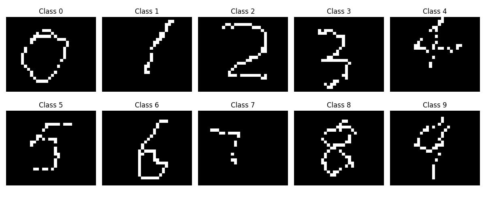

# Touch Digit Recognition Based on ESP-DL

This is a local touchpad handwriting recognition demo based on [ESP-DL](https://github.com/espressif/esp-dl). Based on a real touchpad, data from 0 to 9 was collected separately as the training set, as shown below:



You can click [here](https://dl.espressif.com/AE/esp-iot-solution/touch_dataset.zip) to download the dataset used in this example. The overall dataset distribution is as follows:


In this example, we will demonstrate how to implement the touch driver, train and deploy the model, and finally deploy it to the ESP32 platform.

## Processing Flow of Touch and AI

### Touch Processing Flow

When a finger moves on the Touchpad, it changes the capacitance value of the Touch channel. By detecting changes in capacitance, the finger's position can be determined. Additionally, through a software interpolation algorithm, the original 6x7 Touch data is expanded to 30x25 for model training. For more details on Touch, you can refer to [Touch Digit Recognition](https://docs.espressif.com/projects/esp-iot-solution/en/latest/ai/touch_digit_recognition.html).

### AI Processing Flow

#### Model Training

Based on the PyTorch framework, we build the following neural network model:

```python
class Net(torch.nn.Module):
    def __init__(self):
        super(Net, self).__init__()
        self.model = torch.nn.Sequential(
            torch.nn.Conv2d(in_channels=1, out_channels=16, kernel_size=3, stride=1, padding=1),
            torch.nn.ReLU(),
            torch.nn.MaxPool2d(kernel_size=2, stride=2),

            torch.nn.Conv2d(in_channels=16, out_channels=32, kernel_size=3, stride=1, padding=1),
            torch.nn.ReLU(),
            torch.nn.MaxPool2d(kernel_size=2, stride=2),

            torch.nn.Conv2d(in_channels=32, out_channels=64, kernel_size=3, stride=1, padding=1),
            torch.nn.ReLU(),

            torch.nn.Flatten(),
            torch.nn.Linear(in_features=7 * 6 * 64, out_features=256),
            torch.nn.ReLU(),
            torch.nn.Dropout(p=0.5),
            torch.nn.Linear(in_features=256, out_features=10),
            torch.nn.Softmax(dim=1)
        )

    def forward(self, x):
        output = self.model(x)
        return output

```

> **Note:** In the model design, the input size is 1x25x30, and there are 10 prediction classes corresponding to digits 0~9

Next, we load the local dataset and perform data augmentation:

```python
transform = transforms.Compose([
    transforms.Grayscale(num_output_channels=1),
    transforms.RandomAffine(degrees=10, translate=(0.1, 0.1)),
    transforms.ToTensor(),
    transforms.Normalize((0.5,), (0.5,)),
])

dataset = datasets.ImageFolder(root='./dataset/extra', transform=transform)

train_size = int(0.8 * len(dataset))
test_size = len(dataset) - train_size
train_dataset, test_dataset = random_split(dataset, [train_size, test_size])

train_loader = DataLoader(dataset=train_dataset, batch_size=32, shuffle=True)
test_loader = DataLoader(dataset=test_dataset, batch_size=32, shuffle=False)
```

After model training is completed, save the weight file as input for the ``ESP-PPQ`` model quantization and deployment tool.

#### Model Quantization and Deployment

After completing model and calibration dataset loading, use ``ESP-PPQ`` to quantize and export the model:

```python
BATCH_SIZE = 32
INPUT_SHAPE = [1, 25, 30]
TARGET = "esp32s3"
NUM_OF_BITS = 8
ESPDL_MODEL_PATH = "./s3/touch_recognition.espdl"

quant_ppq_graph = espdl_quantize_torch(
    model=model,
    espdl_export_file=ESPDL_MODEL_PATH,
    calib_dataloader=testDataLoader,
    calib_steps=8,
    input_shape=[1] + INPUT_SHAPE,
    inputs=[input_tensor],
    target=TARGET,
    num_of_bits=NUM_OF_BITS,
    device=DEVICE,
    error_report=True,
    skip_export=False,
    export_test_values=True,
    verbose=1,
    dispatching_override=None
)
```

Additionally, to ensure the model outputs the expected results, you need to preprocess the data following the inference process on the PC and parse the model's inference results. You can refer to the data preprocessing and post-processing steps in this example.

For more details about model training and deployment, please refer to [Touch Digit Recognition](https://docs.espressif.com/projects/esp-iot-solution/en/latest/ai/touch_digit_recognition.html)

## Example output

In this example, after drawing digits on the touch pad, we preprocess the data and input it to the model for inference:

```bash
I (206) esp_psram: Found 2MB PSRAM device
I (206) esp_psram: Speed: 40MHz
I (206) cpu_start: Multicore app
I (573) esp_psram: SPI SRAM memory test OK
I (582) cpu_start: Pro cpu start user code
I (582) cpu_start: cpu freq: 240000000 Hz
I (582) app_init: Application information:
I (582) app_init: Project name:     touchpad_digit_recognition
I (588) app_init: App version:      59da794c-dirty
I (592) app_init: Compile time:     Apr 21 2025 17:57:14
I (597) app_init: ELF file SHA256:  115a95820...
I (601) app_init: ESP-IDF:          v5.5-dev-3226-g186f2a8929d
I (607) efuse_init: Min chip rev:     v0.0
I (611) efuse_init: Max chip rev:     v0.99 
I (615) efuse_init: Chip rev:         v0.2
I (619) heap_init: Initializing. RAM available for dynamic allocation:
I (625) heap_init: At 3FC9FE18 len 000498F8 (294 KiB): RAM
I (630) heap_init: At 3FCE9710 len 00005724 (21 KiB): RAM
I (635) esp_psram: Adding pool of 2048K of PSRAM memory to heap allocator
I (643) spi_flash: detected chip: generic
I (645) spi_flash: flash io: dio
W (648) spi_flash: Detected size(4096k) larger than the size in the binary image header(2048k). Using the size in the binary image header.
W (662) legacy_touch_driver: legacy touch driver is deprecated, please migrate to use driver/touch_sens.h
W (670) i2c: This driver is an old driver, please migrate your application code to adapt `driver/i2c_master.h`
I (680) sleep_gpio: Configure to isolate all GPIO pins in sleep state
I (686) sleep_gpio: Enable automatic switching of GPIO sleep configuration
I (693) main_task: Started on CPU0
I (696) esp_psram: Reserving pool of 32K of internal memory for DMA/internal allocations
I (704) main_task: Calling app_main()
I (710) button: IoT Button Version: 4.0.0
 max:19678 min:8823
 max:20068 min:8889
 max:19611 min:8576
 max:19377 min:8658
 max:19762 min:8738
 max:20282 min:8958
 max:19330 min:8802
 max:20684 min:10258
 max:21640 min:10530
 max:21770 min:10941
 max:20917 min:10954
 max:22385 min:10681
 max:23258 min:11431
I (735) touch_lowlevel: Touch sensor lowlevel (v0.6.0) configured with 13 channels
I (744) touch_lowlevel: Touch sensor lowlevel started
I (749) FbsLoader: The storage free size is 29760 KB
I (754) FbsLoader: The partition size is 800 KB
I (759) dl::Model: model:main_graph, version:0

I (762) dl::Model: /model/model.0/Conv: Conv
I (768) dl::Model: /model/model.2/MaxPool: MaxPool
I (771) dl::Model: /model/model.3/Conv: Conv
I (776) dl::Model: /model/model.5/MaxPool: MaxPool
I (779) dl::Model: /model/model.6/Conv: Conv
I (786) dl::Model: PPQ_Operation_0: Transpose
I (787) dl::Model: /model/model.8/Flatten: Flatten
I (792) dl::Model: /model/model.9/Gemm: Gemm
I (994) dl::Model: /model/model.12/Gemm: Gemm
I (995) dl::Model: /model/model.13/Softmax: Softmax
I (998) MemoryManagerGreedy: Maximum memory size: 15632

I (1003) main_task: Returned from app_main()
                            *  *  *  *     *  *                                           
                                                 *  *  *  *                               
                                                          *                               
                                                          *                               
                                                             *                            
                                                             *                            
                                                             *                            
                                                             *                            
                                                                                          
                                                          *                               
                                                    *     *                               
                                              *                                           
                                                                                          
                                           *                                              
                                           *                                              
                               *     *                                                    
                               *                                                          
                            *                                                             
                *     *     *     *        *           *     *  *                         
             *  *              *              *  *        *  *  *                         
                                                                                          
                                                                                          
                                                                                          
                                                                                          
                                                                                          
I (6524) TouchDigitRecognition: Predict result: 2
```
