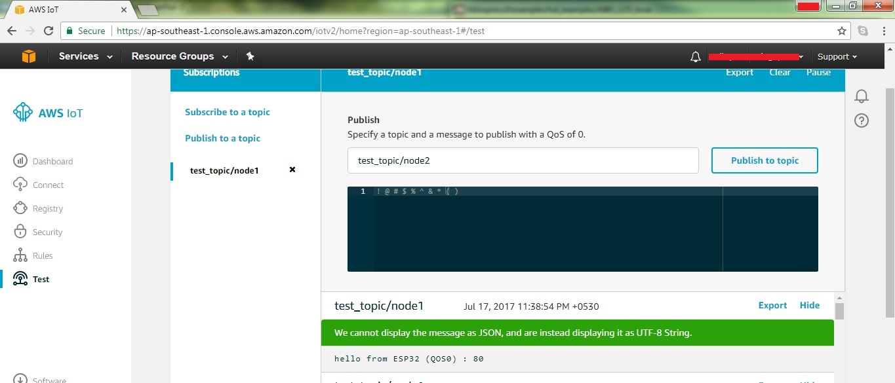
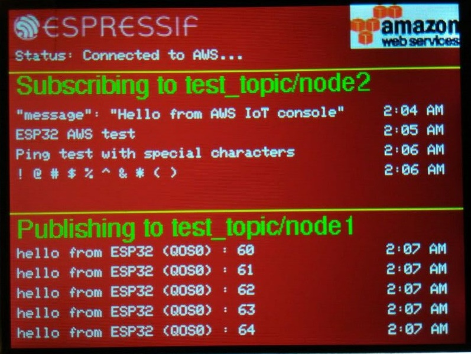

# ESP32 AWS IOT 发布/订阅 示例

这个示例是 ESP-IDF 中[AWS IoT C SDK](https://github.com/aws/aws-iot-device-sdk-embedded-C) 的 “subscribe_publish”示例的扩展，增加了 LCD 显示发布/订阅等相关状态信息。

# AWS IOT 配置

在运行工程前，我们需要正确配置 AWS IOT ：

- 正确配置 esp-iot-solution 和 示例工程，可参考：[Setting Up ESP-IOT-Solution](../../README.md)中 `Preparation` 部分
  - 拉取最新的 esp-iot-solution
  - 保证能够正确编译一个工程
- 正确配置 AWS 事物模块：事物、证书、策略
  - 我们可以根据[AWS IoT Developer Guide](https://docs.aws.amazon.com/zh_cn/iot/latest/developerguide/iot-console-signin.html)，从`登录 AWS IOT 控制台` 这一步，一直配置到 `配置您的设备`这步，之后再进行下面的配置
  - 安装私钥和证书

      添加 `*.pem.key` 和 `*.pem.crt` 文件到 `main/cert` 目录中，并重命名为 `private.pem.key` 和 `certificate.pem.crt`。
  - 设置 AWS 端点主机名

      您的 AWS IOT 帐户具有唯一终端主机名。要找到它，请打开 AWS IOT 控制台，然后单击左下方的“设置”按钮。端点主机名显示在此页面的“自定义端点”标题下。

      之后我们在电脑终端运行 `make menuconfig`(Make) 或者 `idf.py menuconfig`(CMake) 并进入 `component config` -> `Amazon Web Service IoT Config` -> `AWS IoT MQTT Hostname`，在这里我们输入上一步找到的主机名。
  - 设置客户端 ID

      在电脑终端中运行 `make menuconfig`(Make) 或者 `idf.py menuconfig`(CMake)，在 `Example Configuration` 下，设置 `AWS IOT Client ID` 的值
  - 本地验证证书是否配置正确

      运行 `openssl s_client -showcerts -connect hostname:8883 < /dev/null` 命令去验证证书是否正确
- 正确配置 ESP32 网络连接
  - 在电脑终端运行 `make menuconfig`(Make) 或者 `idf.py menuconfig`(CMake) 命令，在 `Example Configuration` 目录中配置 `WiFi SSID` 和 `WiFi Password`

# 监视来自设备的数据

下载完这个工程之后，程序会自动连接 AWS 并开始订阅/发布数据。

这个工程会发布数据到 `test_topic/node1` 主题，在 AWS 中提供了一个用于测试订阅/发布数据的接口：

* 在 AWS IOT 控制里，点击右上角的“MQTT Client”。
* 点击“Generate Client ID去生成一个随机 ID。
* 点击”Connect”

在连接成功后，我们可以订阅 ESP32 发布的数据：

* 点击"Subscribe to Topic"
* 在 "Subscription Topic" 中输入 `test_topic/node1`
* 点击 "Subscribe"

我们可以看到正在运行的示例中发布的 MQTT 数据。

发布数据返回到设备：

* 点击"Publish to Topic"
* 在"Publish Topic"中输入 `test_topic/node2`
* 在有效负载字段中输入消息
* 点击“Publish”

 

 

