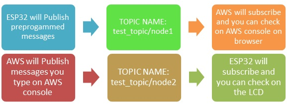
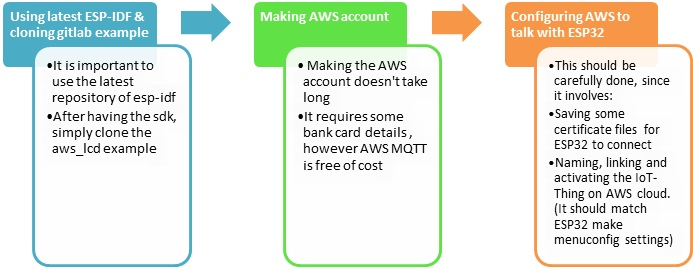

## Setting up AWS+LCD demo
 
## Workflow of Pub Sub

## Basic Steps to setup this example

## Explaining above steps in detail ##
 
**Step 1: Verifying if your esp-idf and example is setup perfectly**

1. Git pull to the latest esp-idf
2. Create a new example folder and git clone this repository:
3. After cloning and updating both these repos, try doing a simple make menuconfig to check if everything is in order.
4. If make menuconfig fails, check if repository is cloned properly and if you have setup esp-idf perfectly.

**Step 2: Linking the three AWS thing modules: Thing, Certificate & Policy** (Do it carefully)

- Follow the steps given in this [Readme_AWS_setup](Readme_AWS_setup.md)

**Step 3: Download the pem files, run make menuconfig**

- You can choose use 'make defconfig' to setup default configuration.
- Set up wifi SSID and KEY, after you run make menuconfig.
- Download the “.pem” files as mentioned in the steps. You don’t get any option of downloading them later if you miss the step. If you don't download it, ESP32 will not be able to authenticate the user with the cloud.
- Copy your keys to main/certs directory and name them as certs/aws-root-ca.pem certs/certificate.pem.crt certs/private.pem.key

> Be extra cautious in following the steps. Failure to do so will crash the ESP32, throwing out different errors. If you don’t setup correctly ESP32 will throw different errors on the console.  The most common errors are listed in the [Readme_AWS_setup](Readme_AWS_setup.md)

----------

