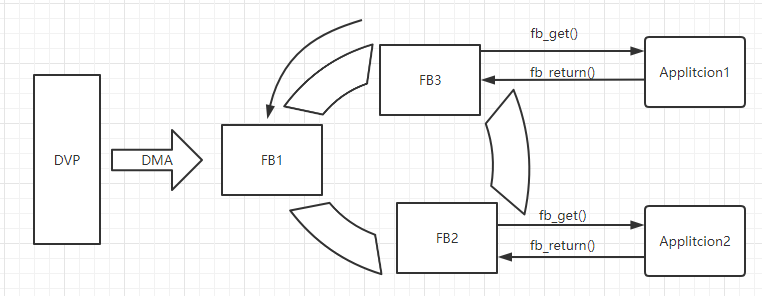

# Camera  Examples

This directory contains a range of example [esp32-camera](https://github.com/espressif/esp32-camera) projects.   
See the [README.md](../../README.md) file in the upper level directory for more information about examples.

## Camera driver workflow

The camera sensor transmits data to ESP32 device through DVP(parallel digital video port) interface. When initializing the camera, some `frame_buffer` will be allocated to store the data transmitted by the camera sensor. Once the camera is initialized, it starts working immediately, and the application can call `esp_camera_fb_get()` to get image data. After the application has applied the image data, the `frame_buffer` can be reused by calling `esp_camera_fb_return()`.

## Example Layout
* `basic` demonstrates basic usage of `ESP32-camera driver`.
* `pic_server` introduces how to control the action of taking pictures, and view the pictures immediately on the web page.
* `test_framerate` introduces how to evaluate the speed of the camera sensor and how to improve the speed of the camera sensor.
* `video_stream_server` demonstrates how to implement a video stream HTTP server on ESP32.

### More 
* [ESP-WHO](https://github.com/espressif/esp-who) is an image processing development platform based on Espressif chips. It contains development examples that may be applied in practical applications.
* [USB_camera_examples](https://github.com/espressif/esp-iot-solution/tree/usb/add_usb_solutions/examples/usb/host) Contains some examples of using USB cameras.

## API Reference

The APIs included in the [esp32-camera](https://github.com/espressif/esp32-camera) are described below.  
### Header File
- [esp32-camera/driver/include/esp_camera.h](https://github.com/espressif/esp32-camera/blob/master/driver/include/esp_camera.h)
#### Functions
- `esp_err_t esp_camera_init(const camera_config_t* config)`  
  Initialize the camera driver.

- `esp_err_t esp_camera_deinit()`  
  Deinitialize the camera driver.

- `camera_fb_t* esp_camera_fb_get()`  
  Obtain pointer to a frame buffer.

- `void esp_camera_fb_return(camera_fb_t * fb)`  
  Return the frame buffer to be reused again.

- `sensor_t * esp_camera_sensor_get()`  
  Get a pointer to the image sensor control structure.

- `esp_err_t esp_camera_save_to_nvs(const char *key)`  
  Save camera settings to non-volatile-storage (NVS).

- `esp_err_t esp_camera_load_from_nvs(const char *key)`  
  Load camera settings from non-volatile-storage (NVS).
### Header File
- [esp32-camera/driver/include/sensor.h](https://github.com/espressif/esp32-camera/blob/master/driver/include/sensor.h)
#### Functions
- `camera_sensor_info_t *esp_camera_sensor_get_info(sensor_id_t *id)`  
  Get the camera sensor information.
### Header File
- [esp32-camera/conversions/include/img_converters.h](https://github.com/espressif/esp32-camera/blob/master/conversions/include/img_converters.h)
#### Functions
- `bool fmt2jpg_cb(uint8_t *src, size_t src_len, uint16_t width, uint16_t height, pixformat_t format, uint8_t quality, jpg_out_cb cb, void * arg)`  
  Convert image buffer to JPEG.

- `bool frame2jpg_cb(camera_fb_t * fb, uint8_t quality, jpg_out_cb cb, void * arg)`  
  Convert camera frame buffer to JPEG.

- `bool fmt2jpg(uint8_t *src, size_t src_len, uint16_t width, uint16_t height, pixformat_t format, uint8_t quality, uint8_t ** out, size_t * out_len)`  
  Convert image buffer to JPEG buffer.

- `bool fmt2bmp(uint8_t *src, size_t src_len, uint16_t width, uint16_t height, pixformat_t format, uint8_t ** out, size_t * out_len)`  
  Convert image buffer to BMP buffer.

- `bool frame2bmp(camera_fb_t * fb, uint8_t ** out, size_t * out_len)`  
  Convert camera frame buffer to BMP buffer.

- `bool frame2bmp(camera_fb_t * fb, uint8_t ** out, size_t * out_len)`  
  Convert camera frame buffer to BMP buffer.

- `bool fmt2rgb888(const uint8_t *src_buf, size_t src_len, pixformat_t format, uint8_t * rgb_buf)`  
  Convert image buffer to RGB888 buffer.
  
- `bool jpg2rgb565(const uint8_t *src, size_t src_len, uint8_t * out, jpg_scale_t scale)`  
Convert image buffer to RGB565 buffer.

### Header File
- [esp32-camera/conversions/include/esp_jpg_decode.h](https://github.com/espressif/esp32-camera/blob/master/conversions/include/esp_jpg_decode.h)
#### Functions
- `esp_err_t esp_jpg_decode(size_t len, jpg_scale_t scale, jpg_reader_cb reader, jpg_writer_cb writer, void * arg)`  
JPEG scaling function.
