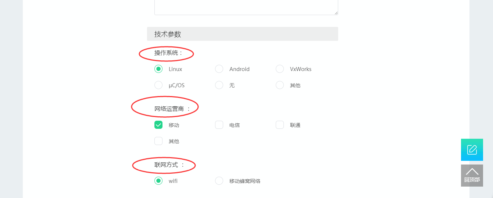
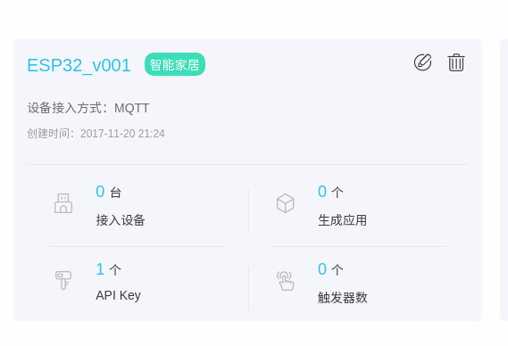
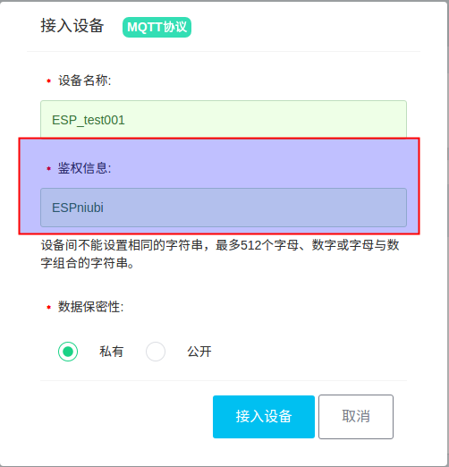
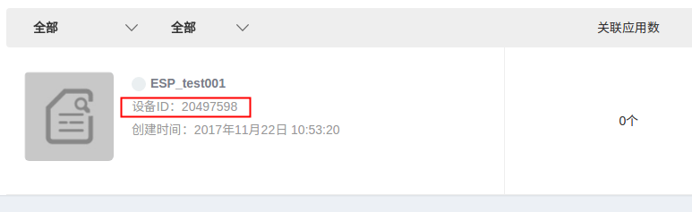
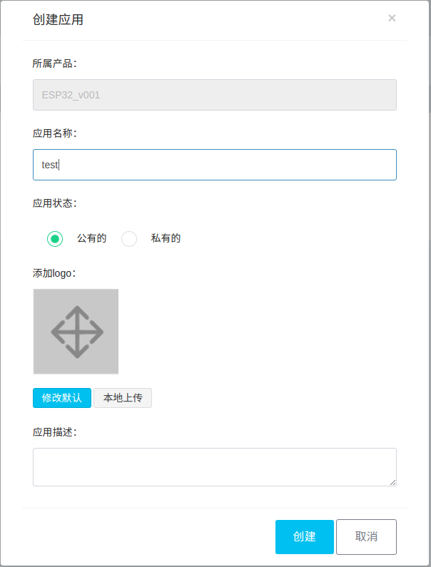
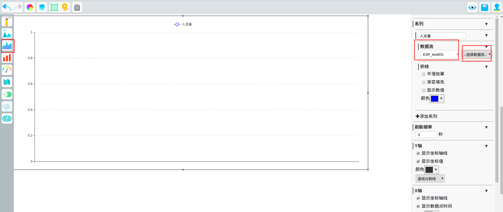
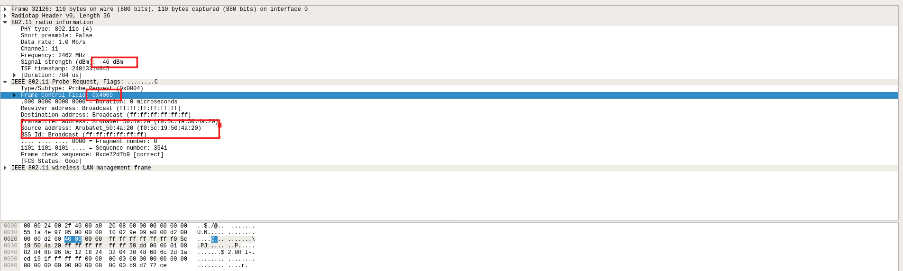

# ESP32 基于 Wi-Fi sniffer 的人流量检测及 OneNET 数据云端统计
 

## 前言

[ESP32](http://espressif.com/zh-hans/products/hardware/esp32/overview)是一颗低功耗、高集成度、性能稳定的 Wi-Fi /BLE芯片，是物联网开发的首选设备。它采用2.4 GHz Wi-Fi 加蓝牙双模芯片，采用 TSMC 低功耗 40nm 技术，功耗性能和射频性能最佳，安全可靠，易于扩展至各种应用。同时集成了双核 160 MHz MCU、两个浮点运算单元 (FPU)、硬件安全加速器、电容触摸传感器、霍尔传感器、ADC、DAC、蓝牙/Wi-Fi 协议栈、TR 滤波器、双工器、功率放大器、接收低噪声放大器、射频 balun 和天线开关。ESP32 的外围器件不超过 10 个，即可实现强大的处理性能、可靠的安全性能，以及 Wi-Fi 和蓝牙功能。可作为独立系统运行应用程序或是主机 MCU 的从设备，通过 SPI / SDIO 或 I2C / UART 接口提供 Wi-Fi 和蓝牙功能。专为移动设备、可穿戴电子产品和物联网应用而设计。该款芯片拥有业内最高水平的低功耗芯片的所有特征，比如精细分辨时钟门控、省电模式和动态电压调整等。集成了更多的元器件，性能稳定，易于制造，工作温度范围达到 -40°C 到 +125°C。ESP32 还集成了先进的自校准电路，实现了动态自动调整，可以消除外部电路的缺陷以及适应外部条件的变化。总之，是一款极其优秀的物联网芯片。

[OneNET中国移动物联网开放平台](https://open.iot.10086.cn/)是中移物联网有限公司基于物联网技术和产业特点打造的开放平台和生态环境，适配各种网络环境和协议类型，支持各类传感器和智能硬件的快速接入和大数据服务，提供丰富的 API 和应用模板以支持各类行业应用和智能硬件的开发，能够有效降低物联网应用开发和部署成本，满足物联网领域设备连接、协议适配、数据存储、数据安全、大数据分析等平台级服务需求。

MQTT（Message Queuing Telemetry Transport，消息队列遥测传输）是IBM开发的一个即时通讯协议，有可能成为物联网的重要组成部分。该协议支持所有平台，几乎可以把所有联网物品和外部连接起来，被用来当做传感器和致动器（比如通过 Twitter 让房屋联网）的通信协议。详细工作过程和原理见:[http://blog.csdn.net/espressif/article/details/78541435](http://blog.csdn.net/espressif/article/details/78541435)

[人流量](https://baike.baidu.com/item/%E4%BA%BA%E6%B5%81%E9%87%8F/9889877?fr=aladdin)监控在安保，商场，旅游等诸多行业具有重要作用，人流量数据不仅具有科学研究价值,还具有很强的实用价值。因此选择一种便捷，经济的监控手段很有必要。

## 一: 目的
我们利用 ESP32  Wi-Fi 的混杂接收模式，接受全部可以获得空中包，然后对其解析，筛选得到周围无线设备发送的 Probe Request 帧，通过对 Probe Request 帧的来源和强度进行分析和汇总，从而计算出周围一定区域内的设备设备使用量（人流量）。  
在得到基本的人流量数据后，ESP32 通过 MQTT 协议将数据发送至 OneNET 物联网平台，在OneNET平台上，得到最终的人流量变化曲线图，同时我们也可以在云端方便的进行数据处理和监控。

##  二: ESP32 及开发环境搭建
**如果您熟悉ESP32开发环境，可以很顺利理解下面步骤; 如果您不熟悉某个部分，比如编译，烧录等，需要您结合官方的[相关文档](http://espressif.com/zh-hans/support/download/overview)来理解。**

**如您需阅读[ESP32 快速入门指南](http://esp-idf.readthedocs.io/en/latest/get-started/index.html)文档。**

### 2.1 ESP32 硬件准备

a) 没错，你需要一颗 ESP32 系列产品，[ESP32-DevKitC 开发板](http://esp-idf.readthedocs.io/en/latest/hw-reference/modules-and-boards.html#esp32-core-board-v2-esp32-devkitc) 或 [ESP-WROVER-KIT 开发板](http://esp-idf.readthedocs.io/en/latest/hw-reference/modules-and-boards.html#esp-wrover-kit) 皆可。

b) 路由器/ AP[可以连接外网]

c) PC[推荐 ubuntu ], 如果不是 Linux，可能需要您参考上面快速入门指南搭建虚拟机和编译器环境

d) 串口线


### 2.2 OneNet 平台准备

#### 2.2.1 [OneNet](https://open.iot.10086.cn/) 账号注册

- 注意联通手机号可能获取不到动态验证码，可能是该平台暂不支持

#### 2.2.2 登录账号，创建产品

在登录后的页面，右上角的**开发者中心**,创建自己的物联网产品。



- 产品信息 // 随便填，不影响使用 
- 下面的技术参数最好按照下面方式填写
- 操作系统选择“其他”，填写 freertos
- 网络运营商选择“移动”
- 设备接入方式选择“公开协议”
- 联网方式选择“ wifi ”
- 模组选择"其他"
- 设备接入协议选择“ MQTT ”  // 很重要

点击“确定”按钮，完成产品创建。   



同时将产生一个 **产品ID**, 注意这个会在后面的程序交互中用到。


#### 2.2.3 产品下面创建设备

点击产品进入，点击添加设备



注意**鉴权信息**会在后面的程序交互中用到。

注意创建完设备后，您将得到一个**设备 ID**,这将在以后的程序交互中用到。



#### 2.2.4 为设备创建应用

设备的应用可以更好的对设备上传的数据进行统计和展示，点击创建应用，选择独立应用，选择产品及名称，点击创建。  



#### 2.2.5 进入创建的应用
因为我们需要展示人流量的变化数据，因此在这里选择“折线图”，然后对坐标轴进行设置，得到一个大体的应用框架。

数据流中，目前只能选择到设备，在这时还不能对数据流进行选择，因为我们还没有开始进行数据上报，等到设备端连上 OneNet 并上报数据后，这里我们就可以选择数据流啦。



至此，平台端工作完毕。

### 2.3 设备端环境搭建

#### 2.3.1 ESP-IDF SDK 获取
此 SDK 可以保证 ESP32 正常启动，良好工作。

```
$ git clone https://github.com/espressif/esp-idf.git
$ cd esp-idf
$ git submodule update --init
```

#### 2.3.2 ESP-IDF 编译器获取

根据官方的说明，不同的平台下载对应的编译器。

编译器下载: [https://esp-idf.readthedocs.io/en/latest/get-started/index.html](https://esp-idf.readthedocs.io/en/latest/get-started/index.html)

#### 2.3.3 ESP-IDF 和 OneNet 对接 demo 获取

```
$ git clone --recuesive https://github.com/espressif/esp-iot-solution.git
$ git submodule update --init
```

#### 2.3.4 Demo 参数修改

 在程序中的 `main/include/onenet.h` 中将刚刚在平台上创建得到的“**设备 ID**”，“**产品 ID**”，“**鉴权信息**” 进行填充：  

```
        #define ONENET_DEVICE_ID    "*****"         // mqtt client id
        #define ONENET_PROJECT_ID   "*****"         // mqtt username
        #define ONENET_AUTH_INFO    "*****"         // mqtt password
```

自定义数据流名称: // 此名称将会出现在 2.2.5 节中 选择数据流的字段中

```
#define ONENET_DATA_STREAM  "******"
```

#### 2.3.5 导出 ESP-IDF 和 编译器路径

根据自己的目录结构导出 esp-idf 和 xtensa 编译器，这样才能编译整个 demo, 如:

```
$ cd ESP32_Check_Pedestrian-flow
$ export IDF_PATH=~/esp/esp-idf
$ export PATH=/opt/xtensa-esp32-elf/bin/:$PATH
```

#### 2.3.6 make menuconfig 配置

- Serial flasher config - Default serial port // 配置烧写串口
-  Demo Configuration - WiFi SSID // 配置连接 路由器/AP 的SSID
- Demo Configuration - WiFi Password // 配置 路由器AP 的密码

#### 2.3.7 编译 && 运行

编译成功后，会自动烧写程序，同时自动运行程序。

```
$ make flash monitor

```

##  三: 结果展示

#### 3.1 设备端成功log如下:

```
... // 一些启动信息

I (136) wifi: wifi firmware version: 59e5fab
I (136) wifi: config NVS flash: enabled
I (136) wifi: config nano formating: disabled
I (136) system_api: Base MAC address is not set, read default base MAC address from BLK0 of EFUSE
I (146) system_api: Base MAC address is not set, read default base MAC address from BLK0 of EFUSE
I (186) wifi: Init dynamic tx buffer num: 32
I (186) wifi: Init data frame dynamic rx buffer num: 32
I (186) wifi: Init management frame dynamic rx buffer num: 32
I (186) wifi: wifi driver task: 3ffbfa0c, prio:23, stack:4096
I (196) wifi: Init static rx buffer num: 10
I (196) wifi: Init dynamic rx buffer num: 32
I (196) wifi: wifi power manager task: 0x3ffc5d8c prio: 21 stack: 2560
W (206) phy_init: failed to load RF calibration data (0x1102), falling back to full calibration
I (536) phy: phy_version: 366.0, ba9923d, Oct 31 2017, 18:06:17, 0, 2
I (546) wifi: mode : sta (24:0a:c4:04:5a:fc)
I (546) SNIFFER: Connecting to AP...
I (2236) wifi: n:12 0, o:1 0, ap:255 255, sta:12 0, prof:1
I (2246) wifi: state: init -> auth (b0)
I (2246) wifi: state: auth -> assoc (0)
I (2246) wifi: state: assoc -> run (10)
I (2256) wifi: connected with BL_841R, channel 12
I (5086) event: sta ip: 192.168.111.111, mask: 255.255.255.0, gw: 192.168.111.1
I (5086) SNIFFER: Connected.
I (5086) wifi: ic_enable_sniffer
[MQTT INFO] Connecting to server 183.230.40.39:6002,29207
[MQTT INFO] Connected!
[MQTT INFO] Connected to server 183.230.40.39:6002
[MQTT INFO] Sending MQTT CONNECT message, type: 1, id: 0000
[MQTT INFO] Reading MQTT CONNECT response message
I (5256) wifi: pm start, type:0

[MQTT INFO] Connected
[MQTT INFO] Connected to MQTT broker, create sending thread before call connected callback
[MQTT INFO] mqtt_sending_task
[MQTT INFO] Queuing publish, length: 31, queue size(31/4096)

[MQTT INFO] Sending...31 bytes
[MQTT INFO] mqtt_start_receive_schedule

Current device num = 1
MAC: 0x38.0x22.0xD6.0xD1.0x8C.0xF0, The time is: 6620, The rssi = -92

Current device num = 2
MAC: 0x38.0x22.0xD6.0xD0.0xCA.0xA0, The time is: 7970, The rssi = -59

Current device num = 3
MAC: 0x44.0x33.0x4C.0x59.0x42.0x69, The time is: 14040, The rssi = -24

Current device num = 4
MAC: 0x94.0x65.0x9C.0x88.0x2A.0x1B, The time is: 15300, The rssi = -91

Current device num = 5
MAC: 0xC6.0x81.0xAA.0xB8.0x0E.0x07, The time is: 20240, The rssi = -70

Current device num = 6
MAC: 0x44.0x33.0x4C.0x6A.0xB6.0x7F, The time is: 32490, The rssi = -56

Current device num = 7
MAC: 0x3E.0x97.0x88.0x49.0x37.0xD7, The time is: 36010, The rssi = -63
... // 继续人流量检测
```

#### 3.2 OneNet 平台结果展示

参考 2.2.5 节，打开 OneNET 控制台，可以看到设备已经在线，点击设备对应的应用，选择数据流“ Pedestrian-flow ”，则可以看到应用中数据流的变化曲线图，如下:

**注意: 程序默认是十分钟上报一次数据，OneNet 平台要想看到曲线，需等待 10 分钟**


##  四: Demo 中一些分析和说明

### 4.1 Probe Request 包分析  

Probe Request 包属于 802.11 标准，其基本的帧结构如下：   

 

通过 wireshark 抓包获得 Probe Request 包如下：  



可以从包中看到该帧的 “Subtype : 4”, 还有信号强度和 MAC 地址等信息。

### 4.2 demo中部分逻辑说明

a)  Probe request 判定

在程序中首先对抓到的包包头进行判定，当包头为 Probe Request 包时进行下一步判定，否则直接丢弃。  

```
if (sniffer_payload->header[0] != 0x40) {
    return;
}
``` 

b) MAC地址选择过滤

得到真正的 Probe Request 包后，首先对来源设备的 MAC 地址进行分析，过滤掉一些不需要计算的设备(固定无线装置等),在程序中我们过滤掉其他 ESP32 芯片的 MAC 地址。  


```
for (int i = 0; i < 32; ++i) {
     if (!memcmp(sniffer_payload->source_mac, esp_module_mac[i], 3)) {
         return;
     }
}
```    
  
c) 重复设备过滤  

在抓到的包中，有相当一部分是来自于同一设备的 Probe Request 包，因此需要剔除。  

```
for (station_info = g_station_list->next; station_info; station_info = station_info->next) {
    if (!memcmp(station_info->bssid, sniffer_payload->source_mac, sizeof(station_info->bssid))) {
            return;
     }
}  
```        

d) 链表说明

我们创建一个存储每一个设备信息的链表，在获得一个有效设备信息后，将该设备信息加入设备链表中。  

```
if (!station_info) {
   station_info = malloc(sizeof(station_info_t));
   station_info->next = g_station_list->next;
   g_station_list->next = station_info;
}
```

e) MQTT 说明

ESP32 可以很好的移植并很好的支持 MQTT 协议，设备端通过 pubish 即可将数据发送到云端。  

```
val =  s_device_info_num / 10;
char buf[128];
memset(buf, 0, sizeof(buf));
sprintf(&buf[3], "{\"%s\":%d}", ONENET_DATA_STREAM, val);
uint16_t len = strlen(&buf[3]);
buf[0] = data_type_simple_json_without_time;
buf[1] = len >> 8;
buf[2] = len & 0xFF;
mqtt_publish(client, "$dp", buf, len + 3, 0, 0);
```

### 4.3 人流量计算

首先需要确定计算人流量的区域范围，我们利用获得的设备信号强度进行划分，从而根据选择不同的信号强度来确定需要监控人流量的区域范围。  

但是 RSSI 并不是协议中的字段，802.11 协议中没有给出具体产生 RSSI 的过程或者说是算法吧。协议中说 RSSI 值范围0~255，RSSI值随 PHY Preamble 部分的能量单调递增。即在接收端网卡测量到RSSI的值以后，我们可以从这个程序接口获得 RSSI 的值。因此在不同的实地环境下，要根据实际测定来确定不同接受距离对应的实际 RSSI 值。

由于无线设备的普及，几乎人手都会持有一具有特定 MAC 地址的无线设备，而无线设备又会发送 Probe Request 包，因此只要得到空中的 Probe Request 包就可以计算出该区域的流动人数。   

人流量是指在一定区域内单位时间的人流总数，因此我们以 10 分钟为侦测区间，通过对在 10 分钟内的所有人数进行计算来获得人流量。
在 10 分钟后将链表清空，开始下一阶段的监控。整个统计流程如下：  

 

## 五. 总结

通过 ESP32 进行抓包，可以在保证抓包质量的同时，也可以承担很多其他的功能角色，来最大程度的利用 ESP32。如 ESP32 可以通过 MQTT 协议进行订阅相关 topic， 进而通过云端来控制 ESP32。

改进: 不同区域内的人流量大小会影响到 ESP32 接收到的信号强度发生变化，因此当使用信号强度来判定选择区域范围时会存在误差，此点需要改进。