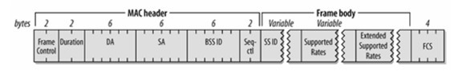

# ESP32 基于 Wi-Fi Sniffer 的人流量检测及 OneNET 数据云端统计

[ESP32](http://espressif.com/zh-hans/products/hardware/esp32/overview) 是一颗低功耗、高集成度、性能稳定的 Wi-Fi/BLE 芯片，是物联网开发的首选设备。人流量监控在安保，商场，旅游等诸多行业具有重要作用。我们利用 ESP32 Wi-Fi 的混杂接收模式，接受全部可以获得的空中包，然后对其解析，筛选得到周围无线设备发送的 Probe Request 帧，通过对 Probe Request 帧的来源和强度进行分析和汇总，从而计算出周围一定区域内的设备设备使用量（人流量）。  

在得到基本的人流量数据后，ESP32 设备通过 MQTT 将数据发送至 OneNET 物联网平台，得到最终的人流量变化曲线图，可以方便用户从云端进行数据处理和监控。

## 1. 开发环境搭建

关于 ESP32 开发，比如编译，烧录等，请参考[乐鑫官方文档](http://espressif.com/zh-hans/support/download/overview)和 [ESP32 快速入门指南](https://docs.espressif.com/projects/esp-idf/en/stable/get-started/index.html)。

### 1.1 ESP32 硬件准备

- [ESP32-DevKitC 开发板](https://docs.espressif.com/projects/esp-idf/en/stable/hw-reference/modules-and-boards.html#esp32-core-board-v2-esp32-devkitc)或 [ESP-WROVER-KIT 开发板](https://docs.espressif.com/projects/esp-idf/en/stable/hw-reference/modules-and-boards.html#esp-wrover-kit) 皆可。

- 路由器/AP（可以连接外网）

- PC，如果不是 Linux 系统，可参考 [ESP32 快速入门指南](https://docs.espressif.com/projects/esp-idf/en/stable/get-started/index.html)搭建虚拟机和编译器环境。

- USB 线


### 1.2 OneNet 平台准备

#### 1.2.1 在 [OneNet](https://open.iot.10086.cn/) 平台上注册账号。

#### 1.2.2 登录账号，创建产品。

在登录后的页面，点击右上角的 `开发者中心` ，选择` 全部产品 -> 多协议接入` 。


然后选择 `添加产品` 后填入一些产品信息，如下示例：


设备接入协议应选择 “MQTT（旧版）”，完成后点击 `确定` 按钮，完成产品创建，同时将产生一个**产品 ID**, 在后面的程序中将用到。


#### 1.2.3 产品下面创建设备

从左侧菜单进入 `设备列表` ，然后点击 `添加设备` ，填入设备信息。


创建完设备后，将生成设备 ID


这里的 **设备 ID** 和上面填入的 **鉴权信息** 一起会在后面的程序中用到。

#### 1.2.4 为设备创建应用

到这里就已经足够让设备连上 OneNET， 接下来是为了更好的数据展示效果，设备的应用可以对设备上传的数据进行统计和展示。同样从左侧菜单进入 `应用管理` 然后点击 ”添加应用“


添加完后，可以在 `应用管理` 页面看到已创建的应用。

#### 1.2.5 进入创建的应用

点击应用的图标，进入应用，然后点击 `编辑应用` 。


因为我们需要展示人流量的变化数据，因此在这里选择“折线图”，选择好数据流，然后在 `样式` 中对坐标轴进行设置，得到一个大体的应用框架。

至此，平台端工作完毕。

### 1.3 设备端环境搭建

#### 1.3.1 获取 Demo 代码

相关的代码被存放在了 esp-iot-solution 仓库中，运行下面的命令克隆到本地

```shell
git clone --recursive https://github.com/espressif/esp-iot-solution.git
git submodule update --init
```

我们需要的示例代码在 `esp-iot-solution/examples/check_pedestrian_flow` 位置

#### 1.3.2 设置环境变量

执行下面命令设置环境变量：

```shell
export IDF_PATH=~/esp/esp-idf
. ~/esp/esp-idf/export.sh
```

注意命令中需要换成自己的 esp-idf 路径，另外本次实验中使用的 esp-idf 是 v4.0.1 版本。 

#### 1.3.3 make menuconfig 配置

执行

```shell
cd examples/check_pedestrian_flow
make menuconfig
```

打开配置菜单，在 `Demo Configuration > WiFi Configuration` 中配置路由器的信息，在 `Demo Configuration > OneNET Configuration` 中配置 OneNET 相关参数：

- ONENET_DEVICE_ID： 设备ID
- ONENET_PROJECT_ID ： 产品ID
- ONENET_AUTH_INFO ： 鉴权信息
- ONENET_DATA_STREAM ： 数据流名称，可自定义

#### 1.3.4 编译 && 运行

执行

```shell
make flash monitor
```

编译成功后，会自动烧写并运行程序。

## 2. 结果展示

#### 2.1 设备端成功 log 如下:

```
... // 一些启动信息
I (136) wifi: wifi firmware version: 59e5fab
I (136) wifi: config NVS flash: enabled
I (136) wifi: config nano formating: disabled
I (136) system_api: Base MAC address is not set, read default base MAC address from BLK0 of EFUSE
I (146) system_api: Base MAC address is not set, read default base MAC address from BLK0 of EFUSE
I (186) wifi: Init dynamic tx buffer num: 32
I (186) wifi: Init data frame dynamic rx buffer num: 32
I (186) wifi: Init management frame dynamic rx buffer num: 32
I (186) wifi: wifi driver task: 3ffbfa0c, prio:23, stack:4096
I (196) wifi: Init static rx buffer num: 10
I (196) wifi: Init dynamic rx buffer num: 32
I (196) wifi: wifi power manager task: 0x3ffc5d8c prio: 21 stack: 2560
W (206) phy_init: failed to load RF calibration data (0x1102), falling back to full calibration
I (536) phy: phy_version: 366.0, ba9923d, Oct 31 2017, 18:06:17, 0, 2
I (546) wifi: mode : sta (24:0a:c4:04:5a:fc)
I (546) SNIFFER: Connecting to AP...
I (2236) wifi: n:12 0, o:1 0, ap:255 255, sta:12 0, prof:1
I (2246) wifi: state: init -> auth (b0)
I (2246) wifi: state: auth -> assoc (0)
I (2246) wifi: state: assoc -> run (10)
I (2256) wifi: connected with BL_841R, channel 12
I (5086) event: sta ip: 192.168.111.111, mask: 255.255.255.0, gw: 192.168.111.1
I (5086) SNIFFER: Connected.
I (5086) wifi: ic_enable_sniffer
[MQTT INFO] Connecting to server 183.230.40.39:6002,29207
[MQTT INFO] Connected!
[MQTT INFO] Connected to server 183.230.40.39:6002
[MQTT INFO] Sending MQTT CONNECT message, type: 1, id: 0000
[MQTT INFO] Reading MQTT CONNECT response message
I (5256) wifi: pm start, type:0

[MQTT INFO] Connected
[MQTT INFO] Connected to MQTT broker, create sending thread before call connected callback
[MQTT INFO] mqtt_sending_task
[MQTT INFO] Queuing publish, length: 31, queue size(31/4096)

[MQTT INFO] Sending...31 bytes
[MQTT INFO] mqtt_start_receive_schedule

Current device num = 1
MAC: 0x38.0x22.0xD6.0xD1.0x8C.0xF0, The time is: 6620, The rssi = -92

Current device num = 2
MAC: 0x38.0x22.0xD6.0xD0.0xCA.0xA0, The time is: 7970, The rssi = -59

Current device num = 3
MAC: 0x44.0x33.0x4C.0x59.0x42.0x69, The time is: 14040, The rssi = -24

Current device num = 4
MAC: 0x94.0x65.0x9C.0x88.0x2A.0x1B, The time is: 15300, The rssi = -91

Current device num = 5
MAC: 0xC6.0x81.0xAA.0xB8.0x0E.0x07, The time is: 20240, The rssi = -70

Current device num = 6
MAC: 0x44.0x33.0x4C.0x6A.0xB6.0x7F, The time is: 32490, The rssi = -56

Current device num = 7
MAC: 0x3E.0x97.0x88.0x49.0x37.0xD7, The time is: 36010, The rssi = -63
... // 继续人流量检测
```

#### 2.2 OneNet 平台结果展示

打开 OneNET 控制台，可以看到设备已经在线，点击设备对应的应用，选择数据流 “Pedestrian-flow”，则可以看到应用中数据流的变化曲线图，如下:

**注意: 程序默认是 10 分钟上报一次数据，OneNet 平台要想看到曲线，需等待 10 分钟。**


## 3. Demo 中一些分析和说明

### 3.1 Probe Request 包分析 

Probe Request 包属于 802.11 标准，其基本帧结构如下：   

 

通过 wireshark 抓包获得 Probe Request 包如下：  


可以从包中看到该帧的类型 “Subtype : 4”, 信号强度和 MAC 地址等信息。

### 3.2 Demo 中部分逻辑说明

- Probe Request 包判定

 在程序中首先对抓到的包报头进行判定，当报头为 Probe Request 包时进行下一步过滤，否则直接丢弃。  

    ```
    if (sniffer_payload->header[0] != 0x40) {
        return;
    }
    ``` 

- MAC 地址选择过滤

 得到真正的 Probe Request 包后，首先对来源设备的 MAC 地址进行分析，过滤掉一些不需要计算的设备（固定无线装置等），在程序中我们过滤掉其他 ESP32 芯片的 MAC 地址。  

    ```
    for (int i = 0; i < 32; ++i) {
         if (!memcmp(sniffer_payload->source_mac, esp_module_mac[i], 3)) {
             return;
         }
    }
    ```    

- 重复设备过滤  

 在抓到的包中，有相当一部分是来自于同一设备的 Probe Request 包，因此需要剔除。  

    ```
    for (station_info = g_station_list->next; station_info; station_info = station_info->next) {
        if (!memcmp(station_info->bssid, sniffer_payload->source_mac, sizeof(station_info->bssid))) {
                return;
         }
    }  
    ```        

- 链表说明

 我们创建一个存储每一个设备信息的链表，在获得一个有效设备信息后，将该设备信息加入设备链表中。  

    ```
    if (!station_info) {
       station_info = malloc(sizeof(station_info_t));
       station_info->next = g_station_list->next;
       g_station_list->next = station_info;
    }
    ```

- MQTT 说明

 ESP32 可以很好的移植并很好的支持 MQTT 协议，设备端通过 publish 即可将数据发送到云端。  

    ```
    val =  s_device_info_num / 10;
    char buf[128];
    memset(buf, 0, sizeof(buf));
    sprintf(&buf[3], "{\"%s\":%d}", ONENET_DATA_STREAM, val);
    uint16_t len = strlen(&buf[3]);
    buf[0] = data_type_simple_json_without_time;
    buf[1] = len >> 8;
    buf[2] = len & 0xFF;
    mqtt_publish(client, "$dp", buf, len + 3, 0, 0);
    ```

### 3.3 人流量计算

首先需要确定计算人流量的区域范围，我们利用获得的设备信号强度进行划分，从而根据选择不同的信号强度来确定需要监控人流量的区域范围。  

但是 RSSI 并不是 802.11 协议中的字段，802.11 协议中没有给出具体产生 RSSI 的过程或者说是算法吧。协议中说 RSSI 值范围 0~255，RSSI 值随 PHY Preamble 部分的能量单调递增。因此在不同的实地环境下，要根据实际测定来确定不同接受距离对应的实际 RSSI 值。

由于无线设备的普及，几乎人手一部具有特定 MAC 地址的无线设备，而无线设备又会发送 Probe Request 包，因此只要得到空中的 Probe Request 包就可以计算出该区域的流动人数。   

人流量是指在一定区域内单位时间的人流总数，因此我们以 10 分钟为侦测区间，通过对在 10 分钟内的所有人数进行计算来获得人流量。
在 10 分钟后将链表清空，开始下一阶段的监控。整个统计流程如下：  

 

## 4. 总结

通过 ESP32 进行抓包，可以在保证抓包质量的同时，也可以承担很多其他的功能角色，来最大程度的利用 ESP32。如 ESP32 可以通过 MQTT 协议进行订阅相关 topic，进而通过云端来控制 ESP32。

> 注意：ESP32 在不同环境下接收到的 Probe Request 信号强度不同，因此当使用信号强度来判定测量人流量的区域范围时会存在误差。

