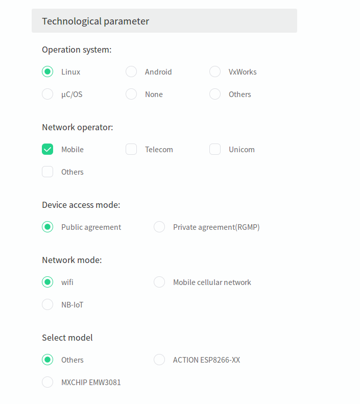
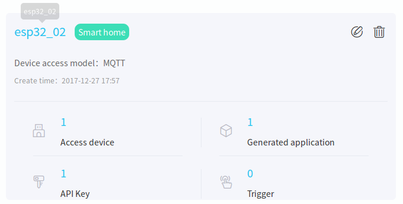
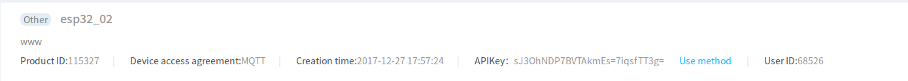
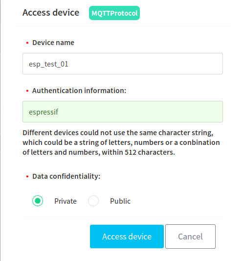
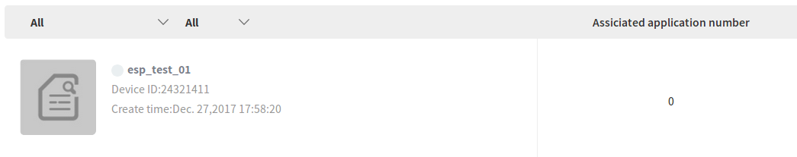
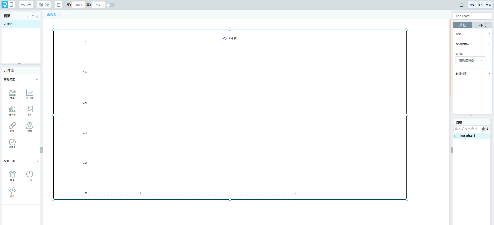
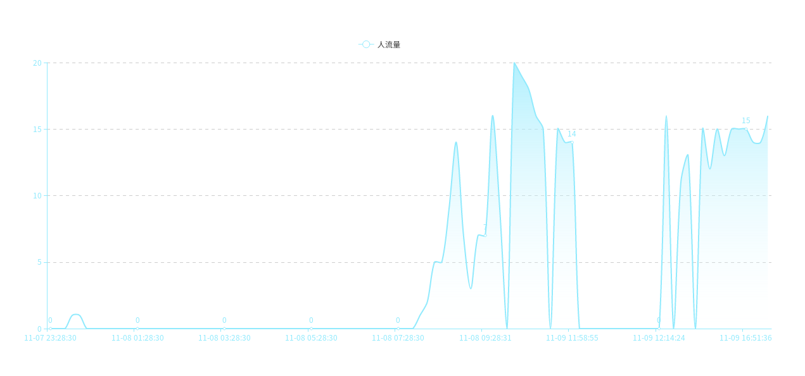
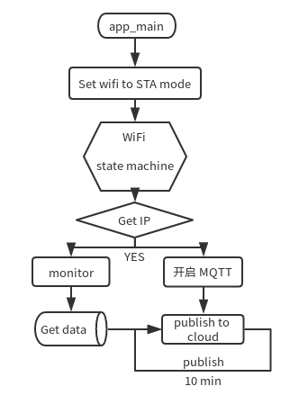

# Pedestrian Flow Monitoring on OneNET Platform Using ESP32 Wi-Fi Sniffer Mode

Pedestrian flow monitoring plays an important role in security, shopping malls, tourism and many other industries.

[ESP32](http://espressif.com/zh-hans/products/hardware/esp32/overview), working in the Wi-Fi sniffer mode, can be used to calculate pedestrian flow. It can accept all packets over the air, and then parse the packets to capture the Probe Request frames sent by the surrounding wireless devices. Pedestrian flow can then be calculated based on analyzing the source and signal strength of the Probe Request frames. 

After getting the basic pedestrian flow data, ESP32 sends the data to the OneNET IoT platform based on the MQTT protocol to generate a line chart of the pedestrian flow. Users can then access the data from the cloud.

## 1. Environment Setup
**For details on compilation and programming of ESP32, please refer to Espressif's [official documents](http://espressif.com/zh-hans/support/download/overview) and [ESP-IDF Getting Started Guide](https://docs.espressif.com/projects/esp-idf/en/stable/get-started/index.html).**

### 1.1 Hardware Preparation

- [ESP32-DevKitC](https://docs.espressif.com/projects/esp-idf/en/stable/hw-reference/modules-and-boards.html#esp32-core-board-v2-esp32-devkitc) or [ESP-WROVER-KIT](https://docs.espressif.com/projects/esp-idf/en/stable/hw-reference/modules-and-boards.html#esp-wrover-kit) 

- Router/AP（which can be connected to the internet）

- PC (For PC with OS other than Linux, please set up a virtual machine and the compiling environment referring to the documents mentioned above.)

- Serial port cable


### 1.2 OneNet Platform

#### 1.2.1 Register an account on [OneNet](https://open.iot.10086.cn/).


#### 1.2.2 Log on to create your product.

Click the **Create product** at the upper right corner of the home page to create your own IoT product.



**Product Information**
Fill in the product information and enter the technical parameters for your product as follows:

- Select "Others" for the “Operation system” and fill in freertos.
- Select "mobile" for the "Network operator".
- Select "public agreement" for "device access mode".
- Select “wifi” for "network mode".
- Select "others" for "select model".
- Select "MQTT" for "device access agreement".

Click "Confirm" button to finish creating your product.  



A **product ID** will be generated, which can be used later. 



#### 1.2.3 Add Devices

Click "access device" and "add device".



Please note that the **authentication information** will be used later.

A **device ID** will be generated. 



#### 1.2.4 Create Applications

The device applications can collect and show the data transmitted from devices. Create an independent application, choose the affiliated product and fill in the name of application. Then click "create". 


#### 1.2.5  Edit the Application
Select "line chart" to show the changes in the pedestrian flow. Configure the X and Y axes to set up a general application framework.



The application is now set up on OneNET Platform.

### 1.3 Device Environment Setup

#### 1.3.1 Acquiring ESP-IDF SDK 

The ESP-IDF SDK will ensure the normal functioning of ESP32. Run the following command on your terminal to download the ESP-IDF SDK.

```
$ git clone -b v4.0.1 --recursive https://github.com/espressif/esp-idf.git
$ cd esp-idf
$ git submodule update --init
```

#### 1.3.2 Acquiring ESP-IDF Compiler

Please refer to [ESP-IDF Getting Started Guide](https://docs.espressif.com/projects/esp-idf/en/stable/get-started/index.html) to download the compiler.

#### 1.3.3 Acquiring Demo Code

```
$ git clone --recursive https://github.com/espressif/esp-iot-solution.git
$ git submodule update --init
```

#### 1.3.4 Export the path to ESP-IDF and compiler.

To compile the whole demo, export the esp-idf and xtensa compilers according to your directory.

```
$ cd ESP32_Check_Pedestrian-flow
$ export IDF_PATH=~/esp/esp-idf
$ export PATH=/opt/xtensa-esp32-elf/bin/:$PATH
```

#### 1.3.5 make menuconfig 

- Serial flasher config - Default serial port // Configure the serial port
- Demo Configuration - WiFi Configuration - WiFi SSID // Configure the SSID of the router/AP 
- Demo Configuration - WiFi Configuration - WiFi Password // Configure the password of the router/AP
- Demo Configuration - OneNET Configuration - ONENET_DEVICE_ID // mqtt client id
- Demo Configuration - OneNET Configuration - ONENET_PROJECT_ID // mqtt username
- Demo Configuration - OneNET Configuration - ONENET_AUTH_INFO // mqtt password
- Demo Configuration - OneNET Configuration - ONENET_DATA_STREAM // Name the data stream

#### 1.3.6 compile && run

After success of compilation, the program will be downloaded and executed automatically.

Make:
```
$ make flash monitor
```

CMake:
```
$ idf.py flash monitor
```

## 2. Result Demonstration

#### 2.1 The following log will be output on the device:

```
... // Some boot information

I (136) wifi: wifi firmware version: 59e5fab
I (136) wifi: config NVS flash: enabled
I (136) wifi: config nano formating: disabled
I (136) system_api: Base MAC address is not set, read default base MAC address from BLK0 of EFUSE
I (146) system_api: Base MAC address is not set, read default base MAC address from BLK0 of EFUSE
I (186) wifi: Init dynamic tx buffer num: 32
I (186) wifi: Init data frame dynamic rx buffer num: 32
I (186) wifi: Init management frame dynamic rx buffer num: 32
I (186) wifi: wifi driver task: 3ffbfa0c, prio:23, stack:4096
I (196) wifi: Init static rx buffer num: 10
I (196) wifi: Init dynamic rx buffer num: 32
I (196) wifi: wifi power manager task: 0x3ffc5d8c prio: 21 stack: 2560
W (206) phy_init: failed to load RF calibration data (0x1102), falling back to full calibration
I (536) phy: phy_version: 366.0, ba9923d, Oct 31 2017, 18:06:17, 0, 2
I (546) wifi: mode : sta (24:0a:c4:04:5a:fc)
I (546) SNIFFER: Connecting to AP...
I (2236) wifi: n:12 0, o:1 0, ap:255 255, sta:12 0, prof:1
I (2246) wifi: state: init -> auth (b0)
I (2246) wifi: state: auth -> assoc (0)
I (2246) wifi: state: assoc -> run (10)
I (2256) wifi: connected with BL_841R, channel 12
I (5086) event: sta ip: 192.168.111.111, mask: 255.255.255.0, gw: 192.168.111.1
I (5086) SNIFFER: Connected.
I (5086) wifi: ic_enable_sniffer
[MQTT INFO] Connecting to server 183.230.40.39:6002,29207
[MQTT INFO] Connected!
[MQTT INFO] Connected to server 183.230.40.39:6002
[MQTT INFO] Sending MQTT CONNECT message, type: 1, id: 0000
[MQTT INFO] Reading MQTT CONNECT response message
I (5256) wifi: pm start, type:0

[MQTT INFO] Connected
[MQTT INFO] Connected to MQTT broker, create sending thread before call connected callback
[MQTT INFO] mqtt_sending_task
[MQTT INFO] Queuing publish, length: 31, queue size(31/4096)

[MQTT INFO] Sending...31 bytes
[MQTT INFO] mqtt_start_receive_schedule

Current device num = 1
MAC: 0x38.0x22.0xD6.0xD1.0x8C.0xF0, The time is: 6620, The rssi = -92

Current device num = 2
MAC: 0x38.0x22.0xD6.0xD0.0xCA.0xA0, The time is: 7970, The rssi = -59

Current device num = 3
MAC: 0x44.0x33.0x4C.0x59.0x42.0x69, The time is: 14040, The rssi = -24

Current device num = 4
MAC: 0x94.0x65.0x9C.0x88.0x2A.0x1B, The time is: 15300, The rssi = -91

Current device num = 5
MAC: 0xC6.0x81.0xAA.0xB8.0x0E.0x07, The time is: 20240, The rssi = -70

Current device num = 6
MAC: 0x44.0x33.0x4C.0x6A.0xB6.0x7F, The time is: 32490, The rssi = -56

Current device num = 7
MAC: 0x3E.0x97.0x88.0x49.0x37.0xD7, The time is: 36010, The rssi = -63
... // Continue calculating pedestrian flow
```

#### 2.2 Result Demonstration on OneNet

On the OneNET console, click the corresponding application and choose the data stream "Pedestrian-flow". A line chart of the pedestrian flow will show.

**Note: the pedestrian flow data is updated every ten minutes.**



## 3. Demo Analysis and Description

### 3.1 Analysis of Probe Request Packets 

Probe Request packets are standard 802.11 packets with a basic frame structure as the figure below shows:   

 

Probe Request Packets captured using wireshark：  


The packet information shows the frame type, “Subtype: 4” in this case, the signal strength, and the MAC address, etc. 

### 3.2 Demo Program Logic 

- Probe request selection

 The program will select the captured packets with the probe request packet header. Other packets will be discarded. 

    ```
    if (sniffer_payload->header[0] != 0x40) {
        return;
    }
    ``` 

- Filtering of MAC Addresses

 After the real Probe Request packets are captured, the MAC addresses of the source devices are analyzed and filtered. In the program, the MAC addresses of other ESP32 chips are also filtered out.

    ```
    for (int i = 0; i < 32; ++i) {
         if (!memcmp(sniffer_payload->source_mac, esp_module_mac[i], 3)) {
             return;
         }
    }
    ```    
  
-  Filter out the Repeated Devices

 Filter out extra probe request packets from the same device in the packets captured.  

    ```
    for (station_info = g_station_list->next; station_info; station_info = station_info->next) {
        if (!memcmp(station_info->bssid, sniffer_payload->source_mac, sizeof(station_info->bssid))) {
                return;
         }
    }  
    ```        

- Linked List

 Create a linked list to save the information of every effective device.

    ```
    if (!station_info) {
       station_info = malloc(sizeof(station_info_t));
       station_info->next = g_station_list->next;
       g_station_list->next = station_info;
    }
    ```

- MQTT Protocol

 ESP32 can port and support MQTT protocol. So the ESP32 device can publish data to the cloud.

    ```
    val =  s_device_info_num / 10;
    char buf[128];
    memset(buf, 0, sizeof(buf));
    sprintf(&buf[3], "{\"%s\":%d}", ONENET_DATA_STREAM, val);
    uint16_t len = strlen(&buf[3]);
    buf[0] = data_type_simple_json_without_time;
    buf[1] = len >> 8;
    buf[2] = len & 0xFF;
    mqtt_publish(client, "$dp", buf, len + 3, 0, 0);
    ```

### 3.3 Calculation of Pedestrian Flow

First of all, we need to define the area of which the pedestrian flow is to be calculated. Divide the area based on the device signal strength. Select the area to be monitored according to the device signal strength.

However, RSSI is not a field in the 802.11 protocol. The RSSI value increases monotonically with the energy of the PHY Preamble. Therefore, in different environments, the actual RSSI values corresponding to different areas should be determined based on the measurement in an actual situation.
 
Wireless devices have a specific MAC address and send probe request packets. Almost all pedestrians carry at least one wireless device with them. Therefore, pedestrian flow can be tested by calculating the Probe Request packets over the air in a certain area. 

Pedestrian flow refers to the total number of people moving in a given area in a given period of time. In the demo mentioned in this document, we use 10 minutes as a time unit to monitor and calculate the pedestrian flow.

The linked list is cleared in 10 minutes and the next phase of packet-sniffering and calculation begins.

 

## 4. Conclusion

Using ESP32 to capture packets guarantees the quality of packets. ESP32 can also be used for other functions, one of which can be using the MQTT protocol to subscribe to topics.

> Note: The pedestrian flow in different environments will affect the probe request signal strength received by ESP32. Therefore, actual environmental conditions need to be taken into account when determine the range of area to be monitored based on signal strength. 


