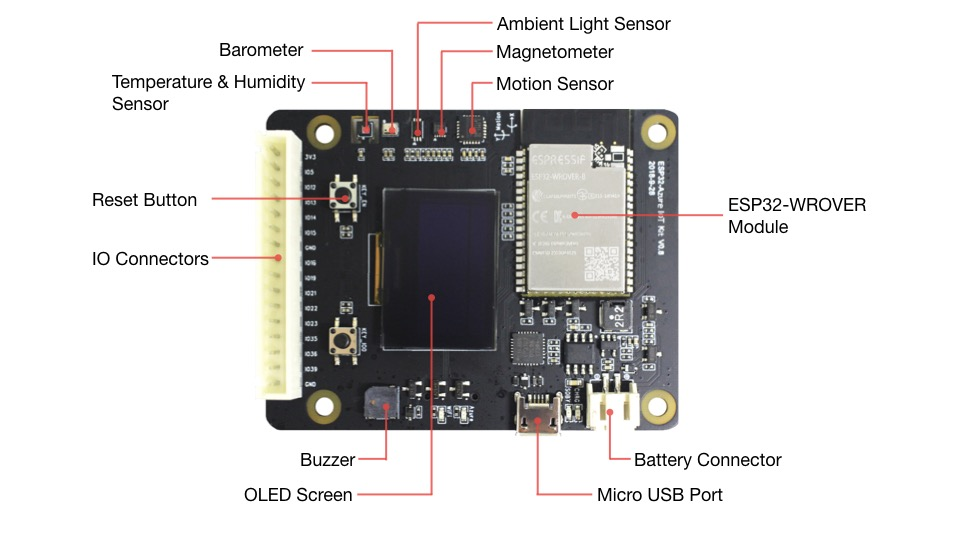
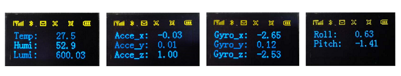

# ESP32-Azure IoT Kit 入门指南

[[EN]](./readme_en.md)

ESP32-Azure IoT Kit 是一款以乐鑫 ESP32 模组为核心的开发板，集成了 OLED 显示屏和 5 款传感器，可使用 ESP32 的 Wi-Fi 功能连接到云端，进行数据交互。本文档首先对硬件进行简单介绍，然后描述本 Demo 的实现和运行。

## 1. 硬件简介
ESP32-Azure IoT Kit 硬件主要由以下几部分组成：

  * ESP32 模组：ESP32-WROVER-B
  * 供电部分：支持 USB 或电池供电
  * 传感器：包括温湿度传感器、环境亮度传感器、运动传感器、磁力计、气压计
  * OLED 显示屏：0.96 寸 OLED 显示屏，内置 SSD1306 驱动芯片
  * 按键：包括 Reset 按键和 1 个功能自定义按键
  * 状态指示部分：2 个 LED 指示灯和 1 个蜂鸣器
  * 拓展 IO 接口：16 pins
  * MicroSD 卡槽：可用于拓展 SD 卡

各个组成部分如下图所示。详细的硬件设计和原理图请查看[《ESP32-Azure IoT Kit 硬件设计指南》](https://www.espressif.com/sites/default/files/documentation/esp32-azure_iot_kit_hardware_design_guide__cn.pdf)

 

## 2. Demo 简介

### 2.1 Demo 功能与实现
本 Demo 将帮助开发者快速熟悉开发板上传感器和 OLED 屏的使用，可实现的主要功能如下：  

  * 读取温湿度传感器数据
  * 读取光照强度传感器数据
  * 读取运动传感器的数据，并使用一阶互补算法获取到了俯仰角 (Pitch) 和滚转角 (Roll)
  * 将传感器数据显示在 OLED 屏上
  * 通过按键切换显示页面

开发板上所有的传感器均使用 I2C 接口，其中温湿度传感器、环境亮度传感器和运动传感器的驱动已开发完成，用户只需要调用相应的 API 即可获取传感器数据。更多有关驱动 API 和代码的信息，请查看 [[esp-iot-solution/components/i2c_devices/sensor]](./../../components/i2c_devices/sensor)。
OLED 显示屏也是用 I2C 接口，且驱动也已开发完成，详细的驱动 API 和代码请查看 [[esp-iot-solution/components/i2c_devices/others/ssd1306]](./../../components/i2c_devices/others/ssd1306) 。

> 注意：
> 
> 磁力计和气压计的驱动暂时没有进行实现，用户如果需要用到可参考其他传感器的驱动进行实现。

### 2.2 编译下载
请查看 [[readme]](./../../README.md#preparation)。

### 2.3 运行
下载完成之后可以按一下标号为 KEY_EN 的按键，开始运行。运行时可以看到 OLED 屏上显示了一些简单的图标，以及温湿度传感器和光照强度传感器的数据。

按一下标号为 KEY_IO0 的按键可以切换数据显示页面，总共有 4 个页面：

  * 显示温湿度和光照强度传感器数据
  * 显示运动传感器读取到的加速度的数据
  * 显示运动传感器读取到的陀螺仪（角速度）数据
  * 显示使用互补算法得到的运动传感器的俯仰角和滚转角

4 个页面的显示如下图所示。

