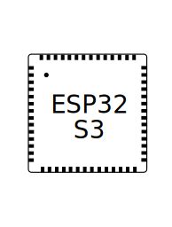

# Blink Example

This example demonstrates how to blink development board LED using GPIO or RMT for the addressable LED, i.e. [WS2812](https://www.mouser.com/pdfDocs/WS2812B-2020_V10_EN_181106150240761.pdf).

## Compatibility

This example is will run on boards marked with green checkbox. Please remember to select the board in menuconfig as discussed is section *Usage* below.

| Board Name | Getting Started | Chip | Compatible |
|-------------------|:--------------------------------------------------------------------------------------------------------------------------------------------------------------------------------------------:|:--------------------------------------------------------------------:|:-----------------------------------------------------------------:|
| esp32-meshkit-sense | [](../../../docs/en/hw-reference/ESP32-MeshKit-Sense_guide.html) |  |  |
| esp32s2-saola | [](https://docs.espressif.com/projects/esp-idf/en/latest/esp32s2/hw-reference/esp32s2/user-guide-saola-1-v1.2.html) |  |  |
| esp32-s3-devkitc-1-v1 | [](https://docs.espressif.com/projects/esp-idf/en/latest/esp32s3/hw-reference/esp32s3/user-guide-devkitc-1.html) |  |  |
| esp32s3_usb_otg_ev | [](https://docs.espressif.com/projects/esp-dev-kits/en/latest/esp32s3/esp32-s3-usb-otg/index.html) |  |  |


## How to Use Example

Before project configuration and build, be sure to set the correct chip target using `idf.py set-target <chip_name>`.

### Configure the Project

Open the project configuration menu (`idf.py menuconfig`). 

In the `Board Options` menu:

* Select a development board in the `Choose Target Board` option.
* Enable `init led during board initialize` in the ` oard Options → Board Common Options → Initialize Options` option.

### Build and Flash

Run `idf.py -p PORT flash monitor` to build, flash and monitor the project.

(To exit the serial monitor, type ``Ctrl-]``.)

See the [Getting Started Guide](https://docs.espressif.com/projects/esp-idf/en/latest/get-started/index.html) for full steps to configure and use ESP-IDF to build projects.

## Example Output

As you run the example, you will see the LED blinking, according to the previously defined period. For the addressable LED, you can also change the LED color by setting the `pStrip_a->set_pixel(pStrip_a, 0, 16, 16, 16);` (LED Strip, Pixel Number, Red, Green, Blue) with values from 0 to 255 in the `blink.c` file.

```
I (477) Board_Common: Board Init Done !
I (487) example_blink: Turning the LED OFF!
I (1087) example_blink: Turning the LED ON!
I (1687) example_blink: Turning the LED OFF!
I (2287) example_blink: Turning the LED ON!
I (2887) example_blink: Turning the LED OFF!
I (3487) example_blink: Turning the LED ON!
I (4087) example_blink: Turning the LED OFF!
I (4687) example_blink: Turning the LED ON!
I (5287) example_blink: Turning the LED OFF!
I (5887) example_blink: Turning the LED ON!
I (6487) example_blink: Turning the LED OFF!
I (7087) example_blink: Turning the LED ON!
I (7687) example_blink: Turning the LED OFF!
I (8287) example_blink: Turning the LED ON!
I (8887) example_blink: Turning the LED OFF!
```

Note: The color order could be different according to the LED model.

The pixel number indicates the pixel position in the LED strip. For a single LED, use 0.

