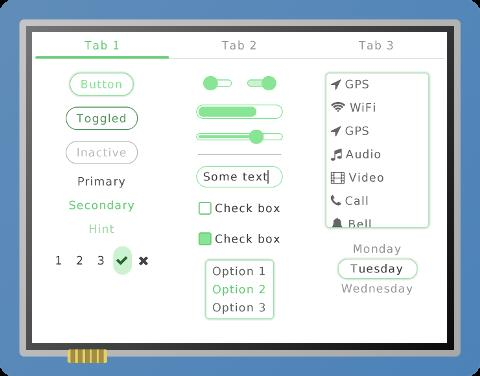

[[中文]](./lvgl_example_cn.md)

# ESP32 LittlevGL Widget

This example is no longer maintained. For LCD and LVGL examples, please refer to: [i80_controller](https://github.com/espressif/esp-idf/tree/master/examples/peripherals/lcd/i80_controller)、[rgb_panel](https://github.com/espressif/esp-idf/tree/master/examples/peripherals/lcd/rgb_panel) and [spi_lcd_touch](https://github.com/espressif/esp-idf/tree/master/examples/peripherals/lcd/spi_lcd_touch)

## What You Need

- Hardware:
	* 1 x [ESP32\_LCD\_EB\_V1](https://docs.espressif.com/projects/esp-dev-kits/en/latest/esp32/esp32-lcdkit/index.html) HMI development board (for this example, it has to be used with the [ESP32_DevKitC](https://docs.espressif.com/projects/esp-idf/zh_CN/latest/esp32/hw-reference/esp32/get-started-devkitc.html) development board)
	* 1 x display (2.8 inches, 240x320 pixels, ILI9341 LCD + XPT2046 Touchscreen)
- Software:
	* [esp-iot-solution](https://github.com/espressif/esp-iot-solution)
	* [LittlevGL GUI](https://lvgl.io/)

See the connection image below:

The pins to be connected:

Name | Pin
-------- | -----
CLK | 22
MOSI | 21
MISO | 27
CS(LCD) | 5
DC | 19
RESET | 18
LED | 23
CS(Touch) | 32
IRQ | 33

## Run the Example

- Open Terminal and navigate to the directory `examples/hmi/lvgl_example`
- Run `make defconfig`(Make) or `idf.py defconfig`(CMake) to apply the default configuration
- Run `make menuconfig`(Make) or `idf.py menuconfig`(CMake) to set up the configuration, you can go to `Example Configuration → Choose LVGL Demo to Run` to choose a demo to run
- Run `make -j8 flash`(Make) or `idf.py flash`(CMake) to build the example and flash it to the device

## Example Demonstration

