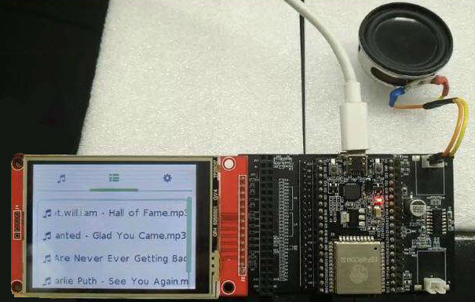
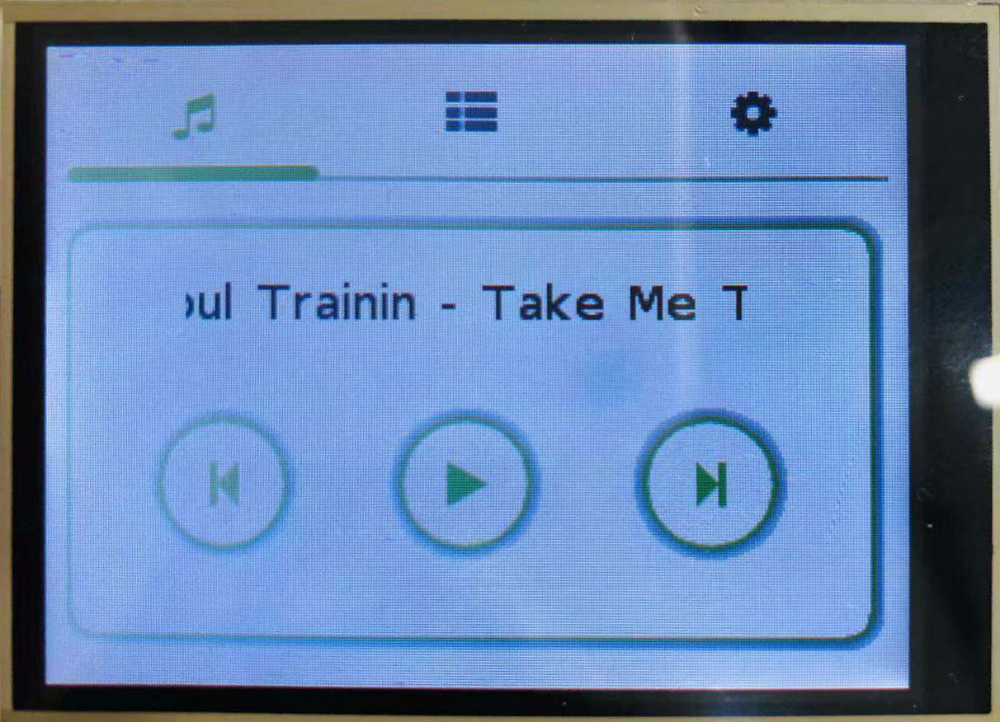

[[EN]](./mp3_example_en.md)

# ESP32 LittlevGL MP3 示例

## 示例环境

- 硬件：
	* [ESP32\_LCD\_EB\_V1](../../../documents/evaluation_boards/ESP32_LCDKit_guide_cn.md) 开发板（该示例需要搭配使用 [ESP32 DevKitC](https://docs.espressif.com/projects/esp-idf/en/stable/hw-reference/modules-and-boards.html#esp32-devkitc-v4) 开发板）
	* 屏幕（2.8 inch、240*320 pixel、 ILI9341 LCD + XPT2046 Touch）
- 软件：
	* [esp-iot-solution](https://github.com/espressif/esp-iot-solution)
	* [LittlevGL GUI](https://littlevgl.com/)

- 环境搭建：[README.md](../../../README.md#preparation)

LittlevGL 介绍及相关配置见 [LittlevGL Guide](../../../documents/hmi_solution/littlevgl/littlevgl_guide_cn.md)。

连接示意图：

  

默认引脚连接：

Name | Pin
-------- | -----
CLK | 22
MOSI | 21
MISO | 27
CS(LCD) | 5
DC | 19
RESET | 18
LED | 23
CS(Touch) | 32
IRQ | 33

## 系统框图
                               +---------------+
                               |               |
                               |      HMI      |
                               |               |
                               +----^-----+----+
                                    |     |
                                    |     |
                                    |     |
                                    |     |
                                    |     |
    +---------------+          +----+-----v----+           +--------------+
    |               |          |               |           |              |
    |    SD-Card    +---------->     ESP32     +----------->   DAC-Audio  |
    |               |          |               |           |              |
    +---------------+          +---------------+           +--------------+

## 运行示例

- 进入到 `examples/hmi/mp3_example` 目录下
- 运行 `make defconfig`(Make) 或者 `idf.py defconfig`(CMake) 使用默认配置
- 运行 `make menuconfig`(Make) 或者 `idf.py menuconfig`(CMake) 进行烧录相关配置
- 运行 `make -j8 flash`(Make) 或者 `idf.py flash`(CMake) 编译、烧录程序到设备

### 使用 ESP-ADF 播放 MP3 音频文件

- 根据 [Get Started](https://docs.espressif.com/projects/esp-adf/en/latest/get-started/index.html) 搭建 ESP-ADF 开发环境、Example 中使用了 ADF_PATH 环境变量
- 运行 `make menuconfig`(Make) 或者 `idf.py menuconfig`(CMake) 选择使用 ADF 播放音频文件，目录：`IoT Example - LittlevGL MP3 Example->Use esp-adf to play song`
- 保存配置并运行 `make -j8 flash`(Make) 或者 `idf.py flash`(CMake) 编译、烧录程序到设备

#### SD-Card、Audio 使用

- 音频文件目前只支持 MP3 格式，MP3 文件可以放置在 SD-Card 的根目录下或者二级目录下，当前 Example 支持最多 20 个音频文件
- 喇叭可以连接到 ESP32_LCDKit_V1 开发板的两个音频输出端口上，分别为左声道、右声道

## 示例结果

  