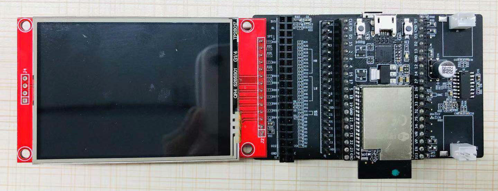

[[EN]](./ugfx_bubbles_en.md)

# ESP32 μGFX 气泡动画示例

## 示例环境

- 硬件：
	* [ESP32\_LCD\_EB\_V1](../../../documents/evaluation_boards/ESP32_LCDKit_guide_cn.md) 开发板（该示例需要搭配使用带 wrover 模组的 [ESP32 DevKitC](https://docs.espressif.com/projects/esp-idf/en/stable/hw-reference/modules-and-boards.html#esp32-devkitc-v4) 开发板）
	* 屏幕（2.8 inch、240*320 pixel、ILI9341 LCD + XPT2046 Touch）
- 软件：
	* [esp-iot-solution](https://github.com/espressif/esp-iot-solution)
	* [μGFX GUI](https://ugfx.io/)

- 环境搭建：[README.md](../../../README.md#preparation)

μGFX 介绍及相关配置见 [μGFX Guide](../../../documents/hmi_solution/ugfx/ugfx_guide_cn.md)。

连接示意图：

  

默认引脚连接：

Name | Pin
-------- | -----
CLK | 22
MOSI | 21
MISO | 27
CS(LCD) | 5
DC | 19
RESET | 18
LED | 23
CS(Touch) | 32
IRQ | 33

## 运行示例

- 进入到 `examples/hmi/ugfx_bubbles` 目录下
- 运行 `make defconfig`(Make) 或者 `idf.py defconfig`(CMake) 使用默认配置
- 运行 `make menuconfig`(Make) 或者 `idf.py menuconfig`(CMake) 进行烧录相关配置
- 运行 `make -j8 flash`(Make) 或者 `idf.py flash`(CMake) 编译、烧录程序到设备

## 示例结果

[示例视频](http://demo.iot.espressif.cn:8887/cmp/demo/ugfx_bubbles.mp4)

  