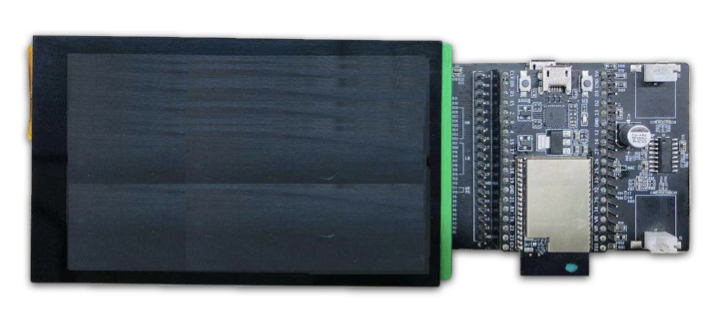

[[EN]](./ugfx_example_en.md)

# ESP32 μGFX 控件示例

## 示例环境

- 硬件：
	* [ESP32\_LCD\_EB\_V1](../../../documents/evaluation_boards/ESP32_LCDKit_guide_cn.md) 开发板（该示例需要搭配使用 [ESP32 DevKitC](https://docs.espressif.com/projects/esp-idf/en/stable/hw-reference/modules-and-boards.html#esp32-devkitc-v4) 开发板）
	* 屏幕（4.3 inch、480*800 pixel、NT35510 LCD + FT5X06 Touch）
- 软件：
	* [esp-iot-solution](https://github.com/espressif/esp-iot-solution)
	* [μGFX GUI](https://ugfx.io/)

- 环境搭建：[README.md](../../../README.md#preparation)

μGFX 介绍及相关配置见 [μGFX Guide](../../../documents/hmi_solution/ugfx/ugfx_guide_cn.md)。

连接示意图：

  

默认引脚连接：

Name | Pin | Name | Pin
-------- | -------- | -------- | --------
WR | 18 | SCL | 3
RS | 5 | SDA | 1
D0 | 19 | D8 | 25
D1 | 21 | D9 | 26
D2 | 0 | D10 | 12
D3 | 22 | D11 | 13
D4 | 23 | D12 | 14
D5 | 33 | D13 | 15
D6 | 32 | D14 | 2
D7 | 27 | D15 | 4

## 运行示例

- 进入到 `examples/hmi/ugfx_example` 目录下
- 运行 `make defconfig`(Make) 或者 `idf.py defconfig`(CMake) 使用默认配置
- 运行 `make menuconfig`(Make) 或者 `idf.py menuconfig`(CMake) 进行烧录相关配置
- 运行 `make -j8 flash`(Make) 或者 `idf.py flash`(CMake) 编译、烧录程序到设备

## 示例结果

  