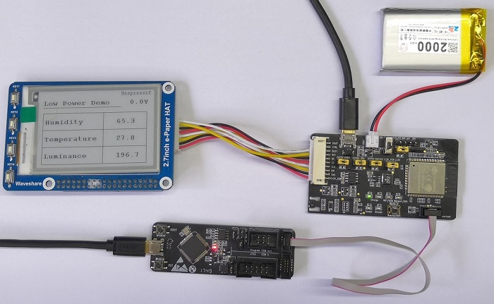
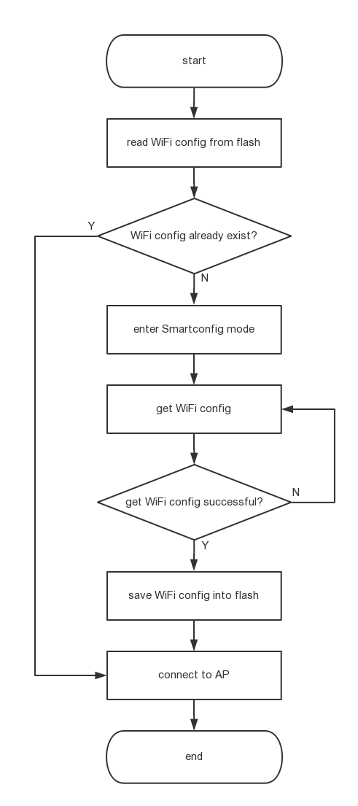

[[EN]](./readme_en.md)

# 低功耗应用开发指南
为了帮助客户熟悉乐鑫低功耗应用的开发，我们专门基于乐鑫的 ESP32-MeshKit-Sense 开发板和低功耗应用框架，设计和实现了一个低功耗应用的 demo。在本文档中，我们将首先介绍硬件平台和 demo 的使用，然后介绍具体的软件设计，最后介绍功耗测试的方法并提供我们的测试数据。

## 1. 硬件平台使用简介
硬件平台包含以下几部分：

  * 开发板（ESP32-MeshKit-Sense）  
  * 下载器（ESP-Prog）  
  * 墨水屏（非必须）  
  * 锂电池（可通过 USB 供电，非必须）  

  

### 1.1 开发板
开发板的各个组成部分如下图所示，硬件设计请查看 [ESP32-MeshKit-Sense 硬件设计指南](https://github.com/espressif/esp-iot-solution/blob/master/documents/evaluation_boards/ESP32-MeshKit-Sense_guide_cn.md)。  

  

开发板上有 5 处跳线，其功能和接法如下：  

| 跳线位置 | 功能 | 接法 |
|---|---|---|
| EXT5V-CH5V | USB 输入的 5V 与充电管理芯片的输入之间的连接，连接后才可使用电池充电功能 | 仅在充电时接上 |
| CHVBA-VBA | 充电管理芯片的输出和电池正极之间的连接，连接后才可使用电池充电功能 | 仅在充电时接上 |
| DCVCC-SUFVCC | 供电电源与 DC-DC 的输入之间的连接，可以测量整个板子在工作时的总电流 | 在 USB 和 电池供电时都要接上 |
| 3.3V-PER_3.3V | 总路 3.3V 与所有外设供电的连接，可测量外设工作时的电流 | 在需要使用外设时接上 |
| 3.3V-3.3V_ESP32 | 总路 3.3V 与模组供电的连接，可以测量模组部分（包含 Reset Protect 芯片和模组）工作时的电流 | 在需要使用模组时接上 |

### 1.2 下载器
下载器的详细使用可以查看 [ESP-Prog 介绍文档](https://github.com/espressif/esp-iot-solution/blob/master/documents/evaluation_boards/ESP-Prog_guide_cn.md)。  
当前版本的开发板不支持 ESP-Prog 供电，所以在使用时只需要使用跳线帽将 IO0_ON/OFF 连接即可，如下图所示。  

  

### 1.3 墨水屏
墨水屏是可选的外接设备。如果接了墨水屏，在 Demo 中也会有其相应的操作，在编译时将该功能打开即可。  

  

### 1.4 锂电池
锂电池也是可选的外接设备，在不使用电池时可以使用 USB 进行供电。如果需要使用电池供电，请不要接 USB，因为在 USB 和 电池都接上时，默认会使用 USB 进行供电。  
注意：请选用标称电压为 3.7V 的锂电池。  

## 2. Demo 的使用

### 2.1 前置条件
* 乐鑫低功耗开发套件
* 手机：安装 Espressif 配网 App
	* Android 系统手机，请安装 [EspTouch](https://github.com/EspressifApp/EsptouchForAndroid/tree/master/releases/apk)。
	* IOS 系统手机，请安装 `Espressif EspTouch`，可以从 App store 下载。
* 路由器：2.4G 路由器
* 服务器：可以使用 `sensor_server.py` 脚本来搭建一个简易的服务器。该服务器可以接收来自开发板的数据，并打印出来。
	* 脚本在使用时需要传入 1 个参数：服务器使用的端口号。例如 `python sensor_server.py 8000`。

### 2.2 配置编译环境
* 安装和配置 ESP32 的 C 语言编译环境，请参照 [链接地址](https://docs.espressif.com/projects/esp-idf/zh_CN/latest/get-started/index.html)。  
* 安装和配置 ULP 的汇编编译工具链，请参照 [链接地址](https://docs.espressif.com/projects/esp-idf/en/stable/api-guides/ulp.html)。

### 2.3 编译下载
请前往 **menuconfig** 菜单，进入 `Lowpower EVB settings` 进行以下配置：  

* `Set lowpower evb task stack size`：配置 task 的栈空间  
* `Wake up type`：可以配置成 ULP 唤醒、GPIO 唤醒、Timer 唤醒  
	* 如果配置成 Timer 唤醒，则会出现 `wake up time(us)`选项，可配置睡眠唤醒间隔  
* `WiFi configure mode`：可以选择 ESP-TOUCH 配网，或者选择连接到一个指定的路由  
	* 如果选择连接到一个指定的路由，则会出现 `Set SSID of fixed router` 选项和 `Set password of fixed router`选项，这两个选项分别用于设置指定路由的 SSID 和 密码，该功能使能后不再需要配网   
* `Set server IP to connect to`：需要连接的服务器的 IP 地址  
* `Set server port to connect to`：需要连接的服务器的端口号  
* `Set upload data size`：上传数据的最大字节数  
* `Read sensor value number`：每进入一次 deep sleep，读取传感器数值的次数  
* `Read sensor interval(ms)`：传感器读取间隔，即设置每隔多久读取一次传感器数据  
* `Enable E-ink`：选择是否使用墨水屏  

### 2.4 操作流程
本节将描述如何运行 demo，主要步骤如下：  

1. 编译并下载固件。  
2. 设备上电，进行配网。  
	* 若此前未经过配网，则设备上电启动后会首先进入配网状态，此时 Wi-Fi 指示灯快闪。
	* 若此前已经过配网，此时需重新配网，应首先观察设备是否处于唤醒状态：
		* Wi-Fi 指示灯亮：设备处于唤醒状态。此时，先按一下 Wakeup 按键，看到 Wi-Fi 指示灯快闪，即说明设备已进入配网状态；
		* Wi-Fi 指示灯灭：设备处于睡眠状态。此时，先按一下 Wakeup 按键唤醒设备，看到 Wi-Fi 指示亮后再按一下 Wakeup 按键，看到 Wi-Fi 指示灯快闪，即说明设备已进入配网状态。
3. 手机连接上相应的路由器，并打开配网 App 进行配网。配网成功后 Wi-Fi 指示灯常亮，表示设备已成功连接至指定路由。  
4. 若不是从 Deep-sleep 模式唤醒（例如重新上电或者复位），设备启动后会首先进入 Deep-sleep 模式，后续唤醒方式取决于 `Wake up type` 中的设置：
	* 若配置为 GPIO 唤醒，则需要按下 WakeUp 按键进行唤醒。唤醒后，主 CPU 使用 I2C 接口读取传感器数据；  
	* 若配置为 Timer 唤醒，则等设定时间后自动唤醒。唤醒后，主 CPU 使用 I2C 接口读取传感器数据；
	* 若配置为 ULP 唤醒，则等 ULP 完成指定次数的数据读取后唤醒。唤醒后，主 CPU 从 ULP 中读取数据。  
5. 唤醒后，设备会自动连接上之前配置过的路由。  
6. 使用 `sensor_server.py` 脚本启动服务器。  
7. ESP32 与服务器建立连接，并将读取到的传感器数据发送至服务器。Network 指示灯代表与服务器的连接状态：
	* Network 指示灯快闪：表示正在尝试与服务器进行连接；
	* Network 指示灯常亮：表示连接成功。  
8. 数据发送完成后，墨水屏将刷新一次屏幕，显示前面 ULP 读取到的最后一组数值。  
9. 此时，设备重新进入 Deep-sleep 模式，等待下一次唤醒。

## 3. 低功耗软件设计

### 3.1 低功耗软件框架概述
低功耗软件框架将 Deep-sleep 和其他功能相结合，形成一个典型应用的流程，框架的实现代码请查看文件夹：`esp-iot-solution/components/framework/lowpower_app_framwork`。在此框架下，用户无需自行设计流程，仅需注册相应的回调函数来实现各个部分的功能即可，大大降低开发时间和成本。  
低功耗软件框架主要包含以下几部分：  

* 网络配置与连接
* 睡眠与唤醒功能
* 读取传感器数据
* 上传数据至服务器
* 数据传输完成处理

低功耗软件框架流程图如下图所示。  

  

> 虚线框中的 ULP 运行过程只有在选择 ULP 唤醒的时候才会发生，这部分的详细流程在 3.3 章节中将会进行描述。

### 3.2 文件与接口说明
此 demo 的主要文件结构如下：

    lowpower_evb
    ├── components
    │   ├── lowpower_evb_callback              // 回调函数的实现
    │   │   ├── lowpower_evb_callback.cpp
    │   │   ├── component.mk
    │   │   └── include
    │   │       └── lowpower_evb_callback.h
    │   ├── lowpower_evb_peripherals           // 外设操作
    │   │   ├── lowpower_evb_adc.cpp           // ADC 操作
    │   │   ├── lowpower_evb_epaper.cpp        // 墨水屏操作
    │   │   ├── lowpower_evb_power.cpp         // 墨水屏和传感器的电源开关操作
    │   │   ├── lowpower_evb_sensor.cpp        // 传感器操作
    │   │   ├── lowpower_evb_status_led.cpp    // 指示灯操作
    │   │   ├── component.mk
    │   │   └── include
    │   │       ├── lowpower_evb_adc.h
    │   │       ├── lowpower_evb_epaper.h
    │   │       ├── lowpower_evb_power.h
    │   │       ├── lowpower_evb_sensor.h
    │   │       └── lowpower_evb_status_led.h
    │   ├── lowpower_evb_ulp                    // ULP 操作
    │   │   ├── lowpower_evb_ulp_opt.cpp
    │   │   ├── component.mk
    │   │   ├── include
    │   │   │   └── lowpower_evb_ulp_opt.h
    │   │   └── ulp                             // ULP 读取传感器的实现
    │   │       ├── bh1750.S                    // 亮度传感器 BH1750 的操作
    │   │       ├── hts221.S                    // 温湿度传感器 HTS221 的操作
    │   │       ├── i2c_dev.S                   // 程序运行入口
    │   │       ├── i2c.S                       // I2C 驱动（软件模拟）
    │   │       └── stack.S                     // 堆栈实现
    │   └── lowpower_evb_wifi                   // Wi-Fi 配置与连接
    │       ├── lowpower_evb_wifi.cpp
    │       ├── component.mk
    │       └── include
    │           └── lowpower_evb_wifi.h
    ├── main
    │   ├── component.mk
    │   ├── Kconfig.projbuild
    │   └── main.cpp
    ├── Makefile
    ├── readme_cn.md
    ├── README.md
    ├── sdkconfig.defaults
    └── sensor_server.py                        // 简易服务器搭建脚本

### 3.3 基于低功耗软件框架的 Demo 设计
为了帮助用户快速熟悉低功耗软件框架，本工程专门准备了一个 demo，对框架流程中的各个部分进行实现，主要包括：

* 初始化
* Wi-Fi 配置与连接
* 向 ULP 导入程序
* 获取传感器数据
* 上传数据至服务器
* 睡眠与唤醒

注意，demo 中使用的外设驱动以及 Wi-Fi 和网络相关接口在 `esp-iot-solution/components` 中都可以找到，直接调用即可，非常方便。

#### 3.3.1 初始化
初始化部分主要对需要使用的外设进行初始化，例如：本 demo 中需要使用到 I2C 接口的传感器、SPI 接口的墨水屏、按键、LED 灯等等，在启动后先对这些设备进行初始化。

#### 3.3.2 Wi-Fi 配置与连接
Wi-Fi 的配置使用乐鑫自主研发的 ESP Touch 进行配网。在本 demo 中，为了使设备重启后能够自动连接上之前配置过的网络，我们在完成 Wi-Fi 配置后会将配置信息保存到 flash 中。这样，设备在每次重启后都先从 flash 读取配置信息，若已存在配置信息，则直接连接到相应的 AP；若不存在配置信息，则自动进入 Smartconfig 进行配网，具体实现的流程图如下所示：  

  

本设计使用 Wi-Fi 指示灯来指示配网的过程：进入 Smartconfig 时指示灯快速闪烁，Wi-Fi 连接成功后，指示灯常亮。  
若用户需要重新进入配网（例如要将设备连接到另一个路由器）上，本 demo 中设计了一个按键（WakeUp 按键）来触发进入配网的操作，该按键触发后，首先清除 flash 中的相关配置信息，然后重启设备。此时，由于设备重启后从 flash 中读取 Wi-Fi 配置信息不存在，将自动进入配网模式。需要注意的是该按键需要在设备处于唤醒状态时才能触发配网。
用户在开发时也可以修改成自己的配网方式。

#### 3.3.3 向 ULP 导入程序
ULP 协处理器有一套专属的汇编指令来进行程序的编写，在编写完成并编译后生成的二进制文件是通过主 CPU 导入进去的。若将唤醒方式设定为 ULP 唤醒，则在进入 deep sleep 后，ULP 协处理器就会运行导入的程序。这一部分建议用户直接使用，不做修改。

#### 3.3.4 获取传感器数据
设备获取传感器数据有两种方式：

* 从 ULP 获取：指在主 CPU 被唤醒后，直接访问 ULP 的存储区，获取 ULP 协处理器在 deep sleep 期间读取到的传感器数据。这种方式可以让芯片长期处于 deep sleep 状态，并通过 ULP 来读取数据，从而极大地降低功耗。在本 demo 中，ULP 会根据 `Read sensor value number` 的设置，在读取相应次数的数据后唤醒主 CPU。  
* 从主 CPU 获取：指在主 CPU 唤醒后，使用 I2C 接口去读取传感器的数值。这种方式只能在设备唤醒后获取当前数值，比较适合偶尔需要唤醒查看实时状态的应用。使用这种方式时，设备处于 deep sleep 下，除了供电部分和模组部分外，所有外设都不工作，总功耗低至 20-30 μA（其中 ESP32 模组部分的电流仅为 5 uA），功耗极低。不过，这种方式只能使用手动唤醒或者定时唤醒。

#### 3.3.5 上传数据至服务器
设备可将数据上传至服务器，允许服务器对上传的数据进行保存、查看与分析。在本 demo 中，设备会将获取的传感器数据上传到指定服务器。  
为了避免主 CPU 长时间运行，本 demo 将设备连接超时时间设置为 10s。因此，设备在连接超时后进入 deep sleep，等待下一次醒来。这里，我们使用 Network 指示灯来显示连接状态：在尝试连接的过程中指示灯快速闪烁、连接成功后指示灯常亮。注意，设备连接服务器之前需连接至 Wi-Fi。  
服务器端收到数据后会打印出来，如下图所示：  

  

在本 demo 中，数据发送完成后，设备会在墨水屏上显示上传的最后一组数据（作为墨水屏的参考设计）。用户可根据实际需求，修改数据发送完毕后的处理。

#### 3.3.6 睡眠与唤醒
设备的睡眠与唤醒通常放在程序的最后执行，因为设备进入 Deep-sleep 模式后，CPU 将会停止运行，等唤醒后从头开始运行，和重启机制类似。在这部分的实现中，我们需要首先设置唤醒方式（定时器唤醒、GPIO 唤醒、ULP 唤醒），然后进入 Deep-sleep 模式，等待唤醒信号。  
ULP 在 Deep-sleep 模式下具有定时睡眠的功能，即可以设置 ULP 在运行完一遍程序后进入睡眠状态，并等待定时器将其唤醒。在本 demo 中，ULP 运行与唤醒的过程如下图所示：

  

## 4. 低功耗开发板的功耗测试
在低功耗开发板中，每个需要测量电流的部分都引出了跳线针脚，用户可将电流表串联到相应位置测量该部分的功耗（正常使用时仅需插上跳线帽即可），具体可测量功耗的部分包括：  

* 3.3V-3.3V_ESP32：模组部分电流，这部分电流主要来自 Reset Protect 芯片和 ESP32-WROOM-32  
* 3.3V-PER_3.3V：外设部分电流，这部分电流主要来自两个传感器和墨水屏  
* DCVCC-SUFVCC：整个开发板在运行时的电流，包括模组、外设及其他外围电路的电流  
* CHVBA-VBA：电池充电处的电流  
* EXT5V-CH5V：在充电状态时，USB 供电处的电流  

各部分的电流测试方法和测试结果数据如下表所示：

| 电流测量位置 | 测试条件 | 电流值 | 测试方法 | 备注 |
|---|---|---|---|---|
|3.3V-3.3V_ESP32|deep sleep（GPIO 唤醒）|10 uA|在程序启动之后不做其他操作，将唤醒方式设定为 GPIO 唤醒，然后进入 Deep-sleep 模式，测量电流值。| 其中，Reset Protect 芯片 5 uA + ESP32-WROOM-32 5 uA |
|3.3V-3.3V_ESP32|deep sleep （ULP 唤醒）|1.8 mA|将唤醒方式设定为 ULP 唤醒，然后进入 Deep-sleep 模式，ULP 此时正在运行。| / |
|3.3V-PER_3.3V|两个传感器工作| 1.6 mA |控制 IO27 将传感器供电打开| / |
|3.3V-PER_3.3V|两个传感器和墨水屏工作| 9.2 mA |控制 IO27 将传感器供电打开，控制 IO14 将墨水屏供电打开| / |
|DCVCC-SUFVCC|deep sleep（GPIO 唤醒）|20 uA|在程序启动之后不做其他操作，将唤醒方式设定为 GPIO 唤醒，然后进入 Deep-sleep 模式，测量电流值。| 其中， Reset Protect 芯片 5 uA + ESP32-WROOM-32 5uA + DC-DC 部分 10 uA |
|DCVCC-SUFVCC|deep sleep（ULP 唤醒）|3.4 mA|将唤醒方式设定为 ULP 唤醒，然后进入 Deep-sleep 模式，ULP 此时正在运行，且读取传感器数据。| / |
|CHVBA-VBA|将电池和 USB 都接上| 电流值会随着电量变化而变化 |直接测量| / |
|EXT5V-CH5V|将电池和 USB 都接上| 电流值会随着电量变化而变化 |直接测量| / |

如果 ULP 一直持续运行，模组部分的电流是 1.8 mA，可以利用 ULP 的定时睡眠功能，来进一步降低功耗。在本 demo 中可以通过 menuconfig 中的 `Read sensor interval(ms)` 选项设置 ULP 醒来读取传感器的时间间隔，这个时间设置得越长，平均功耗就会越低，电池能够使用的时间也越长，相应地读取的数据也会较少，客户在设置这个参数时可以根据实际的使用环境与要求设置一个合理的值。下图为 ULP 在读取数据时模组的电流波形，读取周期为 200 ms，在读取传感器时平均电流约为 1.8 mA，读取传感器完成后进入睡眠，睡眠时平均电流仅为 5 uA。  

  
