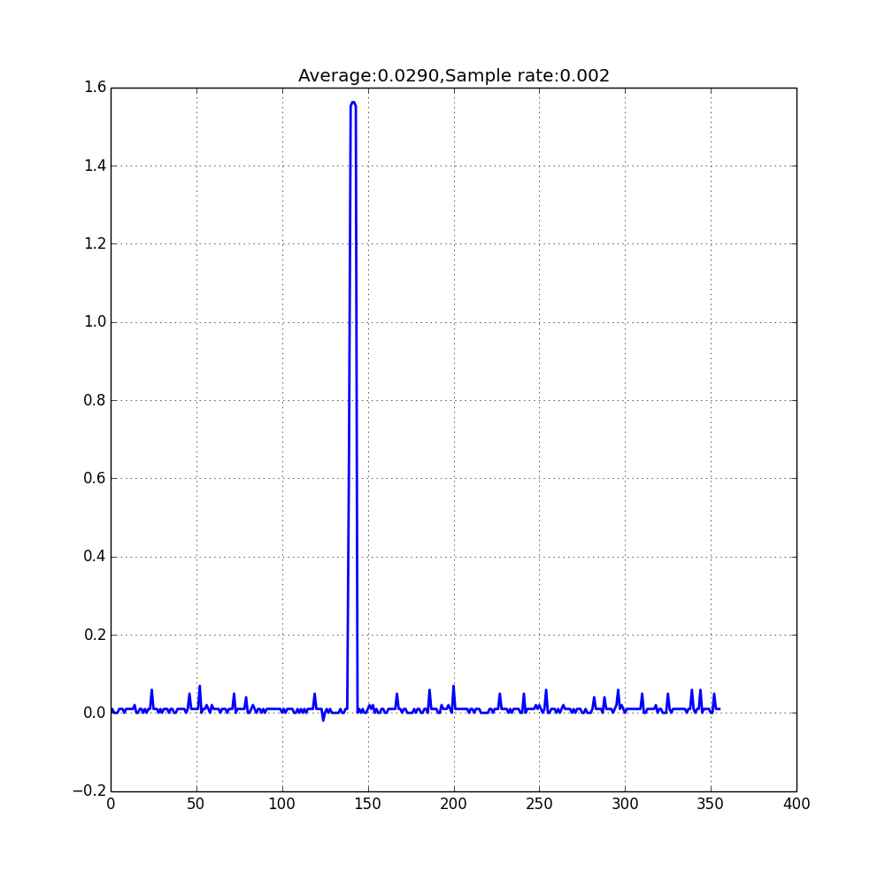
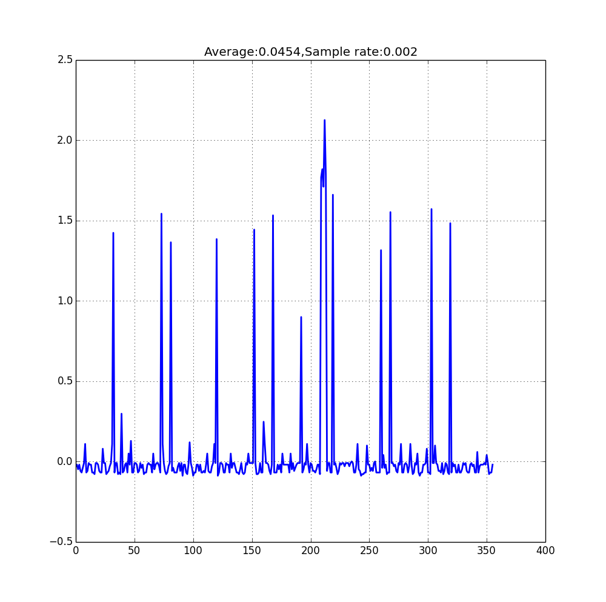

[[EN]](./readme_en.md)

# ESP32 OLED Demo 说明文档
## 实现功能

ESP32 OLED demo 实现了以下功能：

- 温湿度数据采集
- 网络更新实时时间
- OLED 分页显示温湿度、实时时间
- 手势/触摸传感器控制 OLED 显示页面上下翻页
- 通过触摸传感器手动进入低功耗模式

下图为 ESP32 OLED Demo 的硬件实物图：
    <br>
    

-------

## 硬件组成
该 DEMO 使用 ESP32\_Button\_Module\_V2 作为开发板，包含以下元件：

- 接近/环境光线传感器 (APDS9960)
- OLED 132x64分辨率的显示屏 (SSD1306)
- 温度、湿度传感器 (HTS221)
- 两个触摸传感器按钮

完整硬件原理图：[ESP32\_BUTTON\_MODULE\_V2.pdf](../../documents/_static/example/oled_screen_module/ESP32_BUTTON_MODULE_V2_20170720A.pdf)

显示屏、传感器电源开关控制原理图：
    <br>
    

VDD33 为 LDO VOUT 3.3V 端，做为 ESP32、外设、 flash 电源；VDD33\_PeriP 为显示屏、温湿度传感器、手势传感器电源。三极管 SI2301 用做电源开关，控制 VDD33\_PeriP 端电压。默认情况下三极管 gate 端保持高电平，电源开关关闭，通过控制 Power_ON 保持低电平以打开电源开关。

## 软件设计
我们使用了以下方法实现了 ESP32 OLED demo：

- 使用 esp-iot-solution 开发工具包
- 基于 FreeRTOS 实时操作系统，多任务处理
- SNTP 协议获取实时时间
- 通过触摸传感器进入低功耗模式
- 通过触摸传感器唤醒设备

-------

## 低功耗模式说明
###  低功耗模式硬件设计
我们使用了以下方法使设备在低功耗模式下的功耗达到最低。

- 控制显示屏、温湿度传感器、手势传感器的电源开关
- 选用低功耗 LDO, 静态电流约为 1 μA
- 对触摸传感器进行功耗管理

### 触摸传感器工作周期
触摸传感器在工作时，会有两种状态：sleep、measurement，两种状态循环交替进行。在正常的工作模式下我们把 sleep 时间设置得比较短，在进入低功耗模式后，我们把 sleep 时间设置得相对较长，以尽可能地降低功耗。

在进入低功耗模式前调用 `touch_pad_set_meas_time(uint16_t sleep_cycle, uint16_t meas_cycle)` 接口调整触摸传感器的 sleep 与 measure 时间。

参数说明：

- `sleep_cycle`：`sleep_cycle` 决定了两次测量的间隔时间，间隔时间 t\_sleep = sleep\_cycle / (RTC\_SLOW\_CLK frequency)。

    可以使用 `rtc_clk_slow_freq_get_hz()` 接口获取 `RTC_SLOW_CLK` frequency 值。
- `meas_cycle`：`meas_cycle` 决定了测量时间，测量时间 t\_meas = meas\_cycle / 8M，最大测量时间为 0xffff / 8 M = 8.19 ms。

### 低功耗模式使用
长按任意触摸传感器按钮进入低功耗模式，在低功耗模式下，触摸传感器采样频率会降至最低，所以从低功耗模式下唤醒同样需要稍长时间地触摸传感器按钮。低功耗模式下电流采样如下：

- 低功耗模式下 LDO VOUT 3.3V 端的电流采样图如下 (包含 ESP32、显示屏、传感器消耗的电流) ：
    <br>
    

> 注：在低功耗模式下 LDO VOUT 3.3V 端的平均电流约为 30 μA， 最大电流约为 1.6 mA， 处在波峰时， 触摸传感器位于 measurement 状态。
<br>

- 低功耗模式下 LDO VIN 5V 端的电流采样图如下 (包含 ESP32、显示屏、传感器、LDO 消耗的电流) ：
    <br>
    

> 注：在低功耗模式下 LDO VIN 5V 端的平均电流约为 45 μA，最大电流约为 2.1 mA。

## OLED Demo 编译与运行

### 前期准备

首先需要确保你的电脑上已经安装好 ESP32 工具链，工具链安装请参考 ESP-IDF 中的 [Setting Up ESP-IDF](https://github.com/espressif/esp-idf/blob/master/README.md)。

### 获取 IoT Solution 项目代码

执行指令，下载 iot-solution 项目仓库：

* 可以直接递归获取仓库代码，这样将会自动初始化需要的所有子模块：

    ```
    git clone -b release/v1.1 --recursive https://github.com/espressif/esp-iot-solution.git

    ```

* 也可以手动进行初始化子模块，先运行以下指令：

    ```
    git clone -b release/v1.1 https://github.com/espressif/esp-iot-solution.git
    ```

  - 然后切换到项目根目录执行以下指令, 下载本项目依赖的一些其它子模块：

    ```
    git submodule update --init --recursive
    ```

### 编译与运行

子模块代码下载完成后就可以对 Iot Solution 工程中的  oled\_screen\_module 进行编译和运行。切换到 esp-iot-solution/examples/oled\_screen\_module 目录下，然后进行下列步骤。

* 串口参数设置

执行以下指令进行编译配置，如串口号和串口下载速度可以在 `Serial flasher config` 这一菜单选项中进行配置（如果不需配置, 可跳过这一步）。

Make:
```
    cd YOUR_IOT_SOLUTION_PATH/examples/oled_screen_module
    make menuconfig
```

CMake:
```
    cd YOUR_IOT_SOLUTION_PATH/examples/oled_screen_module
    idf.py menuconfig
```

* 编译，烧写与运行

执行下面指令，编译 oled\_screen\_module，以下命令中的 flash 是下载命令，monitor 表示开启系统打印，可根据实际情况选择添加。

Make:
```
    make flash monitor
```

CMake:
```
    idf.py flash monitor
```

> 注：下载程序时，如果无法自动开始下载，可以尝试手动进入下载模式。下载固件完成后，按开发板上的 reset 键重新运行程序，可以查看串口打印。
