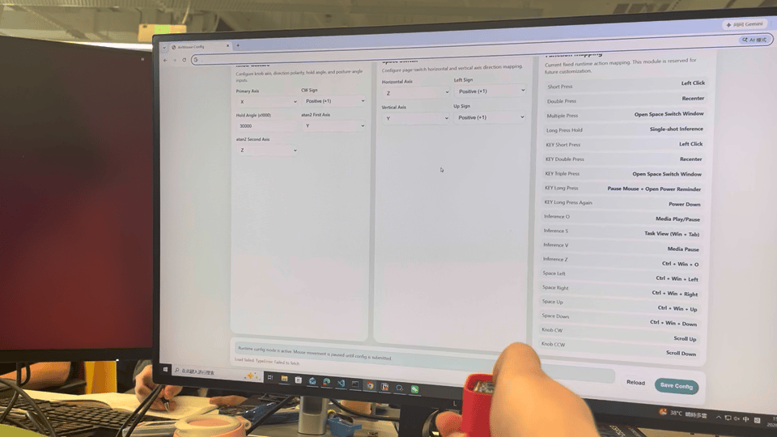
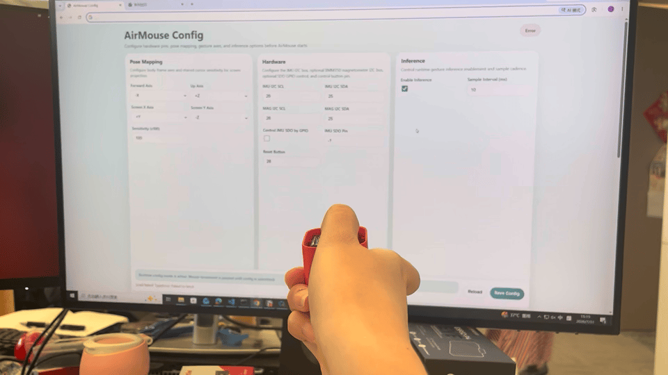

# AirMouse Demo

## Overview

AirMouse is an ESP-IDF demo that turns IMU motion into BLE HID mouse control. The device reads BMI270 motion data, maps pose to cursor movement, recognizes runtime gestures, and sends mouse, keyboard, or consumer-control events to a PC over BLE.

This demo is aimed at handheld pointer-style interaction, including cursor movement, click/recenter control, page switching, media control, and optional gesture inference.

## Supported Hardware

This demo currently provides predefined configurations for the following hardware:

| Board                      | Target    | IMU    | BLE Path                 | Status                                        |
| -------------------------- | --------- | ------ | ------------------------ | --------------------------------------------- |
| ESP-SPOT-C5                | `esp32c5` | BMI270 | Local BLE controller     | Recommended                                   |
| SensairShuttle             | `esp32c5` | BMI270 | Local BLE controller     | Recommended                                   |
| ESP32-P4-Function-EV-Board | `esp32p4` | BMI270 | ESP-Hosted Bluedroid BLE | Supported, requires runtime pin configuration |

For the two supported ESP32-C5 boards, board-specific defaults are provided:

* `sdkconfig.defaults.esp-spot-c5`
* `sdkconfig.defaults.sensair-shuttle`

Loading one of these files automatically selects the corresponding AirMouse board preset and applies its predefined hardware configuration before entering `menuconfig`.

Custom boards can still be configured through Kconfig or through the boot-time HTTP configuration page when no known board preset is selected.

## Key Features

- BLE HID AirMouse output with relative cursor movement
- Quaternion-based pose mapping for handheld pointing
- Recenter support for quick pose reset
- Runtime gesture detection based on reusable `imu_gesture` detectors
- Knob gesture for scroll-like or incremental actions
- Space-switch gesture for directional shortcut actions
- Optional runtime gesture inference using the local model component
- Optional BMM350 magnetometer path for heading-related initialization
- Runtime HTTP configuration page for hardware pins, pose axes, gesture axes, and inference settings
- Board-specific bring-up path for hosted BLE on `ESP32-P4`

## Demo Effects

### Cursor Control

Moving or rotating the device updates the host cursor through BLE HID mouse reports.



### Gesture Actions

The demo supports gesture-triggered business actions in addition to normal pointer control.

- knob gesture: repeated incremental action
- space-switch gesture: directional shortcut actions, including browser/app navigation and runtime-config entry
- inference gesture labels: mapped to media or keyboard shortcuts




### Runtime Configuration

When the firmware is not using a known board preset, it can start a local HTTP configuration flow before entering normal BLE runtime.


## Feature-to-Effect Mapping

The current firmware maps runtime effects as follows:

- cursor motion: IMU pose -> BLE HID mouse movement
- short press: left click
- double press: recenter
- triple press: open the runtime page-switch window
- inference label `"O"`: media play/pause
- inference label `"S"`: `Win + Tab`
- inference label `"V"`: `Escape`
- inference label `"Z"`: `Ctrl + Win + O`
- space left: `Alt + Left`
- space right: `Alt + Right`
- space up: open runtime config
- space down: `Ctrl + Shift + Tab`

The exact runtime behavior depends on the enabled features and current board configuration.

## Hardware Requirements

- one supported target board
- BMI270 connected over I2C
- one reset/control button
- BLE-capable host such as Windows PC or another HID-capable client

Optional:

- BMM350 magnetometer, when `CONFIG_AIRMOUSE_ENABLE_BMM350=y`

## Software Requirements

- ESP-IDF 5.x environment installed and exported
- matching target toolchain
- access to this repository with local common components available

## Project Structure

The demo uses these main directories:

- `main/`: application entry, BLE path, IMU path, pose mapping, runtime config, gesture integration
- `components/model_inference/`: exported local inference model component
- `components/BLE_multiple_HID/`: local BLE HID profile component
- `components/`: local reusable components bundled with this demo

## Configuration Notes

The ESP32-C5 board presets are defined in `main/Kconfig.projbuild`:

* `AIRMOUSE_BOARD_PRESET_ESP_SPOT_C5`
* `AIRMOUSE_BOARD_PRESET_SENSAIR_SHUTTLE`

The corresponding board-specific defaults files select the preset and provide the predefined BMI270 and button configuration.

When either known ESP32-C5 board preset is active, the firmware can skip the initial HTTP hardware-configuration gate.

The current ESP32-P4 path does not provide fixed board pin defaults and must complete runtime hardware configuration after boot.

## Build

### ESP-SPOT-C5

From the AirMouse demo directory, remove any configuration generated for another board, load the ESP-SPOT-C5 defaults, and open `menuconfig`:

```bash
cd demo/airmouse
rm -rf build sdkconfig

idf.py -DIDF_TARGET=esp32c5 -DSDKCONFIG_DEFAULTS="sdkconfig.defaults;sdkconfig.defaults.esp-spot-c5" menuconfig
```

The `ESP-SPOT-C5` preset and its predefined hardware configuration are already selected when `menuconfig` opens.

Build the firmware with:

```bash
idf.py build
```

### SensairShuttle

From the AirMouse demo directory, remove any configuration generated for another board, load the SensairShuttle defaults, and open `menuconfig`:

```bash
cd demo/airmouse
rm -rf build sdkconfig

idf.py -DIDF_TARGET=esp32c5 -DSDKCONFIG_DEFAULTS="sdkconfig.defaults;sdkconfig.defaults.sensair-shuttle" menuconfig
```

The `SensairShuttle` preset and its predefined hardware configuration are already selected when `menuconfig` opens.

Build the firmware with:

```bash
idf.py build
```

### ESP32-P4-Function-EV-Board

For the ESP32-P4 hosted BLE path:

```bash
cd demo/airmouse
rm -rf build sdkconfig
idf.py set-target esp32p4
idf.py menuconfig
idf.py build
```

The current ESP32-P4 path does not rely on fixed Kconfig pin defaults. After boot, complete the HTTP runtime configuration and provide the required hardware pin mapping before normal startup continues.

## Flash and Monitor

```bash
cd demo/airmouse
idf.py flash monitor
```

## Basic Usage Flow

1. Build and flash the firmware for the target board.
2. If no known board preset is active, complete the boot-time HTTP configuration.
3. Wait until BLE HID becomes ready.
4. Pair the device with the host.
5. Move the board to control the cursor.
6. Use the button and runtime gestures to trigger actions.

## Optional Features

### BMM350 Magnetometer

Enable `CONFIG_AIRMOUSE_ENABLE_BMM350=y` if the hardware includes BMM350 and you want the magnetometer-assisted path enabled.

### Hosted BLE on ESP32-P4

For `esp32p4`, the demo keeps the AirMouse HID application logic on `ESP32-P4` and uses the on-board `ESP32-C6` as the hosted BLE controller path.

### Runtime Gesture Inference

The demo can create an inference detector from the exported local model component and run sliding-window gesture inference during normal runtime.

## Notes

- This README focuses on what the demo does, what hardware it supports, and how to run it.
- Detailed implementation notes remain in the source files and comments under this demo directory.
