# Alink embed guide

## 1. 硬件准备
  * 开发板：ESP32-DevKitC 开发板
  * 路由器：可以连接外网（所有的数据交互必需通过阿里云服务器）
  * 手机：若需要使用热点配网，则需要内置 SIM 卡，且可连接 4G 移动网络（热点配网时，设备需要通过手机热点连接阿里云服务器完成的注册、绑定等过程）；安装阿里智能厂测包， [APP 下载链接](https://open.aliplus.com/download/?spm=0.0.0.0.7OBTZm)

## 2. 相关配置
可以通过 `make menuconfig` 修改 Alink embed 工程的一些相关配置： 

  * 在 `IoT Solution settings -> IoT Components Management -> Platforms and Clouds -> ALINK ENABLE -> ALINK_SETTINGS` 下可以选择 alink 的版本（embed 或 sds）以及配置工程内部的一些关键参数的配置等等。

    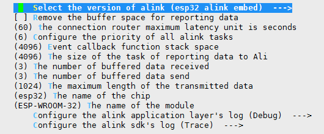

  * 在 `IoT Example - smart_device` 下可以选择设备的类型并配置该设备的相关参数，以及配置 ALINK 的设备信息。

    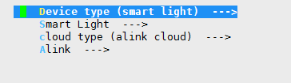

若运行当前 demo，使用默认参数即可。

## 3. demo 使用流程

1. 打开 APP，登录淘宝账号，为了便于找到我们的设备，可以将开启模组认证测试列表。首先进入 `环境切换`，然后滑到底部，将 `开启配网模组测试列表` 勾选上，然后退出 APP，并杀掉该 APP 的进程，再重新打开该 APP 并登录。
    
    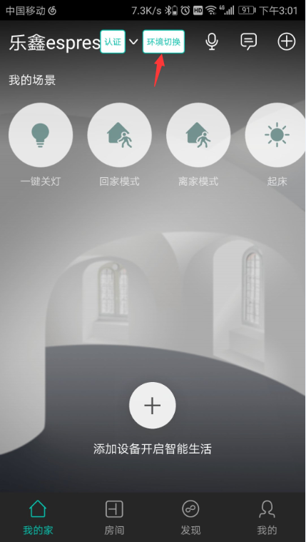

    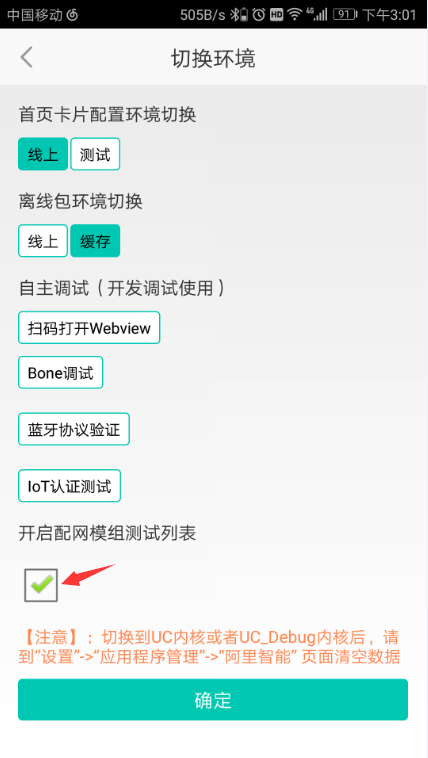

2. 点击右上角 `+` 号，然后点击 `添加设备` 进入添加设备的界面。

    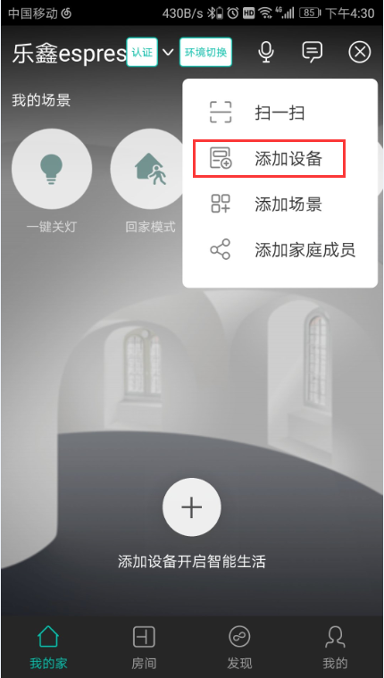

3. 点击 `分类查找`，可以看到设备类别下面只有 `模组认证` 这一个类别，这是由于前面我们将 `开启配网模组测试列表` 打开了，如果将这个选项关闭，就会显示所有的设备类别。

    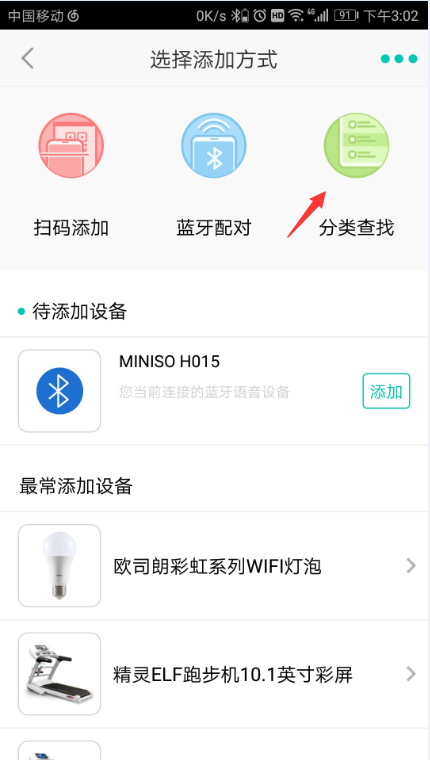

    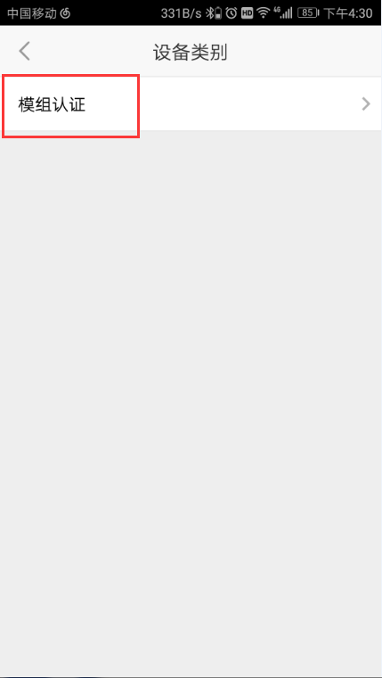

4. 进入模组认证类别后，有一个用于模组测试的设备列表，从这些设备中选择 `配网_V3_热点配网_小智`。

    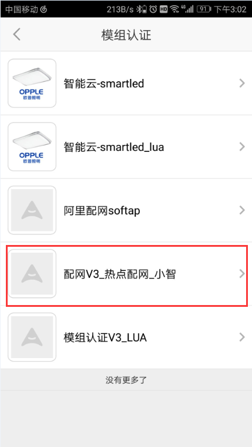

5. 开发板上电，按一下 EN 开关，短按（1-5s） boot 按键，查看打印，出现 “ENTER SAMARTCONFIG MODE” 信息，即表示已进入配网模式；在任何时候只需要短按（1-5s） boot 按键即可重新进入配网模式。  
    注意：进入一键配网后若在 60s 内没有收到 SSID 和 password，则认为一键配网超时，模块自动进入热点配网模式

    

    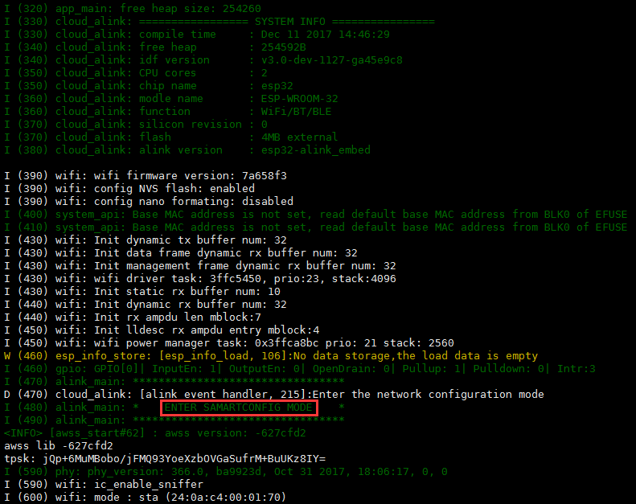

6. 选择使用的路由器并输入密码，点击 `搜索设备`，就进入了配网状态。

    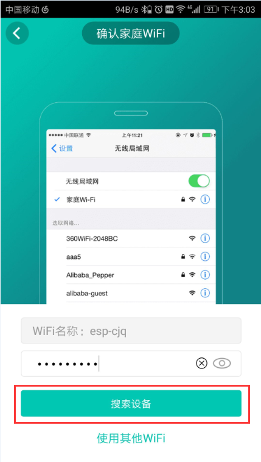

    

7. 设备连上服务器后会进入等待设备激活界面，这时需要上报一个激活指令来激活设备，通过按一下开发板上的 boot 键来触发激活指令上报。

    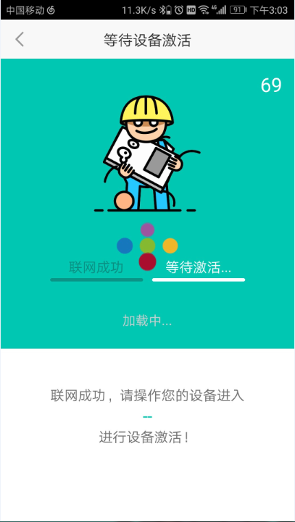

8. 激活成功后将会跳转到 `开始使用` 的界面，在该界面中可以修改设备的名称以及将该设备分配到某一个用户下；点击 `开启设备` 即可进入最终的控制界面，从界面中可以进行开关以及调节各个参数。

    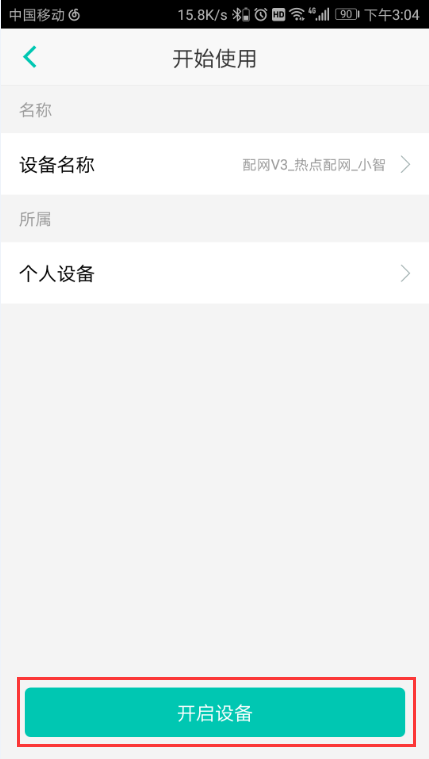

    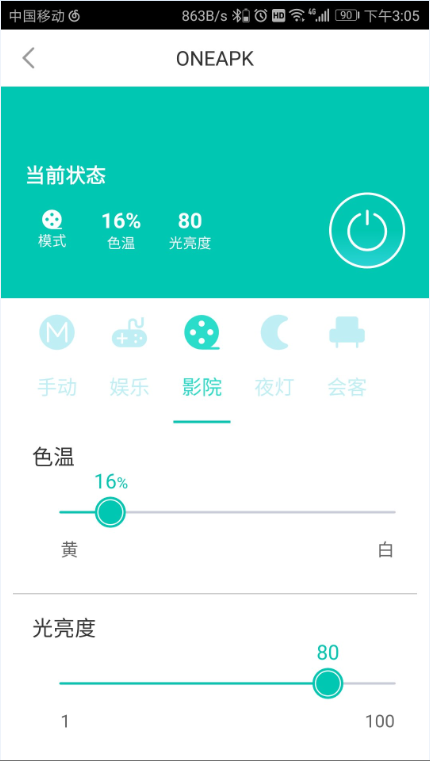

## 4. 热点配网

1. 当一键配网失败（超时）后，可以选择热点模式进行配网。

    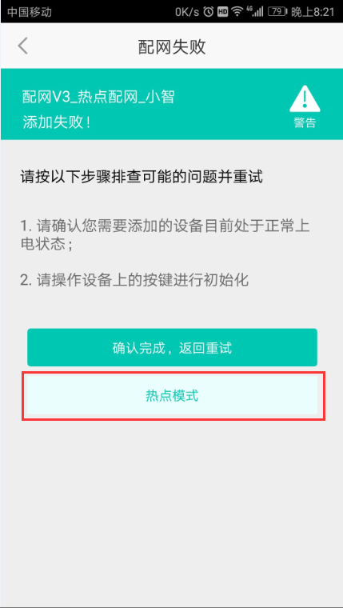

2. 点击进入热点模式后手机将会创建一个 SSID 为 “aha”，密码为 “12345678” 的热点，模块在热点配网模式下会不断搜索这个热点，一旦搜索到这个热点之后就会与这个热点建立连接。

    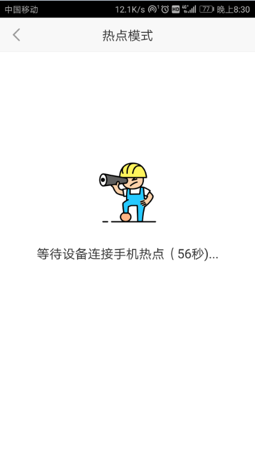

    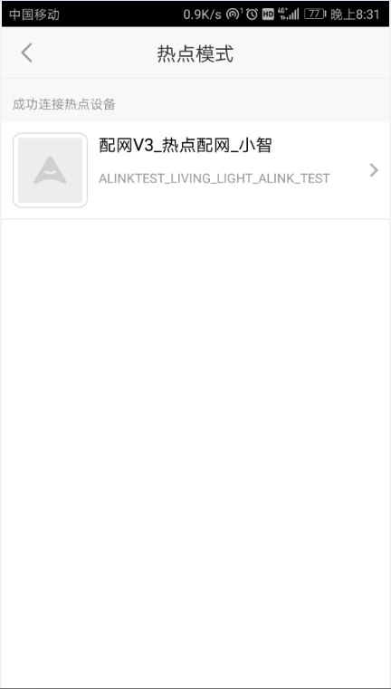

3. 点击连接上热点的设备后，APP 会提示你选取模块后面需要连接的路由器，并输入相应的密码；APP 将会通过手机热点将路由器的 SSID 和 password 发送给设备端。

    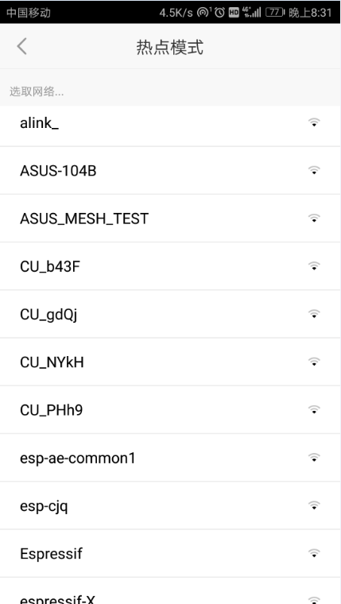

    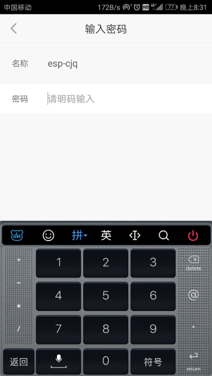

4. 设备端成功接收到 SSID 和 password 之后就会与手机热点断开，并尝试去连接指定的路由器；从这一步开始就与一键配网是类似的，首先连接路由，然后连接服务器，最后上报激活指令完成配网。

    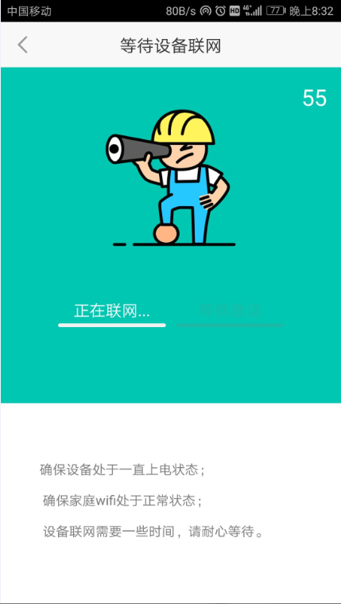

    