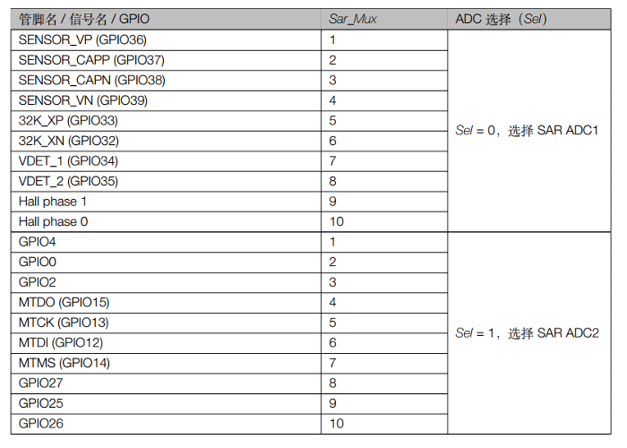
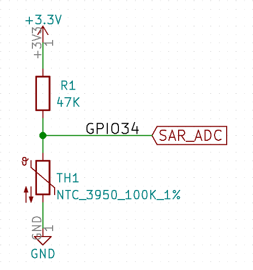
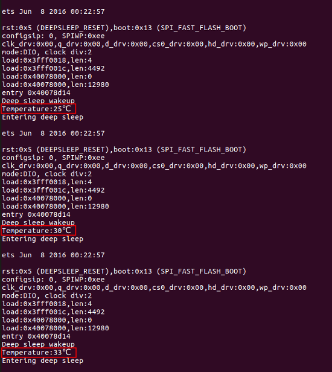

(English version will be released soon)

# ULP ADC Example

本文档介绍了在超低功耗模式下，通过 SAR_ADC 读取 NTC 热敏电阻电压值，并计算出当前室内温度值的例子。

### 1. 逐次逼近数字模拟转换器
ULP 协处理器支持在超低功耗模式下 ADC 测量指令，这种便利的模数转换，给超低功耗模式的应用带来众多可能。

下表是 SAR ADC 的通道和相关管脚信息：



### 2. 硬件原理图
此例中，我们使用 SAR ADC1，输入管脚是 GPIO34，对应 SAR_MUX 通道7，NTC 热敏电阻型号是 3950 100K 1% 。



### 3. 软件部分
NTC 热敏电阻随着温度阻值变化是非线性的，我们采用查表法，在汇编程序中构造了一个从 -5℃ 到 100℃ 的 ADC 数值表。

下面是部分的电压数值表，为了阻止查表超量程溢出，我们在表格的末尾设置数值为 0xffff 作为表格结束的标记。
```
.global thermistor_lut
thermistor_lut:
		.long 0x0D33	//	-5 degree centigrade
		.long 0x0D1F	//	-4 
		.long 0x0D0C	//	-3 
		.long 0x0CF8	//	-2 
		.long 0x0CE4	//	-1 
		.long 0x0CD0	//	0
		.long 0x0CBB	//	1
		.long 0x0CA6	//	2
		.long 0x0C90	//	3
		.long 0x0C7A	//	4
		.long 0x0C63	//	5
		.long 0x0C4B	//	6
		.long 0x0C32	//	7
		.long 0x0C19	//	8
		.long 0x0BFE	//	9
        ...
		.long 0x0250	//	90
		.long 0x0240	//	91
		.long 0x0230	//	92
		.long 0x0222	//	93
		.long 0x0213	//	94
		.long 0x0205	//	95
		.long 0x01F8	//	96
		.long 0x01EB	//	97
		.long 0x01DE	//	98
		.long 0x01D2	//	99
		.long 0x01C5	//	100
		.long 0xffff	//	end
```

汇编代码先通过 ADC 指令读取 NTC 热敏电阻的电压，获取模数转换后的 ADC 值，经过多次采集取平均值后，将此 ADC 值和 thermistor_lut 表中的数值对比，依次查找表中的 ADC 数值获得当前室内温度。

````
	move r3, temperature
	ld r1, r3, 0
	/* initialize temperature every calculate loop */
	move r1, 0 
	st r1, r3, 0
	/* use r3 as thermistor_lut pointer */
	move r3, thermistor_lut 
look_up_table:
	/* load table data in R2 */
	ld r2, r3, 0 

	/* check if at the table_end */
	sub r1, r2, 0xffff
	/* if hit the tail of table, jump to table_end */
	jump out_of_range, eq
	
	/* thermistor_lut - last_result */
	sub r2, r0, r2
	/* adc_value < table_value */
	jump move_step, ov 
	/* adc_value > table_value, get current value */
	jump wake_up
out_of_range:
	move r1, temperature
	ld r2, r1, 0
	/* Maximum range 100 degree centigrade */
	move r2, 105 
	st r2, r1, 0
	jump wake_up
move_step:
	/* move pointer a step */
	add r3, r3, 1 

	move r1, temperature
	ld r2, r1, 0
	/* temperature count 1 */
	add r2, r2, 1 
	st r2, r1, 0
	jump look_up_table
````

上面汇编代码是一个查表的过程，每移动一步，temperature 值就加一，但需要注意此表格是从 -5℃ 开始的，因此在最后打印时候需要减去这个偏移量以获取正确的温度值。

```C
/* Count temperature form -5 ℃ , so ulp_temperature minus 5 */
printf("Temperature:%d℃\n", (int16_t)ulp_temperature - 5); 
```

### 4. 最终效果
在计算出室内温度后，唤醒 CPU 打印室温值，下图是测试中用手指传递热量给热敏电阻，串口打印的截图。



