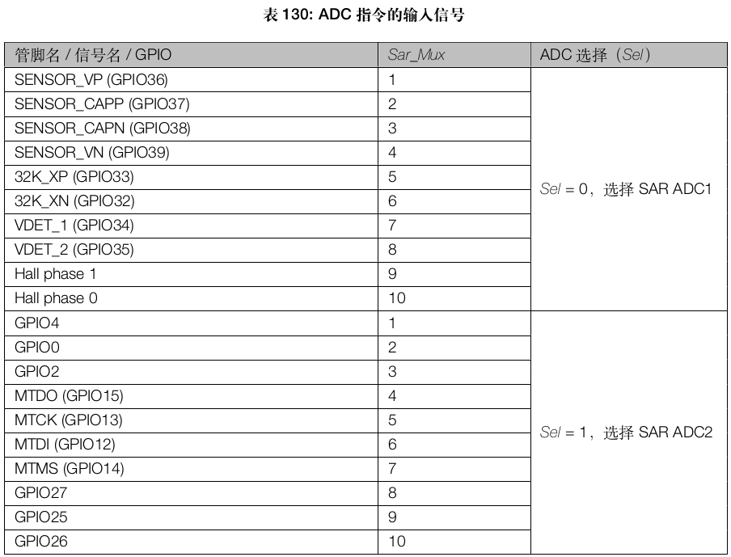
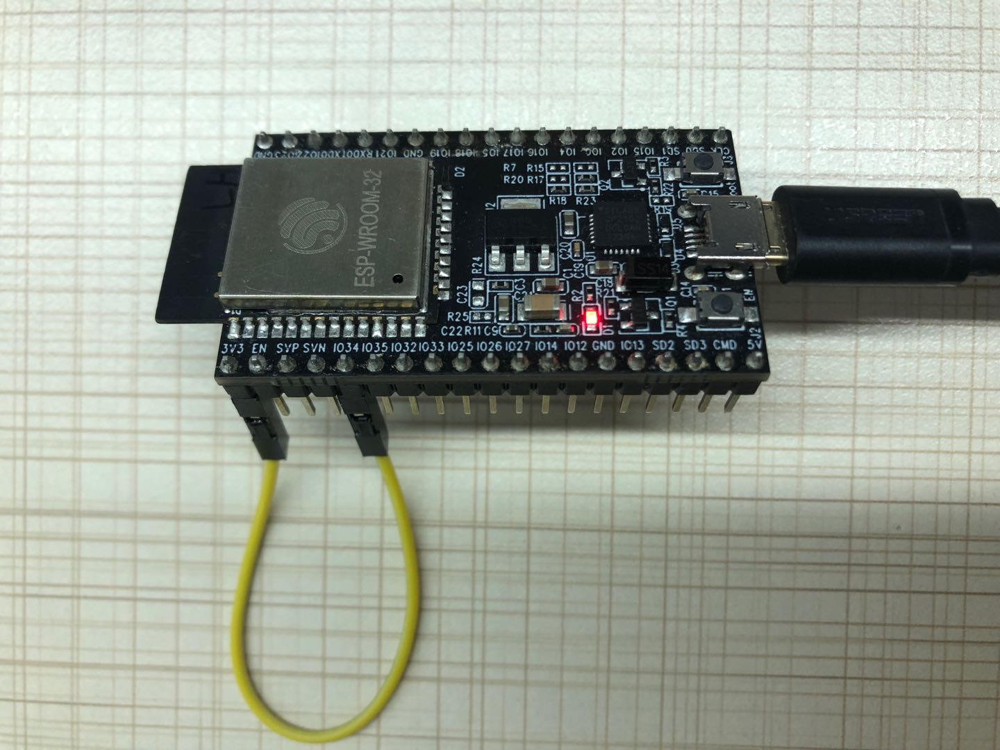

# ULP Coprocessor Detect ESP32 Brownout
该示例利用 ULP 协处理器的 ADC 测量功能，在后台轮询检测 VDD33 引脚的电压值，并在电压不稳定情况下做相应处理。

### 1. 硬件连接

参考 [ESP32 技术手册](https://www.espressif.com/sites/default/files/documentation/esp32_technical_reference_manual_en.pdf) ，ULP 的 [ADC](https://docs.espressif.com/projects/esp-idf/en/stable/api-guides/ulp_instruction_set.html#adc-do-measurement-with-adc) 指令可以选择的 ADC 通道及 GPIO 引脚如下图所示：

<div align=center>

</div>

本例子中，选择 SAR ADC1 的第 7 通道（GPIO34），通过外部跳线，接至 VDD33 引脚进行电压测量，如下图所示：

<div align=center>

</div>

### 2. 软件工作原理 
主 CPU 在 **非睡眠模式** 启动后，需要进行如下设置：

- 配置 SAR ADC1，并使能 ULP 对其访问功能
- 初始化并使能 RTC 看门狗定时器
- 加载并启动 ULP 程序

ULP 程序启动后会一直轮询检测 VDD33 引脚的电压值：

- 若电压值低于程序设定的 Brownout 阈值，则关掉数字内核，射频电路，并且停止 CPU
- 若电压值从低位提升到设定的 Brownout 阈值，ULP 通过 RTC WDT 超时重置整个系统

> 注意：由于 ULP 不可以访问数字部分的模块，故无法读取 EFUSE 中的 ADC 校准参数来对 SAR ADC1 测量结果进行校准，所以最后 SAR ADC1 的测量结果会因不同模组类型有一些偏差。

### 3. 汇编代码

下面分段介绍汇编代码的意图和实现方法。

- ULP 通过 ADC 指令多次采样 VDD33 引脚电压值并取平均值：
```assembly
measure:
    /* measure and add value to accumulator */
    adc r1, 0, adc1_chn_6 + 1
    add r0, r0, r1
    /* increment loop counter and check exit condition */
    stage_inc 1
    jumps measure, oversample, lt

    /* divide accumulator by oversample.
       Since it is chosen as a power of two, use right shift */
    rsh r0, r0, oversample_power
    /* averaged value is now in r0, store it into last result */
    move r3, last_result
    st r0, r3, 0
```

- 当 ULP 读取的 VDD33 引脚电压低于设定的阈值时，设置 Brownout 标志位，同时关掉数字内核，射频电路，并且停止 CPU：
```
low_voltage:
    /* set brownout_flag to 1 */
    move r3, brownout_flag
    move r2, 1
    st r2, r3, 0
    /* power down digital core in sleep */
    WRITE_RTC_REG(RTC_CNTL_DIG_PWC_REG, RTC_CNTL_DG_WRAP_PD_EN_S, 1, 0)
    /* power down Wi-Fi in sleep */
    WRITE_RTC_REG(RTC_CNTL_DIG_PWC_REG, RTC_CNTL_WIFI_PD_EN_S, 1, 0)
    /* software stall CPU */
    WRITE_RTC_REG(RTC_CNTL_SW_CPU_STALL_REG, RTC_CNTL_SW_STALL_PROCPU_C1_S, 6, 0x21)
    WRITE_RTC_REG(RTC_CNTL_SW_CPU_STALL_REG, RTC_CNTL_SW_STALL_APPCPU_C1_S, 6, 0x21)
    WRITE_RTC_REG(RTC_CNTL_OPTIONS0_REG, RTC_CNTL_SW_STALL_PROCPU_C0_S, 2, 2)
    WRITE_RTC_REG(RTC_CNTL_OPTIONS0_REG, RTC_CNTL_SW_STALL_APPCPU_C1_S, 2, 2)
    jump feed_dog
```

- 只有在 VDD33 引脚电压值 **从低位提升到设定的 Brownout 阈值** 时，才会跳过喂狗程序，等待 RTC 看门狗定时器超时重置整个芯片。其余情况下都会定期给 RTC WDT 喂狗：

```assembly
feed_dog:
    /* Write 0x50d83aa1 to RTC_CNTL_WDTWPROTECT_REG unlock RTC-WDT registers,
        please refer to soc/rtc_cntl_reg.h for more info */
    WRITE_RTC_REG(RTC_CNTL_WDTWPROTECT_REG, 0, 8, 0xa1)
    WRITE_RTC_REG(RTC_CNTL_WDTWPROTECT_REG, 8, 8, 0x3a)
    WRITE_RTC_REG(RTC_CNTL_WDTWPROTECT_REG, 16, 8, 0xd8)
    WRITE_RTC_REG(RTC_CNTL_WDTWPROTECT_REG, 24, 8, 0x50)
    /* feed RTC-WDT */
    WRITE_RTC_REG(RTC_CNTL_WDTFEED_REG, RTC_CNTL_WDT_FEED_S, 1, 1)
    /* write any data to lock RTC-WDT registers */
    WRITE_RTC_REG(RTC_CNTL_WDTWPROTECT_REG, 0, 8, 0)
    halt
```

### 4. 程序运行结果

主 CPU 启动后，定时打印  ULP 读取的 VDD33 引脚电压值（ADC 原始值和转换后的电压值）。ULP 协处理器被设定为定时 100ms 醒来检测 VDD33 引脚电压值，该示例中 Brownout 阈值设置为 2.76v。

以下为程序运行的日志：

````tex
rst:0x1 (POWERON_RESET),boot:0x13 (SPI_FAST_FLASH_BOOT)
ets Jun  8 2016 00:22:57

rst:0x10 (RTCWDT_RTC_RESET),boot:0x13 (SPI_FAST_FLASH_BOOT)
configsip: 0, SPIWP:0xee
clk_drv:0x00,q_drv:0x00,d_drv:0x00,cs0_drv:0x00,hd_drv:0x00,wp_drv:0x00
mode:DIO, clock div:2
load:0x3fff0018,len:4
load:0x3fff001c,len:5152
ho 0 tail 12 room 4
load:0x40078000,len:10768
load:0x40080400,len:6300
entry 0x4008070c
Not ULP wakeup, start ULP program
ulp_low_thr: 3825
system in active mode [0s], voltage: [0][0.000]
system in active mode [1s], voltage: [4085][3.272]
system in active mode [2s], voltage: [4091][3.289]
system in active mode [3s], voltage: [4011][3.069]
system in active mode [4s], voltage: [3980][2.994]
system in active mode [5s], voltage: [3959][2.972]
system in active mode [6s], voltage: [3952][2.964]
system in active mode [7s], voltage: [3949][2.961]
system in active mode [8s], voltage: [3926][2.937]
system in active mode [9s], voltage: [3902][2.912]
system in active mode [10s], voltage: [3868][2.804]
system in active mode [11s], voltage: [3854][2.788]
system in active mode [12s], voltage: [3853][2.787]
ets Jun  8 2016 00:22:57

rst:0x10 (RTCWDT_RTC_RESET),boot:0x13 (SPI_FAST_FLASH_BOOT)
configsip: 0, SPIWP:0xee
clk_drv:0x00,q_drv:0x00,d_drv:0x00,cs0_drv:0x00,hd_drv:0x00,wp_drv:0x00
mode:DIO, clock div:2
load:0x3fff0018,len:4
load:0x3fff001c,len:5152
ho 0 tail 12 room 4
load:0x40078000,len:10768
load:0x40080400,len:6300
entry 0x4008070c
Not ULP wakeup, start ULP program
ulp_low_thr: 3825
system in active mode [0s], voltage: [0][0.000]
system in active mode [1s], voltage: [3858][2.791]
system in active mode [2s], voltage: [3859][2.792]
system in active mode [3s], voltage: [3860][2.793]
system in active mode [4s], voltage: [3858][2.791]
system in active mode [5s], voltage: [3890][2.896]
system in active mode [6s], voltage: [3898][2.907]
system in active mode [7s], voltage: [3935][2.946]
system in active mode [8s], voltage: [3971][2.984]
system in active mode [9s], voltage: [4022][3.099]
````

分析日志可知：当 ULP 检测到 VDD33 引脚电压值低于 Brownout 阈值时，关闭了 CPU。即系统在打印如下日志后停止了打印：

```tex
system in active mode [12s], voltage: [3853][2.787]
```

之后 VDD33 引脚电压值从低位恢复到设定的 Brownout 阈值时，ULP 停止喂狗程序，RTC 看门狗定时器超时后重置整个系统，系统重新运行。
