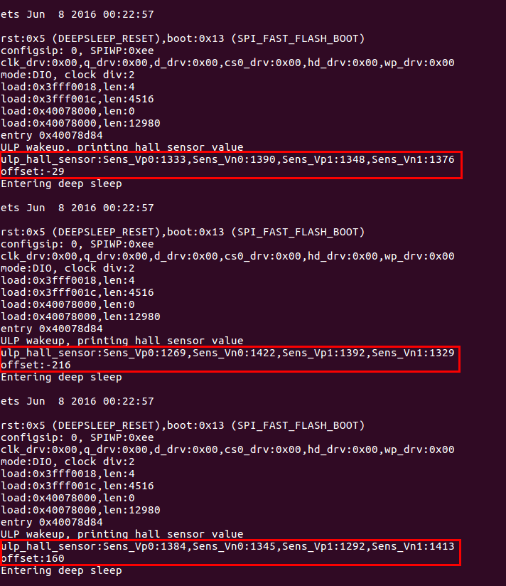
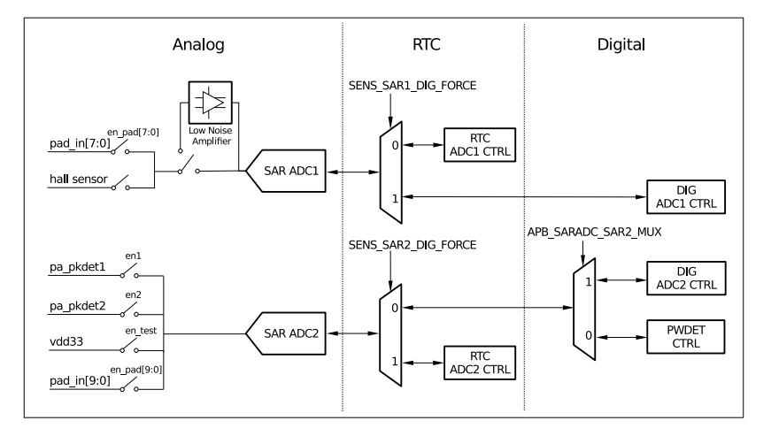

[[中文]](./readme_cn.md)
# ULP Co-processor Reads On-chip Hall Sensor in Low-Power Mode
This document provides an example of a ULP co-processor reading an on-chip Hall sensor in low-power mode.

## 1. Hall Sensor
The Hall effect is the generation of a voltage difference across an N-type semiconductor passing electrical current, when a magnetic field is applied to it in a direction perpendicular to that of the flow of the current. The value of the Hall voltage is proportional to the product of the magnetic field strength and the current. A Hall-effect sensor could be used to measure the strength of a magnetic field when constant current flows through it, or when the current is in the presence of a constant magnetic field. As the heart of many applications, Hall-effect sensors provide proximity detection, positioning, speed measurement, and current sensing.

## 2. An Example Showing How a Hall Sensor is read
In this example, the ULP co-processor wakes up every 3s and reads the Hall sensor values ​​in low-power mode. In total, the ULP co-processor reads the `Sens_Vp0` and `Sens_Vn0` during two different phases, which means it will eventually get four values in total (two vp values and two vn values, respectively). Then, the ULP co-processor calculates the `offset` value by subtracting the common-mode parts, i.e. offset = [(Vp0 - Vp1) - (Vn0 - Vn1)]. The offset can be used to characterize the impact of the environment on the Hall sensor. As shown in the figure below, the values printed for the first time are the Hall sensor values obtained when there is no strong magnetic field around. The values of the second print are the values obtained when the N pole of a NdFeB magnet is close to ESP32. The values of the third print are the values obtained when the S pole of a NdFeB magnet is close to ESP32. As it can be seen in the figure, the Hall sensor values change significantly across the three different prints.



## 3. System Connection
The connection between the Hall sensor and the SAR ADC is shown below. The SENSOR_VP and SENSOR_VN pins of the Hall sensor are connected to channel 1 and channel 4 of SAR ADC1, respectively.



The following table shows the SAR ADC1 input signals and their corresponding SAR_MUX channels:

|Signal Name/GPIO|SAR_ADC1, SAR_MUX|
|---|:---:|
|SENSOR_VP (GPIO36)|1|
|SENSOR_CAPP (GPIO37)|2|
|SENSOR_CAPN (GPIO38)|3|
|SENSOR_VN (GPIO39)|4|
|32K_XP (GPIO33)|5|
|32K_XN (GPIO32)|6|
|VDET_1 (GPIO34)|7|
|VDET_2 (GPIO35)|8|

## 4. Configure the Compiler and Download Programs
For information on how to install the C compiler environment and complete the relevant configuration for ESP32, please click [here](https://docs.espressif.com/projects/esp-idf/en/stable/get-started/index.html#setup-toolchain). In addition, the ULP co-processor currently supports assembly programming only. Therefore, the installation of the assembly toolchain is also required. The text below introduces the steps to install the assembly toolchain and complete the relevant configuration.

##### 4.1 Configuration of the Assembly Language Environment
The installation and configuration of the assembly toolchain in the ULP co-processor are very simple and can be completed in just two steps. Here we introduce how to complete the installation and configuration of the toolchain in the Ubuntu operating system. Besides, you can also click [here](https://docs.espressif.com/projects/esp-idf/en/stable/api-guides/ulp.html) for more information on the ULP programming.

>* Step 1: Download the [binutils-esp32ulp]( https://github.com/espressif/binutils-esp32ulp/wiki#downloads) toolchain, and extract it in the directory you want it to be installed.
>* Step 2: Add the `bin` directory of the toolchain to the `PATH` system environment variable. For example, assuming the unzip directory of the toolchain is `/opt/esp32ulp-elf-binutils`, then you should add `export PATH=/opt/esp32ulp-elf-binutils/bin:$PATH` to the end of the hidden file `.Bashrc`, which is located at the `/home` dictionary. Then, save and close this file, and use the `source .bashrc` command to enable the `PATH` environment variable.

##### 4.2 Default Config, Compile and Download
At this point, the installation of the assembly language environment is complete. To also complete the default config and start compiling and downloading programs, execute the following commands at [esp-iot-solution](https://github.com/espressif/esp-iot-solution)/examples/ulp_hall_sensor/ in sequence. 

Make:
>* make defconfig
>* make all -j8 && make flash monitor

CMake
>* idf.py defconfig
>* idf.py flash monitor

## 5. Software Analysis
The ULP co-processor does not have built-in assembly instructions that read the Hall sensor, so we need to set up registers to read the on-chip Hall sensor.

Set the voltage attenuation of `ADC1_CHANNEL_0` and `ADC1_CHANNEL_3` to 1/2 with the `void init_ulp_program()` function. Please, note that users can define the attenuation value themselves. The greater the attenuation is, the smaller the ADC value is, as well.

```C
    /* The ADC1 channel 0 input voltage will be reduced to about 1/2 */
    adc1_config_channel_atten(ADC1_CHANNEL_0, ADC_ATTEN_DB_6);
    /* The ADC1 channel 3 input voltage will be reduced to about 1/2 */
    adc1_config_channel_atten(ADC1_CHANNEL_3, ADC_ATTEN_DB_6);
    /* ADC capture 12Bit width */
    adc1_config_width(ADC_WIDTH_BIT_12);
    /* enable adc1 */
    adc1_ulp_enable();                 
```

In the ultra-low-power mode, the Hall sensor value can be read only by the SAR ADC1, after having set the relevant registers.

```C
	/* SENS_XPD_HALL_FORCE = 1, Hall sensor's force-enable, XPD HALL, is controlled by SW */
	WRITE_RTC_REG(SENS_SAR_TOUCH_CTRL1_REG, SENS_XPD_HALL_FORCE_S, 1, 1)

	/* RTC_IO_XPD_HALL = 1, xpd hall, Power on the Hall sensor and connect it to VP and VN */
	WRITE_RTC_REG(RTC_IO_HALL_SENS_REG, RTC_IO_XPD_HALL_S, 1, 1)

	/* SENS_HALL_PHASE_FORCE = 1, phase force, HALL PHASE is controlled by SW */
	WRITE_RTC_REG(SENS_SAR_TOUCH_CTRL1_REG, SENS_HALL_PHASE_FORCE_S, 1, 1)

	/* RTC_IO_HALL_PHASE = 0, phase of the Hall sensor */
	WRITE_RTC_REG(RTC_IO_HALL_SENS_REG, RTC_IO_HALL_PHASE_S, 1, 0)

	/* SENS_FORCE_XPD_SAR, Forced power-up */
	WRITE_RTC_REG(SENS_SAR_MEAS_WAIT2_REG, SENS_FORCE_XPD_SAR_S, 2, SENS_FORCE_XPD_SAR_PU)
```

After that, read the phase_vp and phase_vn values of the on-chip Hall sensor multiple times by using the ADC instruction, and then save their average values in `Sens_Vp0` and `Sens_Vn0`, respectively.

```asm
	/* do measurements using ADC */
	/* r2, r3 will be used as accumulators */
	move r2, 0
	move r3, 0	
	/* initialize the loop counter */
	stage_rst
measure0:
	/* measure Sar_Mux = 1 to get vp0   */
	adc r0, 0, 1
	add r2, r2, r0

	/* measure Sar_Mux = 4 to get vn0 */
	adc r1, 0, 4
	add r3, r3, r1

	/* increment loop counter and check exit condition */
	stage_inc 1
	jumps measure0, adc_oversampling_factor, lt

	/* divide accumulator by adc_oversampling_factor.
	   Since the divide accumulator is chosen as a power of two, use right shift */
	rsh r2, r2, adc_oversampling_factor_log

	/* The average value is now in r2; store it into Sens_Vp0 */
	move r0, Sens_Vp0
	st r2, r0, 0

	/* r3 divide 4 which means rsh 2 bits */
	rsh r3, r3, adc_oversampling_factor_log
	/* The average value is now in r3; store it into Sens_Vn0 */
	move r1, Sens_Vn0
	st r3, r1, 0
```

Next, you need to shift the phase of the Hall sensor. Set the `RTC_IO_HALL_PHASE` bit in the `RTC_IO_HALL_SENS_REG` register to 1. Similarily, read the phase_vp and phase_vn values ​​of the on-chip Hall sensor, again, multiple times, and then save their average values in `Sens_Vp1` and `Sens_Vn1`, respectively.

```C
	/* RTC_IO_HALL_PHASE = 1, phase of hall sensor */
	WRITE_RTC_REG(RTC_IO_HALL_SENS_REG, RTC_IO_HALL_PHASE_S, 1, 1)
```

In the end, after waking up the main CPU, calculate the offset value by using the following values: `Sens_Vp0`, `Sens_Vn0`, `Sens_Vp1` and `Sens_Vn1`. Then, print out the offset value.

```C
static void print_hall_sensor()
{
    printf("ulp_hall_sensor:Sens_Vp0:%d,Sens_Vn0:%d,Sens_Vp1:%d,Sens_Vn1:%d\r\n",
        (uint16_t)ulp_Sens_Vp0,(uint16_t)ulp_Sens_Vn0,(uint16_t)ulp_Sens_Vp1,(uint16_t)ulp_Sens_Vn1);  
    printf("offset:%d\r\n",  ((uint16_t)ulp_Sens_Vp0 - (uint16_t)ulp_Sens_Vp1) - ((uint16_t)ulp_Sens_Vn0 - (uint16_t)ulp_Sens_Vn1));
}
```


## 6. Conclusion
The Hall sensor in ESP32 is specifically designed to provide voltage signals to the LNA and SAR ADC for magnetic field sensing. In the ultra-low-power mode, the sensor can be controlled by the ULP co-processor. By incorporating Hall sensors, ESP32 becomes an attractive solution for applications, such as position sensing, proximity sensing, velocity sensing, and current sensing.

## 7. References
1. Section regarding the Hall sensor in [ESP32 Technical Reference Manual](https://www.espressif.com/sites/default/files/documentation/esp32_technical_reference_manual_en.pdf).
2. Section regarding the SAR ADC in [ESP32 Technical Reference Manual](https://www.espressif.com/sites/default/files/documentation/esp32_technical_reference_manual_en.pdf).

 