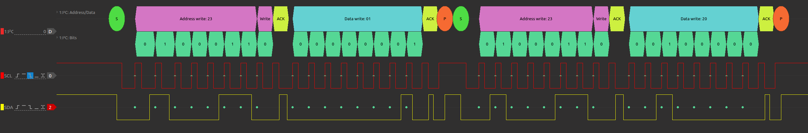
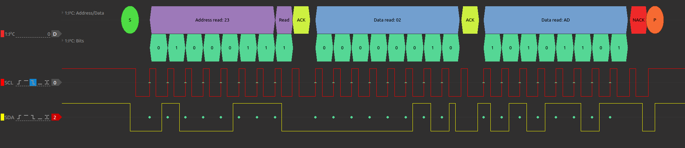
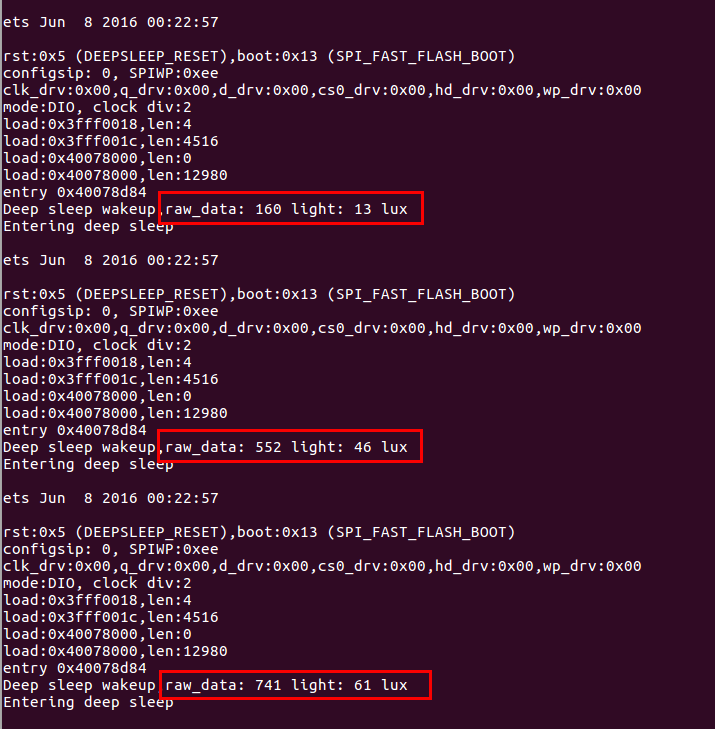

(English version will be released soon)

# ULP 协处理器在超低功耗模式下软件模拟 I2C 读取光照传感器（汇编）
本文是关于 ULP 协处理器在低功耗模式下模拟 I2C 主机读取光照传感器 BH1750 的例子  

## 1. I2C 管脚分配
软件模拟 I2C 的例子使用 RTC_GPIO9, RTC_GPIO8 两个管脚, 对应的 GPIO 管脚如下表 

|I2C_PIN|RTC_GPIO|GPIO|
|---|---|---|
|I2C_SCL|RTC_GPIO9|GPIO32|
|I2C_SDA|RTC_GPIO8|GPIO33|

## 2.软件环境配置
ESP32 的 C 语言编译环境安装和配置参照 [链接地址](https://docs.espressif.com/projects/esp-idf/en/latest/get-started/index.html#setup-toolchain)，另外 ULP 协处理器目前只支持汇编编程，所以还需要安装汇编工具链，下面介绍汇编工具链的安装和配置。
#### 2.1 汇编环境的配置
ULP 协处理器配置汇编编译工具链，只需两步即可安装配置完毕，下面给出 ubuntu 操作系统下配置的步骤，或者点击 [链接地址](http://docs.espressif.com/projects/esp-idf/en/latest/api-guides/ulp.html) 获得更多 ULP 编程信息
>* 第一步, 下载工具链 `binutils-esp32ulp toolchain`  [链接地址]( https://github.com/espressif/binutils-esp32ulp/wiki#downloads), 解压到需要安装的目录
>* 第二步，添加工具链的 `bin` 目录到系统环境变量 `PATH` 中。例如我的解压目录是 `/opt/esp32ulp-elf-binutils` 那么添加 `export PATH=/opt/esp32ulp-elf-binutils/bin:$PATH` 这一行到 /home 目录的隐藏文件 `.bashrc` 文件最后一行，保存关闭文件并使用命令 `source .bashrc` 使上述环境变量生效

#### 2.2 配置编译烧录
至此，汇编编译环境就安装好了，在 ulp_i2c_bitbang/ 目录下依次运行以下命令，进行 default config 配置并编译、烧录程序。
>* make defconfig
>* make all -j8 && make flash monitor

## 3. stack.S 堆栈宏说明
由于当前 ULP 协处理器汇编环境没有实现关于子函数的调用和返回堆栈保存等操作，需要用户来实现和构造这部分。所以在四个通用寄存器中我们牺牲 R3 寄存器用来当做栈指针，实现了 4 个关于堆栈操作的宏 PUSH、POP、PSR、RET，以上的宏在 stack.S 汇编文件中。

1. push，这个操作是把 Rx（R0，R1，R2）的数据压到 R3 所指向的栈里，栈指针向下增长
```
.macro push rx
	st \rx,r3,0
	sub r3,r3,1
.endm
```
2. pop，把 R3 所指向的栈里的数据保存到 Rx（R0,R1,R2）中，栈指针回退
```
.macro pop rx
	add r3,r3,1
	ld \rx,r3,0
.endm
```
3. psr，这个宏是计算出函数执行完毕后需要返回的地址，将其保存到栈上，即当前地址加上偏移 16 就是子函数跳转执行完毕后需要返回的地址
```
.macro psr 
	.set addr, (.+16)
	move r1, addr
	push r1
.endm
```
4. ret，此宏是把栈上保存的返回地址取出来，然后跳转到这个地址
```
.macro ret 
	pop r1
	jump r1
.endm
```

## 4. i2c.S 汇编函数说明
用户可以自由调用下表中的汇编函数，组合成自己需要的 I2C 读写函数，需注意在调用子函数前插入 psr 宏，获取汇编子函数返回地址。

|序号| 汇编函数 | 传入参数 | 返回参数 |传参形式|函数说明|
|:---:|:---|:---:|:---:|:---:|---|
|1|i2c_start_cond|i2c_didInit, i2c_started|i2c_didInit, i2c_started|全局变量|检查是否初始化 I2C 管脚及是否进行过 I2C_START，初始化 I2C 管脚且发送 I2C_START 信号|
|2|i2c_stop_cond| - |i2c_started | 全局变量 |发送 I2C_STOP 信号，清除 i2c_started 值|
|3|i2c_write_bit|R0| - |寄存器|根据 R0 的值，发送 BIT0 或 BIT1 |
|4|i2c_read_bit| - | R0 |寄存器|从 SDA 数据线上读 1 Bit 的数据，保存在 R0 中|
|5|i2c_write_byte| R2 |R0|寄存器|把 R2 中的数据发送出去，读取从机 ACK 保存在 R0 中，如果收到 Slave 的 ACK 返回 0 |
|6|i2c_read_byte| R0 |R0|寄存器|从 SDA 数据线上读取 1 Byte 数据并依据传入参数 R0 值回复 ACK 或 NACK，返回的数据保存在 R0 中 |

## 5. i2c_dev.S 汇编函数
|序号| 汇编函数 | 传入参数 | 返回参数 |传参形式|函数说明|
|:---:|:---|:---:|:---:|:---:|---|
|1|Read_BH1750|BH1750_ADDR_R, R2| R2 |堆栈，全局变量|从 I2C BUS 上读 16bit 值|
|2|Cmd_Write_BH1750|Dev_addr, Command| - | 堆栈 | Write Command|
|3|Start_BH1750|Dev_addr, Command| - |堆栈|设置 BH1750 工作模式|
|4|Task_BH1750| - | - | - | 读一次 BH1750 光照数值|
|5|waitMs|R2| - |寄存器|R2 传入需要延迟的 MS，例如 R2 = 5，则延迟 5MS |

## 6. 读取光照传感器
I2C 设置 BH1750 的时序如下


I2C 测量 BH1750 的光照结果，时序如下


ULP 协处理器通过软件模拟 I2C 读取 BH1750 的光照强度打印在如下图中，通过遮挡传感器的光栅窗口可获得不同的光照数值。



## 7. 总结
我们构造了 4 个用于堆栈管理的宏，方便的进行函数跳转和函数返回，比较容易实现大型的复杂的 ESP32 超低低功耗应用。

 