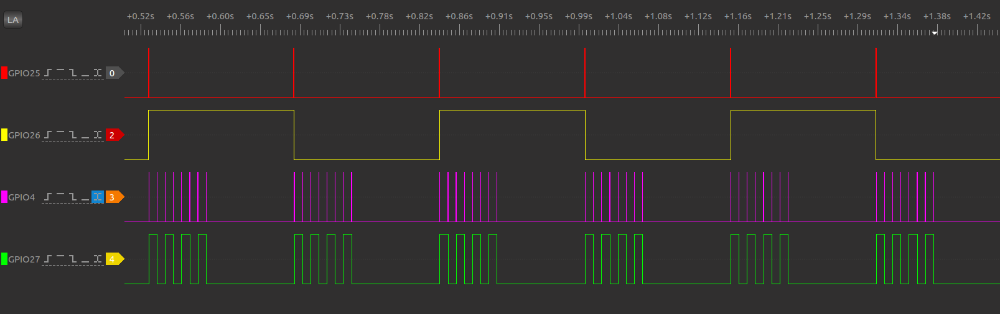
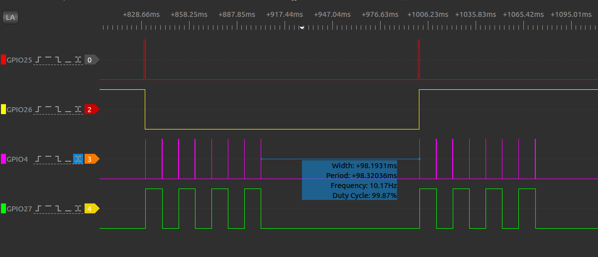

# ULP 协处理器在低功耗模式下操作 RTC GPIO 的例子

本文目的是介绍如何在 ULP 协处理器中操作 RTC GPIO 

## 1. RTC GPIO
RTC GPIO 一共有 18 个 IO 口，这些 GPIO 管脚具有低功耗 RTC 性能和模拟功能，并且由 ESP32 的 RTC 子系统控制。这些功能不使用 IO_MUX 和 GPIO 交换矩阵，而是使用 RTC_MUX 将 IO 指向 RTC 子系统。

当这些管脚被配置为 RTC GPIO 管脚时，作为输出的管脚能够在芯片处于 Deep-Sleep 睡眠状态下保持输出电平值，或者作为输入管脚使用时可以将芯片从 Deep-Sleep 中唤醒。

下表列出了 RTC 管脚和其对应的 GPIO 管脚

|RTC GPIO Num|GPIO Num|Pad Name|Analog Function1|Analog Function2|Analog Function3|
|:---:|:---:|---|---|---|---|
|0|36|SENSOR_VP|ADC_H|ADC1_CH0| - |
|1|37|SENSOR_CAPP|ADC_H|ADC1_CH1| - |
|2|38|SENSOR_CAPN|ADC_H|ADC1_CH2| - |
|3|39|SENSOR_VN| - |ADC1_CH3| - |
|4|34|VDET_1| - |ADC1_CH6| - |
|5|35|VDET_2| - |ADC1_CH7| - |
|6|25|GPIO25|DAC_1|ADC2_CH8| - |
|7|26|GPIO26|DAC_2|ADC2_CH9| - |
|8|33|32K_XN|XTAL_32K_N|ADC1_CH5|TOUCH8|
|9|32|32K_XP|XTAL_32K_P|ADC1_CH4|TOUCH9|
|10|4|GPIO4| - |ADC2_CH0|TOUCH0|
|11|0|GPIO0| - |ADC2_CH1|TOUCH1|
|12|2|GPIO2| - |ADC2_CH2|TOUCH2|
|13|15|MTDO| - |ADC2_CH3|TOUCH3|
|14|13|MTCK| - |ADC2_CH4|TOUCH4|
|15|12|MTDI| - |ADC2_CH5|TOUCH5|
|16|14|MTMS| - |ADC2_CH6|TOUCH6|
|17|27|GPIO27| - |ADC2_CH7|TOUCH7|

在本例子中，我们使用 GPIO25，GPIO26 指示 CPU 的工作状态；GPIO4，GPIO27 指示 ULP 协处理器的状态。

|PIN|说明|
|---|---|
|GPIO25|主 CPU 运行时置高，主 CPU 休眠时置低|
|GPIO26|每当主 CPU 被唤醒时，翻转一次电平状态|
|GPIO4|ULP 协处理器运行时置高，ULP 协处理器时休眠时置低|
|GPIO27|每当 ULP 协处理器被唤醒时，翻转一次电平状态|

## 2. RTC GPIO 翻转图示
本例子主 CPU 设置 ULP 协处理器每隔 10ms 唤醒自身一次 并且 ULP 协处理器每隔 8 个唤醒周期后，再唤醒主 CPU 一次，依此循环。每次处理器状态切换时，均有相应的 GPIO 翻转指示当前的状态。


## 3.软件部分
ESP32 的 C 语言编译环境安装和配置参照 [链接地址](https://docs.espressif.com/projects/esp-idf/en/stable/get-started/index.html#setup-toolchain)，另外 ULP 协处理器目前只支持汇编编程，所以还需要安装汇编工具链，下面介绍汇编工具链的安装和配置。
#### 3.1 汇编环境的配置
ULP 协处理器配置汇编编译工具链，只需两步即可安装配置完毕，下面给出 ubuntu 操作系统下配置的步骤，或者点击 [链接地址](https://docs.espressif.com/projects/esp-idf/en/stable/api-guides/ulp.html) 获得更多 ULP 编程信息
>* 第一步, 下载工具链 `binutils-esp32ulp toolchain`  [链接地址]( https://github.com/espressif/binutils-esp32ulp/wiki#downloads), 解压到需要安装的目录
>* 第二步，添加工具链的 `bin` 目录到系统环境变量 `PATH` 中。例如我的解压目录是 `/opt/esp32ulp-elf-binutils` 那么添加 `export PATH=/opt/esp32ulp-elf-binutils/bin:$PATH` 这一行到 /home 目录的隐藏文件 `.bashrc` 文件最后一行，保存关闭文件并使用命令 `source .bashrc` 使上述环境变量生效

至此，汇编编译环境就安装好了，将 ulp_rtc_gpio/ 目录下的 sdkconfig.defaults 复制一份改名为 sdkconfig，然后在工程中使用 `make all -j8 && make flash monitor`(Make) 或者 `idf.py flash monitor`(CMake) 编译并烧录命令时，会自动调用汇编工具链编译汇编代码。

#### 3.2 汇编代码介绍

需要注意：每个 GPIO（包括 RTC GPIO）都有单独的 hold 功能，由 RTC 寄存器控制。 GPIO 的 hold 功能被置上后， GPIO 在置上 hold 那一刻的状态被强制保持，无论内部信号如何变化，修改 IO_MUX 配置或者 GPIO 配置，都不会改变 GPIO 的状态。所以如果希望在看门狗超时触发内核复位或系统复位时亦或者 Deep-sleep 时 GPIO 的状态不被改变，就需要提前把相应GPIO 的 hold 功能置位。

在下面的汇编代码中，我们需要操作 RTC_GPIO10， 则先应 disable RTC_GPIO10 管脚的 hold 功能后，再操作 RTC_GPIO10 输出高
```
	.global entry
entry:
	/* Disable hold of RTC_GPIO10 output */
	WRITE_RTC_REG(RTC_IO_TOUCH_PAD0_REG,RTC_IO_TOUCH_PAD0_HOLD_S,1,0)
	/* Set the RTC_GPIO10 output HIGH to signal that ULP is now up */
	WRITE_RTC_REG(RTC_GPIO_OUT_W1TS_REG,RTC_GPIO_OUT_DATA_W1TS_S+10,1,1)
	/* Wait some cycles to have visible trace on the scope */
	wait 1000
```

同理，在进入 Deep-Sleep 之前，拉低 RTC_GPIO10 之后，则需要把 RTC_GPIO10 管脚的 hold 功能置位，使其在系统复位时能够保持原来的电平状态

```
	.global toggle_complete
toggle_complete:
	/* Set the RTC_GPIO10 output LOW (clear output) to signal that ULP is now going down */
	WRITE_RTC_REG(RTC_GPIO_OUT_W1TC_REG,RTC_GPIO_OUT_DATA_W1TC_S+10,1,1)
	/* Enable hold on RTC_GPIO10 output */
	WRITE_RTC_REG(RTC_IO_TOUCH_PAD0_REG,RTC_IO_TOUCH_PAD0_HOLD_S,1,1)
	/* Compare the toggle counter with toggle cycles to wakeup SoC  and wakup SoC if the values match */ 
	and r0, r3, toggle_cycles_to_wakeup
	jump wake_up, eq
```

## 4. 额外说明


如果你运行了这个例子，而且试图分析各个处理器切换状态，可能会遇到上图中额外多出的 98ms 的疑惑。这里需要说明的是，汇编程序 Polling CPU 并唤醒 CPU 时间是很短的，绝大部分的时间是用来 boot 主 CPU 的（例如主 CPU 上电动作、一级 Bootloader 加载打印等时间消耗）。因为在 DeepSleep 状态下 CPU 的各个模块都是被关掉的，如内部 8MHz 振荡器、40MHz 高速晶振、PLL 及射频模块均禁用；数字内核断电，CPU 内容丢失，这里有一个重新上电加载的过程。

```
	/* Get ULP back to sleep */
	.global exit
exit:
	halt
	.global wake_up
wake_up:
	/* Check if the SoC can be woken up */
	READ_RTC_REG(RTC_CNTL_DIAG0_REG, 19, 1)
	and r0, r0, 1
	jump exit, eq
	/* Wake up the SoC and stop ULP program */
	wake
	/* Stop the wakeup timer so it does not restart ULP */
	WRITE_RTC_FIELD(RTC_CNTL_STATE0_REG, RTC_CNTL_ULP_CP_SLP_TIMER_EN, 0)
	halt
```
 