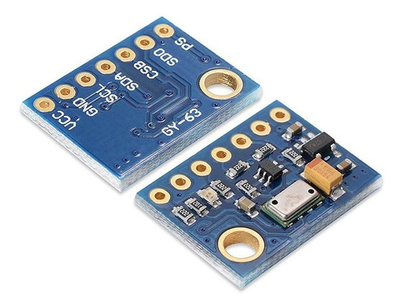
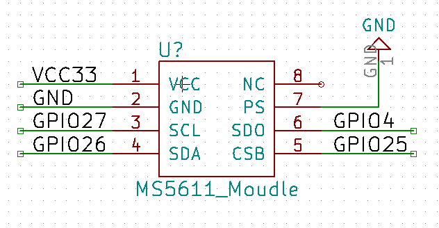
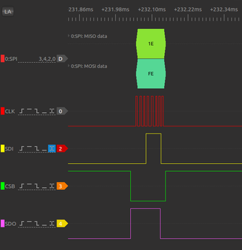
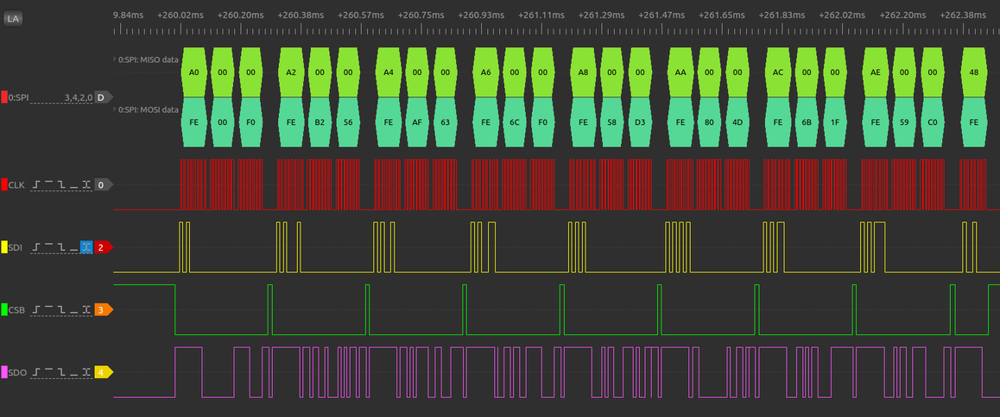
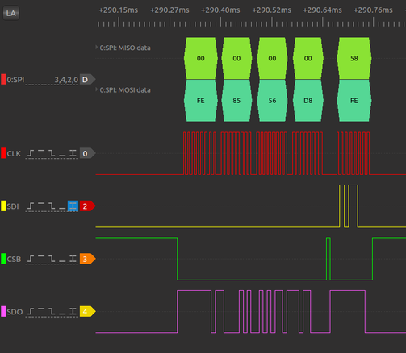
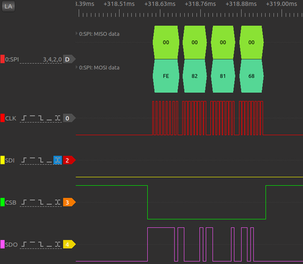
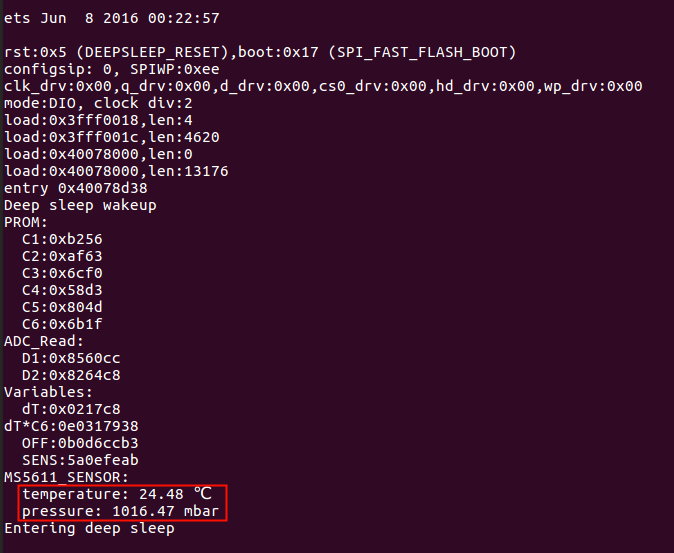

[[EN]](./readme_en.md)
# ESP32 ULP SPI Example
本文档介绍了在超低功耗模式下，使用 RTC GPIO 模拟 SPI 读取 MS5611 传感器的例子。

## 1. 硬件介绍
ESP32 的 ULP 协处理器并没有 SPI 接口，本例提供了 RTC GPIO 软件模拟出 SPI （支持 4 种 SPI 模式）的 API， 并且使用这些 API 读取 MS5611 传感器。

MS5611 是一颗高精度的大气压传感器芯片，内置 24bit AD 转换器，官方给出的最大分辨率 10cm， 在 25°C, 750 mbar 条件下分辨率 ±1.5mbar。使用到的模块提供 I2C 和 SPI 两种接口，通过 PS 管脚进行选择。PS 接高电平时，模块激活 I2C 接口；PS为低电平时，模块 SPI 接口生效。MS5611 芯片支持 SPI 模式 0 和模式 3，此例子我们使用的是 SPI 的模式 0。 
#### 1.1 传感器模块

#### 1.2 原理图

#### 1.3 SPI 接口
|NUM|GPIO|SPI|MS5611|
|---|---|---|---|
|1|GPIO_25|SPI_CS|CSB|
|2|GPIO_26|SPI_MOSI|SDA|
|3|GPIO_27|SPI_SCLK|SCL|
|4|GPIO_4|SPI_MISO|SDO|

## 2 软件介绍
本例程设计到的相关汇编宏和汇编函数众多，归纳在下面的三大表格中。具体汇编代码就不贴上来了，请对照表格中的函数说明阅读汇编代码，便于理解。
#### 2.1 RTC GPIO 宏
|NUM|汇编宏|说明|
|---|---|---|
|1|read_MISO| 读取 MISO 线上的电平状态 |
|2|clear_SCLK| SCLK 置低 |
|3|set_SCLK| SCLK 置高 |
|4|clear_MOSI| MOSI 置低 |
|5|set_MOSI| MOSI 置高 |
|6|clear_CS| CS 线置低 |
|7|set_CS| CS 线置低 |

#### 2.2 汇编函数
|NUM|汇编函数|传入参数|返回参数|说明|
|---|---|---|---|---|
|1|SPI_Init|SPI_MODE_SET| - |初始化 RTC GPIO， 根据 SPI 模式设置 SCLK 和 MOSI 线的初始电平 |
|2|CS_Disable| - | - | 为保证 API 风格一致，对汇编宏 set_CS 封装 |
|3|CS_Enable| - | - | 汇编宏 clear_CS 的封装 |
|4|SPI_Write_Byte|R2| - | 支持 SPI 的 4 种模式的写操作，默认是写一个字节(8bit), 若使能宏 SPI_BIT16，可支持 16bit 写操作|
|5|SPI_Read_Byte| - |R2| 默认读一个字节(8bit), 使能宏 SPI_BIT16 后，可支持 16bit 读操作，支持 SPI 的 4 种模式读操作 |
|6|waitMs|R2| - |延迟函数，作用是延迟 1ms，参数由 R2 传入 |
|7|MS5611_Init| CMD_RESET| - |初始化 SPI ， 初始化 MS5611 传感器，具体是发送 RESET 命令（0x1E），然后延迟 3ms 等待传感器重载 |
|8|MS5611_Save_Data|addr_pointer，prom_table| addr_pointer | Base_Addr（prom_table） +  Offset_addr（addr_pointer） 模式，把读到的传感器 RROM 数据存入内存表中，最后更新 addr_pointer 值 |
|9|MS5611_Read_PROM|PROM_NB，CMD_PROM_RD| - |读 MS5611 PROM，地址为（0xA0,0xA2,0xA4,0xA6,0xA8,0xAA,0xAC,0xAE）共 8 x 16bit 的数据|
|10|MS5611_Convert_D1|CMD_ADC_D1_4096， CMD_ADC_READ| D1_H，D1_L|Convert D1, 设置OSR = 4096, 返回 24bit 的数据，读到的数据保存在 D1_H, D1_L 中|
|11|MS5611_Convert_D2|CMD_ADC_D2_4096，CMD_ADC_READ|D2_H，D2_L|Convert D2, 设置OSR = 4096, 返回 24bit 的数据，读到的数据保存在 D2_H, D2_L 中|

#### 2.3 栈管理宏
|NUM|汇编宏|说明|
|---|---|---|
|1|push|这个宏是把 Rx（R0，R1，R2）的数据压到 R3 所指向的栈里，栈指针向下增长|
|2|pop|POP 宏是把 R3 所指向的栈里的数据保存到 Rx（R0,R1,R2）中，栈指针回退|
|3|psr|PSR 宏是计算出函数执行完毕后需要返回的地址，将其保存到栈上，即当前地址加上偏移 +16 就是子函数跳转执行完毕后需要返回的地址|
|4|ret|此宏是把栈上保存的返回地址取出来，然后跳转到这个地址|
|5|clear|此宏作用是将变量赋值清零，reset 作用|

## 3 读 MS5611 传感器
读取 MS5611 传感器，大致分为四步骤。第一步，RESET 芯片；第二步，读取 PROM 中的校准数据；第三步，启动 AD 读取温度和压力的 RAW 数据；第四步，根据校准值、温度和压力的 RAW 值计算出真实压力和温度值。
#### 3.1 RESET MS5611

#### 3.2 READ PROM

#### 3.3 ADC D1,D2
|Digital pressure value(D1)|Digital temperature value(D2)|
|---|---|
|||
#### 3.4 Calculate temperature and compensated pressure

## 4 总结
本例 ULP 协处理器读 MS5611 编写过程中，发现当前的传感器精度越来越高，但是对计算的需求也越来越大（本例是有符号的64bit乘除运算），这样给没有乘除法的 ULP 协处理器带来了很大的困难，本例子是唤醒 CPU 进行计算处理并打印出信息的。
 

