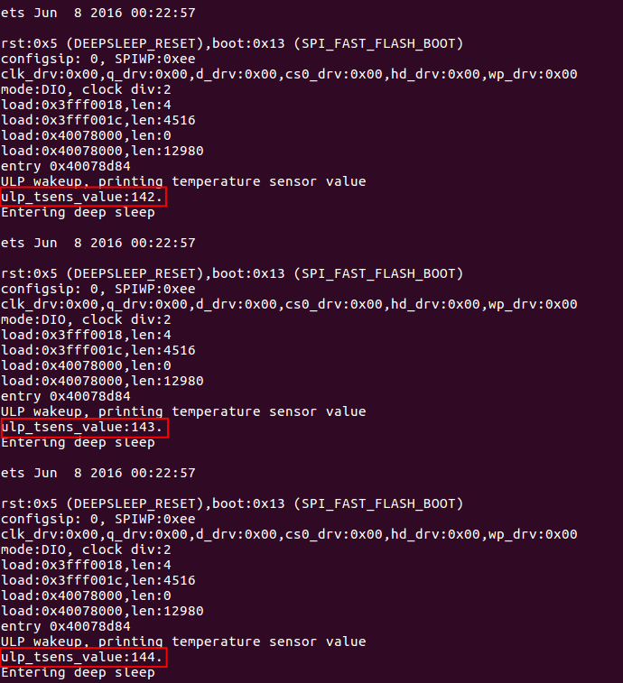

# ULP 协处理器在低功耗模式下读片内温度传感器

本文介绍 ULP 协处理器如何在低功耗模式下读片内温度传感器 TSENS 

## 1. 片内温度传感器
ESP32 芯片内内置了温度传感器，其温度测量范围在 -40℃ 到 125℃ 之间，通过测量周围环境(例如 WiFi 电路)产生的热量，可以大致评估系统的负荷散热以及环境温度情况。
需要指出的是，由于制程工艺偏差的原因，每片芯片的温度电压特性可能有差异，因此，温度传感器的主要应用场景为测量温度的变化量，而非温度的绝对值。

## 2. 温度传感器读取示例
本例子 ULP 协处理器每隔 3 S 唤醒一次，唤醒后在低功耗模式下通过 `TSENS` 指令读取片内温度传感器数值，然后唤醒主 CPU 打印出获取的数值，并再次进入 DeepSleep 状态。
下图演示的是，用拇指和食指捏住 Core Board ，通过 PCB 板将手指热量传递到芯片，最终终端打印数值从 142 变化到 144 （注：对于不同的芯片这个数值可能是不一样的）。



需要说明，TSENS 值是一个字节，范围是 0 - 255，其数值变化和环境温度变化近似成线性关系，用户需要自己定义和测量其对应的外界温度值。

## 3.软件部分
ESP32 的 C 语言编译环境安装和配置参照 [链接地址](https://docs.espressif.com/projects/esp-idf/en/stable/get-started/index.html#setup-toolchain)，另外 ULP 协处理器目前只支持汇编编程，所以还需要安装汇编工具链，下面介绍汇编工具链的安装和配置。
#### 3.1 汇编环境的配置
ULP 协处理器配置汇编编译工具链，只需两步即可安装配置完毕，下面给出 ubuntu 操作系统下配置的步骤，或者点击 [链接地址](https://docs.espressif.com/projects/esp-idf/en/stable/api-guides/ulp.html) 获得更多 ULP 编程信息
>* 第一步, 下载工具链 `binutils-esp32ulp toolchain`  [链接地址]( https://github.com/espressif/binutils-esp32ulp/wiki#downloads), 解压到需要安装的目录
>* 第二步，添加工具链的 `bin` 目录到系统环境变量 `PATH` 中。例如我的解压目录是 `/opt/esp32ulp-elf-binutils` 那么添加 `export PATH=/opt/esp32ulp-elf-binutils/bin:$PATH` 这一行到 /home 目录的隐藏文件 `.bashrc` 文件最后一行，保存关闭文件并使用命令 `source .bashrc` 使上述环境变量生效

#### 3.2 配置编译烧录
至此，汇编编译环境就安装好了，在 ulp_tsens/ 目录下依次运行以下命令，进行 config 配置并编译、烧录程序。

Make:
>* make defconfig
>* make all -j8 && make flash monitor

CMake
>* idf.py defconfig
>* idf.py flash monitor


#### 3.3 汇编代码介绍

ULP 已经内置了 `TSENS` 的汇编指令，用来读取片内温度传感器，使用示例如下:
```
 TSENS  R1, 1000     /* Measure temperature sensor for 1000 cycles, and store result to R1 */                  
```

需要注意：单独使用这条 `TSENS` 指令并不能获得温度传感器的真实数值，因为此时片内相应的电路电源是处于被关闭状态(POWER DOWN)的，需要手动设定寄存器 `SENS_SAR_MEAS_WAIT2_REG` 中的 `SENS_FORCE_XPD_SAR` 寄存器置位，给相关电路上电。

```
	/* Force power up */
	WRITE_RTC_REG(SENS_SAR_MEAS_WAIT2_REG,SENS_FORCE_XPD_SAR_S,2,SENS_FORCE_XPD_SAR_PU)
    
```

之后再使用 ` TSENS` 指令读取片内温度传器，并将温度值传递给 `tsens_value` 
```
	tsens r0, 1000
	move r3, tsens_value
	st r0, r3, 0	
	jump wake_up

```
接下来 Polling 寄存器 `RTC_CNTL_DIAG0_REG` 进行主 CPU 的唤醒

```
	/* Get ULP back to sleep */
	.global exit
exit:
	halt

	.global wake_up
wake_up:
	/* Check if the SoC can be woken up */
	READ_RTC_REG(RTC_CNTL_DIAG0_REG, 19, 1)
	and r0, r0, 1
	jump exit, eq

	/* Wake up the SoC and stop ULP program */
	wake
	/* Stop the wakeup timer so it does not restart ULP */
	WRITE_RTC_FIELD(RTC_CNTL_STATE0_REG, RTC_CNTL_ULP_CP_SLP_TIMER_EN, 0)
	halt
```
## 4. 电流估算
本例 ULP 协处理器工作时电流为 1.4mA ，工作时间持续 2ms ，ULP 协处理器睡眠时间 3s , 平均电流 5uA 。我们按照 1ms 一个采样点计算电流数据，可以得出整个过程平均电流为 5.9uA 左右 

## 5. 总结
ESP32 内置的 汇编指令 `TSENS` 可以让我们在低功耗模式下非常容易的进行片内温度传感器读取，另外，当 ULP 协处理器再次进入睡眠时，会关闭掉除 150K 唤醒时钟外的所有电路电源，所以下次 ULP 协处理器唤醒后仍需要置位 `SENS_FORCE_XPD_SAR` 寄存器给相关内部电路上电(POWER UP) 。


 