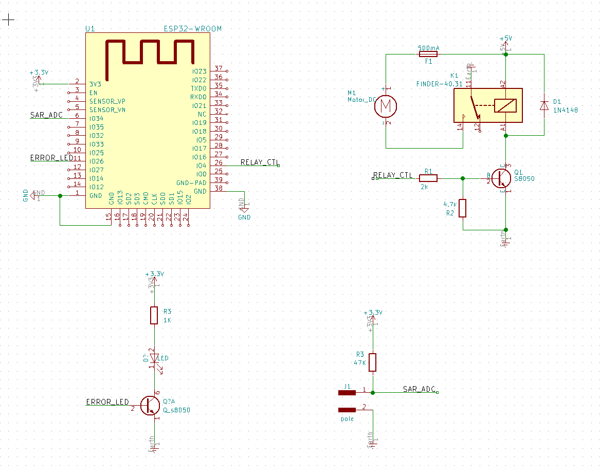
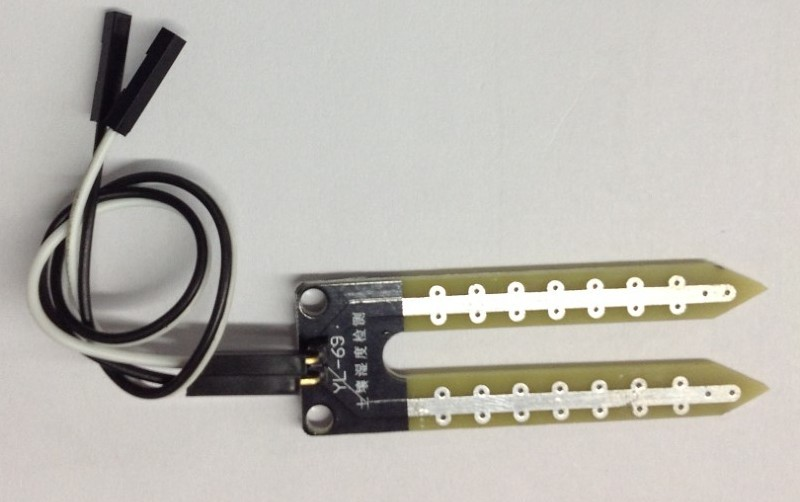
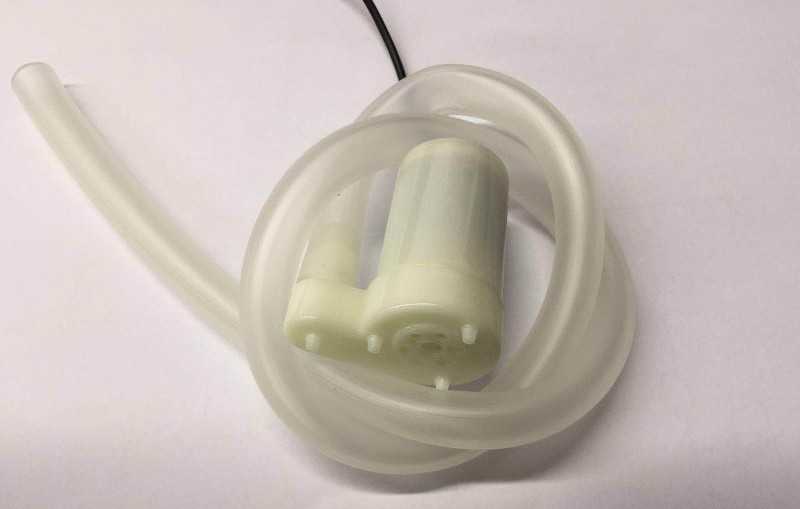
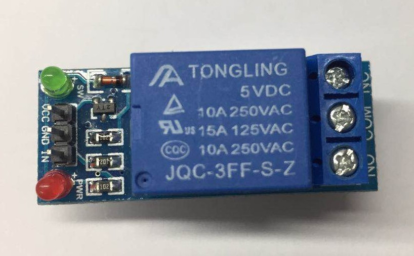
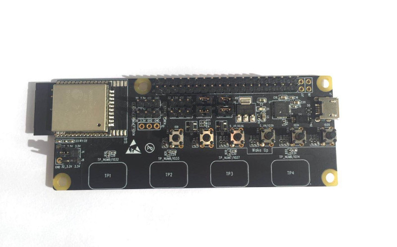
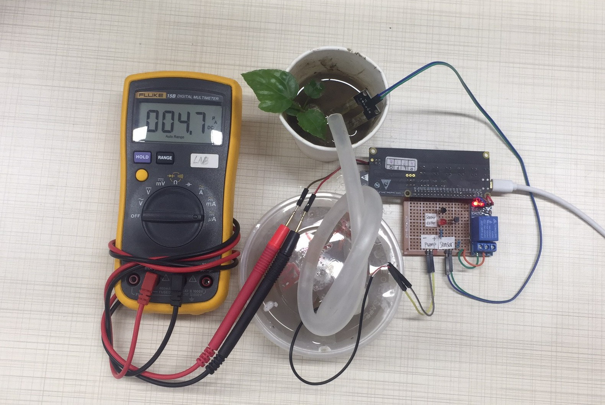
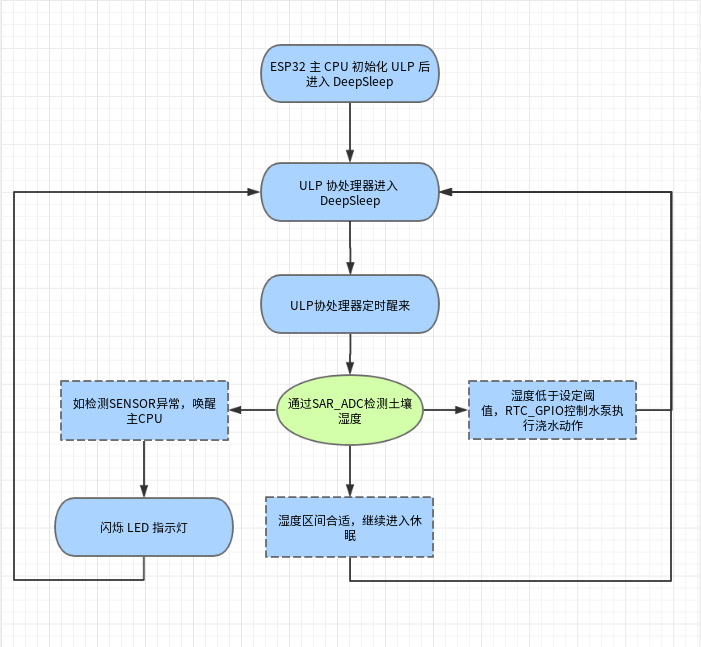

[[EN]](./readme_en.md)

# 使用 ESP32 超低功耗 ULP 协处理器的浇花 DEMO
标签： esp32 ulp adc rtc_gpio
## 1. 背景和目的
ULP Co-processor 是 ESP32 内置的一颗功耗极低的协处理器设备，无论主 CPU 是处于正常运行模式或是 Deep-Sleep 模式, ULP 协处理器都可以独立运行。ULP 协处理器具有特色的内置了 ADC 控制器和 I2C 控制器，支持正常模式和 Deep-Sleep 模式，并支持唤醒主 CPU 和向主 CPU 发送中断等特性，更多特性及介绍详见乐鑫的[ESP32技术参考手册](http://www.espressif.com/sites/default/files/documentation/esp32_technical_reference_manual_cn.pdf)。

## 2. 方案阐述
ULP 协处理器大部分时间处于睡眠状态，定时唤醒后，通过 SAR_ADC 检测土壤湿度，如土壤干燥则控制 RTC_GPIO 执行浇水动作，如检测到传感器异常后闪烁 LED 并唤醒主 CPU 。这个 ULP 例子消耗电流平均为 4.7uA 左右。

## 3. 硬件部分
为了实现上述功能，我们需要可以测芯片电流的 ESP32_ULP_EBV1 开发板（使用其他开发板亦可，只不过无法的看到芯片 Deep-Sleep 时耗流情况），一个叉状电极用于插入土壤，一个 5V 继电器模块，一个 5V 小水泵

#### 3.1 硬件原理图
硬件原理图使用 Kicad 设计，检测土壤湿度原理是通过 47k 电阻和土壤中的电阻分压，测得 ADC 值后推算出土壤的湿度。另外，湿润的土壤到干燥的土壤电阻值一般测得阻值数据是 20K - 100k 左右。

需要注意：ESP32_ULP_EBV1 这个板子 GPIO34 有 10K 上拉电阻 R41 ，我们把它去掉了，因为 ADC 采集不需要这个电阻，并且还会造成漏电流。


#### 3.2 硬件实物
|土壤湿度传感器|水泵|
|---|---|
|叉状电极插入土壤获得土壤阻值|5V 电机，可正反转|
|||

|继电器控制|ESP32_ULP_EBV1|
|---|---|
|继电器是负载 10A 250VAC 的单刀双掷，负电平控制常开端闭合|ESP32_ULP_EBV1 板子可方便的接入电流表测得芯片电流消耗情况| 
|||

#### 3.3整体连接图



## 4.软件部分
ESP32 的 C 语言编译环境安装和配置参照 [链接地址](https://docs.espressif.com/projects/esp-idf/en/stable/get-started/index.html#setup-toolchain)，另外 ULP 协处理器目前只支持汇编编程，所以还需要安装汇编工具链，下面介绍汇编工具链的安装和配置。
#### 4.1 汇编环境的配置
ULP 协处理器配置汇编编译工具链，只需两步即可安装配置完毕，下面给出 ubuntu 操作系统下配置的步骤，或者点击 [链接地址](https://docs.espressif.com/projects/esp-idf/en/stable/api-guides/ulp.html) 获得更多 ULP 编程信息
>* 第一步, 下载工具链 `binutils-esp32ulp toolchain`  [链接地址]( https://github.com/espressif/binutils-esp32ulp/wiki#downloads), 解压到需要安装的目录
>* 第二步，添加工具链的 `bin` 目录到系统环境变量 `PATH` 中。例如我的解压目录是 `/opt/esp32ulp-elf-binutils` 那么添加 `export PATH=/opt/esp32ulp-elf-binutils/bin:$PATH` 这一行到 /home 目录的隐藏文件 `.bashrc` 文件最后一行，保存关闭文件并使用命令 `source .bashrc` 使上述环境变量生效

至此，汇编编译环境就安装好了，将 ulp_watering_device/ 目录下的 sdkconfig.defaults 复制一份改名为 sdkconfig，然后在工程中使用 `make all -j8 && make flash monitor`(Make) 或者 `idf.py flash monitor`(CMake) 编译命令时，会自动调用汇编工具链编译汇编代码。

#### 4.2 管脚使用

|管脚|功能|
|---|---|
|GPIO4|RELAY_CTL|
|GPIO34|SAR_ADC|
|GPIO26|SENSOR_ERROR_LED|

#### 4.3 程序流程图
ESP32 上电后，配置 ULP 协处理器相关的 RTC GPIO 和唤醒周期后进入休眠，ULP 协处理器醒来后，通过 ADC 指令获取土壤电阻分压 ADC 值，如果检测到 SENSOR 异常，则唤醒 CPU 闪烁 LED 指示灯，用户可自定义其他的出错处理（例如链接云上报数据）；如果检测到湿度区间合适则什么都不做继续睡眠降低功耗；如果湿度值低于设定阈值则打开 RTC GPIO 控制水泵浇水。


#### 4.4 代码分析

本例子的代码保存在 GitHub 仓库 [espressif/esp-iot-solution](https://github.com/espressif/esp-iot-solution.git) 中,可通过 git 命令
* git clone  --recursive https://github.com/espressif/esp-iot-solution.git  来获取代码

下面给出部分的汇编代码
汇编代码主要分成三大部分：ADC 采样、RTC GPIO 操作以及 Polling CPU 唤醒，第一部分给出 ADC 采样的汇编代码，主要意图是多次采样 ADC 以及计算平均值
```ASM
	///* ulp read adc example: using ADC in deep sleep on ulp co-processor */
    
	/* increment sample counter */
	move r3, sample_counter
	ld r2, r3, 0
	add r2, r2, 1
	st r2, r3, 0

	/* do measurements using ADC */
	/* r0 will be used as accumulator */
	move r0, 0
	/* initialize the loop counter */
	stage_rst
measure:
	/* measure and add value to accumulator */
	adc r1, 0, adc_channel + 1
	add r0, r0, r1
	/* increment loop counter and check exit condition */
	stage_inc 1
	jumps measure, adc_oversampling_factor, lt

	/* divide accumulator by adc_oversampling_factor.
	   Since it is chosen as a power of two, use right shift */
	rsh r0, r0, adc_oversampling_factor_log
	/* averaged value is now in r0; store it into last_result */
	move r3, last_result
	st r0, r3, 0
```

第二部分汇编代码，主要是操作 RTC GPIO 用来打开或者关闭水泵，以及 SENSOR 出错的处理
    
```
  	.global start_water
start_water:
	/* Disable hold of RTC_GPIO10 output */
	WRITE_RTC_REG(RTC_IO_TOUCH_PAD0_REG,RTC_IO_TOUCH_PAD0_HOLD_S,1,0)

	/* Set the RTC_GPIO10 output HIGH
	   to signal that ULP is now up */
	WRITE_RTC_REG(RTC_GPIO_OUT_W1TS_REG,RTC_GPIO_OUT_DATA_W1TS_S+10,1,1)
	
	/* Enable hold on RTC_GPIO10 output */
	WRITE_RTC_REG(RTC_IO_TOUCH_PAD0_REG,RTC_IO_TOUCH_PAD0_HOLD_S,1,1)

	/* stop water and go sleep */	
	jump exit	/* start pump and go sleep wait next wake up checking ADC value */

	.global stop_water
stop_water:
	/* Disable hold of RTC_GPIO10 output */
	WRITE_RTC_REG(RTC_IO_TOUCH_PAD0_REG,RTC_IO_TOUCH_PAD0_HOLD_S,1,0)

	/* Set the RTC_GPIO10 output LOW (clear output)
	   to signal that ULP is now going down */
	WRITE_RTC_REG(RTC_GPIO_OUT_W1TC_REG,RTC_GPIO_OUT_DATA_W1TC_S+10,1,1)

	/* Enable hold on RTC_GPIO10 output */
	WRITE_RTC_REG(RTC_IO_TOUCH_PAD0_REG,RTC_IO_TOUCH_PAD0_HOLD_S,1,1)

	jump exit	/* stop water and go sleep */

	.global sensor_err
sensor_err:
	/* Disable hold of RTC_GPIO10 output */
	WRITE_RTC_REG(RTC_IO_TOUCH_PAD0_REG,RTC_IO_TOUCH_PAD0_HOLD_S,1,0)

	/* Set the RTC_GPIO10 output LOW (clear output)
	   to signal that ULP is now going down */
	WRITE_RTC_REG(RTC_GPIO_OUT_W1TC_REG,RTC_GPIO_OUT_DATA_W1TC_S+10,1,1)

	/* Enable hold on RTC_GPIO10 output */
	WRITE_RTC_REG(RTC_IO_TOUCH_PAD0_REG,RTC_IO_TOUCH_PAD0_HOLD_S,1,1)	

	jump wake_up	/* sensor error waku up */	     
```

最后，第三部分的汇编代码是用来 Polling CPU 是否可以被唤醒

```
	/* value within range, end the program */
	.global exit
exit:
	halt

	.global wake_up
wake_up:
	/* Check if the system can be woken up */
	READ_RTC_REG(RTC_CNTL_DIAG0_REG, 19, 1)
	and r0, r0, 1
	jump exit, eq

	/* Wake up the SoC, end program */
	wake
	WRITE_RTC_FIELD(RTC_CNTL_STATE0_REG, RTC_CNTL_ULP_CP_SLP_TIMER_EN, 0)
	halt
```


## 5. 电流部分
ULP 协处理器的主频是 8MHz， ULP 协处理器在正常工作时，瞬时电流消耗为 1.4 - 2.2 mA 左右。理想的 ULP 协处理器用法是较长的周期性进入 Deep-Sleep 和短暂的醒来工作来换取功耗平衡。
此例子为了演示效果，我们的设定 ULP 协处理器睡眠周期设置为 3 S，醒来工作的周期不足 1ms， 用电流表测得电流值维持在 4.7uA 

## 6.总结部分
* ULP 协处理器十分强大，内置 ADC 和 I2C 接口，能够在低功耗模式下做出更为复杂的应用，但应尽可能的使其进入 DeepSleep 状态降低功耗。


