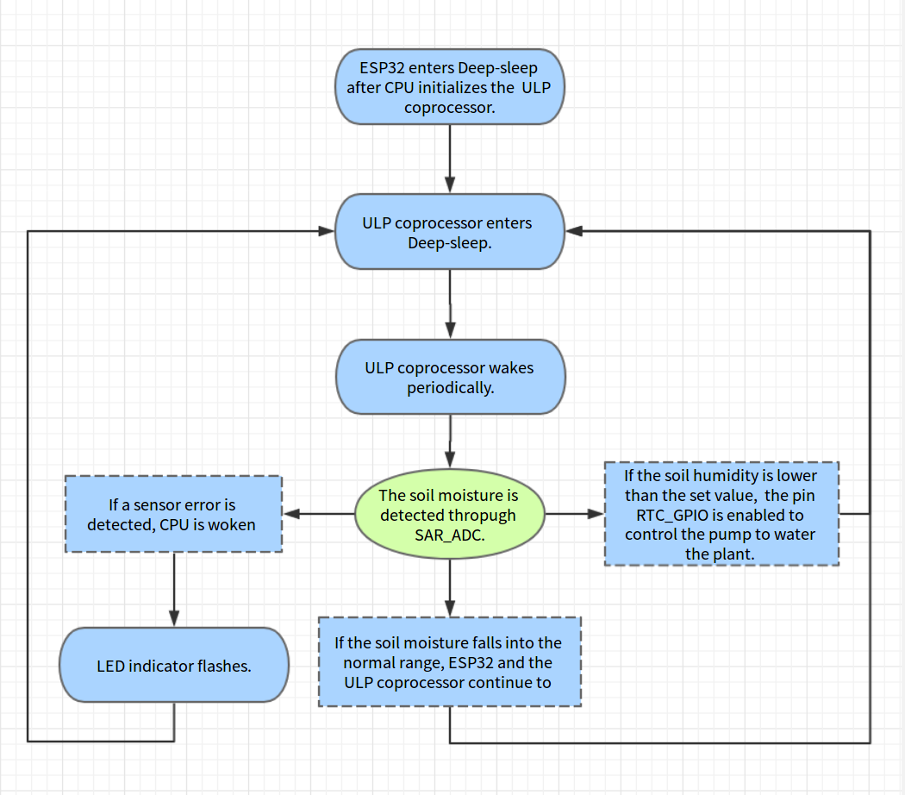

[[中文]](./readme_cn.md)

# Application Demo of Watering Machine Based on ESP32 ULP Co-processor 
Tag: esp32 ulp adc rtc_gpio

## 1. Introduction
The ESP32 integrates a ULP co-processor that consumes minimal power. It can function independently when the CPU functions normally or is in the Deep-Sleep mode. The ULP coprocessor features a built-in ADC controller and I2C controller. It supports normal mode and Deep-Sleep mode. It can also wake up the CPU and send interrupts to the CPU. For more features of the ESP32 ULP co-processor, please see [ESP32 Technical Reference Manual](http://espressif.com/sites/default/files/documentation/esp32_technical_reference_manual_en.pdf).

## 2. Overview of Solution
The ULP coprocessor sleeps for most of the time. It wakes up periodically, and examines the soil moisture through the pin SAR_ADC. If the soil is dry, it controls the pin RTC_GPIO to perform the watering action. If it detects an abnormality in the sensor, the LED blinks and the CPU is woken up.  [And video link address here](http://v.youku.com/v_show/id_XMzE4MTU5NjY5Ng==.html).

## 3. Hardware Preparation
- 1 X ESP32_ULP_EVB1 board to evaluate the current; (Other ESP32 development boards can also be used, but they can not evaluate the working current of the chip in the Deep-Sleep mode.)
- 1 X Forked electrode to insert into the soil;
- 1 X 5V Relay module;
- 1 X mini pump.

#### 3.1 Hardware Schematics

The hardware schematics is designed using Kicad. The principle is that an 47 kΩ resistor is connected in series with the soil, which acts as a variable resistor. The soil moisture is evaluated by measuring the voltage of the soil. The measured resistance of soil varies from 20 kΩ to 100 kΩ as the moisture of the soil declines.

> Note: A 10 kΩ pull-up resistor, R41, is connected to GPIO34 of ESP32_ULP_EVB1. It is recommended that users remove this resistor since it won't be used in the measurement of soil voltage and may cause leakage currents.


#### 3.2 Hardware 
|Soil Moisture Sensor|Water Pump|
|---|---|
|Thrust the forked electrode into the soil to test the resistance of the soil.|5V Motor, the direction of which can be reversed.|
|||

|Relay Control|ESP32_ULP_EVB1|
|---|---|
|10A 250VAC single-pole double-throw switch. When the voltage is low, the normally open negative contact will be closed.|ESP32_ULP_EVB1 can be easily connected to a multimeter to test the current consumption of the chip| 
|||

#### 3.3 Hardware Connection


## 4. Software Preparation
For details of the C language compiling environment setup and configuration of ESP32, please refer to [ESP-IDF Getting Started](https://docs.espressif.com/projects/esp-idf/en/stable/get-started/index.html#setup-toolchain). The ULP co-processor currently supports assembly programming only. So the users will also need to install the ULP coprocessor toolchain. The following introduces the installation and configuration of the ULP coprocessor toolchain.

#### 4.1 Configuration of Compiling Environment 
It takes only two steps to configure the ULP coprocessor toolchain. Below is an introduction to the steps for configuring the environment in ubuntu. For more information on ULP coprocessor programming, please see [ULP Coprocessor Programming](https://docs.espressif.com/projects/esp-idf/en/stable/api-guides/ulp.html).
>* Step One: Download [binutils-esp32ulp toolchain](https://github.com/espressif/binutils-esp32ulp/wiki#downloads), and extract the toolchain into a directory for installation.
>* Step Two: Add the path to the `bin` directory of the toolchain to the `PATH` environment variable. For example, if the toolchain is extracted into the directory `/opt/esp32ulp-elf-binutils`, then add the line `export PATH=/opt/esp32ulp-elf-binutils/bin:$PATH` at the end of the hidden file `.bashrc` under the directory `/home`. Save the file and run the command `source .bashrc` to enable the environment variable. 

The compiling environment is now set up. Make a copy of `sdkconfig.defaults` under the directory `ulp_watering_device/` and rename it as `sdkconfig`. When running the compiling command `make all -j8 && make flash monitor`(Make) or `idf.py flash monitor`(CMake) in programming the codes, the toolchain will be called to compile codes in assembly. 

#### 4.2 Pin Function

|Pin |Function|
|---|---|
|GPIO4|RELAY_CTL|
|GPIO34|SAR_ADC|
|GPIO26|SENSOR_ERROR_LED|

#### 4.3 Demo Process

After the ESP32 is powered on, configure the RTC GPIO related to the ULP coprocessor and the period of the sleep state. After the ULP coprocessor wakes up, the soil resistance is measured through running the ADC instruction. If a sensor error is detected, the CPU is woken up to flash the LED indicator. Users can customize other ways of error handling for that (for example, linking ESP32 to the cloud and report the error). If the soil moisture falls within an normal range, then the chip continues to sleep so as to reduce power consumption. If the moisture is below the set threshold, then the RTC GPIO is enabled to control the pump to water the plant.



#### 4.4 Codes

The sample code for this demo can be found in [espressif/esp-iot-solution](https://github.com/espressif/esp-iot-solution.git). Execute the command ` git clone  --recursive https://github.com/espressif/esp-iot-solution.git` to acquire the code.

Below is part of the compiling code, which is divided into three parts: ADC sampling, RTC GPIO control and polling CPU wakeup. 
Sample Code One is the ADC sampling code, meant for multiple ADC samplings of the soil voltage and calculating the average value. 

```ASM
	///* ulp read adc example: using ADC in deep sleep on ulp co-processor */
    
	/* increment sample counter */
	move r3, sample_counter
	ld r2, r3, 0
	add r2, r2, 1
	st r2, r3, 0

	/* do measurements using ADC */
	/* r0 will be used as accumulator */
	move r0, 0
	/* initialize the loop counter */
	stage_rst
measure:
	/* measure and add value to accumulator */
	adc r1, 0, adc_channel + 1
	add r0, r0, r1
	/* increment loop counter and check exit condition */
	stage_inc 1
	jumps measure, adc_oversampling_factor, lt

	/* divide accumulator by adc_oversampling_factor.
	   Since it is chosen as a power of two, use right shift */
	rsh r0, r0, adc_oversampling_factor_log
	/* averaged value is now in r0; store it into last_result */
	move r3, last_result
	st r0, r3, 0
```

Sample Code Two is the code for controlling the RTC GPIO to turn on or off the pump and for handling the sensor error.
    
```C
  	.global start_water
start_water:
	/* Disable hold of RTC_GPIO10 output */
	WRITE_RTC_REG(RTC_IO_TOUCH_PAD0_REG,RTC_IO_TOUCH_PAD0_HOLD_S,1,0)

	/* Set the RTC_GPIO10 output HIGH
	   to signal that ULP is now up */
	WRITE_RTC_REG(RTC_GPIO_OUT_W1TS_REG,RTC_GPIO_OUT_DATA_W1TS_S+10,1,1)
	
	/* Enable hold on RTC_GPIO10 output */
	WRITE_RTC_REG(RTC_IO_TOUCH_PAD0_REG,RTC_IO_TOUCH_PAD0_HOLD_S,1,1)

	/* stop water and go sleep */	
	jump exit	/* start pump and go sleep wait next wake up checking ADC value */

	.global stop_water
stop_water:
	/* Disable hold of RTC_GPIO10 output */
	WRITE_RTC_REG(RTC_IO_TOUCH_PAD0_REG,RTC_IO_TOUCH_PAD0_HOLD_S,1,0)

	/* Set the RTC_GPIO10 output LOW (clear output)
	   to signal that ULP is now going down */
	WRITE_RTC_REG(RTC_GPIO_OUT_W1TC_REG,RTC_GPIO_OUT_DATA_W1TC_S+10,1,1)

	/* Enable hold on RTC_GPIO10 output */
	WRITE_RTC_REG(RTC_IO_TOUCH_PAD0_REG,RTC_IO_TOUCH_PAD0_HOLD_S,1,1)

	jump exit	/* stop water and go sleep */

	.global sensor_err
sensor_err:
	/* Disable hold of RTC_GPIO10 output */
	WRITE_RTC_REG(RTC_IO_TOUCH_PAD0_REG,RTC_IO_TOUCH_PAD0_HOLD_S,1,0)

	/* Set the RTC_GPIO10 output LOW (clear output)
	   to signal that ULP is now going down */
	WRITE_RTC_REG(RTC_GPIO_OUT_W1TC_REG,RTC_GPIO_OUT_DATA_W1TC_S+10,1,1)

	/* Enable hold on RTC_GPIO10 output */
	WRITE_RTC_REG(RTC_IO_TOUCH_PAD0_REG,RTC_IO_TOUCH_PAD0_HOLD_S,1,1)	

	jump wake_up	/* sensor error waku up */	     
```

Sample Code Three is the code for polling the CPU to see if it is to be woken up or not.

```C
	/* value within range, end the program */
	.global exit
exit:
	halt

	.global wake_up
wake_up:
	/* Check if the system can be woken up */
	READ_RTC_REG(RTC_CNTL_DIAG0_REG, 19, 1)
	and r0, r0, 1
	jump exit, eq

	/* Wake up the SoC, end program */
	wake
	WRITE_RTC_FIELD(RTC_CNTL_STATE0_REG, RTC_CNTL_ULP_CP_SLP_TIMER_EN, 0)
	halt
```


## 5. Current Consumption
The clock frequency of the ULP coprocessor is 8 MHz, when the ULP coprocessor works in the normal condition, the instantaneous current consumption of 1.4 ~ 2.2 mA or so. The optimal working mechanism of the ULP coprocessor is to rotate long periods of the Deep-sleep and short wakeup moments to maintain power balance.
For demonstration's sake, we set the ULP coprocessor to wake up for less than 2 ms after every 3s of sleep. In this case, the current consumption is maintained at 4.7 μA. 

## 6. Conclusion
The ULP coprocessor, integrated with built-in ADC and I2C interface, is suitable for complex applications in low-power mode. To reduce power consumption, though, it should be put into the Deep-sleep mode as much as possible. 


