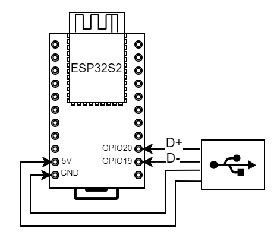
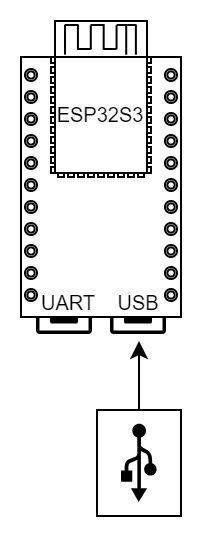
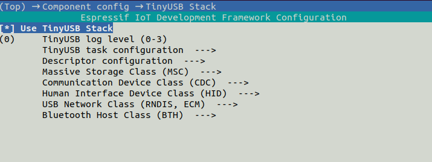
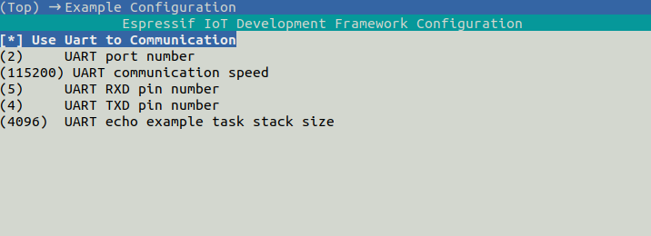
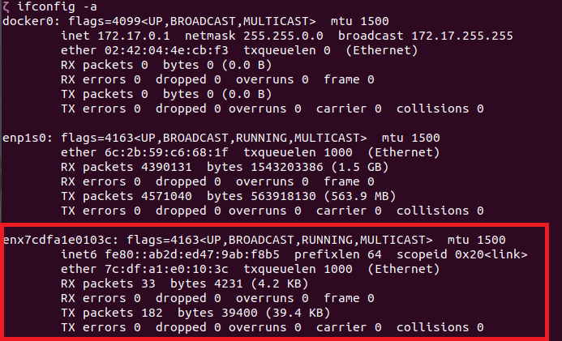
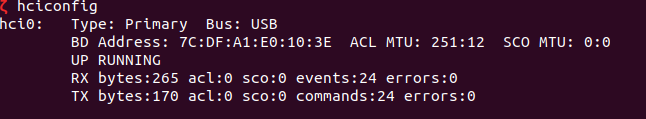
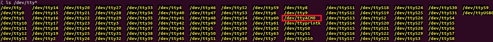

# ESP32-S 系列 USB 无线适配器方案介绍

## 1.概述

本示例程序演示 ESP32-S 系列芯片如何实现 USB Dongle 设备功能，支持以下功能：

* 支持 Host 主机通过 USB-ECM/RNDIS 无线上网
* 支持 Host 主机通过 USB-BTH 进行 BLE 扫描、广播、配对、连接、绑定以及读写数据
* 支持 Host 主机通过 USB-DFU 进行设备升级
* 支持 Host 主机通过 USB-CDC、UART 对 ESP32-S 系列设备进行通信和控制
* 支持多种 system、Wi-Fi 控制命令，使用 FreeRTOS-Plus-CLI 命令行接口，易拓展更多命令
* 支持使用 USB webusb / 串口 / smartconfig 等多种配网方式
* 支持热插拔

## 2. 如何使用示例
### 2.1 硬件准备

支持 USB-OTG 的 ESP 开发板。

* ESP32-S2

* ESP32-S3

### <span id = "connect">2.2 引脚分配</span>

只有具有 USB-OTG 外设的 ESP 芯片才需要引脚分配。 如果您的电路板没有连接到 USB-OTG 专用 GPIO 的 USB 连接器，您可能需要自己动手制作电缆并将 **D+** 和 **D-** 连接到下面列出的引脚

```
ESP BOARD          USB CONNECTOR (type A)
                          --
                         | || VCC
[USBPHY_DM_NUM]  ------> | || D-
[USBPHY_DP_NUM]  ------> | || D+
                         | || GND
                          --
```

|             | USB_DP | USB_DM |
| ----------- | ------ | ------ |
| ESP32-S2/S3 | GPIO20 | GPIO19 |

* ESP32-S2-Saola



* ESP32-S3 DevKitC



### 2.3 软件准备

1. 确认 ESP-IDF 环境成功搭建。
    ```
    >git checkout release/v5.0
    >git pull origin release/v5.0
    >git submodule update --init --recursive
    >
    ```

2. 添加 ESP-IDF 环境变量，Linux 方法如下，其它平台请查阅 [设置环境变量](https://docs.espressif.com/projects/esp-idf/zh_CN/latest/esp32/get-started/index.html#get-started-set-up-env)。
    ```
    >cd esp-idf
    >./install.sh
    >. ./export.sh
    >
    ```

3. 设置编译目标为 `esp32s2` 或 `esp32s3`。

    ```
    >idf.py set-target esp32s2
    >
    ```

### 2.4 软件工程配置





目前 USB-Dongle 支持如下最大组合选项：

| USB-ECM/RNDIS | USB-BTH | USB-CDC | UART | USB-DFU | WEBUSB |
| :-----------: | :-----: | :-----: | :--: | :-----: | ------ |
|       √       |         |         |  √   |    √    | √      |
|       √       |         |    √    |      |    √    |        |
|       √       |    √    |         |  √   |         |        |
|               |    √    |         |  √   |    √    |        |

* 本软件默认使能 ECM、CDC。
* UART 默认在 CDC 使能时禁用。
* UART 可以用于命令通讯，与此同时，你也可以用于蓝牙通讯。
* 可以通过 `component config -> TinyUSB Stack` 选择 USB 设备。
* 同时使能 RNDIS/ECM 和 BTH 时，建议禁用 CDC，采用 UART 发送命令，可以通过 `Example Configuration` 进行串口配置。

>由于目前硬件限制，EndPoint 不能超过一定数量，故不支持 ECM/RNDIS、BTH、CDC 同时使能。

### 2.5 固件编译&烧录

您可以通过以下命令编译、下载固件，并查看输出。

```
>idf.py -p (PORT) build flash monitor
>
```

 * ``(PORT)`` 需要替换为实际的串口名称。
 * 使用命令 `Ctrl-]` 可以退出串口监控状态。


### 2.6 使用说明

1. 完成上述[硬件连接](#connect)并成功烧录固件后，将 USB 连接至 PC 端

2. PC 端将会新增一个 USB 网卡以及一个蓝牙设备

    * 显示网络设备

    ```
    >ifconfig -a
    >
    ```

    

    * 显示蓝牙设备

    ```
    >hciconfig
    >
    ```

    

    * 显示 USB-CDC 设备

    ```
    >ls /dev/ttyACM*
    >
    ```

    

3. 通过 USB-CDC 或者 UART 与 ESP 设备进行通信，使用 help 命令来查看目前所支持的所有指令

    >与 ESP 设备进行通信时命令末尾需加上 LF（\n）

4. 若使能 USB-ECM/RNDIS，则可通过指令来控制 ESP 设备进行配网操作

* [通过 sta 命令来连接至对应路由器](./Commands.md#3sta)
* [通过 startsmart 命令开启 smartconfig 配网](./Commands.md#5smartconfig)

### 2.7 网络设备常见问题

- #### Windows

Windows 平台只支持 RNDIS，USB ECM 无法识别

- #### MAC

MAC 平台只支持 ECM，USB RNDIS 无法识别

- #### Linux

Linux 平台同时支持 ECM 和 RNDIS，不过使用 RNDIS 时，如果切换不同的路由器，Linux 下的网络设备并不会主动重新获取 IP。

如果使用嵌入式 Linux， 没有显示网络设备，可能是在内核中没有使能上述两个模块，在 Linux 内核中使能如下两个配置项，分别用于支持 CDC-ECM 和 RNDIS。

```
Device Drivers   --->
	Network Device Support --->
		Usb Network Adapters --->
			Multi-purpose USB Networking Framework --->
				CDC Ethernet Support
				Host For RDNIS and ActiveSync Devices
```

如果确定使能上述模块依然无法看到网络设备，请通过 `dmesg` 命令查看内核信息， 确定 Linux 内核中是否有探测到 ESP32-S USB 网络设备，以及是否有错误打印信息。

## 3. 配置连接 Wi-Fi 网络

本示例提供了两种连接 Wi-Fi 网络的方法。

### [方法 1. 通过 `sta` 命令连接至 Wi-Fi 路由器](./Commands.md#3sta)

**命令示例**

```
sta -s <ssid> -p [<password>]
```

**说明**

* `password` 为选填参数。

### [方法 2. 通过 smartconfig 连接至 Wi-Fi 路由器](./Commands.md#5smartconfig)

(1) 硬件准备

从手机应用市场下载 ESPTOUCH APP：[Android source code](https://github.com/EspressifApp/EsptouchForAndroid) [iOS source code](https://github.com/EspressifApp/EsptouchForIOS)。

(2) 将手机连接到目标 Wi-Fi AP（2.4GHz）。

(3) 手机打开 ESPTOUCH app 输入 Wi-Fi 密码。

(4) Host 通过 USB ACM port 发送以下命令给 ESP 设备，开始配网。

**命令示例**

```
smartconfig 1
```

## 4. 命令说明

[Command](./Commands.md)

注意：Wi-Fi 相关命令只有在 USB Network Class 使能时才可以使用.

## 5. 如何使用 USB-DFU 对设备升级

在使用 DFU 对设备升级之前，请确保已经在配置项中使能了 DFU 功能

```
component config -> TinyUSB Stack -> Use TinyUSB Stack -> Firmware Upgrade Class (DFU) -> Enable TinyUSB DFU feature
```

#### Ubuntu

在 Ubuntu 环境下首先需要安装 DFU 工具

```

```

使用如下命令进行升级操作

```
sudo dfu-util -d <VendorID> -a 0 -D <OTA_BIN_PATH>
```

其中：

1. VendorID 为 USB vendor ID, 缺省为 0x303A
2. OTA_BIN_PATH 为需要升级的固件

使用如下命令进行上传操作，默认会把 OTA_0 分区读取出来

```
sudo dfu-util -d <VendorID> -a 0 -U <OTA_BIN_PATH>
```

其中：

1. VendorID 为 USB vendor ID, 缺省为 0x303A
2. OTA_BIN_PATH 从设备读取固件保存的文件名

#### Windows

1. 在 Windows 平台首先需要下载 [dfu-util](http://dfu-util.sourceforge.net/releases/dfu-util-0.9-win64.zip)。

2. dfu-util 使用 libusb 访问 USB 设备，这要求我们需要在 Windows 上安装 WinUSB 驱动，可以使用 [Zadig 工具](http://zadig.akeo.ie/) 安装。

3. 打开命令行窗口，将 dfu-util.exe 拖进去，然后执行如下命令进行升级操作

   ```
   dfu-util.exe -d <VendorID> -a 0 -D <OTA_BIN_PATH>
   ```

   其中：

   1. VendorID 为 USB vendor ID, 缺省为 0xcafe
   2. OTA_BIN_PATH 为需要升级的固件

#### 常见问题和错误

1.  各平台 dfu-util 工具安装错误的问题请参考[此链接](https://support.particle.io/hc/en-us/articles/360039251394-Installing-DFU-util) 。
2. dfu-util 执行时打印 “No DFU capable USB device available”， 这说明 dfu-util 没有探测到 ESP32-S 芯片的 DFU 设备，请确保在配置项已经使能 DFU 功能。在 Ubuntu 中，请确保使用了管理员权限操作。
sudo apt install dfu-util