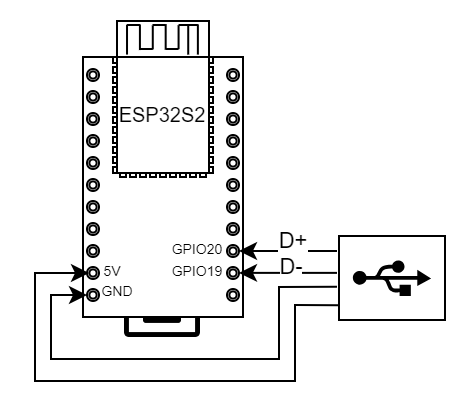
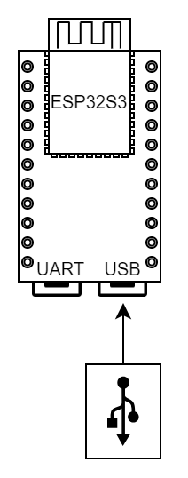
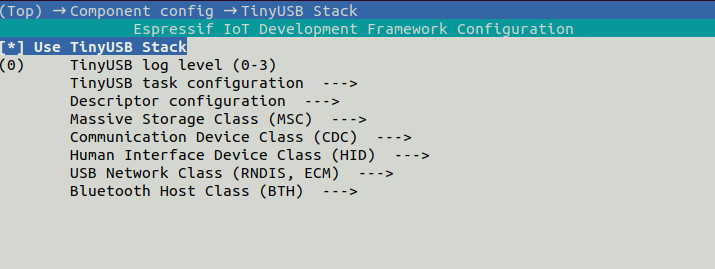
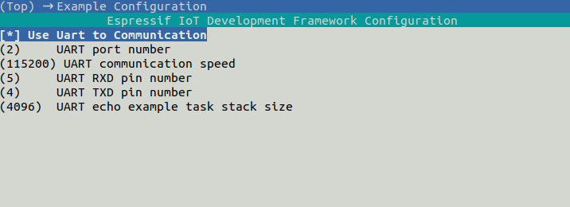
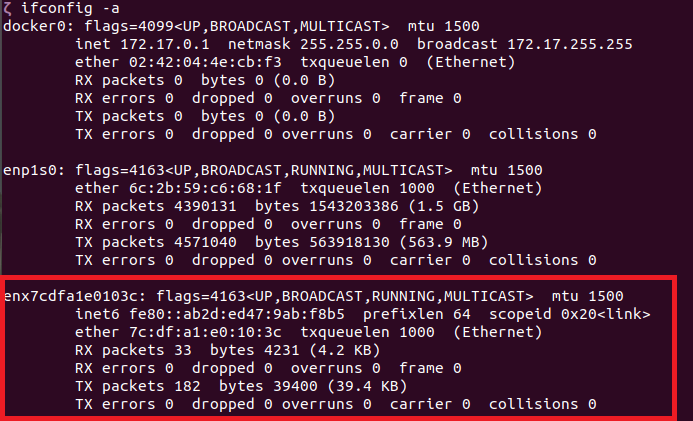
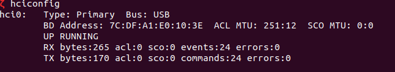
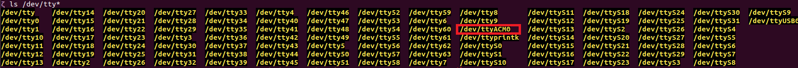

# ESP USB Dongle Solution

## 1.Overview

This example shows how to set up a supported ESP chip to work as a USB Dongle device.

Supports the following functions:

* Support Host to surf the Internet wirelessly via USB-ECM/RNDIS.
* Add BLE devices via USB-BTH, support scan, broadcast, connect and other functions.
* Support Host to communicate and control ESP devices via USB-CDC or UART.
* Support Host to upgrade device using USB-DFU.
* Support system commands and Wi-Fi control commands. It uses FreeRTOS-Plus-CLI interfaces, so it is easy to add more commands.
* Support hot swap.

## 2.How to use example

### 2.1 Hardware Preparation

Any ESP boards that have USB-OTG supported.

* ESP32-S2

* ESP32-S3

* ESP32-P4

* ESP32-S31

### 2.2 Hardware Connection

Pin assignment is only needed for ESP chips that have an USB-OTG peripheral. If your board doesn't have a USB connector connected to the USB-OTG dedicated GPIOs, you may have to DIY a cable and connect **D+** and **D-** to the pins listed below.

```
ESP BOARD          USB CONNECTOR (type A)
                          --
                         | || VCC
[USBPHY_DM_NUM]  ------> | || D-
[USBPHY_DP_NUM]  ------> | || D+
                         | || GND
                          --
```

|                         | USB_DP | USB_DM |
| ----------------------- | ------ | ------ |
| ESP32-S2/S3             | GPIO20 | GPIO19 |
| ESP32-P4 2.0            | Pin 50 | Pin 49 |
| ESP32-P4 1.1            | GPIO27 | GPIO26 |
| ESP32-S31               | Pin 44 | Pin 45 |

On ESP32-S31, the USB 2.0 PHY pins are dedicated to USB-OTG and cannot be used as general-purpose GPIOs. ESP32-S31 only supports the USB 2.0 PHY.

When using ESP32-S31-Korvo-1, connect the USB host to the onboard **USB 2.0 Type-A** port. This port is connected to the ESP32-S31 USB 2.0 OTG High-Speed peripheral; the onboard USB Type-C ports are not USB-OTG ports. See the [ESP32-S31-Korvo-1 User Guide](https://docs.espressif.com/projects/esp-dev-kits/en/latest/esp32s31/esp32-s31-korvo-1/user_guide.html) for the connector location.

* ESP32-S2-Saola



* ESP32-S3 DevKitC



### 2.3 Software Preparation

* Use an ESP-IDF version that supports the selected target. ESP32-S31 requires ESP-IDF 6.1 or later and is a preview target in the current SDK.

    ```
    >git submodule update --init --recursive
    >
    ```

* To add ESP-IDF environment variables. If you are using Linux OS, you can follow below steps. If you are using other OS, please refer to [Set up the environment variables](https://docs.espressif.com/projects/esp-idf/en/latest/esp32/get-started/index.html#step-4-set-up-the-environment-variables).

    ```
    >cd esp-idf
    >./install.sh
    >. ./export.sh
    >
    ```

* Set the compilation target. For ESP32-S2, ESP32-S3, or ESP32-P4:

    ```
    >idf.py set-target esp32s2
    >
    ```

* ESP32-S31 currently requires the preview option:

    ```
    >idf.py --preview set-target esp32s31
    >
    ```

### 2.4 Project Configuration





ESP32-S2/S3 have limited USB endpoint resources and support the following maximum combinations.

| ECM/RNDIS | BTH  | CDC  | UART | DFU  |
| :-------: | :--: | :--: | :--: | :--: |
|     √     |      |      |  √   |  √   |
|     √     |      |  √   |      |  √   |
|     √     |  √   |      |  √   |  √   |
|           |  √   |      |  √   |  √   |

* UART is disabled by default when CDC is enabled.
* UART can be used for command communication, and you can also use Bluetooth for communication.
* The project enables ECM and CDC by default.
* You can select USB Device through `component config -> TinyUSB Stack`.
* ESP32-S31 defaults to High Speed on TinyUSB RHPort0. ESP32-P4 uses RHPort1 for High Speed, while ESP32-S2/S3 default to Full Speed.
* The ESP32-S2/S3 USB controller provides 7 endpoints including EP0, with at most 5 IN endpoints including EP0. Therefore, ECM/RNDIS, BTH, and CDC cannot be enabled simultaneously. When ECM/RNDIS and BTH are enabled, disable CDC, use UART for commands, and configure it through `Example Configuration`.
* The ESP32-P4/S31 USB High-Speed controller provides 16 endpoints including EP0, with at most 8 IN endpoints including EP0. In terms of endpoint resources, ECM/RNDIS, BTH, and CDC can be enabled simultaneously.
* Available combinations are also limited by chip capabilities, memory, and application partition size. Enabling multiple USB classes may require a larger app partition.
* When using USB-BTH, note that:
  * Disable CDC (and the network class) so BTH occupies USB interface 0; otherwise the host may enumerate USB but never create `hciX`.
  * Set `BTH ISO ALT COUNT` to 1 or 2; the default is 1.
  * For ESP32-S3, use `sdkconfig.ci.bth` via `idf.py -D SDKCONFIG_DEFAULTS="sdkconfig.defaults;sdkconfig.ci.bth" set-target esp32s3`.
  * For ESP32-S31, use `sdkconfig.ci.bth` via `idf.py -D SDKCONFIG_DEFAULTS="sdkconfig.defaults;sdkconfig.ci.bth" --preview set-target esp32s31`.

### 2.5 build & flash & monitor

You can use the following command to build and flash the firmware.

```
>idf.py -p (PORT) build flash monitor
>
```

For ESP32-S31, add the preview option:

```
>idf.py --preview -p (PORT) build flash monitor
>
```

 * Replace ``(PORT)`` with the actual name of your serial port.

 * To exit the serial monitor, type `Ctrl-]`.

### 2.6 User Guide

1. After completing above preparation, you can connect PC and your ESP device with USB cable.

2. You can see a USB network card and a bluetooth device on your PC.

    * Show network devices

    ```
    >ifconfig -a
    >
    ```

    

    * Show bluetooth device

    ```
    >hciconfig
    >
    ```

    

    Show USB-CDC device

    ```
    >ls /dev/ttyACM*
    >
    ```

    

3. The PC can communicate with the ESP board through the USB ACM port or UART. And you can use ``help`` command to view all commands supported.

    > When communicating with ESP device, add **LF(\n)** at the end of the command

4. If USB-RNDIS is enabled, you can connect ESP device to AP by commands.
    * [Connect to target AP by sta command](./Commands_EN.md#3sta)
    * [Connect to target AP by startsmart command (SmartConfig)](./Commands_EN.md#5smartconfig)

#### 2.6.1 Send Commands over CDC

Both Windows and Linux support sending commands over CDC. Enable USB-CDC, flash the firmware, and connect the board's USB-OTG port to the host. In a terminal with the ESP-IDF environment activated, first find the CDC serial port:

```text
python -m serial.tools.list_ports -v
```

Open the serial port using the command for your operating system:

**Linux:**

```bash
python -m serial.tools.miniterm /dev/ttyACM0 115200 --eol LF --echo
```

**Windows:**

```powershell
python -m serial.tools.miniterm COM5 115200 --eol LF --echo
```

Replace `/dev/ttyACM0` or `COM5` with the actual port name. `--eol LF` makes the Enter key send `\n`, and `--echo` displays local input. Press `Ctrl+]` to exit. Close other serial tools using the same port before opening it. You can also use another serial terminal with the transmit line ending set to LF or CRLF.

Enter the following commands in the serial terminal one at a time, pressing Enter after each command:

```text
help
version
ram
scan
sta -s MyWiFi -p MyPassword
sta
```

Replace `MyWiFi` and `MyPassword` with the router's SSID and password. The `scan` and `sta` commands require USB-ECM/RNDIS/NCM to be enabled. See [Commands_EN.md](./Commands_EN.md) for the full command reference.

The `Wi-Fi STA connected` and `connect success` messages indicate that the ESP device has connected to Wi-Fi.

### 2.7 Common network device Problems

#### Windows

Windows platform only supports RNDIS, USB ECM is not recognized.

#### MAC

MAC platform only supports ECM, USB RNDIS is not recognized.

#### Linux

Linux platform support both ECM and RNDIS. However, if  RNDIS is used, network devices in Linux do not proactively obtain IP addresses when switching between different routers.

If embedded Linux is used and network devices are not displayed, the preceding two modules may not be enabled in the kernel. The following two configuration items are enabled in the Linux kernel to support CDC-ECM and RNDIS respectively.

```
Device Drivers   --->
	Network Device Support --->
		Usb Network Adapters --->
			Multi-purpose USB Networking Framework --->
				CDC Ethernet Support
				Host For RDNIS and ActiveSync Devices
```

If you are sure that the network device cannot be seen after the preceding modules are enabled, run the `dmesg` command to view the kernel information to check whether the ESP USB network device is detected in the Linux kernel and whether error messages are displayed.

## 3. Connect to a Wi-Fi AP

The example provides two methods to connect ESP device to a Wi-Fi AP.

### [Method 1. Connect to target AP by `sta` command](./Commands_EN.md#3sta)

**Command Example**

```
sta -s <ssid> -p [<password>]
```

**Notes**

* `password` is optional


### [Method 2. Connect to target AP by startsmart command (SmartConfig)](./Commands_EN.md#5smartconfig)

(1) Hardware Required

Download ESPTOUCH APP from app store: [Android source code](https://github.com/EspressifApp/EsptouchForAndroid) [iOS source code](https://github.com/EspressifApp/EsptouchForIOS) is available.

(2) Make sure your phone connect to the target AP (2.4GHz).

(3) Open ESPTOUCH app and input password.

(4) Send commands via USB ACM port

**Example**

```
smartconfig 1
```

## 4.Command introduction

[Commands](./Commands_EN.md)

Note: Wi-Fi commands can only be used when USB Network Class is enabled

## 5. How to use USB-DFU to upgrade device

Before using DFU to upgrade the ESP device, ensure that the DFU feature has been enabled in the configuration item.

```
component config -> TinyUSB Stack -> Use TinyUSB Stack -> Firmware Upgrade Class (DFU) -> Enable TinyUSB DFU feature
```

#### Ubuntu

You need to install the DFU tool first in Ubuntu.

```
sudo apt install dfu-util
```

Run the following command to upgrade.

```
sudo dfu-util -d <VendorID> -a 0 -D <OTA_BIN_PATH>
```

**Notes**

- VendorID is USB vendor ID, the default value 0x303A
- OTA_BIN_PATH is the upgrade firmware

Run the following command to upload.

```
sudo dfu-util -d <VendorID> -a 0 -U <OTA_BIN_PATH>
```

**Notes**

- VendorID is USB vendor ID, the default value 0x303A
- Read firmware from device into OTA_BIN_PATH

#### Windows

1. On Windows you need to download [dfu-util](http://dfu-util.sourceforge.net/releases/dfu-util-0.9-win64.zip) first.

2. `dfu-util` uses libusb to access the device. You have to register on Windows the device with the WinUSB driver. Installation using [Zadig](http://zadig.akeo.ie/) tool is recommended.

3. Open the command window, run the following commands using `dfu-util.exe`.

   ```
   dfu-util.exe -d <VendorID> -a 0 -D <OTA_BIN_PATH>
   ```

   **Notes**

   - VendorID is USB vendor ID, the default value 0x303A
   - OTA_BIN_PATH is the upgrade firmware

#### Common problems

1. Please refer to [this link](https://docs.particle.io/archives/installing-dfu-util/) for the installation error of `dfu-util` tool on each platform.
2. "No DFU capable USB device available" means `dfu-util` does not detect the DFU device of the ESP chip. Ensure that the DFU feature is enabled in the configuration item.
   In Linux platform, make sure you are using administrator rights.
