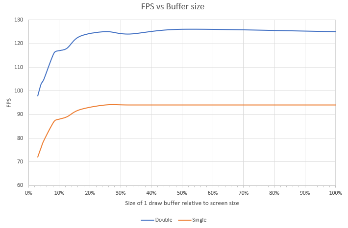

# LCD & LVGL Performance

This document provides steps, how to set up your LCD and LVGL port for the best performance and comparison of different settings. All settings and measurements are valid for Espressif's chips.

## Performance metrics

In this document we will use following metrics for performance evaluation:

1. Measure time needed for refreshing the whole screen.
2. Use LVGL's [lv_demo_benchmark()](https://github.com/lvgl/lvgl/tree/v8.3.6/demos/benchmark) -test suite- to measure Frames per second (weighted FPS).
3. Use LVGL's [lv_demo_music()](https://github.com/lvgl/lvgl/tree/v8.3.6/demos/music) -demo application- to measure Frames per second (average FPS).

## Settings on ESP32 chips which have impact on LCD and LVGL performance

Following options and settings have impact on LCD performance (FPS). Some options yield only small difference in FPS (e.g. ~1 FPS), and some of them are more significant. Usually it depends on complexity of the graphical application (number of widgets...), resources (CPU time, RAM available...) and size of screen (definition and color depth).

Another set of key parameters are hardware related (graphical IO, frame buffer location), which are not yet covered in this document.

### LVGL Buffer configuration

**This is by far the most significant setting.** Users are encouraged to focus on correct frame buffer configuration before moving ahead with other optimizations.

On the other hand, the frame buffer(s) will consume significant portion of your RAM. In the graph below, you can see different frame buffer settings and resulting FPS:

Main takeaways from the graph are:

* The size of **LVGL buffer** and **double buffering** feature has big impact on performance. 
* Frame buffer size >25% of the screen does not bring relevant performance boost
* Frame buffer size <10% will have severe negative effect on performance

*Note:* The measurements are valid for frame buffer in internal SRAM. Placing the frame buffer into external PSRAM will yield worse results.

### Compiler optimization level

Recommended level is "Performance" for good results. The "Performance" setting causes the compiled code to be larger and faster.

* `CONFIG_COMPILER_OPTIMIZATION_PERF=y`

### CPU frequency

The CPU frequency has a big impact on LCD performance. The recommended value is maximum -> 240 MHz.

* `CONFIG_ESP_DEFAULT_CPU_FREQ_MHZ_240=y`

### Flash frequency and mode

The flash clock frequency and mode (bus width) has a big impact on LCD performance. Your choices will be limited by your hardware flash configuration. The higher the frequency and bus width, the better.

* `CONFIG_ESPTOOLPY_FLASHFREQ_120M=y`
* `CONFIG_ESPTOOLPY_FLASHMODE_QIO=y` or `CONFIG_ESPTOOLPY_OCT_FLASH` on supported chips

More information about SPI Flash configuration can be found in [ESP-IDF Programming Guide](https://docs.espressif.com/projects/esp-idf/en/latest/esp32s3/api-guides/flash_psram_config.html).

### Fast LVGL memory

This option puts the most frequently used LVGL functions into IRAM for execution speed up.

* `CONFIG_LV_ATTRIBUTE_FAST_MEM_USE_IRAM=y`

### Affinity main task to second core

The main LVGL task can be processed on the second core of the CPU. It can increase performance. (It is available only on dual-core chips)

* `CONFIG_ESP_MAIN_TASK_AFFINITY_CPU1=y`

### Using esp-idf `memcpy` and `memset` instead LVGL's configuration

Native esp-idf implementation are a little (~1-3 FPS) faster.

* `CONFIG_LV_MEMCPY_MEMSET_STD=y`

### Default LVGL display refresh period

This setting can improve subjective performance during screen transitions (scrolling, etc.).

* `CONFIG_LV_DISP_DEF_REFR_PERIOD=10`

## Example FPS improvement vs graphical settings

Default settings:
* BSP example `display_lvgl_demos` with `ws_7inch` component
* LCD: 7" 800x480
* Intarface: 16bit parallel Intel 8080
* LCD IO clock: 20 MHz
* LVGL buffer size: 800 x 50
* LVGL double buffer: YES
* Optimization: Debug
* CPU frequency: 160 MHz
* Flash frequency: 80 MHz
* Flash mode: DIO
* LVGL display refresh period: 30 ms

### Internal RAM with DMA

| Average FPS | Weighted FPS | Changed settings |
| :---: | :---: | ---------------- |
|  17   |  32   | Default          |
|  18   |  36   | + Optimization: Performance (`CONFIG_COMPILER_OPTIMIZATION_PERF=y`) |
|  21   |  46   | + CPU frequency: 240 MHz (`CONFIG_ESP_DEFAULT_CPU_FREQ_MHZ_240=y`) |
|  26   |  56   | + Flash frequency: 120 MHz, Flash mode: QIO (`CONFIG_ESPTOOLPY_FLASHFREQ_120M=y` + `CONFIG_ESPTOOLPY_FLASHMODE_QIO=y`) |
|  28   |  **60**   | + LVGL fast memory enabled (`CONFIG_LV_ATTRIBUTE_FAST_MEM_USE_IRAM=y`) |
|  41   |  55   | + (`CONFIG_LV_DISP_DEF_REFR_PERIOD=10`) |

### PSRAM (QUAD) without DMA

Default changes:
* LCD IO clock: 2 MHz
* PSRAM frequency: 80 MHz

| Average FPS |  Weighted FPS  | Changed settings |
| :---: | :---: | ---------------- |
|  11   |   7   | Default          |
|  11   |   7   | + Optimization: Performance (`CONFIG_COMPILER_OPTIMIZATION_PERF=y`) |
|  12   |   8   | + CPU frequency: 240 MHz   (`CONFIG_ESP_DEFAULT_CPU_FREQ_MHZ_240=y`) |
|  12   |   9   | + Flash frequency: 120 MHz, PSRAM frequency: 120 MHz, Flash mode: QIO (`CONFIG_ESPTOOLPY_FLASHFREQ_120M=y` + `CONFIG_SPIRAM_SPEED_120M=y` + `CONFIG_ESPTOOLPY_FLASHMODE_QIO=y`) |
|  12   |   9   | + LVGL fast memory enabled (`CONFIG_LV_ATTRIBUTE_FAST_MEM_USE_IRAM=y`) |
|  12   |   8   | + LVGL buffer size: 800 x 480 |
|  26   |   8   | + (`CONFIG_LV_DISP_DEF_REFR_PERIOD=10`) |
|  31   |  23   | + LCD clock: 10 MHz [^1] |

[^1]: This is not working in default and sometimes in fast changes on screen is not working properly.

### RGB LCD (without `esp_lvgl_port`), PSRAM (octal) with GDMA - ESP32-S3-LCD-EV-BOARD

Default settings:
* BSP example `display_lvgl_demos`
* LCD: 4.3" 800x480
* Interface: RGB
* LVGL buffer size: 800 x 100
* LVGL double buffer: NO
* Optimization: Debug
* CPU frequency: 160 MHz
* Flash frequency: 80 MHz
* PSRAM frequency: 80 MHz
* Flash mode: DIO
* LVGL display refresh period: 30 ms

| Average FPS |  Weighted FPS  | Changed settings |
| :---: | :---: | ---------------- |
|  18   |  24   | Default          |
|  18   |  26   | + Optimization: Performance (`CONFIG_COMPILER_OPTIMIZATION_PERF=y`) |
|  21   |  32   | + CPU frequency: 240 MHz   (`CONFIG_ESP_DEFAULT_CPU_FREQ_MHZ_240=y`) |
|  21   |  32   | + Flash mode: QIO (`CONFIG_ESPTOOLPY_FLASHMODE_QIO=y`) |
|  21   |  32   | + LVGL fast memory enabled (`CONFIG_LV_ATTRIBUTE_FAST_MEM_USE_IRAM=y`) |
|  35   |  34   | + (`CONFIG_LV_DISP_DEF_REFR_PERIOD=10`) |

## Conclusion

The graphical performance depends on a lot of things and settings, many of which affect the whole system (Compiler, Flash, CPU, PSRAM configuration...). The user should primarily focus on trade-off between frame-buffer(s) size and RAM consumption of the buffer, before optimizing the design further.

Other configuration options not covered in this document are:
* Hardware interfaces, color depth, screen definition (size), clocks, LCD controller and more. 
* Complexity of the graphical application (number of LVGL objects and their styles).
