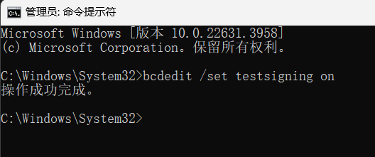
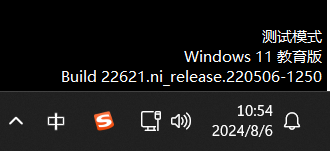
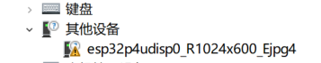
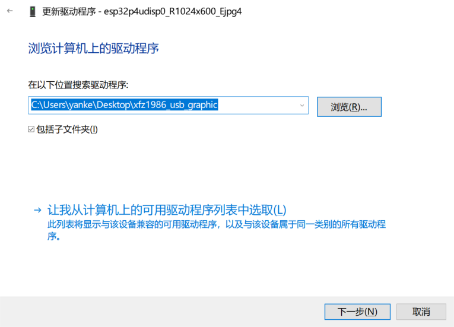
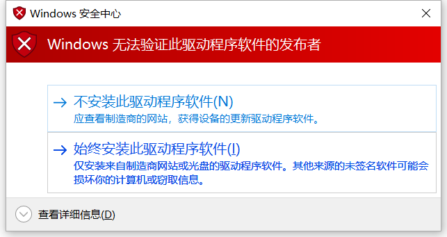
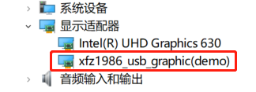

## Windows IDD 驱动程序

Windows 间接显示驱动程序 (IDD) 模型提供简单的用户模式驱动程序模型，以支持未连接到传统 GPU 显示输出的监视器。[参考](https://learn.microsoft.com/zh-cn/windows-hardware/drivers/display/indirect-display-driver-model-overview)

本驱动参考自 [chuanjinpang/win10_idd_xfz1986_usb_graphic_driver_display](https://github.com/chuanjinpang/win10_idd_xfz1986_usb_graphic_driver_display), 如需修改，请自行下载后重新编译。

## 下载链接

[点我下载](https://dl.espressif.com/AE/esp-iot-solution/usb_lcd_windos_driver.zip)

## 如何使用

1. (可忽略) 首先需要关掉 windows 对驱动的检查使用测试模式。

   * 使用管理员身份打开命令行 cmd

    ```shell
    bcdedit /set testsigning on
    ```

    

    * 重启电脑，桌面右下角会出现测试模式的水印

    

2. 关闭 windows 对第三方驱动的签名检查，[参考](https://answers.microsoft.com/zh-hans/windows/forum/all/%E5%AE%89%E8%A3%85%E9%A9%B1%E5%8A%A8%E7%A8%8B/de380edb-5f62-474e-9820-5663db1af086)

    * 依次点开 `开始` --> `设置` --> `windows 更新` --> `恢复` --> `高级启动` --> `立即重新启动`
    * 重启到修复模式后，点击 `疑难解答` --> `高级选项` --> `启动设置` --> `重启电脑`
    * 重启后，在启动菜单中选择 `禁用驱动程序强制签名` 重启返回桌面

3. 在设备管理器中选择未识别的设备，为其安装驱动程序
    

    * 右键选择 `更新驱动程序`
    * 选择 `游览我的电脑以查找驱动程序(R)`

    

    * 选择此文件夹目录
    * 选择 `始终安装此驱动程序软件(I)`

    

4. 安装完毕后，在显示适配器下面出现一个新的显示器，即安装成功

    

## 注意事项

* 设备的 VID PID 必须符合驱动文件 INF 中 `DeviceName` 的描述，对于复合设备必须精确到接口号，例如：`USB\VID_303A&PID_2986&MI_00`，修改此文件必须重新编译驱动

* 该驱动通过 VENDOR 接口与设备进行通信，支持多种分辨率和图片格式，通过接口字符描述符来控制，具体参考 [README](https://github.com/chuanjinpang/win10_idd_xfz1986_usb_graphic_driver_display/blob/main/README.md)

* 驱动仅支持 windows10 及 windows11 系统，其他系统请自行测试

