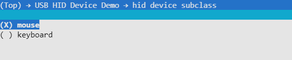

## USB HID Device example

This example demonstrates how to use ESP32-Sx USB function as the HID device. Buttons are used to trigger such signals as a keyboard or mouse.

## How to use example

### Hardware Required

- Any ESP32-S2 or ESP32-S3 develpment board with **buttons**
 
- Hardware Connection： 
  - GPIO19 to D
  - GPIO20 to D+

### Configure the project

By default the buttons act as a mouse, you can chage `menuconfig->USB HID Device Demo->hid class subclass` to `keyboard`.



### Build and Flash

1. Make sure `ESP-IDF` installed successfully, and checkout to specified commit [idf_usb_support_patch](../../../usb/idf_usb_support_patch/readme.md)

2. Clone `ESP-IOT-SOLUTION` repository, and checkout to branch `usb/add_usb_solutions`

    ```bash
    git clone -b usb/add_usb_solutions --recursive https://github.com/espressif/esp-iot-solution
    ```

3. Set up the `ESP-IDF` environment variables，you can refer [Set up the environment variables](https://docs.espressif.com/projects/esp-idf/en/latest/esp32/get-started/index.html#step-4-set-up-the-environment-variables), Linux can using:

    ```bash
    . $HOME/esp/esp-idf/export.sh
    ```

4. Set up the `ESP-IOT-SOLUTION` environment variables，Linux can using:

    ```bash
    export IOT_SOLUTION_PATH=$HOME/esp/esp-iot-solution
    ```

5. Set ESP-IDF build target to `esp32s2` or `esp32s3`

    ```bash
    idf.py set-target esp32s2
    ```

6. Build, Flash, output log

    ```bash
    idf.py build flash monitor
    ```

## Example Output

```
I (354) Board: Board Info: ESP32_S3_USB_OTG_EV
I (364) Board: Board Init Done ...
I (364) gpio: GPIO[10]| InputEn: 1| OutputEn: 0| OpenDrain: 0| Pullup: 1| Pulldown: 0| Intr:0 
I (374) gpio: GPIO[11]| InputEn: 1| OutputEn: 0| OpenDrain: 0| Pullup: 1| Pulldown: 0| Intr:0 
I (384) gpio: GPIO[0]| InputEn: 1| OutputEn: 0| OpenDrain: 0| Pullup: 1| Pulldown: 0| Intr:0 
I (394) gpio: GPIO[14]| InputEn: 1| OutputEn: 0| OpenDrain: 0| Pullup: 1| Pulldown: 0| Intr:0 
I (404) tusb_desc: using default config desc
I (404) tusb_desc: config desc size=34
I (414) tusb_desc: 
┌─────────────────────────────────┐
│  USB Device Descriptor Summary  │
├───────────────────┬─────────────┤
│bDeviceClass       │ 0           │
├───────────────────┼─────────────┤
│bDeviceSubClass    │ 0           │
├───────────────────┼─────────────┤
│bDeviceProtocol    │ 0           │
├───────────────────┼─────────────┤
│bMaxPacketSize0    │ 64          │
├───────────────────┼─────────────┤
│idVendor           │ 0x303a      │
├───────────────────┼─────────────┤
│idProduct          │ 0x4004      │
├───────────────────┼─────────────┤
│bcdDevice          │ 0x100       │
├───────────────────┼─────────────┤
│iManufacturer      │ 0x1         │
├───────────────────┼─────────────┤
│iProduct           │ 0x2         │
├───────────────────┼─────────────┤
│iSerialNumber      │ 0x3         │
├───────────────────┼─────────────┤
│bNumConfigurations │ 0x1         │
└───────────────────┴─────────────┘
I (584) TinyUSB: TinyUSB Driver installed
I (584) HID Example: USB initialization DONE
I (594) HID Example: Mouse demo
I (5434) HID Example: Mouse x=-8 y=0
I (6154) HID Example: Mouse x=-8 y=0
I (6904) HID Example: Mouse x=0 y=8
I (7494) HID Example: Mouse x=0 y=8
I (7964) HID Example: Mouse x=0 y=8
I (8634) HID Example: Mouse x=0 y=-8
I (9104) HID Example: Mouse x=0 y=-8
I (9584) HID Example: Mouse x=0 y=-8
I (10554) HID Example: Mouse x=8 y=0
I (11014) HID Example: Mouse x=8 y=0
```
