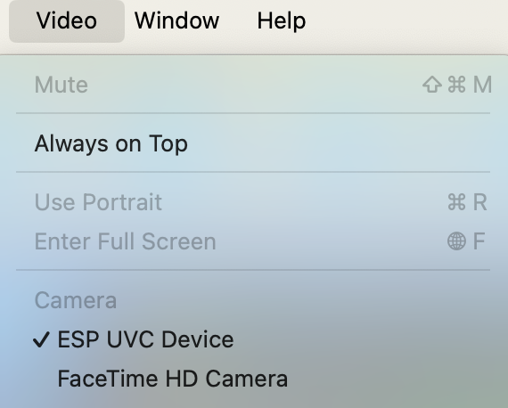

## USB LCD Display Example

This example demonstrates how to use the esp_lcd_usb_display component to compress generated image data into a JPEG frame stream and transmit it to the USB host.


This example uses the [esp_timer](https://docs.espressif.com/projects/esp-idf/en/latest/esp32/api-reference/system/esp_timer.html) to generate the ticks needed by LVGL and uses a dedicated task to run the `lv_timer_handler()`. Since the LVGL APIs are not thread-safe, this example uses a mutex which be invoked before the call of `lv_timer_handler()` and released after it. The same mutex needs to be used in other tasks and threads around every LVGL (lv_...) related function call and code. For more porting guides, please refer to [LVGL porting doc](https://docs.lvgl.io/master/porting/index.html).

## Hardware

* Development board

  1. `ESP32-P4` board with USB Host port can be used.
  2. An USB cable for power supply and programming

* Connection

```
ESP BOARD            USB CONNECTOR
                          --
                         | || VCC
[USBPHY_DM_NUM]  ------> | || D-
[USBPHY_DP_NUM]  ------> | || D+
                         | || GND
                          --
```

### Configure the Project

Run `idf.py menuconfig` and navigate to `Example Configuration` menu.

### Build and Flash

Run `idf.py set-target esp32p4` to select the target chip.

Run `idf.py -p PORT build flash monitor` to build, flash and monitor the project. 

The first time you run `idf.py` for the example will cost extra time as the build system needs to address the component dependencies and downloads the missing components from registry into `managed_components` folder.

(To exit the serial monitor, type ``Ctrl-]``.)

See the [Getting Started Guide](https://docs.espressif.com/projects/esp-idf/en/latest/get-started/index.html) for full steps to configure and use ESP-IDF to build projects.

## Run Example

Boards programmed with this example can be directly tested on `Windows` and `Mac` operating systems following the steps below. However, Linux system support is currently unavailable.

* **For Windows OS**: Open the system `Camera` application to view the images.
* **For Mac OS**: Open the `FaceTime` application, and select `ESP UVC Device` (as shown in the figure) to view the images.

<div align=center>
    
</div>

## Troubleshooting

For any technical queries, please open an [issue](https://github.com/espressif/esp-iot-solution/issues) on GitHub. We will get back to you soon.