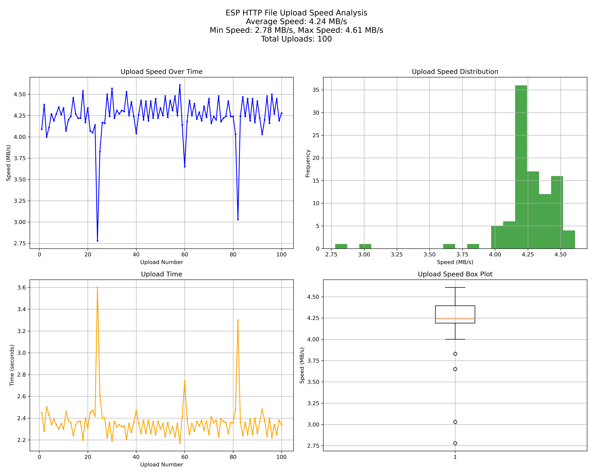

## USB MSC 无线磁盘

使用 ESP32-Sx 作为带有无线访问功能的 USB 磁盘。HTTP 文件服务器可用于上传和下载文件。

**此演示仅用于功能预览，如果您发现错误请不要感到意外**

### 硬件

- 开发板：ESP32-S3-USB-OTG，或任何 ESP32-Sx 开发板
- 微控制器（MCU）：ESP32-S2，ESP32-S3
- Flash 存储：4MB NOR Flash
- 硬件连接：
  - GPIO19 连接到 D-
  - GPIO20 连接到 D+
  - SD 卡 IO 根据不同的开发板而异，您可以在代码中自定义定义。

注意：如果您使用的是自供电设备，请参考[自供电设备](https://docs.espressif.com/projects/esp-idf/en/latest/esp32s3/api-reference/peripherals/usb_device.html#self-powered-device)

### 功能

1. 支持 USB MSC，可以通过主机读写板载 Flash 或 SD 卡；
2. 通过 Wi-Fi 下载和上传数据，ESP32-SX 可以作为 Wi-Fi AP 或 STA。

### 如何使用

1. 使用微型 USB 电缆直接插入主机的 USB 端口；
2. 默认情况下，在您的“文件资源管理器”中可以找到一个大小为 `1.5MB` 的磁盘；
3. 通过 Wi-Fi 连接到 ESP32S2，SSID：`ESP-Wireless-Disk`，默认没有密码；
4. 在浏览器中输入 `192.168.4.1`，您可以查看磁盘上的文件列表；
5. 拖放到磁盘的任何文件都将显示在网页中；
6. 从网页上传的任何文件也会显示在磁盘中（此演示中文件大小必须小于 20MB）。

### 配置 Wi-Fi

* 您可以在 `menuconfig → USB MSC Device Demo → Wi-Fi Settings` 中配置 Wi-Fi AP 的 SSID 和密码，以更改 esp32-sx 的热点名称。
* 您也可以设置 Wi-Fi STA 的 SSID 和密码，以使 esp32-sx 同时连接到路由器。
* 您还可以通过网页端的 `settings` 来配置 Wi-Fi 的相关信息。

### 多语言支持

此演示已启用 FATFS 的 OEM 多代码页支持。如需手动调整文件名的多语言支持，请在 menuconfig 中调整下列选项：

- (Top) → <kbd>Component config</kbd> → <kbd>FAT Filesystem support</kbd> → <kbd>OEM Code Page</kbd>
  - 本例程默认为 <kbd>Dynamic (all code pages supported)</kbd>。
  - 将其设置为 <kbd>Dynamic (all code pages supported)</kbd> （`FATFS_CODEPAGE_DYNAMIC`）时，FATFS 将支持所有代码页，但会使编译产物体积增加约 500 kB。
  - 若选择其他代码页，请确保所选代码页与文件名字符集匹配，否则会导致乱码、无法找到文件或其他隐性问题。
- (Top) → <kbd>Component config</kbd> → <kbd>FAT Filesystem support</kbd> → <kbd>API character encoding</kbd>
  - 本例程默认为 <kbd>API uses UTF-8 encoding</kbd> (`FATFS_API_ENCODING_UTF_8`)。
  - 该选项控制 FATFS API 读出的文件名所使用的编码方式，详见该配置项的说明。
  - 若进行 Web 开发，建议使用 UTF 8 编码。

### 无线传输速率优化

**如果您希望获得最佳的无线访问速度，强烈推荐选择带有 PSRAM 的芯片或模组，特别是配备 8MB 及以上容量、8 线（OCT）PSRAM 的 ESP32-S3。**

#### 性能测试结果

以下图表显示了使用优化配置后的 HTTP 文件上传速度分析结果：

*测试结果显示，在 100 次上传测试中，平均上传速度为 4.24 MB/s，最大速度达到 4.61 MB/s。*

通过以下方式可以进一步提高无线文件上传和下载的速度：

1. **Wi-Fi 配置优化** (RAM 开销: 高)
   - 在 `sdkconfig.defaults.r8` 文件中已经配置了以下参数：
     - `CONFIG_ESP_WIFI_STATIC_RX_BUFFER_NUM=16`：增加静态接收缓冲区数量（每个缓冲区约 1.6KB）
     - `CONFIG_ESP_WIFI_DYNAMIC_RX_BUFFER_NUM=85`：增加动态接收缓冲区数量（每个缓冲区约 1.6KB）
     - `CONFIG_ESP_WIFI_DYNAMIC_TX_BUFFER_NUM=64`：增加动态发送缓冲区数量（每个缓冲区约 1.6KB）
     - `CONFIG_ESP_WIFI_TX_BA_WIN=32` 和 `CONFIG_ESP_WIFI_RX_BA_WIN=32`：增大 Block ACK 窗口大小
     - `CONFIG_ESP_WIFI_EXTRA_IRAM_OPT=y`：启用额外的 IRAM 优化（降低 RAM 使用但增加 IRAM 使用）

2. **TCP/IP 协议栈优化** (RAM 开销: 中高)
   - `CONFIG_LWIP_TCPIP_TASK_PRIO=23`：提高 TCP/IP 任务优先级（无 RAM 影响）
   - `CONFIG_LWIP_IRAM_OPTIMIZATION=y` 和 `CONFIG_LWIP_EXTRA_IRAM_OPTIMIZATION=y`：启用 LWIP 的 IRAM 优化（增加 IRAM 使用）
   - `CONFIG_LWIP_TCP_SND_BUF_DEFAULT=65535` 和 `CONFIG_LWIP_TCP_WND_DEFAULT=65535`：增大 TCP 发送和接收窗口（显著增加每个连接的 RAM 使用）
   - `CONFIG_LWIP_TCPIP_RECVMBOX_SIZE=64`：增大 TCP/IP 接收邮箱大小（适度增加 RAM 使用）
   - `CONFIG_LWIP_TCP_RECVMBOX_SIZE=64` 和 `CONFIG_LWIP_UDP_RECVMBOX_SIZE=64`：增大 TCP 和 UDP 接收邮箱大小（适度增加 RAM 使用）

3. **文件操作缓冲区优化** (RAM 开销: 高)
   - `CONFIG_FILE_WRITE_BUFFER_COUNT=10`：增加写入缓冲区数量
   - `CONFIG_FILE_WRITE_BUFFER_SIZE=128`：增加写入缓冲区大小
   - `CONFIG_FILE_DMA_BUFFER_SIZE=32`：设置 DMA 缓冲区大小
   - 总计 RAM 开销约为: 10 × 128 + 32 = 1312 KB

## 变更日志

### 2025-08-25

- 支持 4-bit SD 卡接口
- 文件系统使用异步写入以提升性能
- 增加了无线传输速率优化章节，提供详细的配置指南

