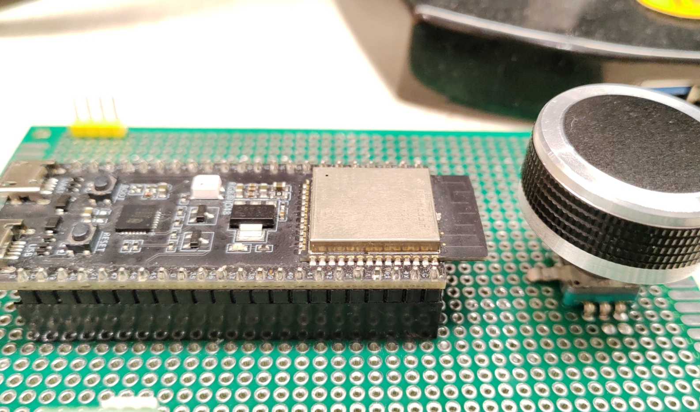
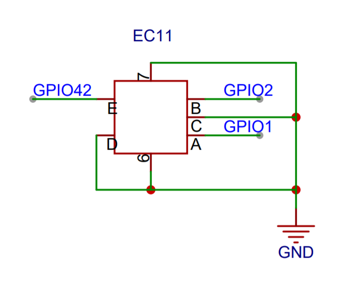
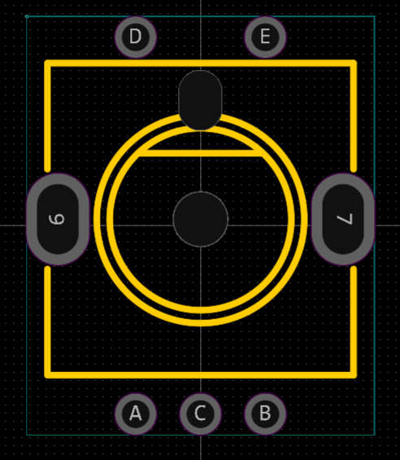
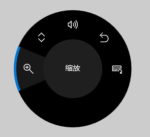

## USB HID Surface Dial

This example shows how to use the ESP32-Sx USB function to emulate a Windows knob that allows volume control, page up and down, and more.

## Hardware Required



- Any ESP32-Sx development board with **knob** functionality. 
    - The knob can be a series of rotary encoders with push function such as EC11
    - It is also possible to use three buttons that simulate: press, left turn, right turn

- Hardware Connection： 
    - GPIO19 to USB_D-
    - GPIO20 to USB_D+
    - GPIO42 to EC11_E
    - GPIO1  to EC11_A
    - GPIO2  to EC11_C





## Build and Flash

1. Set up the `ESP-IDF` environment variables，you can refer [Set up the environment variables](https://docs.espressif.com/projects/esp-idf/en/latest/esp32/get-started/index.html#step-4-set-up-the-environment-variables), Linux can using:

    ```
    . $HOME/esp/esp-idf/export.sh
    ```

2. Set ESP-IDF build target to `esp32s2` or `esp32s3`

    ```bash
    idf.py set-target esp32s2
    ```

3. Build, Flash, output log

    ```bash
    idf.py build flash monitor
    ```

## How To Use

* Connect the USB to the Windows USB port and wait for the USB device to finish installing
* Press and hold the button to wake up the Windows wheel

