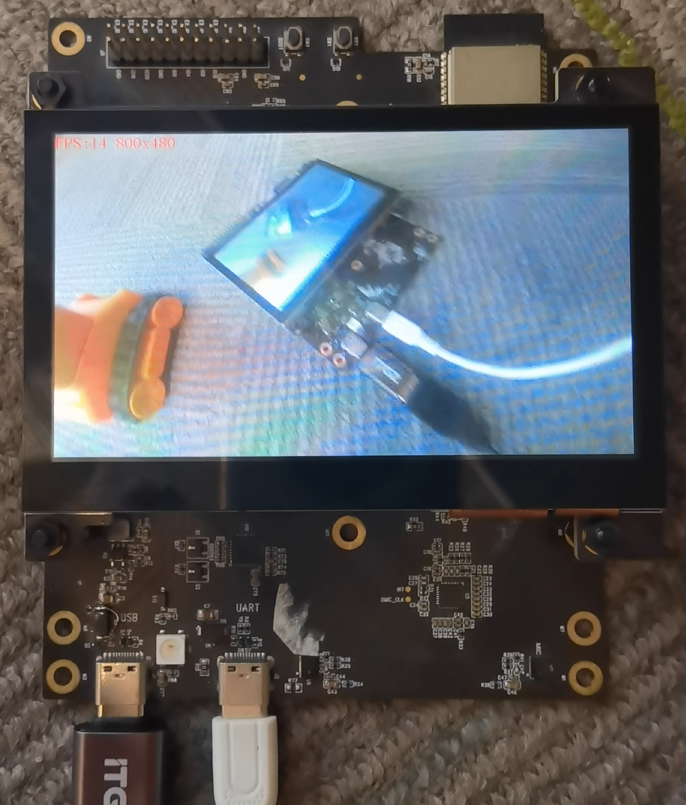

| Supported Targets | ESP32-S3 | ESP32-P4 |
| ----------------- | -------- | -------- |

## Camera LCD Display Example

This example captures MJPEG frames from a camera and displays the decoded image on the onboard LCD.

Functionality:

* Shows `Waiting for camera...` when no camera is connected.
* Displays the camera image centered on the LCD.
* Overlays the current FPS and display resolution on the screen.
* Pressing the switch button cycles through the available camera resolutions.
* Starts with the LCD resolution first when the camera supports it.



## Hardware

Required hardware:

* A supported development board:
  * [ESP32-S3-LCD-EV-Board](https://docs.espressif.com/projects/esp-dev-kits/en/latest/esp32s3/esp32-s3-lcd-ev-board/index.html)
  * [ESP32-P4-Function-EV-Board](https://docs.espressif.com/projects/esp-dev-kits/en/latest/esp32p4/esp32-p4x-function-ev-board/index.html)
* A camera that outputs MJPEG frames
* A USB cable for power, flashing, and log output

### Build and Flash

```bash
idf.py set-target TARGET
idf.py -p PORT flash monitor
```

Replace `PORT` and `TARGET` with the serial port of your board.

(To exit the serial monitor, type `Ctrl-]`.)

See the Getting Started Guide for all the steps to configure and use the ESP-IDF to build projects.

## Notes

* The example currently accepts MJPEG camera frames only.
* On `ESP32-P4`, JPEG decoding is done into a dedicated decode buffer first and then copied to the LCD framebuffer.
* On `ESP32-S3`, frames matching the LCD resolution can be decoded directly into the display buffer for better refresh performance.
