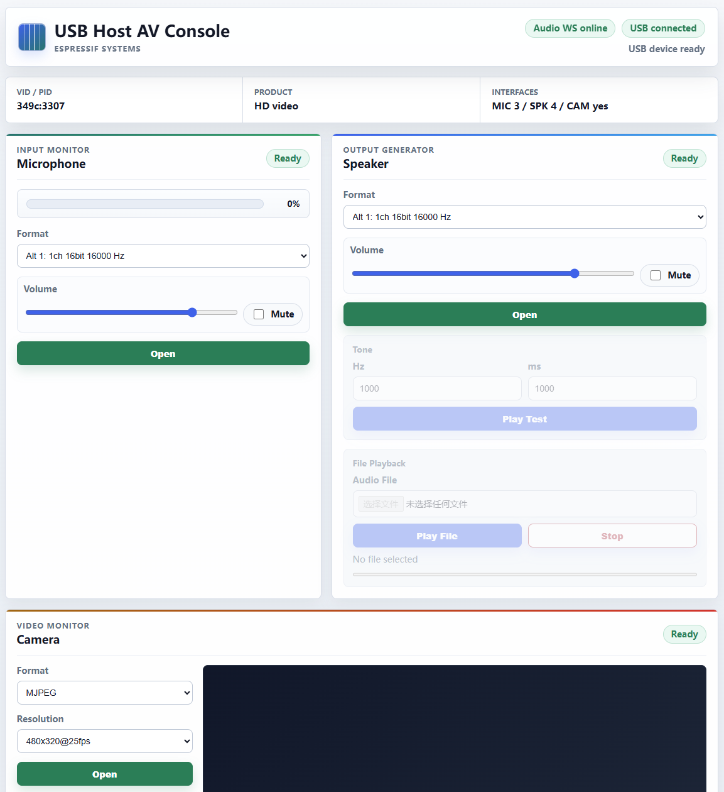

| Supported Targets | ESP32-P4 | ESP32-S2 | ESP32-S3 | ESP32-S31 |
| ----------------- | -------- | -------- | -------- | --------- |

# USB Host AV Demo

This example runs USB Audio Class and USB Video Class devices from a browser-based AV console.

## Features

- USB UAC microphone and speaker detection.
- Microphone and speaker stream enable, mute, volume, and format selection.
- Live microphone playback in the browser with a level meter.
- Speaker test tone playback.
- Local audio file playback from the browser to the USB speaker.
- USB UVC camera detection.
- MJPEG camera resolution selection and live preview in the browser.

## Hardware

Required hardware:

- An ESP32 board with USB OTG host capability.
- A USB Audio Class device with microphone and/or speaker interfaces, and/or a USB Video Class camera with MJPEG support.
- A proper USB connection and 5 V power for the USB device when required.

Connection example:

```text
┌─────────────────┐          ┌─────────────────┐
│                 │          │                 │
│ USB Device      ┼──────────┼ 5V              │
│                 ┼──────────┼ GND             │
│                 │          │    ESP32-xx     │
│                 ┼──────────┼ USB D+          │
│                 ┼──────────┼ USB D-          │
│                 │          │                 │
└─────────────────┘          └─────────────────┘
```
## Wi-Fi

Default SoftAP settings:

```text
SSID: USB-AV-DEMO
Password: none
Address: http://192.168.4.1
```

Wi-Fi settings can be changed in `menuconfig` under `Example Configuration -> WiFi Settings`.

Captive portal support redirects common OS connectivity probes to `http://192.168.4.1/`.

## Build and Flash

```bash
idf.py set-target TARGET
idf.py -p PORT flash monitor
```

Replace `PORT` and `TARGET` with the serial port of your board.

## Usage

**Web Console:**



1. Connect the USB audio device or USB camera to the ESP board.
2. Flash the firmware.
3. Connect a computer or phone to the `USB-AV-DEMO` SoftAP.
4. Open `http://192.168.4.1` or use the captive portal pop-up.
5. Select the microphone and speaker formats.
6. Open the microphone or speaker and start testing.
7. Select a camera resolution, then open the camera panel to preview MJPEG video.

Keep the browser tab active during audio playback and camera preview. Browsers may throttle background tabs, which can cause choppy audio or video.

## Troubleshooting

### `EP MPS exceeds supported limit`

If the log shows:

```text
E (...) HCD DWC: EP MPS (288) exceeds supported limit (264)
E (...) USBH: EP Alloc error: ESP_ERR_NOT_SUPPORTED
```

the selected USB audio endpoint requires a max packet size larger than the current DWC FIFO configuration can support.

This example installs the USB host in `main/app_usb_host.c` with `fifo_settings_custom`:

```c
.fifo_settings_custom = {
    .nptx_fifo_lines = 56,
    .ptx_fifo_lines = 72,
    .rx_fifo_lines = 72,
}
```

Some UAC alternate settings, especially high-sample-rate isochronous speaker or microphone endpoints, need a larger periodic TX or RX FIFO than this split provides. When the endpoint MPS is larger than the configured FIFO limit, endpoint allocation fails with `ESP_ERR_NOT_SUPPORTED`.

To fix it, adjust `fifo_settings_custom` for the target device and stream direction, or select a lower-bandwidth UAC format in the web console.
