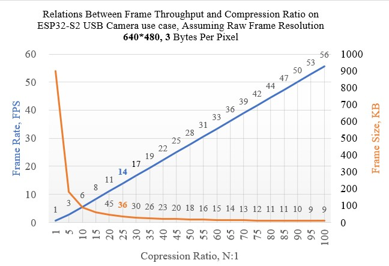

[English Version](./README.md)

## USB Camera Wi-Fi Transfer Demo 说明

该示例程序通过 `ESP32-S2` 或 `ESP32-S3` 系列 USB 主机功能，实现对 USB 摄像头 `MJPEG` 数据流读取、Wi-Fi 图传，支持以下功能：

* 支持 USB Camera 数据流获取和解析
* 支持设置为 Wi-Fi AP 或 STA 模式
* 支持 HTTP 图传，可使用移动设备或 PC 浏览器查看实时画面

### 硬件准备

* 该示例支持的摄像头，需要满足以下必要参数：

    1. 摄像头兼容 USB1.1 全速模式
    2. 摄像头自带 MJPEG 压缩
    3. 摄像头支持设置接口为 `wMaxPacketSize` 为 `512`
    4. 图像数据流**USB 传输总带宽应小于 4 Mbps** （500 KB/s）
    5. 受制于 USB 总线带宽，图像帧率和单帧图像大小相互制约，若图像单帧 25KB，帧率可到 20 FPS.
    6. 该示例由于无需本地解码，可支持满足以上条件的**任意分辨率**

* USB 摄像头硬件接线：
  
  1. USB 摄像头 VBUS 请使用 5V 电源独立供电，亦可使用 IO 控制 VBUS 通断
  2. USB 摄像头 D+ D- 数据线请按常规差分信号标准走线
  3. USB 摄像头 D+ (绿线) 接 ESP32-S2/S3 GPIO20
  4. USB 摄像头 D- (白线) 接 ESP32-S2/S3 GPIO19

### 编译代码

该示例代码需要额外添加 `2M` `PSRAM`，可使用基于 `ESP32-S2-WROVER` 模组的 `ESP32-S2-Saola-1` `ESP32-S2-Kaluga-1` 等开发板：

1. 添加 ESP-IDF 环境变量，Linux 方法如下，其它平台请查阅 [Set up the environment variables](https://docs.espressif.com/projects/esp-idf/en/latest/esp32/get-started/index.html#step-4-set-up-the-environment-variables)
    ```
    . $HOME/esp/esp-idf/export.sh
    ```
2. 添加 ESP-IOT-SOLUTION 环境变量，Linux 方法如下，其它平台请查阅 [readme](../../../../README_CN.md)
    ```
    export IOT_SOLUTION_PATH=$HOME/esp/esp-iot-solution
    ```
3. 根据摄像头配置描述符，[修改摄像头配置项](../../../../components/usb/uvc_stream/README.md)
4. 设置编译目标为 `esp32-s2` 或 `esp32s3`
    ```
    idf.py set-target esp32s2
    ```
5. 编译、下载、查看输出
    ```
    idf.py build flash monitor
    ```

### 使用说明

1. PC 或手机接入 ESP32-S2/S3 发出的热点，SSID: `ESP32S2-UVC` 默认无密码
2. 浏览器输入 `192.168.4.1` 打开操作窗口
3. 点击 `Start Stream` 开启视频流
4. 点击 `Get Still` 拍摄照片
5. 点击预览窗口 `Save` 可保存当前图像

### 性能参数

**总带宽限制下**，不同分辨率图像**压缩率**与**帧率**对应关系：

  * 在压缩率 **15：1** 下，**320*240** 图像吞吐率可达到 **33 帧**每秒，每一帧图像大小约 15 KB：

  

  * 在压缩率 **25：1** 下，**640*480** 图像吞吐率可达到 **15 帧**每秒，每一帧图像大小约 36 KB：

  
